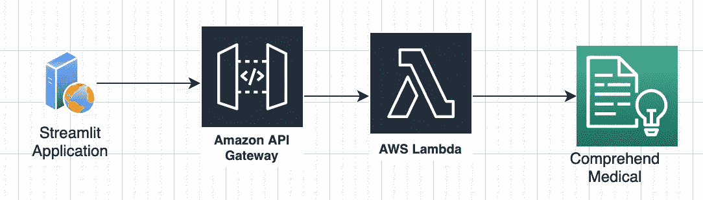
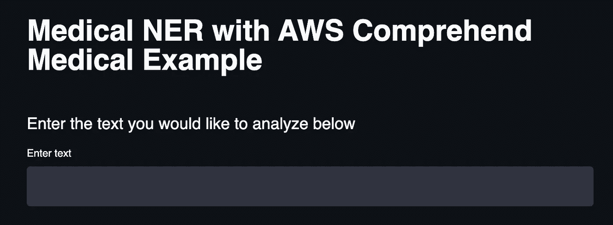
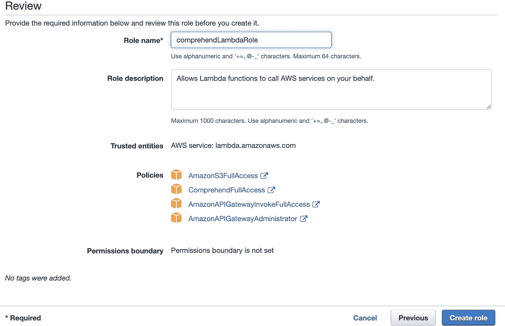
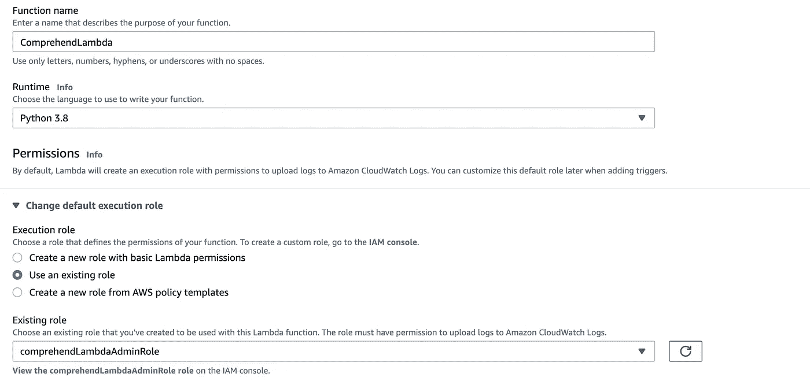
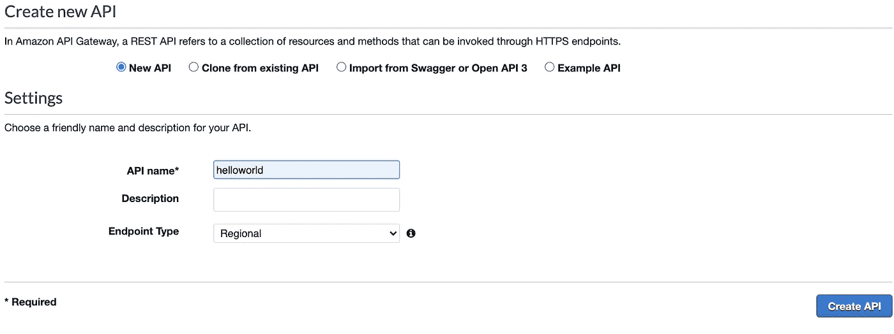
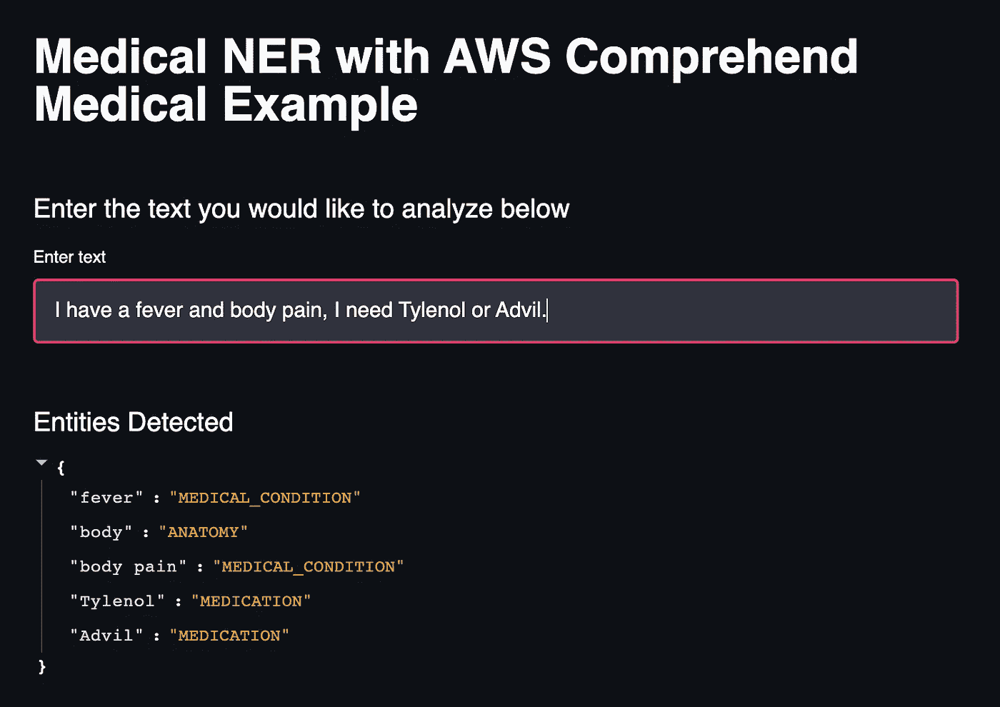

# 带 AWS 的医用 NER 理解

> 原文：<https://towardsdatascience.com/medical-ner-with-aws-comprehend-3f27db0a8255?source=collection_archive---------28----------------------->

## 使用 AWS intensive 构建用于医疗实体检测的 web 应用程序

图片来自 [Unsplash](https://unsplash.com/photos/VCtI-0qlVgA)

命名实体识别( **NER** )是最流行和最受欢迎的自然语言处理任务之一。随着 NER 的扩张，它也变得越来越有 T4 特色。为特定领域(如医疗保健/医疗)构建自定义 NER 模型可能非常困难，并且需要大量数据和计算能力。AWS 领悟是一种高级服务，AWS 提供自动化许多不同的 NLP 任务，如情感分析、主题建模和 NER。“理解”分支创建了一个名为[理解医疗](https://aws.amazon.com/comprehend/medical/)的子服务，专门面向医疗 NER。在本文中，我们将介绍如何使用 [Streamlit](https://docs.streamlit.io/en/stable/) 构建一个 web 应用程序，它可以调用 intensive Medical 并返回检测到的医疗实体。本文假设读者具备 AWS 的基础知识、浏览 AWS 控制台的能力以及 Python 基础知识。我将提供一个我们将要使用的服务列表，并在此广告之后提供更深入的定义，但是如果您已经熟悉这些服务，可以随意跳到情感分析&实体提取的代码演示。

# 目录

1.  AWS 服务概述
2.  体系结构
3.  使用 Streamlit 进行前端创建
4.  创建 Lambda 函数和 REST API
5.  将 Lambda 功能与 AWS 集成理解医疗
6.  连接前端和后端
7.  代码和结论

# 1.AWS 服务

[**AWS 领悟医疗**](https://aws.amazon.com/comprehend/medical/) :一个**符合 HIPAA 的 NLP 服务**，为用户从文本中提取健康数据提供一个**高级 API** 。

[**AWS Lambda**](https://aws.amazon.com/lambda/) :无服务器计算服务，允许开发者运行代码，无需管理或提供服务器。我们将使用此服务来**访问 NER 的 AWS 理解医疗**，并**与 **REST API** 通信**以将结果输出到前端。

[**Boto3**](https://boto3.amazonaws.com/v1/documentation/api/latest/index.html) : AWS 软件开发工具包( **SDK** )对于 Python 开发者来说，我们在我们的 Lambda 函数上使用这个来访问其他 AWS 服务，比如 understand。

[**身份访问和管理(IAM)**](https://aws.amazon.com/iam/) :允许您通过权限和角色管理对 AWS 服务的访问。我们将为我们的 **Lambda** 函数创建一个角色，以便能够**访问**AWS comprehense 和 API GW。

[**【AWS API 网关(API GW)**](https://aws.amazon.com/api-gateway/) :允许开发者创建、发布和监控安全 RESTful 和 Socket APIs 的服务。

# 2.体系结构

架构图(作者截图)

架构相对简单。我们将构建一个 streamlit web 应用程序来访问我们将使用 Amazon API Gateway 创建的 REST API。这个 REST API 将作为后端 Lambda 函数的接口，该函数使用 Boto3 SDK 来访问 NER 医疗的理解医疗。

# 3.使用 Streamlit 进行前端创建

对于我们的应用程序，我们将使用一个称为 Streamlit 的漂亮 Python 库创建一个简单的前端，让 Python 开发人员和数据科学家能够快速启动和运行 web 应用程序/仪表板。我们的应用程序只需要一些标题和一个用于输入文本的文本框，我们将对其进行分析，以检测任何潜在的**医疗实体**。

创建基本前端设置的代码

稍后将使用[请求](https://pypi.org/project/requests/)库来**访问**我们创建的 **API** ，但是现在应该创建了一个基本的前端模板，如果您执行"**streamlit run filename . py**"操作，您应该会看到设置。

前端创作(作者截图)

# **4。创建 Lambda 函数和 REST API**

**注意**:这一步有点费力，有许多 API 创建的小细节，为了简单起见，我跳过了，如果你喜欢这一部分的**视频演示**，请继续并跟随这个[链接](https://www.youtube.com/watch?v=DxpM_JN28GE&feature=emb_title)。

现在，当你登录到 **IAM 服务**后，就该去 AWS 控制台了。在我们可以使用 Lambda 之前，我们需要为我们的 Lambda 函数创建一个 [**角色**](https://docs.aws.amazon.com/IAM/latest/UserGuide/id_roles.html) ，该角色赋予它 [**权限**](https://aws.amazon.com/iam/features/manage-permissions/) 来使用领悟医疗和 API 网关。一旦进入 IAM 服务，点击页面左侧的**角色**，点击**创建角色**。现在您选择角色所服务的服务，在我们的例子中是 Lambda。单击 **next: Permissions** ，现在我们可以在 search 选项卡中查找与我们的角色相关的策略。确保**检查 AmazonComprehendFullAccess、Amazon APIGatewayFullAccess、**和**amazonapigatewaymanagement**。

Lambda 角色创建(作者截图)

继续并点击创建角色，我们可以**越过**到达 **Lambda 服务**。点击**创建函数**，命名你的 Lambda 函数，选择 **Python 3.8** 作为你的运行时，点击**更改默认执行角色**。现在选择**使用现有角色**并选择您为 Lambda 服务创建的角色。

Lambda 函数创建(作者截图)

继续并点击创建函数，我们已经准备好了 Lambda 函数。我们的**下一步**是**用 **API GW** 创建**一个 **REST API** ，并将其与我们的 Lambda 函数集成。转到控制台上的 API 网关服务，然后单击创建 API。选择**构建 REST API** ，命名您的 API，然后点击 create。

REST API 创建(作者截图)

一旦你创建了你的 REST API，确保创建一个 **POST 方法**，这样我们就可以从我们的前端向我们的后端 Lambda 函数提供数据。在创建了适当的资源和方法之后，确保**部署**您的 **API** 并且**启用 CORS** 。我们现在有了一个 REST API，可以用来集成我们的前端和后端。

# 5.将 Lambda 功能与 AWS 集成理解医疗

既然已经建立了体系结构的一般流程，我们可以将重点放在后端工作上，以便为 NER 集成理解医疗服务。使用 boto3 库，我们对医疗 NER 使用 API 调用: [**detect_entities**](https://boto3.amazonaws.com/v1/documentation/api/latest/reference/services/comprehendmedical.html#ComprehendMedical.Client.detect_entities) ，无论我们输入什么文本。用于理解医学的检测实体有**五个不同的** [**类别**](https://docs.aws.amazon.com/comprehend/latest/dg/extracted-med-info.html) 它可以将术语分类为:**解剖、医学状况、药物治疗、受保护健康信息和测试治疗程序**。如需了解 boto3 用于理解医疗的 API 调用的更多文档，请点击此[链接](https://boto3.amazonaws.com/v1/documentation/api/latest/reference/services/comprehendmedical.html)。

Lambda 函数访问理解医疗

注意，您必须在我们返回的 JSON 中包含一个头部分，以避免任何 CORS 错误。

# 6.连接前端和后端

现在我们已经部署了 API，我们需要在前端访问这个 REST API，这样我们就可以将输入文本输入 Lambda 函数。我们使用 Python 请求库来访问我们创建的 REST API。

访问实体的 API & Lambda 的代码

该函数的第一部分接收用户输入，并将其传递给我们的 REST API。在 understand Medical 返回其检测到的实体后，我们将数据解析为可呈现的格式，我们可以将其写回前端。

应用示例

# 7.代码和结论

 [## RamVegiraju/medner understand

### 使用 AWS 的 Web 应用程序理解医疗-RamVegiraju/medner 理解

github.com](https://github.com/RamVegiraju/MedNERComprehend) 

要访问演示的所有代码，请访问上面发布的链接。AWS 拥有一套不断扩展的高级人工智能服务，可以真正实现自动化，并为时间少或没有构建定制 ML 模型经验的人提供应用程序。

我希望这篇文章对试图使用 AWS 和 NLP 的人有用。如果您对 ML、数据科学和 AWS 感兴趣，请随时在评论中留下任何反馈或通过 [Linkedln](https://www.linkedin.com/in/ram-vegiraju-81272b162/) 与我联系。感谢您的阅读！