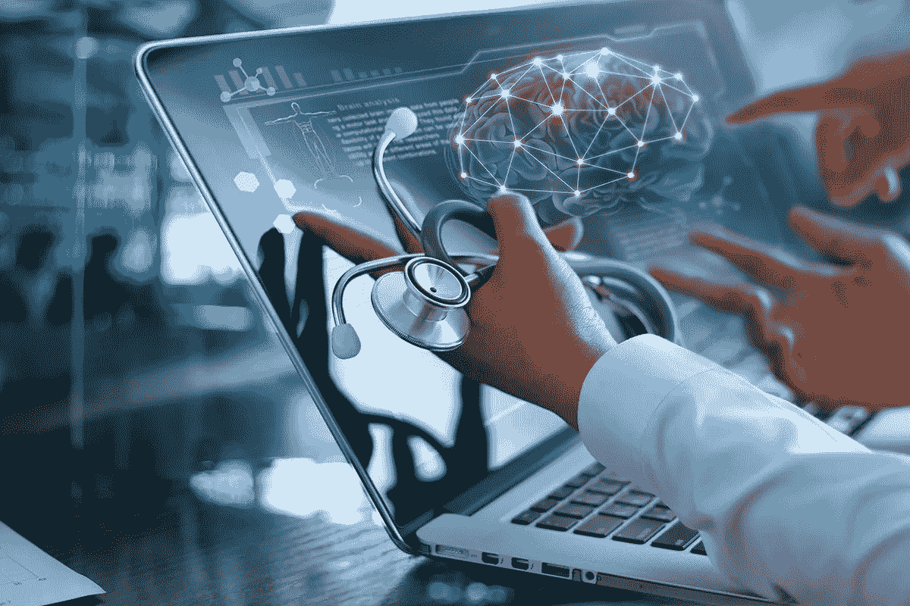

# 语音技术时代的医学转录

> 原文：<https://towardsdatascience.com/medical-transcription-in-the-age-of-voice-tech-ba218b5a514?source=collection_archive---------45----------------------->

## *人工神经网络通过用于医疗记录的自动语音识别技术，正在缓慢地革新医疗领域*

医生现在比以往任何时候都更愿意专注于治疗病人，而不是把时间花在无休止的行政任务上——为什么？因为 AI。人工神经机器网络(ANN)不仅在数据科学领域，而且在医学领域和相应的翻译行业都在慢慢改变着行业。今天，我们将看看人工智能和翻译技术在医学转录中的应用，看看数据科学、医学和翻译是如何为公众服务的。我们将看看人工神经网络对医学领域的影响，特别是自动语音识别(ASR)，以及 ASR 在医患互动中的语言障碍。

【Freepik.com】形象由

# 医学领域中的人工神经网络

人工神经网络的工作有点像人脑中的神经元，这是它们的模型——神经机器网络具有相同的互联性，能够产生大脑的新“神经元”,但相似之处仅此而已。

我们了解到，由于机器智能程序在加载大量数据时学习速度非常快，它们现在可以从中解析许多上下文信息。根据医学研究，他们可能无法知道背景文化信息，但他们对背景视觉线索反应良好。正如这篇文章所提出的，[软件算法正在学习超越人类智能](/what-the-data-is-telling-us-about-machine-translation-ea987742403c)，它们正变得善于通过长期增量增长的海量数据层来学习模式。

随着 2019 年疫情奖的颁发，人工智能在解决医疗领域内的问题，然后通过翻译将这些信息传递给公众方面的重要性得到了紧急关注。人工神经网络(ANN)作为虚拟医生、医疗转录和诊断识别的人工智能工具的构建模块，现在不仅是医学研究的主题。现在，在国际领域中，通过将自动语音识别(ASR)用于医学转录，人工神经网络被广泛实施。这就是医学、技术和翻译为公众利益而共同努力的效果，今天仍然可以感受到。

# 用人工神经网络作为医学抄写员的医学转录

也就是说，人工神经网络(ANN)正在彻底改变医学研究，如果不是医学领域的话。它们很可能被用于数字成像、识别新疾病等等。人工智能研究中出现的最受欢迎的领域不是使用人工智能来创建一个不需要人类医生的虚拟医生，而是一个呼吁人类和机器之间成功合作的领域:医学转录。医学转录是一种专业的医疗服务，它正在慢慢适应医疗行业的变化。

由人工神经网络构建的自动语音识别(ASR)技术(通常用于翻译行业)正在向医疗领域推广，供希望直接向护士和病人发号施令的医生使用。这些是虚拟的医疗记录，而不是人类的医疗记录。通过记录医生与患者互动的转录，语音识别技术可以实现医生出诊的自动化，而没有成堆成堆的文件的繁琐。

使用 ASR 进行医疗转录有助于从更新患者的电子健康记录(EHR)到自动化医疗图表、标记医疗预约到建立医生间转诊的方方面面。例子包括西雅图初创公司 Nuance Communications 旗下的 Saykara。他们将 Saykara 营销为第一个“自动化医生图表的移动人工智能助手”。

语音识别自 20 世纪 50 年代就已经存在，但像所有伟大的技术一样，直到最近几十年，特别是随着谷歌语音搜索和苹果 Siri 的推出，才开始使用。现在有亚马逊的 Alexa，微软的 Cortana，还有很多其他的。Otter.ai、Augnito 和 Decrypt 只是这个语音技术行业中的一些新品牌，它们通过医疗转录彻底改变了临床工作流程。

一切都很好，对吗？是的，也不是。自动语音识别(ASR)对翻译技术产生了重大影响。本研究提出两个问题:1 .众所周知，音频转录和翻译比文本翻译更费时，而且实际上并不能使这一过程自动化。2.由于背景噪音、重叠语音和其他条件，音频质量可能会变得很差，翻译技术尚未提供最佳解决方案。第三。语言障碍可以通过翻译服务来解决，翻译服务在人工智能和医疗文档方面具有专长。

因此，基于人工智能的转录工具和医疗文档是携手并进的，这些工具可以监听患者与医生的互动，而不需要任何手写的文档。但是当病人说韩语而医生说英语时，会发生什么呢？根据这项研究，在韩国，当有语言障碍需要解决时，语音识别技术就更加困难。

此外，ASR 还需要解决不同程度的语言问题:从一种语言到另一种语言的代码转换，到用未知的方言说话，到受到少数语言对的限制，到识别文化背景。这就是为什么最好利用翻译行业的医疗转录员的服务，因为该行业的人具有专业的语言知识，技术医学知识，并完全配备了人工智能技术。

因此，结论已经出来了:在人工智能中，人工智能还不具备完全转录多语言患者-医生互动的能力。安可能会很快改变这种状况，但不是现在。随着语音识别技术在国际范围内的医院和诊所变得越来越普遍，它有望变得更加先进。