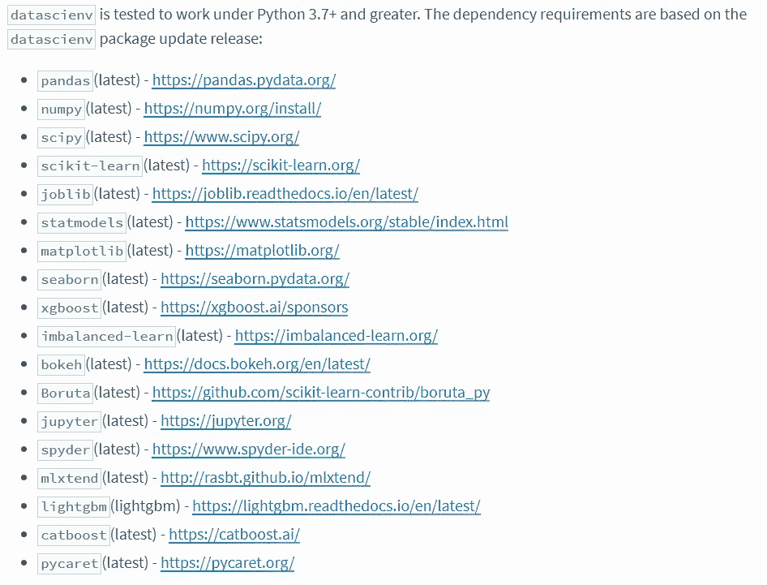
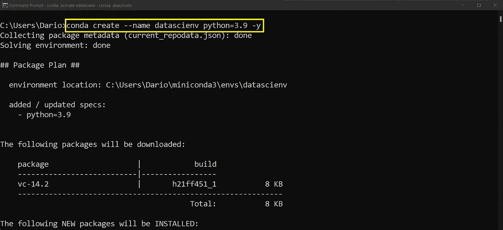
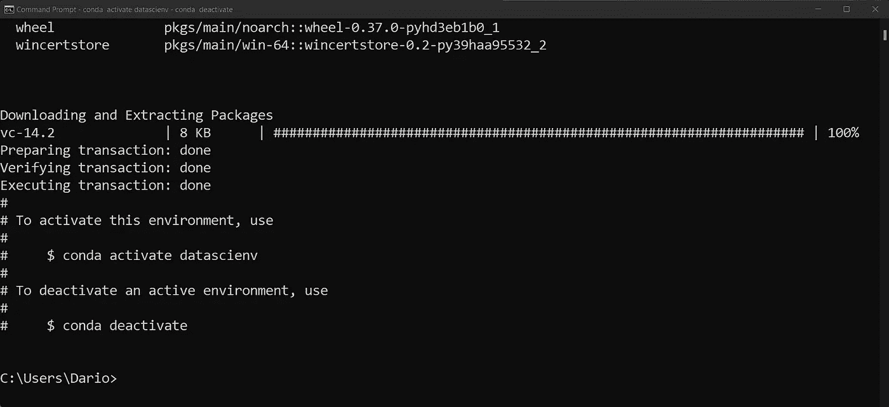
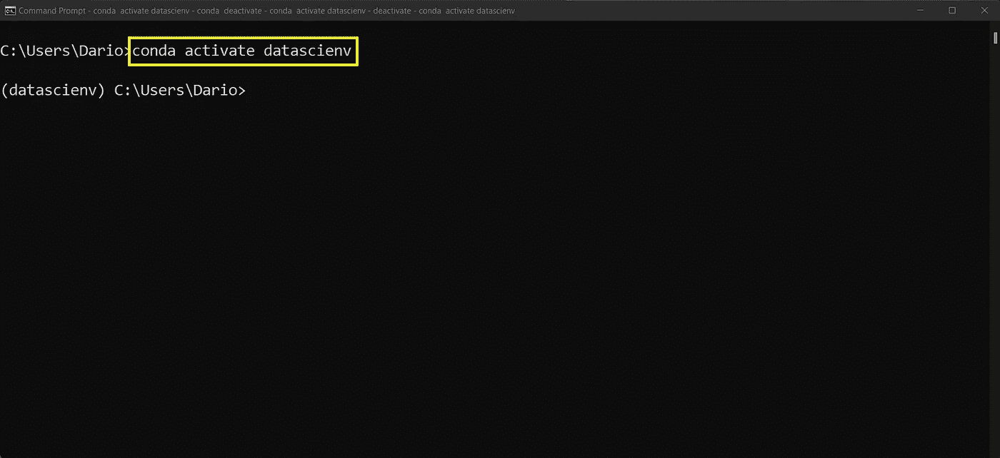
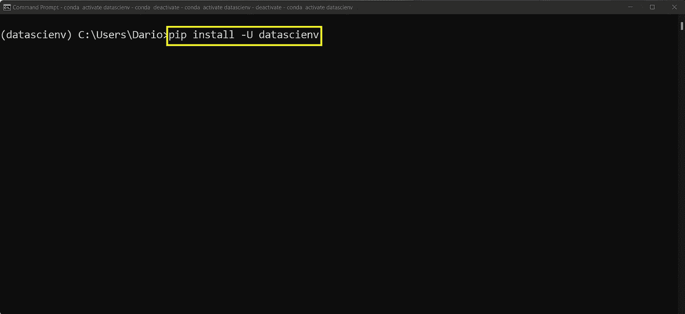
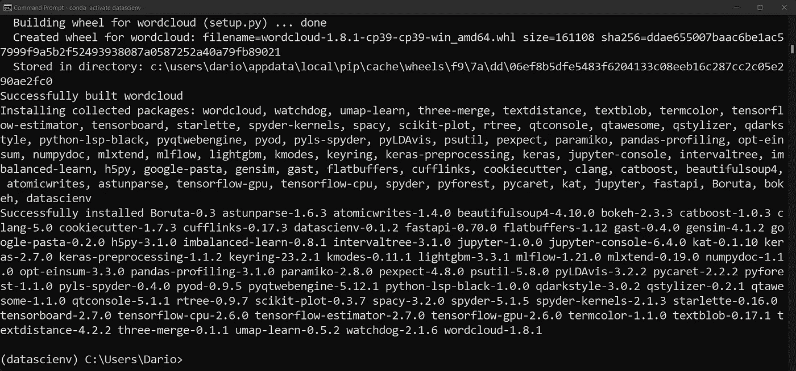
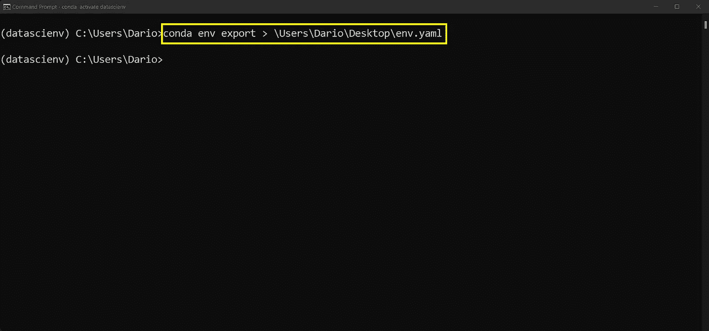
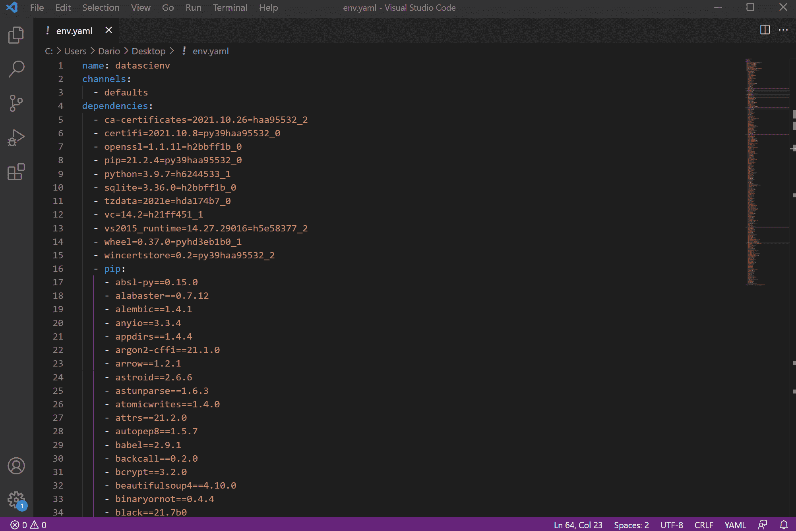
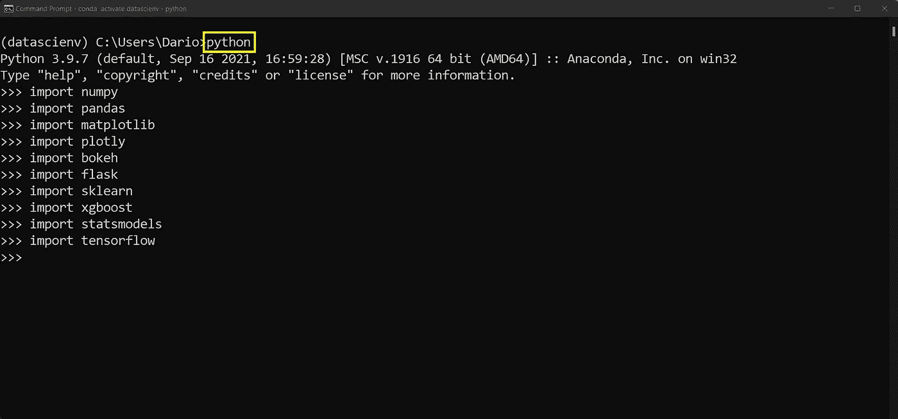

# 了解 Datascienv —一种用于设置数据科学环境的防故障方法

> 原文：<https://towardsdatascience.com/meet-datascienv-a-fail-proof-method-for-setting-up-data-science-environments-4d734290bc3?source=collection_archive---------14----------------------->

## 如何通过单个 Pip 安装配置数据科学环境


安东尼·里埃拉在 [Unsplash](https://unsplash.com/?utm_source=unsplash&utm_medium=referral&utm_content=creditCopyText) 上的照片

管理数据科学工作流并不有趣。通常会涉及到几十个虚拟环境，整个事情就是一团乱麻。说真的，有多少次执行失败仅仅是因为您的 Python 环境缺少一个依赖项？

想象一下，您已经为您的项目创建了一个新的虚拟环境。就库而言，您几乎需要任何可以想象的东西，从数据预处理到数据可视化、机器学习和部署库。手工安装它们需要时间。有更好的方法。

今天，我将向您介绍`datascienv` —一个简化数据科学环境设置的开源 Python 包。我们将从一个新的环境开始，并从那里配置一切。

不想看书？请观看我的视频:

# 什么是 Datascienv？

简而言之，`datascienv`是一个 Python 包，它提供了数据科学环境设置，只需进行一次 *pip* 安装。根据官方 Pypi 页面，这是它为你安装的库列表:



图 1 —由 datascienv 安装的 Python 包

从日常数据分析、预处理和可视化到机器学习包，这是非常多的。安装完成后，我发现`datascienv`安装的软件包比列表中的还要多，但更多是在后面。

接下来看看`datascienv`怎么上手。

# 如何安装 Datascienv？

我们将从头开始。我假设您已经通过 Anaconda 安装了 Python。如果不是这样，只需翻译终端命令来匹配您的虚拟环境管理器。

**1。创建新的虚拟环境**

我基于 Python 3.9 创建了一个名为`datascienv`的虚拟环境:

```
conda create --name datascienv python=3.9 -y
```



图 2——创建一个新的虚拟环境(图片由作者提供)

如果一切按计划进行，您应该会看到如下消息:



图片 3 —创建新的虚拟环境(2)(图片由作者提供)

**2。激活虚拟环境**

配置虚拟环境后，您可以激活它:

```
conda activate datascienv
```

您应该会看到`(datascienv)`显示在路径前面:



图 4 —激活虚拟环境(图片由作者提供)

就这样——您已经准备好安装`datascienv`了。

**3。安装**和`**datascienv**`

如果您使用的是 Windows，请确保首先安装了[Microsoft Visual c++ 14.0+](https://docs.microsoft.com/en-us/cpp/windows/latest-supported-vc-redist?view=msvc-170)。不知道有没有 Mac 或者 Linux 的前提条件。我还没有在我的 M1 MacBook Pro 上安装`datascienv`，因为它仍然不支持所有的数据科学库。至少没有变通办法。

使用以下命令在您的虚拟环境中安装`datascienv`:

```
pip install -U datascienv
```



图 5 —安装 datascienv(图片由作者提供)

安装需要一段时间，因为它需要拉一吨的 Python 包。完成后，您应该会看到这样的输出:



图 6 —安装 datascienv (2)(图片由作者提供)

你现在已经安装了`datascienv`。但是这到底是什么意思呢？图书馆包括什么？接下来让我们来探索一下。

# Datascienv 包含哪些内容？

事实证明，很多。比 Pypi 官方页面上列出的要多。有无数种方法可以检查，可能最简单的方法是将 Anaconda 虚拟环境导出到一个`.yaml`文件中:

```
conda env export > \Users\Dario\Desktop\env.yaml
```



图 7 —导出 Anaconda 环境(图片由作者提供)

用任何文本编辑器打开`env.yaml`文件。做好准备，因为文件中有将近 300 行:



图 8 — env.yaml 文件(图片由作者提供)

对于单个 *pip* 命令来说，这已经很多了。不过，让我们通过打开 Python shell 并导入常见的疑点来验证我们是否拥有了所需的一切:



图 9-检查已安装的 Python 包(图片由作者提供)

是—甚至安装了 Plotly、Flask 和 TensorFlow。这些没有列在官方的 Pypi 页面上。我在大多数数据科学项目中使用它们，所以很高兴确认它们被包括在内。

唯一的问题是——谁应该使用，谁不应该使用`datascienv`？

# 判决

你已经看到了`datascienv`的能力。这不是什么开创性的东西，但它确实做到了它所宣传的那样，并且节省了你的时间。我向任何探索数据科学和机器学习的人推荐它，因为它安装了所有需要的东西。没有必要杀死 Python 内核，安装一个遗漏的依赖项，然后再次启动 Python。

如果您计划部署您的数据科学解决方案，并希望保持需求文件整洁紧凑，我不建议您这样做。很可能你并不需要`datascienv`提供的所有服务。

*你对 Datascienv 有什么想法？你试过吗，如果没有，你打算试试吗？*请在下面的评论区告诉我。

*喜欢这篇文章吗？成为* [*中等会员*](https://medium.com/@radecicdario/membership) *继续无限制学习。如果你使用下面的链接，我会收到你的一部分会员费，不需要你额外付费。*

<https://medium.com/@radecicdario/membership>  

# 保持联系

*   注册我的[简讯](https://mailchi.mp/46a3d2989d9b/bdssubscribe)
*   订阅 [YouTube](https://www.youtube.com/c/BetterDataScience)
*   在 [LinkedIn](https://www.linkedin.com/in/darioradecic/) 上连接