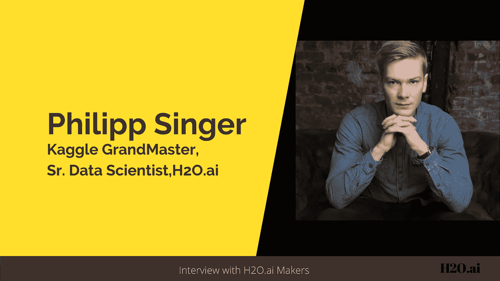
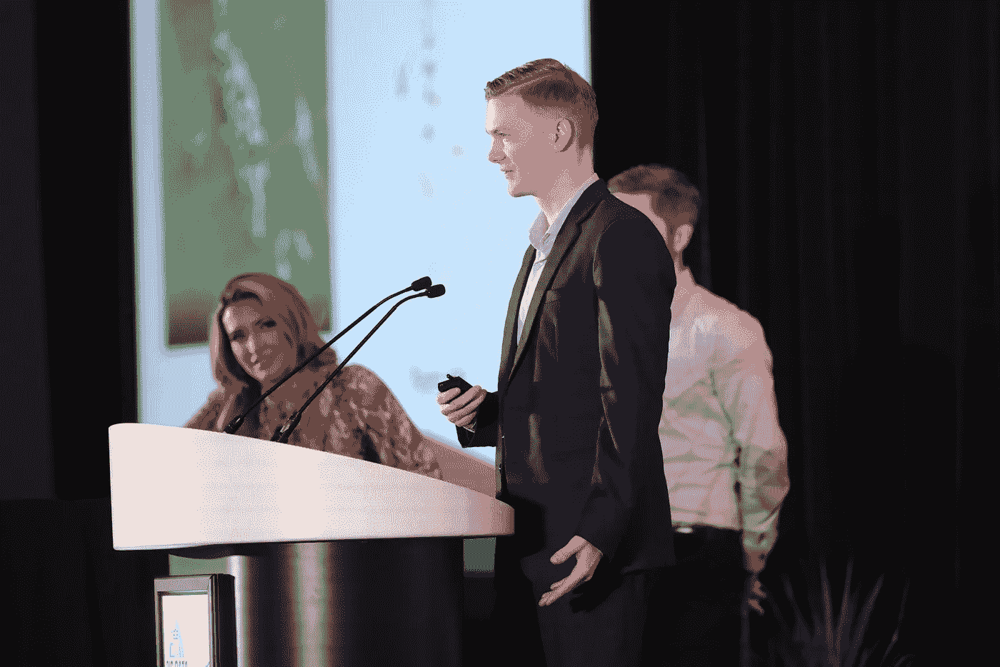
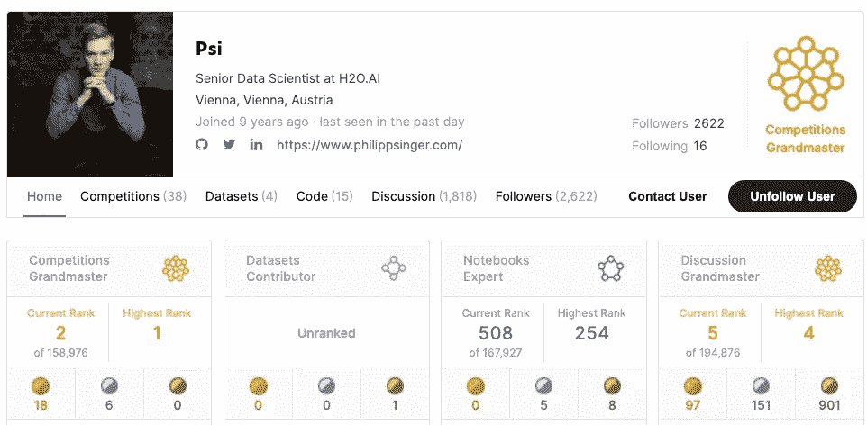
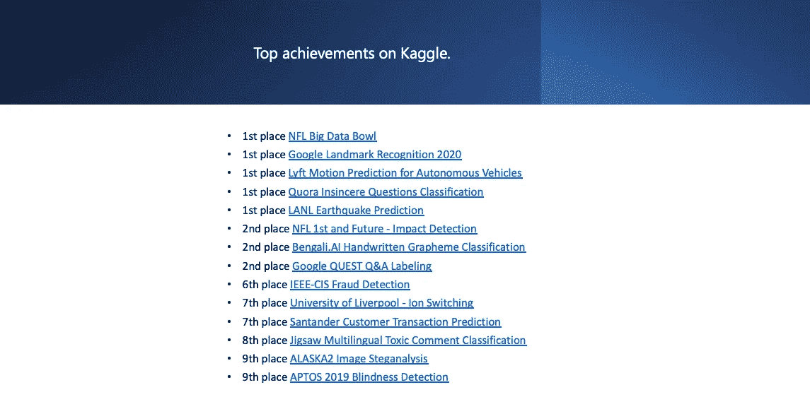
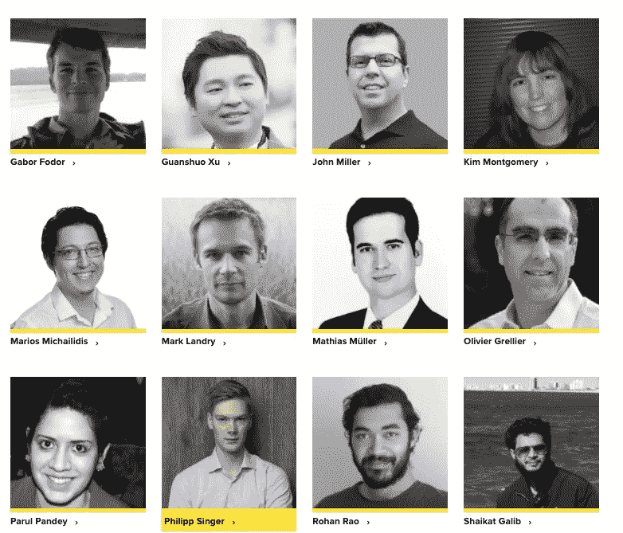
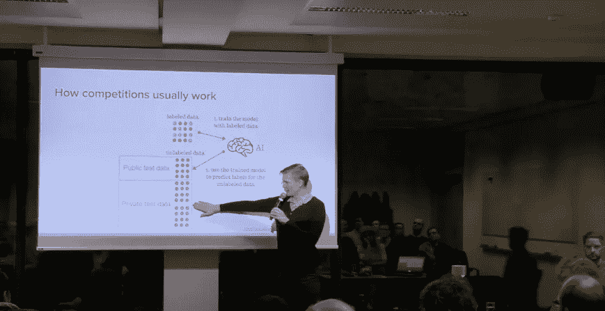

# 见见无法停止在 Kaggle 上获胜的数据科学家

> 原文：<https://towardsdatascience.com/meet-the-data-scientist-who-just-cannot-stop-winning-on-kaggle-dfc0e6fe88f8?source=collection_archive---------5----------------------->

## 与 Philipp Singer 对话:数据科学家，Kaggle 双特级大师，计算机科学博士。

在这一系列采访中，我在 [H2O.ai](https://www.h2o.ai/) 展示了一些知名数据科学家和 Kaggle 大师的故事，他们分享了自己的旅程、灵感和成就。这些采访旨在激励和鼓励那些想了解成为一名 Kaggle 特级大师的人。

在这次采访中，我将分享我与**菲利普辛格、**在 Kaggle world **中更为人熟知的 **Psi** 的互动。**他是 **Kaggle 双特级大师**和**高级** **数据科学家**at[**H2O . ai**](https://www.h2o.ai/)。Philipp 以优异的成绩获得了格拉茨技术大学的计算机科学博士学位，并在那里完成了软件开发和商业管理的硕士学位。

Philipp 有几项成就，包括多次获奖和在 [Kaggle](https://www.kaggle.com/philippsinger) 上名列前茅，以及几项科学荣誉，例如在著名的[万维网会议](http://www.www2015.it/)上获得最佳论文奖。他是前世界排名第一的选手，目前在全球范围内的 Kaggle 比赛中排名第二，这既令人印象深刻，同时也令人鼓舞。

Philipp 最显著的成就之一是通过与一位 H2O.ai 数据科学家合作赢得了 [NFL 第二届年度大数据碗](https://www.kaggle.com/c/nfl-big-data-bowl-2020/overview)比赛。来自世界各地的 2000 多名数据科学家在 [Kaggle](https://www.kaggle.com/c/nfl-big-data-bowl-2020/) 上竞争预测仓促的游戏结果。Philipp Singer 和 Dmitry Gordeev 凭借他们的[方法](https://www.kaggle.com/c/nfl-big-data-bowl-2020/discussion/119400)赢得了 5 万美元的最高奖金。

2019-20 大数据碗获奖者 Philipp Singer 和 Dmitry Gordeev(后)在印第安纳波利斯发表演讲。

在这次采访中，我们将更多地了解他的学术背景、他对 Kaggle 的热情以及他作为数据科学家的工作。以下是我与菲利普对话的摘录:

**你有计算机科学的博士学位。你为什么选择数据科学作为职业，而不是坚持学术界的研究方向？**

***菲利普:*** 我在奥地利格拉茨工业大学获得了计算机科学博士学位，并在德国做博士后研究员。在我的科学生涯中，我接触了许多不同的数据科学主题，并在著名的会议和期刊上发表了许多论文和文章。作为职业生涯的下一步，我将不得不追求教授职位，这听起来很有趣。然而，即使我热爱教学，我也想深入更多的应用工作，这意味着我希望我的工作比研究中最有可能产生的影响更大。这促使我将数据科学作为职业。也就是说，我非常喜欢我的博士学位，并在那段时间里学到了很多东西，但现在我也很高兴处于数据科学和机器学习的前沿，并在 H2O.ai 担任真正的创造者角色。

**你与 Kaggle 的幽会是如何开始的，是什么让你在你的大师之旅中一直保持动力？**

[菲利普的卡格尔简介](https://www.kaggle.com/philippsinger)

***Philipp:*** 大约八年前，我在 Kaggle 上注册，接近我成为博士的第一步，因为我听说了这个平台，想去看看。但是我除了提交一份样本之外什么也没做，然后六年内不再接触 Kaggle。大约两年前，我和德米特里决定一起在 Kaggle 上尝试一个竞赛，作为工作中的副业。我们对它没有任何期望，但最终赢得了比赛，这让我着迷，并开始了我的 Kaggle 之旅。在 Kaggle 上，我的方法一直是解决新类型的问题以保持动力，并且仍然有新的和令人兴奋的问题需要定期解决。我也喜欢在 Kaggle 上与有才华的人见面和一起工作，并看到社区是如何努力的。

**最近，你已经凭借一些惊人的成绩杀入 Kaggle 排行榜，最新的是** [***NFL 第一名和未来-影响检测***](https://www.kaggle.com/c/nfl-impact-detection) ***，*你获得了第二名。你解决这些问题并取得成功的方法是什么？**

**Kaggle 上的许多成功都是基于经验和愿意去接触和学习乍一看你不太了解的东西。随着时间的推移，我已经组装了一个特殊的通用工具箱，其中包含了我处理过的每个比赛的构建模块。例如，我知道如何建立适当的**交叉验证**，什么**库**用于我的模型，如何恰当地拟合模型，跟踪它们的性能，以及类似的事情。所以我已经有更多的时间来关注最近比赛的新的和关键的方面。每次比赛后，我都会努力改进我的工作流程，让自己变得更有效率和竞争力。**

> Kaggle 上的许多成功都是基于经验和主动去接触和学习乍一看你不太了解的东西。

你如何决定参加哪些比赛？

菲利普在 Kaggle 上的最高成就

Philipp: 我主要尝试解决新类型的问题或竞赛，这些问题或竞赛听起来与数据或要解决的问题有关。有时，我也会参加一些更标准的比赛来试试运气，以了解艺术每周的变化情况。

你通常如何处理一个难题？任何喜欢的 ML 资源(MOOCS，博客等。)您想与社区分享的内容？

Philipp: 我会尝试利用我已经积累的方法、工具和经验，然后尝试研究手头的具体问题。这意味着我将在 Kaggle 上研究以前类似问题的解决方案，并阅读相关论文。了解一个问题的最好方法是亲自动手，边做边学。

**作为 H2O.ai 的数据科学家，你的角色是什么，你在哪些具体领域工作？**

Philipp 和其他 kaggle 大师在 H2O.ai

***菲利普:***At[**H2O . ai**](https://www.h2o.ai/)**，**我的角色是非常多面的。我经常参与面向客户的项目，我的目标是用我的数据科学专业知识支持项目。此外，作为 Kaggle 大师，我们总是试图利用我们的经验和知识，不断改进我们的产品，开发新的尖端原型和解决方案。例如，这可能意味着我们在 [**无人驾驶人工智能**](https://www.h2o.ai/products/h2o-driverless-ai/) 中提出新功能的建议，或者在 [**Wave**](https://www.h2o.ai/products/h2o-wave/) 中开发人工智能应用，展示新技术或完整的管道数据科学解决方案。

**你通过 Kaggle 学到的最好的东西有哪些是你在 H2O.ai 的专业工作中应用到的？**

***Philipp:*** 你在 Kaggle 上学到的一件重要的事情是如何生成健壮的模型，这些模型能够很好地概括，并且不会受到强烈的过度拟合。这在 Kaggle 上至关重要，因为你需要在看不见的私有数据上表现良好。这意味着您会学到很多关于健壮的交叉验证的知识，并关心其他数据方面，如特性分布变化或某些重要方面。我可以在 H2O.ai 的工作中很好地利用这些知识，因为这也是我们产品不可或缺的一部分。我们希望通过我们在该领域的专业知识和知识，让客户能够进行强大的机器学习。

**数据科学领域正在快速发展。你是如何设法跟上所有最新发展的？**

***Philipp:*** 我大多用 Kaggle 来跟上最新动态；这是一个优秀的新技术过滤器，它要么能解决实际和应用问题，要么不能。通常，健壮的方法会保留下来，偶尔有用的边缘技术会被过滤掉。与此同时，我试图通过在 Twitter 和其他平台上关注知名研究人员和从业者来了解最新情况。

你想在 ML 中应用你的专业知识吗？

[菲利普在 2020 年 1 月 9 日举行的维也纳数据科学小组会议上的讲话](https://www.youtube.com/watch?v=6KF1KLLM6Q8)

***菲利普:*** 我没有什么具体的想法；我通常会对工作或社交中突然出现的有趣问题感到惊讶。深入研究乍看之下你并不感兴趣的问题是非常必要的。你也可以对这个问题有一个公正的看法，或许还可以将你从其他问题中获得的经验应用到手头的数据中。

**给刚刚开始或希望开始数据科学之旅的数据科学和 Kaggle 有志人士一点建议？**

***菲利普:*** 弄脏自己的手，不要害怕失败，永远渴望学习新的东西。

菲利普的卡格尔之旅相当不寻常。我确信，他的旅程、奉献和成就将成为已经在这一领域工作或试图在这一领域取得成就的其他人的灵感来源。

# 阅读本系列的其他采访:

*   [*Rohan Rao:数据科学家从数独到 Kaggle 的旅程*](/a-data-scientists-journey-from-sudoku-to-kaggle-120876b7fa33)
*   [*Shivam Bansal:数据科学家，负责 Kaggle 上的“有益的数据科学”竞赛。*](/the-data-scientist-who-rules-the-data-science-for-good-competitions-on-kaggle-ab436595a29f)
*   [*认识 Yauhen:第一位也是唯一一位来自白俄罗斯的 Kaggle 特级大师。*](/meet-yauhen-the-first-and-the-only-kaggle-grandmaster-from-belarus-ee6ae3c86c65)
*   [*苏达莱·拉杰库马尔:对数字的热情是如何将这位机械工程师变成了一位围棋大师*](/how-a-passion-for-numbers-turned-this-mechanical-engineer-into-a-kaggle-grandmaster-8b1ae218afc)
*   [*加博·福多尔:卡格尔世界“白鲸”的励志之旅🐋*](/the-inspiring-journey-of-the-beluga-of-kaggle-world-5409e740a21b?sk=a500e2014feb175eae520931ff43b419)