# 在浏览器中与代码相遇(vscode.dev)—与 Web 代码相遇

> 原文：<https://towardsdatascience.com/meet-vs-code-in-the-browser-vscode-dev-vs-code-for-the-web-cf8740211967?source=collection_archive---------7----------------------->

## 在任何操作系统的任何浏览器上运行 VS 代码

[韦雪恩(魏贤)成龙](https://unsplash.com/@weixian?utm_source=medium&utm_medium=referral)在 [Unsplash](https://unsplash.com?utm_source=medium&utm_medium=referral) 上的照片

Visual Studio (VS)代码是最流行的 ide 之一，因为它不仅免费，而且支持多种通用编程语言，并具有安装各种插件的可扩展性。一般来说，要设置 VS 代码或其他任何 IDE，我们通常需要在自己的电脑上下载并安装 app，这在如今并不是一个痛苦的过程，因为各大 IDE 都简化了安装过程。

然而，当您无法访问自己的计算机或者您的计算机不够强大，无法运行这些 ide 时，您的选择就相当有限了。VS Code 团队一直在努力为我们提供更好的解决方案——VS Code 现在是基于网络的应用。换句话说，你可以在浏览器中打开一个网站——[VS Code . dev](http://vscode.dev)，启动一个在线 VS 代码编辑器。

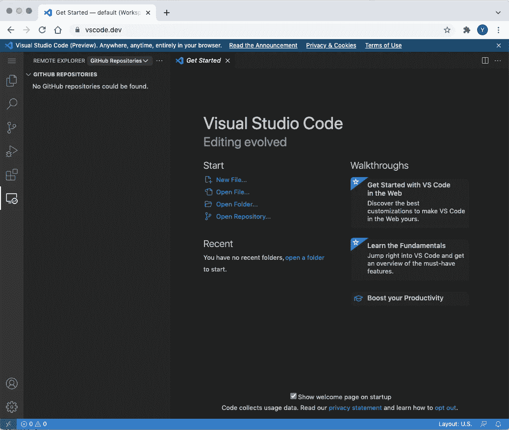

VS Web 代码(作者截图)

## 独立于平台

因为 VS web 代码本质上是一个 web 应用程序，它运行在浏览器上。因此，它几乎可以在任何装有网络浏览器的智能设备上运行。在桌面打开 app 后，在手机上试了一下，如下图。还不算太糟，对吧？

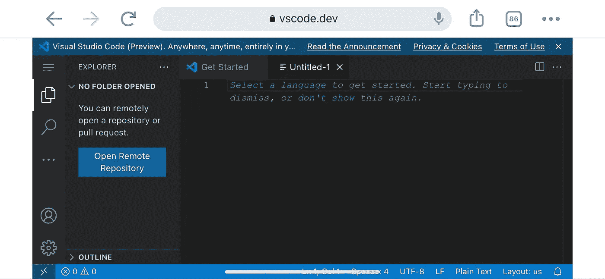

VS 手机上的代码 Web(Chrome)

我尝试的下一个设备当然是 iPad。我没有感觉到和桌面浏览器有什么区别，因为 iPad 的屏幕并不算小。

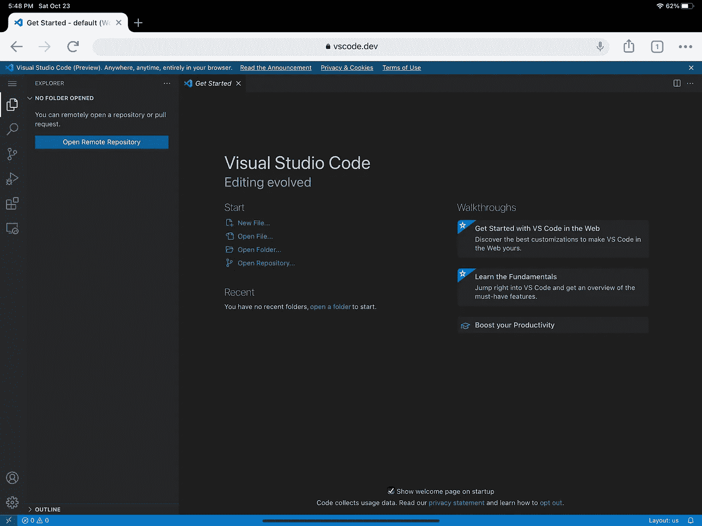

VS iPad 上的 Code Web(Chrome)

正如你所想象的，只要你能访问设备上的浏览器，你就可以在任何地方运行 VS 代码。

这是我在 XBOX 上运行 VS 代码时的样子。所以你可以和你的孩子一起写代码——你们每个人都用一个控制器:)

使用 Edge 的 XBOX 上的 VS 代码 Web(作者提供图片)

## 支持通用编程语言

我没有听说过任何一种语言完全不受 VS 代码的支持。然而，由于 web 的 VS 代码是在浏览器中运行的，它对编程语言的支持受到 web 浏览器能力的限制。然而，正如官方博客关于 VS 代码发布的介绍，有三个类别作为支持级别的函数。

*   最佳语言:这个类别包括与 web 开发最相关的语言，比如 JSON、HTML 和 CSS。你真的看不出网络版和桌面版有什么区别。

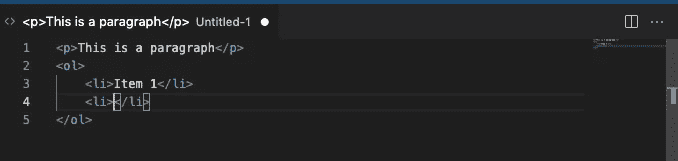

一些 HTML 代码

*   **更好的**:你可能知道，TypeScript 和 JavaScript 在 web 浏览器中被大量使用。最近，Python 也加入了这个团队。因此，这三种语言与 web 的 VS 代码有更好的兼容性。在语法突出显示和错误方面，您会有非常好的体验。

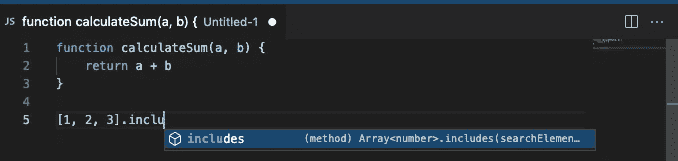

一些 JavaScript 代码

*   **好**:这一类适用于大多数语言，比如 C/C++、Java、C#、Go。这种支持仅限于语法着色、括号对高亮显示和其他一些基本功能。

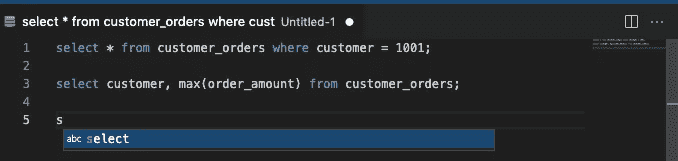

一些 SQL 代码

## 文件系统访问

虽然是 web app，但不代表你永远不想用电脑上的文件。你还是可以的。当您点按“打开文件夹”时，系统会提示您在电脑上选取一个文件夹。

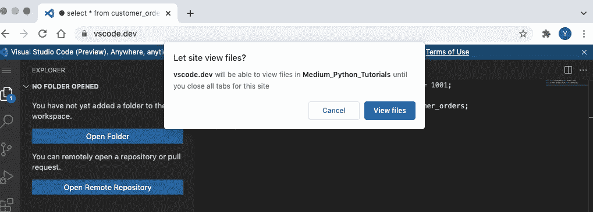

访问文件的授权

一旦你选择了你的文件夹，Chrome 会要求你授权访问你的文件系统。

当您想要尝试向文件系统添加新文件时，可能会有其他提示询问您是否将更改保存到文件系统。

## 扩展ˌ扩张

在访问我的本地文件后，我向文件夹添加了一个 Python 脚本文件。正如您在桌面应用程序中体验到的，系统会提示您安装推荐的 Python 扩展。

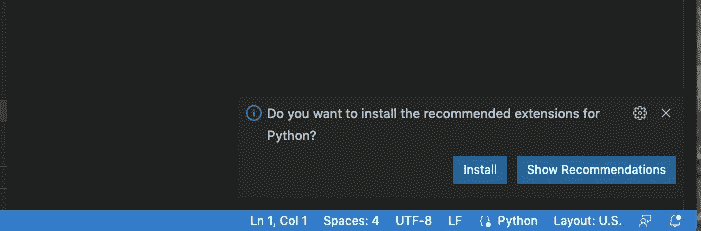

VS 网页代码，扩展提示

毫不奇怪，推荐的扩展是 VS 代码的官方 Python 扩展。然而，它也给出了一个警告，VS 代码的功能可能会受到限制。反正我“反正装”。

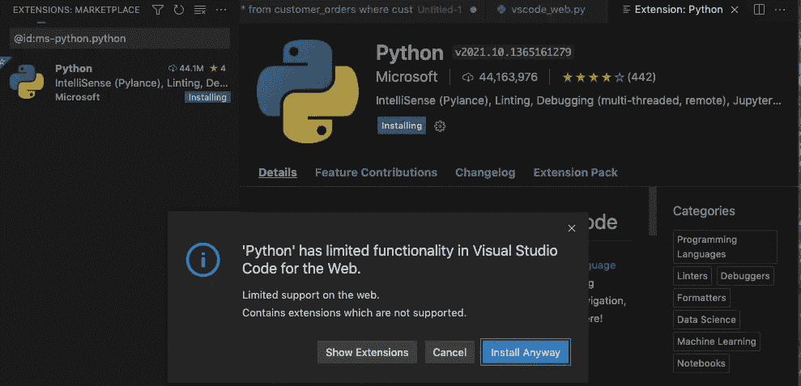

Python 扩展

安装 Python 扩展后，我得到了 Python 脚本所需的自动完成提示，如下所示。多好啊！

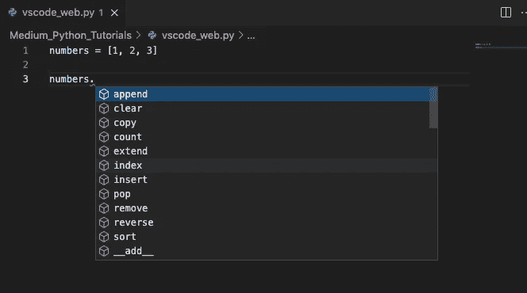

安装扩展后的 Python 编码

当然，您可以尝试许多其他扩展。然而，许多扩展还不能用于 web 版本。相信很多开发者都会更新自己的插件，为网页版提供更多支持。让我们拭目以待吧。

## GitHub 集成

对于我们大多数人来说，我们使用 GitHub 来托管源代码控制的代码。它也集成到了 web 的 VS 代码中。当你点击“打开远程存储库”时，会提示你访问你的 GitHub 账户。

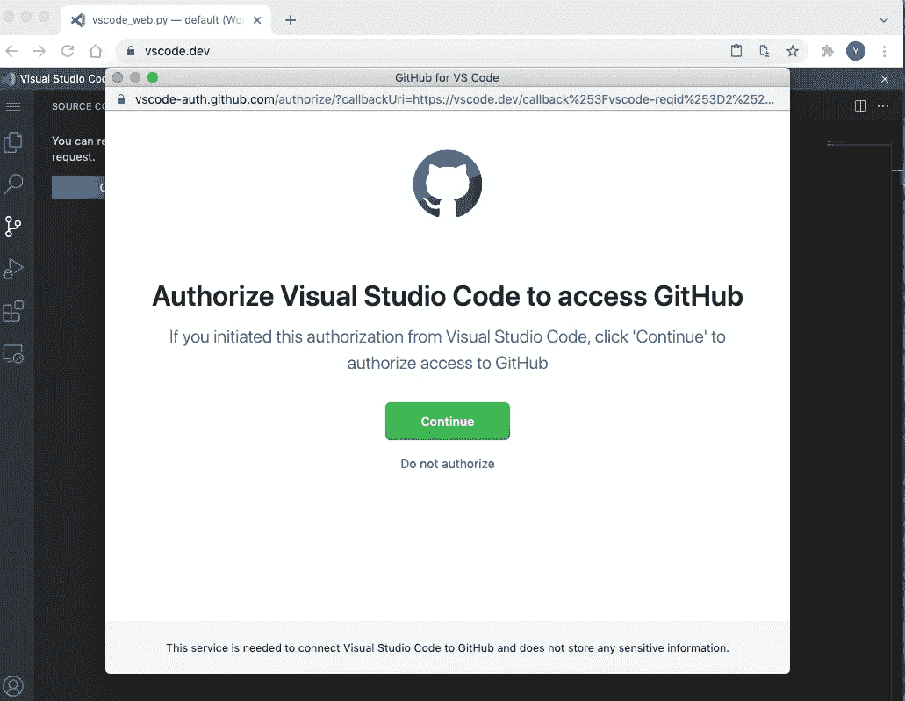

GitHub 的授权

一旦您授权，您将看到您的存储库被列出，您可以选择打开一个您想要的。是不是超级方便？

## 您的设置同步

如果您想要同步您的设置，您可以登录到您的帐户，以便您的 web 应用程序的设置可以与您的桌面版本同步。因此，你在桌面应用上所做的任何设置，也可以在你的网络应用上使用。

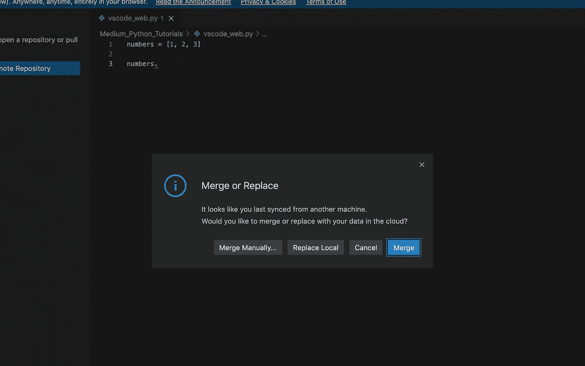

合并设置

## 结论

在本文中，我们将了解 VS web 代码是如何工作的。本质上，它有代码智能、GitHub 集成等最基本的元素，供你编码。最大的优势是几乎可以在任何可以访问 web 的地方编写代码。

当然，它有一些限制，毕竟它是在网络浏览器上运行的，因此它没有桌面应用程序所提供的全部功能。尽管如此，你可以试着使用它，只是为了好玩！

感谢阅读这篇文章。通过[注册我的简讯](https://medium.com/subscribe/@yong.cui01)保持联系。还不是中等会员？通过[使用我的会员链接](https://medium.com/@yong.cui01/membership)支持我的写作(对你没有额外的费用，但是你的一部分会费作为奖励由 Medium 重新分配给我)。