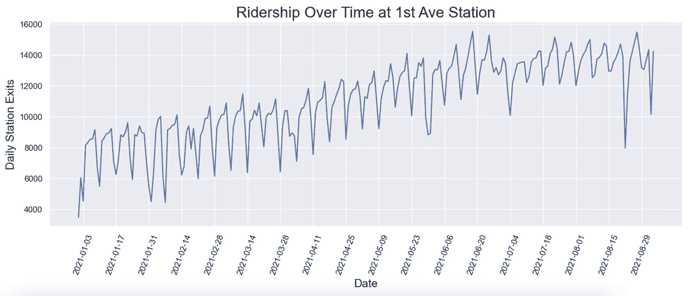
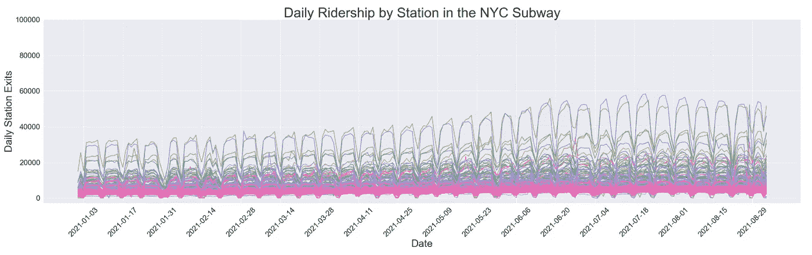
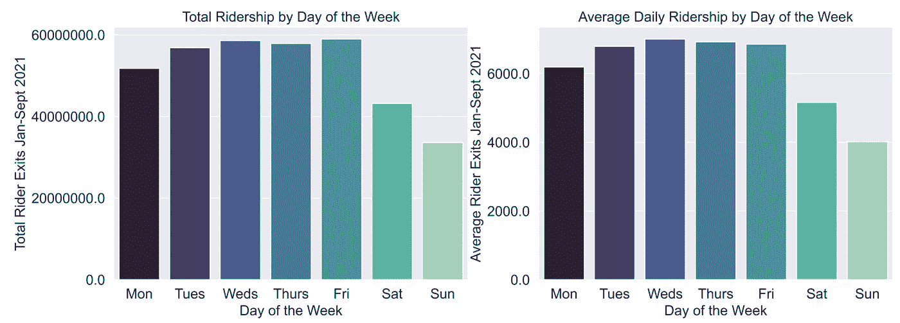
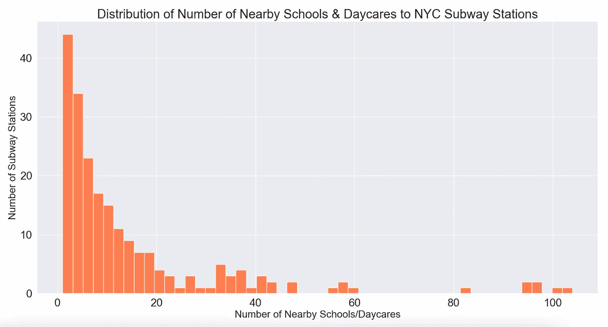
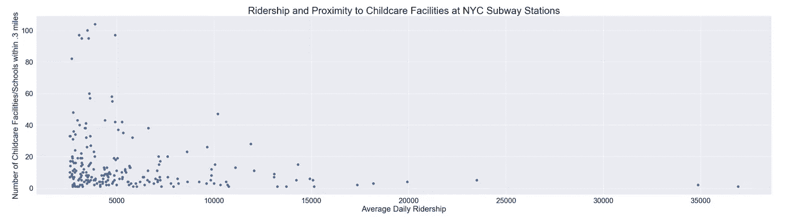
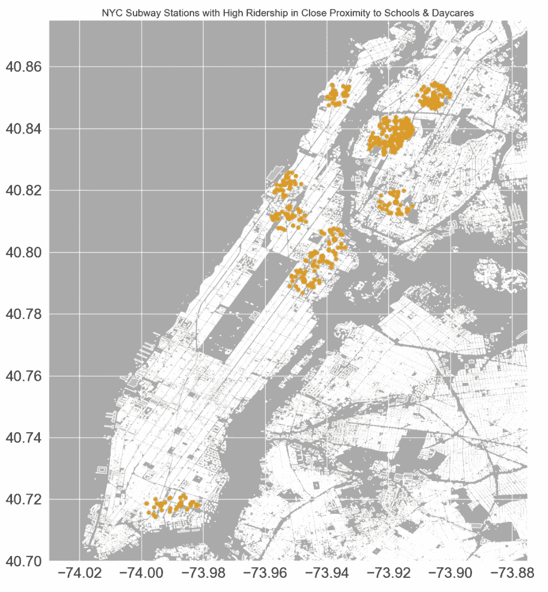
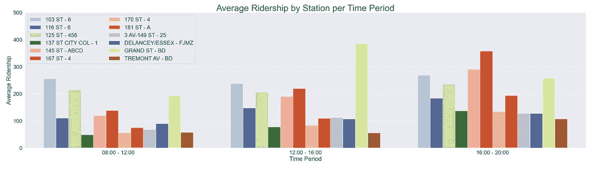
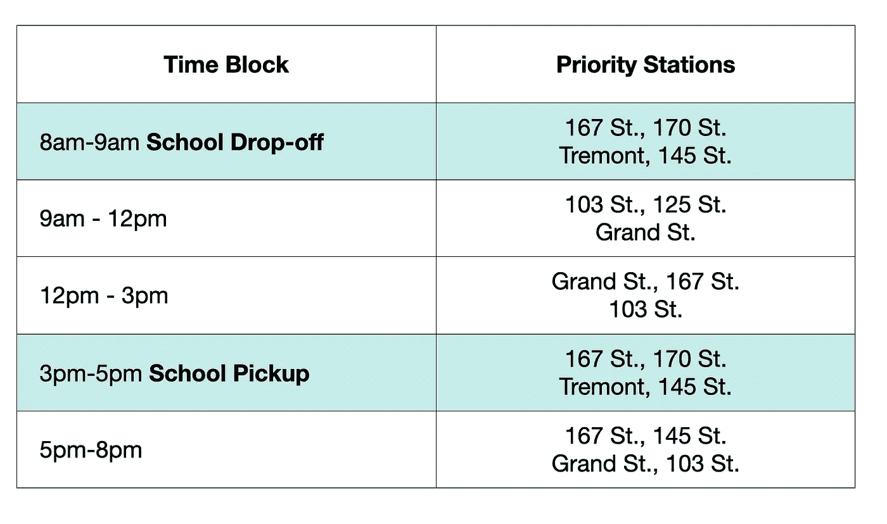

# 在她们所在的地方遇见她们

> 原文：<https://towardsdatascience.com/meeting-women-where-they-are-3735b0bd362d?source=collection_archive---------29----------------------->

## [公平和偏见](https://towardsdatascience.com/tagged/fairness-and-bias)

## 利用纽约地铁十字转门数据增加科技产品的代表性

根据数据科学训练营 [METIS](https://medium.com/u/d18bcb7f0383?source=post_page-----3735b0bd362d--------------------------------) 的提示，我最近接受了一项挑战，帮助一家科技机构的女性增加曝光率和影响力，在她们即将到来的晚会之前，将她们的员工团队安排在纽约地铁站收集电子邮件。目标车站、时间和原因将主要通过使用 [MTA 十字转门数据](http://web.mta.info/developers/turnstile.html)来确定，这些数据是多年来纽约市每个十字转门的骑车人活动的详细记录。

我的方法是依靠以前的研究作为我分析的基础，使用卡罗琳·克里亚多·佩雷斯 2019 年出版的《看不见的女人:为男人设计的世界中的数据偏差》一书的论点。

## **背景**

在《看不见的女人》中，Criado Perez 将城市旅行描述为一种性别化的体验。虽然许多交通系统主要关注早上去市中心、晚上回家的典型通勤者，但“女性的出行模式往往更复杂。”由于女性完成了世界上 75%的无偿护理工作，她们的城市旅行往往包括连续完成多项差事，也称为“旅行链”在一次通勤中，送孩子上学、买杂货和看望年迈的父母可能是最方便的。有了这些知识，我决定将分析的重点放在确定离学校和托儿所很近的纽约地铁站上，以便在这些地方遇到女性。

## 数据集

这个项目的主要数据源是 [MTA 十字转门数据](http://web.mta.info/developers/turnstile.html)，它是由单个十字转门构成的，每一行代表每 4 小时一次的十字转门进出记录。我使用了这个数据集的一个子集，范围从 2021 年 1 月到 9 月，以反映 COVID 期间的最近活动，以及学年中的一系列月份。这个数据集需要大量的清理，包括考虑不规则的负值、不切实际的高进入/退出数和重复值。为了更细致地分析十字转门数据，我将车站名称与它们各自的线路名称结合起来，因为纽约市碰巧有多个同名的车站。

此外，为了测量车站、学校和托儿所之间的距离，我还包括了多个带有地理数据的数据集。[车站位置](http://web.mta.info/developers/developer-data-terms.html#data)、[学校位置](https://data.cityofnewyork.us/Education/2019-2020-School-Locations/wg9x-4ke6)和[儿童保育位置](https://data.ny.gov/Human-Services/Child-Care-Regulated-Programs-Map/s8uq-s4wq)数据都是从纽约市的各种来源收集的，并提供了经纬度坐标用于地理比较。

## 分析

在这个分析中，我将“乘客量”定义为给定时间段内特定站点的乘客出口数量。我开始试图通过观察一个单一的车站来理解纽约地铁系统中常见的乘客模式，第一大道:

第一大道站遵循周末低客流量的模式。图片作者。

知道每隔一个星期天有一个 x 轴标签，我们可以看到在 9 个月的数据中，第一大道遵循工作日高客流量的一致趋势，周末有所下降。但这只是一个车站——这种趋势会推广到更广泛的地铁系统吗？

整个纽约市的地铁系统都遵循工作日乘客量高、周末乘客量低的趋势。图片作者。

当我绘制了 9 个月以来所有可用车站的图表时(如上)，很明显，整个纽约地铁系统都遵循着我们在第一大道看到的相同趋势——这些车站在周末都不太受欢迎。我们还可以通过绘制 9 个月期间每周各天的乘客图表来更清楚地了解这一趋势:

周六和周日的总载客量和平均载客量低于一周中的其他时间。图片作者。

鉴于我计划利用学校的活动进行分析，并且周末的客流量较低，从这一点开始，我将周六和周日从数据集中删除。此外，按照组织的要求，我放弃了所有客流量低于 50%的电视台，以优先考虑曝光率和覆盖范围。

接下来，是时候找到车站离学校和儿童保育设施的距离了。将此数据与十字转门数据关联起来的最佳方式是合并站名和站线的数据集，这是创建唯一车站标识符的要素组合。这不可能干净利落地完成，所以我使用了一个组合的 [fuzzywuzzy](https://pypi.org/project/fuzzywuzzy/) 字符串匹配(一个比较字符串并返回一个衡量其‘相同’程度的比率的包)和手动匹配，以便组合数据集。我成功地匹配了 215 个站名，这给了我们足够的选项来分析该组织的街道团队。

使用 geopy 的距离函数来计算两个坐标之间的英里距离，我找到了每个车站到每个学校&日托的距离。我将“附近”定义为鸟儿飞行时 0.3 英里以内，这在城市街区很容易行走，并将数据帧过滤为仅“附近”位置的组合。我发现，大多数车站附近的学校和日托所不到 20 个，但有几个超过 80 个，这对我们的团队来说是非常有价值的车站位置:

大多数车站在 0.3 英里范围内只有不到 20 所学校和托儿所，但少数车站有超过 80 所。图片作者。

然而，乘客数量仍然是这次讨论中的一个重要因素——如果在选定的车站没有活动，靠近学校和托儿所就变得不那么重要了。为了记住这两个变量，我们可以根据乘客数量和附近设施数量绘制所有车站:

大多数车站的乘客相对较少，附近的学校设施也很少。图片作者。

使用这个散点图将分析范围缩小到我们的顶级站点，我将重点放在两个主要组上。第一个是“理想”车站，它具有较高的日客流量(> 5000)和较高的设施数量(> 20)。第二组是设施数量非常高(> 80)的车站，即使它们的日客流量相对较低(> 3500)，因为这些车站似乎是一个非常有价值的地方，仅在当地学校环境中存在。使用 [geopandas](https://geopandas.org/) ，一个允许你在 python 中操作地理空间数据的包，我在 NYC 的 shapefile 上绘制了最后 12 个顶级站点。你可以看到下面红色的车站，黄色的是附近的学校和托儿所。分别是:125 St-456，145 St-ABCD，Delancey/Essex-FJMZ，Grand St-BD，3 Av-149 St-25，103 St-6，137 St City Col-1，181 St-A，116 St-6，167 St-4，170 St-4，Tremont Av-BD。

这张地图由 Geopandas 制作而成，用红色显示了 12 个被选中的站点，周围的学校和托儿所用黄色标出。图片作者。

在优化女性在技术组织的员工团队的时间表的最后努力中，我查看了这 12 个站点的每小时活动。在人手有限的情况下，重要的是我们要把时间集中在每个车站最繁忙的时段，而在乘客较少的时候转移到其他地方。如果我们只关注每天早上 8 点到晚上 8 点的合理时段，我们可以看到每个车站的活动时起时伏:

早上 8 点到晚上 8 点之间，许多车站的乘客量时高时低。图片作者。

了解了这一点，我们就能够为团队制定一个时间表，在我们的团队在那里的时候最大化车站活动。在上学高峰期，我们可以将注意力转移到附近学校设施高度集中的车站。在一天中改变优先站点将使团队的投资回报率最大化。

## 这些建议

组织应将学校接送时间(上午 8 点到 9 点)集中在附近学校和托儿所高度集中的车站(167 街、170 街、特雷蒙特街和 145 街)。在街道地铁入口部署团队将利用可能与地铁无关的当地学校行人交通。在上学期间或下班后的休息时间，他们可以关注那些时间段内客流量高的车站，以利用白天的所有时间。团队的潜在时间表如下所示:

图片作者。

在这些站点工作几周后，我们可以使用收集到的数据来重新评估我们的策略。进一步改进我们方法的未来工作可能包括纳入纽约市人口统计数据、社区和技术学院位置数据，或者更密切地关注客户团队的独特限制和偏好，以便切实满足他们的需求。

*感谢*[*Maxen Haveles*](https://twitter.com/mhaveles?ref_src=twsrc%5Egoogle%7Ctwcamp%5Eserp%7Ctwgr%5Eauthor)*对本文的反馈。要深入挖掘代码，可以随意探索我的* [*项目回购*](https://github.com/ninaksweeney/Metis_Project_1) *和* [*Jupyter 笔记本*](https://github.com/ninaksweeney/Metis_Project_1/blob/main/Project1_Notebook.ipynb) *。*

参考资料:C. Criado-Perez。《隐形女性:在为男性设计的世界中揭露数据偏见》(2019)