# 用 NLP 熔化面

> 原文：<https://towardsdatascience.com/melting-faces-with-nlp-3d21031fba8c?source=collection_archive---------41----------------------->

## 用 python 发现 90 年代垃圾音乐中的主题

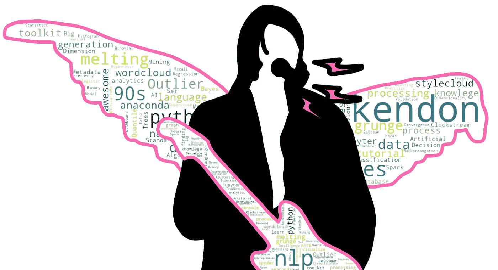

作者图片，灵感来自 Jeff Kravitz 的摄影作品。

# 活着是多么美好的时光

90 年代给我们带来了一些致命的东西。这是 Python 和 R 蓬勃发展的十年！90 年代也给了我们谷歌、Windows 95 和第一条短信。另一方面，堆栈溢出直到 2008 年才被发现，所以我不确定人们实际上是如何使用 Python 或 r 的。

我想那时候你真的必须很聪明才能编程，但我那时还只是个青少年。一个不关心成人的事业、发展技能或写关于事业和发展技能的文章的青少年。然而，我在 90 年代确实关心一件事:摇滚。

这十年给我们带来了涅槃乐队、碎南瓜乐队乐队、戴着镣铐的爱丽丝乐队、石神庙舞女乐队、声音花园乐队乐队、珍珠果酱乐队，以及许许多多其他伟大的乐队。但是柯特·科本警告我们:

```
"He's the one who likes all our pretty songs
But he knows not what it means"
```

接受挑战。

# 这个计划

在我们试图理解 90 年代垃圾音乐运动的意义之前，我们需要稍微放慢节奏。当我们思考单词的*含义*时，这被称为情感。在我们开始从单词、短语、句子、歌曲和专辑中寻找情感之前，还有几个步骤。我打算这是一个多部分的系列，每次深入到 NLP(自然语言处理)的不同方面。

不要绝望！NLP 的早期步骤还可以向我们展示文本中的有趣主题，这些主题可能对人眼(或者在音乐的情况下，对人耳)是裸露的。我们阅读或听音乐的单一经历是时间的小快照，当我们的注意力集中在当前时刻时，之前的时刻很快在我们的记忆中模糊了。NLP 让我们能够一次看到所有这些模糊的时刻，将它们聚焦，并使它们相对于彼此有一个视角。

为了生成和捕捉这些主题，我们将使用短语频率分析。事情是这样的:

*   导入数据。这将是 6 首伟大的 90 年代垃圾专辑的歌词
*   把这些文本块分解成单词列表
*   删除我们不关心的单词
*   把这些单词组成三个单词的短语
*   统计每个短语出现的频率
*   在一些看起来很酷的单词云中可视化这个分析，看看哪些主题上升到顶部

*PS:坚持到最后，我会告诉你我是如何在文章顶部制作出那个恶心的柯特·科本吉他云图像的！*

# 入门指南

这里是 Github 上完整项目的[链接。它包括文件夹、代码和完成本教程所需的一切。](https://github.com/KendonDarlington/MeltingFacesWithNLP)

开始了。首先创建一个名为“短语分析”的文件夹。这是所有事情的发展方向。我更喜欢使用 Pythons 的 Anaconda 发行版，Spyder 是我的 IDE，但是你可以使用任何你觉得舒服的东西。

去这个项目的 GitHub 下载数据 [**链接**](https://github.com/KendonDarlington/MeltingFacesWithNLP/blob/main/Phrase%20Analysis/Grunge%20Lyrics.xlsx) 。这个项目的数据是一个只有 3 行的 excel 文件。这个电子表格有两栏，乐队名称和歌词。两张专辑的歌词被塞进了每个单元格，以使这变得容易。所有这些数据都是从 LyricsOnDemand.com 的[下载的，里面有整张专辑的歌词。这些是我们将要分析的专辑:](https://www.lyricsondemand.com/)

*   涅槃:没关系&在子宫里
*   砸碎南瓜:暹罗梦&梅隆牧羊犬和无限悲伤
*   珍珠果酱:十对五

数据看起来是这样的:


作者图片

在我们开始编码之前，我们需要安装一些软件包。这些是你想要的。

其中许多都带有蟒蛇。然而，您可能需要摆弄其中的几个来安装它们。只需一行一行地运行这些代码。在 Spyder 中，您可以突出显示一行代码，然后按 F9 键只运行突出显示的部分。其他 ide 可能称之为“运行选择”或“运行当前行”。监控控制台的错误，谷歌任何红色。我们没有 1998 年的谷歌，我们有这个漂亮、尖牙利齿的 2021 年的谷歌，所以你的 python 问题的答案总是只需要几次搜索…

接下来，我们有一点我不能为你写的代码。还记得我们创建的名为“短语分析”的文件夹吗？让我们将工作目录指向该文件夹。只需将“PathToTheFolderYouCreated”替换为您计算机上的路径，您猜对了。

如果您的名字是 Jessie，并且您在“我的文档”中创建了文件夹:“C:\ \ Users \ \ Jessie \ \ Documents \ \ Phrase Analysis”

我们为什么要设置工作目录？它让我们对这个项目中的其余代码使用相对路径，并减少了多余的文件路径类型，产生了看起来更整洁的代码。现在，要访问一个文件，你只需键入“file.txt”，而不必硬编码“C:\ \ Users \ \ Jessie \ \ Documents \ \ Phrase Analysis \ \ file . txt”。

# Loopapaloza 的后台通行证

接下来，我们将获取数据。让我们将这些数据存储到一个名为 dfAlbums 的熊猫数据帧中。很快我们将遍历 dfAlbums 的行(只有 3 行),并对每个文本块执行 NLP。

我们还将创建 dfNgramFrequency 来存储循环的结果。现在，这一行代码用列 Band、Phrase 和 Frequency 定义了一个空的数据帧。这将是我们进行频率分析的地方。我在循环之外定义了这个 home，这样就不会被它覆盖了！

现在是写一大块代码的时候了！你准备好了吗？大块的代码会让你焦虑到 11 吗？这很好，因为我将要解释每一行的作用。

```
for index, row in dfAlbums.iterrows():
```

这就是循环。它在说:为我们的乐队和他们的歌词的数据框架中的每一行，做一些事情。这意味着每个循环是一个乐队！涅槃第一，然后砸南瓜，然后珍珠酱。我们会把这个全明星阵容叫做 Loopapaloza，它会卖光的。

```
band = dfAlbums.loc[dfAlbums['band'] == row[0]]['band'].item()
lyrics = dfAlbums.loc[dfAlbums['band'] == row[0]]['lyrics'].item()
```

这将获取当前的循环乐队和歌词，并将它们存储到一个变量中。一旦有了熊猫，这就更容易解析了，这样我们就可以继续与 vairbles 合作了。代码越少越好。

这里有一些稍微有趣的事情

*   。loc:这有助于我们通过选择一列来访问 dfAlbums 数据帧的内容。在我们的例子中，我们通过波段栏来限制它。
*   。item():允许我们将单个 dataframe 单元格中的数据存储为字符串变量。没有它，熊猫会把信息存储成一个系列，这不是我们想要的

```
lyrics = re.sub(r'[^\w\s]', '', lyrics) 
```

首先，我们把歌词去掉所有标点符号。标点符号对短语频率分析真的没有任何帮助，它只是噪音。我使用一行正则表达式去掉了标点符号。不要相信它那么容易？在控制台中键入以下内容，然后按 enter:

```
re.sub(r'[^\w\s]', '', "Hey! Wait! I've gotta backpropogate.")
```

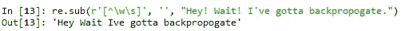

作者图片

```
stopWords = set(stopwords.words('english')) 
```

接下来，我们创建一组名为“停用词”的单词。在 NLP 中，停用词是字面上的词，你停在那里。它的意思是不要使用它们。一般来说，这些单词没有意义，或者对句子的情感没有贡献。在控制台中键入“stopWords”来打开它，并查看其中的单词类型:

现在我不是在这里这样做，但是将你自己的停用词添加到列表中是很常见的。你可以这样做来去除数据中的异常值，并添加对发现情绪没有价值的公司专用术语。如果我们想将单词“cheese”添加到这个列表中，我们可以键入:

```
stopWords.add("cheese")
```

奶酪现在不见了。

```
wordTokens = word_tokenize(lyrics)
```

接下来，我们将打破我们的大块歌词文本，并把它变成一个单词列表。这个过程被称为标记化。

```
sentenceNoStopwords = [w for w in wordTokens if not w.lower() in stopWords]
```

最后，我们从歌词列表中删除停用词。这存储在“句子注释”中。这是一个比较两个列表的简单循环，实际上是在说“对于单词令牌中的每个单词，确保它不在停用词中”。

```
listOGrams = []
n = 3gramGenerator = ngrams(sentenceNoStopwords, n)    
for grams in gramGenerator:
      listOGrams.append(grams[0] + ' ' + grams[1] + ' ' + grams[2])
```

现在我们来看看好东西！首先，我们定义一个列表来存储我们的短语，我们循环遍历我们的单词列表(sentenceNoStopwords)并将所有三个单词短语存储到列表中。当你在 NLP 中看到“gram”时，把它想象成一个文本单位，通常是一个单词。我们的 n 设置为 3，因此 n 元语法是 3 个单词短语，也称为“三元语法”。

如果我们将 n 设置为 2，它将是两个单词短语，也称为“二元模型”。如果我们将它设置为 1，它将是单个单词，也称为“字母组合”。最后，如果我们把它设置为-1，它会让时间倒流，让整个宇宙及其所有物质冲向大爆炸的奇点，我们称之为天启图。

实际上，python 可能会崩溃。

```
df = pd.DataFrame(listOGrams, columns = ['Phrase'])
```

最后，我们把这个列表图转换成熊猫的数据图。这个数据帧只有一个名为“短语”的列。坚持住，我们快到了！！！

```
df = df.groupby(['Phrase']).size()
df = df.to_frame()
df['Phrase'] = df.index
df.reset_index(drop=True, inplace=True)
```

这些系做我们与熊猫的聚合。实际上，第一行是聚合，计算每个短语在文本中出现的次数。其余的行只是你必须对熊猫做的愚蠢的事情，以一个干净的数据帧结束。

当你聚集在熊猫中时，它喜欢把你的分组(在我们的例子中是短语)发送到索引中。我们只需要在完成计数后将事情打乱，比如将短语从索引移回一列，然后重新设置索引，这样看起来就不会太草率。

```
df = df.rename(columns = {0: "Frequency"})
df = df.sort_values(by = 'Frequency', ascending = False )    

df['Band'] = band
```

我们将聚合列重命名为“Frequency ”,然后按降序对该值进行排序。我们还创建了一个名为“band”的列，其中填充了很久以前创建的 band 变量。现在，我们已经拥有了填充最终表格所需的一切。

```
dfNgramFrequency = dfNgramFrequency.append(df, ignore_index = True)
```

这会将我们的聚合插入到 dfNgramFrequency 中，它是在我们的循环之外定义的。看，这并不难，是吗？

# 可视化结果

我们终于可以看到我们的短语频率分析的结果了。但是在我们开始之前，让我们在控制台中键入下面一行，来看一下我们的新数据:

```
dfNgramFrequency
```

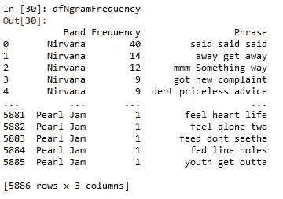

作者图片

这里我们有一个数据框架，有 3 列，带，短语和短语出现的频率。短语和频率恰好是非常棒的 stylecloud 库接受的两种格式之一。

Stylecloud 是一个获取数据并生成一些好看的单词云的包。有两种方法可以将数据传递到 stylecloud 中。

1.  将原始文本传递到库中
2.  将包含短语和频率的 csv 传递到库中

为什么我不选择第一个选项？Styleclouds 确实有自己的停用词函数，我们可以直接使用它。记住这是自然语言处理系列文章的第一篇。我喜欢在执行 NLP 时完全控制我的数据发生了什么，我觉得 pythons 优秀的 NLTK 库(这就是我们使用的)是这项工作的正确工具。

唯一令人失望的是，我们无法将数据帧直接传递给 stylecloud，尽管我尽了最大努力来破解它，它还是想要一个 csv(我说的最大努力是指我尝试了大约 30 秒后放弃)。作为一种变通方法，我只是将数据写入我们工作目录中的 csv，并让 stylecloud 从中读取。

stylecloud 库的另一个好处是我们可以将云做成[字体图标](https://fontawesome.com/)的形状。这些都是网页和应用程序开发中常用的漂亮图标。如果你碰巧是硅谷的数据科学家之一，你的 FANG 股票期权已经被抛到了月球上，你可以每年花 99 美元解锁所有图标。

对于我们这些预算有限做数据科学的人来说，免费的就足够了。说够了，是时候变得时髦了！

# 开场表演:涅槃

请允许我介绍我们在 Loopapaloza 的开场表演:涅槃:

让我们简单回顾一下这段代码在做什么。第一行获取我们的 dfNgramFrequency 数据帧，将它限制在只有波段是 Nirvana 的行。然后，我们将这些内容写入短语分析目录中的 csv 文件。然后 Stylecloud 从这个文件中读取数据来生成云。“icon_name”参数决定使用字体 Awesome 中的哪个图标。你可以点击他们网站上的任何图标来复制这个标识符。最后，我们显示图像。

结果是:

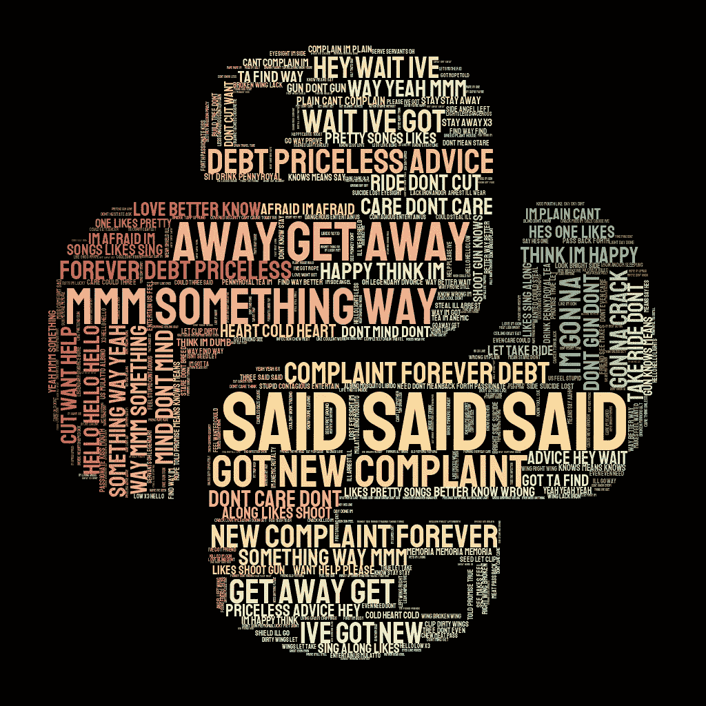

你现在看到的是“Nevermind”和“In 子宫”的短语频率分析，它们被塑造成有史以来最具表情的编程语言:Python。

看着云，你会注意到出现频率最高的三元模型一定是“说了说了”。只是，这有问题；柯特·科本从来没有说过这句话…

这来自于歌曲“品种”的歌词，它重复了两个词短语“她说，她说，她说”一遍又一遍。但是为什么我们的分析说‘说了说了说了’而不是‘她说了她’或者‘说了她说了’呢？停用词！

停用词主要包含代词(如“我”、“她”和“他”)。我其实不认为这是世界末日。移除停用词有助于我们减少数据集中的噪音，并有助于识别主题。主题不一定是艺术家口中说出的顺序。主题不止于此。如果你从我们的项目中删除停用词代码，词云会变得不那么有趣，并且被没有太多实际意义的短语覆盖。

但是，如果您想将' said said '视为异常值，只需将这个单词添加到我们的停用词列表中，然后重新运行代码。

```
stopWords = set(stopwords.words('english'))
stopWords.add("said")
```

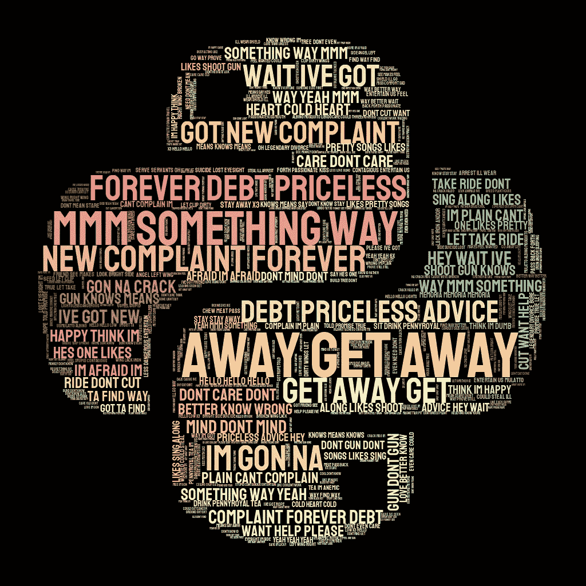

作者图片

在那里，它不见了。现在，你可能注意到的另一件事是，歌曲副歌中的单词比歌词中的单词更突出(例如，歌曲“心形盒子”副歌中的“永远的债务无价”)。这是因为在典型的歌曲结构中，合唱是重复多次的，而韵文往往是唯一的。我将把这作为家庭作业留给读者(顺便说一句，就是你)，你可以冗长地删除第一首歌之后出现的所有合唱(每首歌一个合唱)。

结果可能很有趣，但我不认为这将有助于我们更好地找到意义或主题。仔细想想这个问题，我认为艺术家为副歌选择这些词是因为它们是歌曲中最重要的部分，所以它们应该比独唱部分更流行。

当我看着这个风格云时，我看到了关于逃离、快乐、精神崩溃、枪支和抱怨的主题。你看到了什么？

# 第二幕:碎南瓜乐队！

Nirvanas 一组结束了！现在是 Loopapaloza 的第二幕:

结果是:

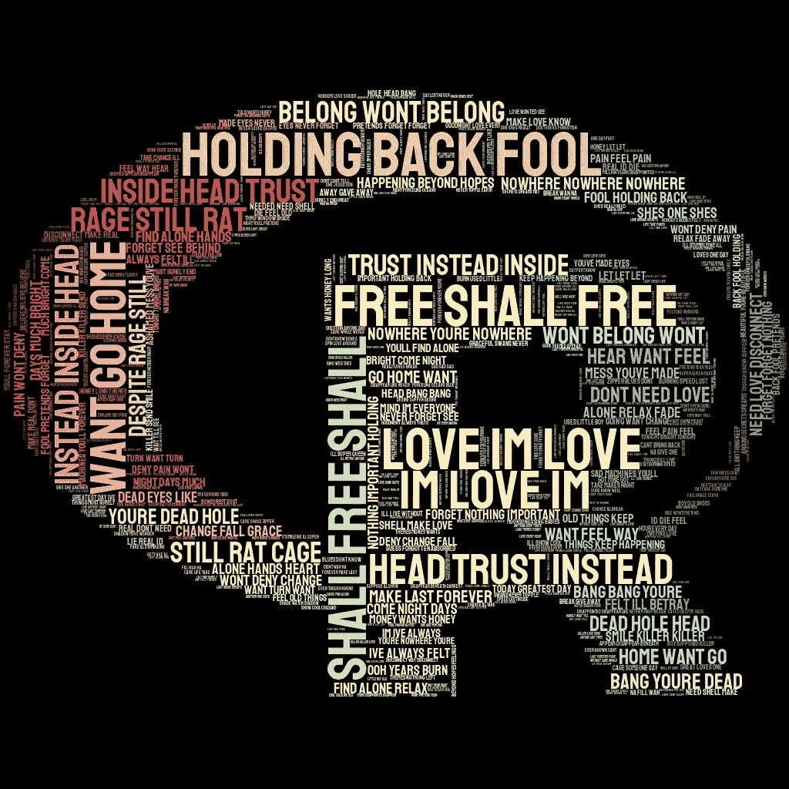

以下是《暹罗之梦》和《梅隆·柯利和无限悲伤》的歌词，它们被压缩成了最难懂的编程语言:r。

我们可以看到围绕着爱、死亡、自由、归属、信任和退缩的清晰主题。比利·考根变得深沉了。

# 头条新闻:珍珠果酱

最后我们在 Loopapaloza 有了最后的表演:

结果是:


我不知道你怎么想，但是我不戴眼镜就没法做数据科学。戴眼镜可能是你能做的最酷的事情了。Pearl Jams 'Ten '和' Vs '专辑中的歌词显示了荣耀、活着、儿童和弹丸枪等主题。

# 安可！

## 艺术和数据联手。

现在你可能想知道我是如何在文章顶部制作出那个很酷的图片的？我用 Python，Photoshop 和一点艺术技巧做了这个。有些人可能会说 Photoshop 在数据科学中没有一席之地，但我不同意。

我相信，作为数据科学家，我们的工作就是抓住观众的注意力和想象力。当你将艺术和数据融合在一起时，你的作品可以在我们每天面对的条形图海洋中脱颖而出。虽然柯特·科本文字云可能不会比条形图更好地讲述一个故事，但它具有新颖性。作为一种生存机制，人类的大脑天生就能记住并专注于从未见过的新奇事物。让我们挖掘人性的这一弱点，并利用它为我们所用！

你可以通过 4 个简单的步骤制作这张图片！

1.  购买数百美元的数字艺术设备，如绘图板和 Photoshop 订阅。
2.  擅长数字艺术。为图像画一堆东西。
3.  将您的作品用作文字云的剪贴蒙版。
4.  用 Photoshop 把它们混合在一起。

看容易！

为什么我选择了柯特·科本？有一些子宫内时代的令人敬畏的图像和摄影。有一些很酷的照片和视频，库尔特在真人大小的子宫内专辑艺术人体模型前表演歌曲，让它看起来好像他有天使的翅膀。杰夫·克拉维茨拍下了这些精彩瞬间的照片，你应该看看他的作品[这里](https://jeffkravitzphoto.com/)！

下面是如何做到这一点:

第一步:画一个左手挡泥板野马。

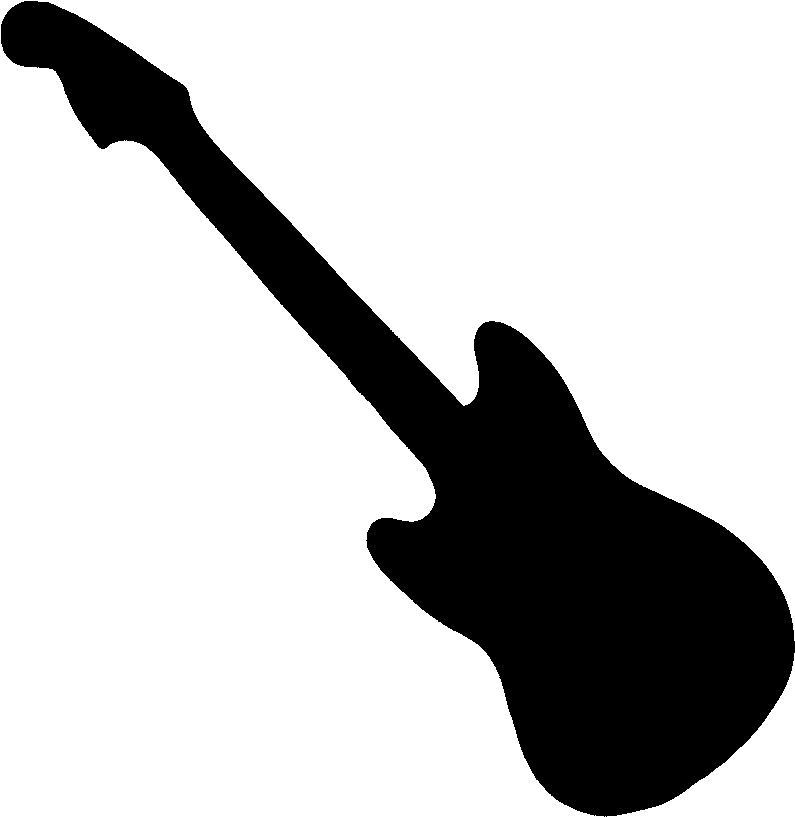

图片作者。

第二步:画一些翅膀

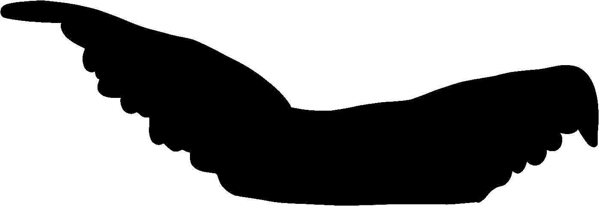

图片作者。

第三步:绘制柯特·科本的风格图。细节在这里并不重要。我们希望我们的目光被吸引到吉他和翅膀上。

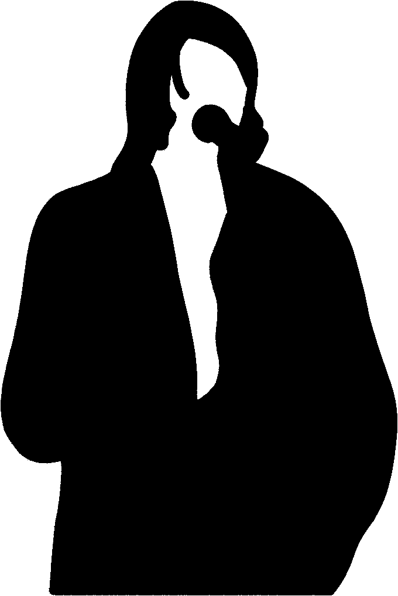

图片由作者提供，灵感来自杰夫·克拉维茨和柯特·科本的摄影作品。

第四步:Python！

接下来，我们需要用文字填充翅膀和吉他。

这里我用的是 wordcloud 库，而不是 stylecloud。原因是因为 wordcloud 允许你在蒙版内部生成 word cloud。什么是口罩？你拿一张涂黑的图片，单词云会填充它的形状。在数字艺术中，这有时被称为使用“剪贴蒙版”。假设你在短语分析文件夹里有上面的图片(它们在 [Github 项目](https://github.com/KendonDarlington/MeltingFacesWithNLP)！).

我也想把文字设置得和这篇文章的标题一样。

```
Melting Faces with NLP
Finding themes in 90s grunge with python
By: Kendon Darlington
```

你会注意到，在我的代码中，我多次重复这些单词，以使它们在云中变得更大。我也只是列出一堆数据科学术语，每次一个，这将使那些单词变得非常小，并作为我文章标题下的数据科学的基础。最后，我确保重复我的名字最多，所以它是最大的单词，因为我是一个自我吸收的俄勒冈小径千禧一代，并在关注中茁壮成长。

新吉他:


图片作者。

新翅膀:

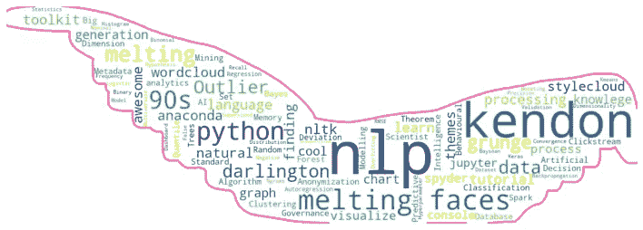

图片作者。

现在这些图片本身就足够酷了。但是要真正让它流行起来，我们需要把它结合在一起。你需要在 Photoshop 中对所有的图像进行分层，重新绘制吉他和翅膀的轮廓，使它们更加平滑，并添加一些效果，比如从他嘴里发出的粉红色声波。我希望我在这里展示所有这些步骤，但是这将是一个 photoshop 教程！

最终结果是:

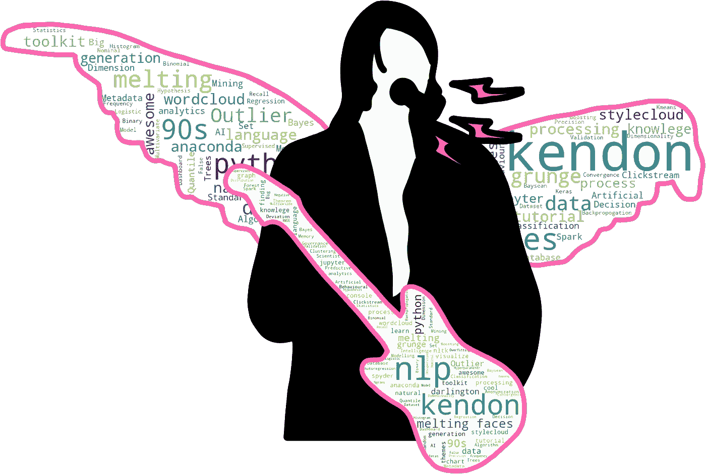

作者图片，灵感来自 Jeff Kravitz 的摄影作品。

在 Github 上下载完整的项目。[链接](https://github.com/KendonDarlington/MeltingFacesWithNLP)。