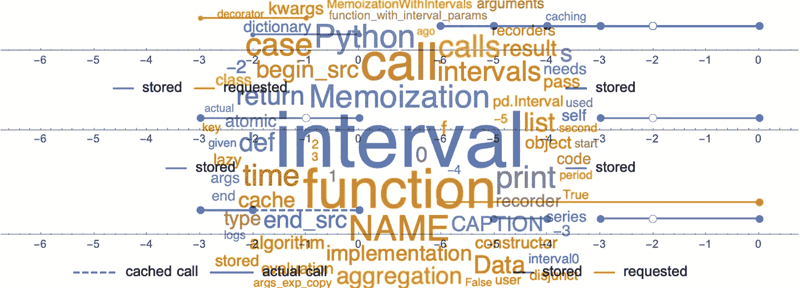

# Python 中带区间的记忆

> 原文：<https://towardsdatascience.com/memoization-with-intervals-in-python-887ece304278?source=collection_archive---------28----------------------->

## 应用于更快的时间序列处理



作者图片

# 动机

数据科学家面临的一个常见任务类型包括
处理不断出现的信息。一个典型的例子是
监控在交易台执行的交易或复杂系统生成的日志
的后处理。

如果您发现自己一天中有很多次要等上三到五分钟，等待统计数据在您的完整数据集上运行，那么您可能会想到，经常会有相当多的时间花在重复的任务上，比如加载数据，无论是从数据库、REST 兼容资源还是文件系统。如果您一直以天真的方式进行，您甚至会发现自己处于这样一种情况，即在更新信息和等待更新所花费的时间之间进行权衡，会使您在刷新系统状态时犹豫不决。

更有效地解决这个问题的一个方法是注意，在典型的
监视任务中，要处理的信息是先前处理的
信息和新到达的信息的联合。简而言之，时间向前运行，并且在许多真实的实际情况下，过去的信息是不可变的(或者对于一个人的特定意图来说，相当接近不可变)。监控频率越高，**新**信息的数量越少(假设泊松过程)。因此，这一大类任务最好增量处理。

具体地说，从午夜到当前时刻加载日志相当于将从上次加载
日志到存储的上次检索以来发生的日志列表连接起来。在处理
不可变部分的操作主导实际的最终处理的情况下(与对这些数据执行
聚合相比，从 DB 中检索数据通常是这种情况)，这种观点的转变导致了与以前情况相比的彻底的
改进:刷新越多，等待越少。

包含存储冗长的
操作结果而不是再次执行它们的优化技术被称为惰性评估、缓存或*记忆化*。

后者是一个 60 年代中期的美国词语，来源于拉丁语
*备忘录*(动词 *memorari* :“被记住”)。用美国公司的行话来说，发表一份*备忘录*，即要记住的东西，后来被通俗地称为*备忘录化* /这个术语在计算机科学中有了自己的生命，用来表示让一个函数记住它自己的结果的行为。这可以帮助不熟悉的读者理解为什么*记忆*不是拼写错误。

对惰性评估策略的一个不太粗略的描述是，接收相同参数的函数
将计算一次结果，并以某种方式存储该结果。在以后的某个时间提供相同的参数，它将检索存储的结果并返回它。当然，这个描述中的几乎每一个单词都隐藏了许多情况、约束和设计选择。例如,“相同”需要明确定义。“存储”的含义以及在实践中是如何实现的，已经产生了许多不同的可能算法和实现策略。仅在 Python 中，就有几十个包部分或全部致力于这项技术的各个方面。

# 时间序列的记忆化:比看上去的要多

解决时间序列惰性评估的简单方法如下。给定时间序列的开始和结束，lazy 评估已经请求的最长序列，其开始和结束时间戳包含在间隔[start，end]中，并且实际上只计算或检索这些时间戳之间的差。因此，以某种方式，在每次评估时保存开始和结束时间戳，并将它们与请求的开始和结束时间戳进行比较。

这个简单的任务可以通过直接实现来处理。现在，如果试图处理非连续请求的情况(从两小时前到一小时前和半小时前到 10 分钟前的时间序列已经被处理的情况)，问题出人意料地变得对普通人来说是难以处理的:如果比较日期的案例爆炸，那么*的数量。人们面临的是这些典型问题中的一个，它比最初看到的要复杂得多。*

# 区间算术的拯救

通常在这种情况下，问题的答案需要在抽象上更进一步
。幸运的是，这里不涉及抽象的步骤，它所需要的概念在文献中有很好的介绍。更重要的是，对这些概念执行基本操作的包是可用的，我们将在本文后面看到。

在许多实际情况下，时间序列可以通过它的开始和结束时间戳来识别。以系统日志为例，生成的所有日志的时间序列由两个时间戳之间的所有日志明确给出。正如前面所建议的，我们不是看两个时间戳，而是想把时间序列看成是由一个单独的时间间隔定义的。这种看似平凡的视角转变最终成为优雅解决问题的关键。

首先，我们将关注一种情况——一种相当常见的情况——我们希望从文件系统中检索两个时间戳之间的所有日志，或者数据库中的所有传入记录，并显示它们的缩略版本。

假设先前已经进行了一些调用来检索不同时间戳的相似数据
。人们应该注意存储这些不同调用的结果
，它们中的每一个都定义了一个原子时间间隔。一个
原子时间间隔是人们想到一个间隔时自发召唤的图像:被考虑的空间/时间的连续部分。区间的这种自然定义可以推广到这种
区间的并集。为了区分这两种类型，前者被指定为*原子*。

假设新的调用定义了新的原子间隔，让我们考虑两个简单的情况:

*   原子间隔与先前记录的间隔相分离。这意味着用户从未检索过这些数据，因此需要调用底层函数。一旦这样做了，一个适时地存储结果，并记录时间间隔沿着以前的。
    该机制如下图所示。
*   新的原子间隔包含在先前记录的间隔之一中。在这种情况下，已经存储了所需结果的超集。人们检索存储的结果，然后应用过滤器。这自然假设过滤操作比查询数据更快，这是一个将进一步放宽的约束。下面的三个“完全重叠”图说明了该机制。


在析取情况下请求新的间隔。图片作者。


析取情况下的结果调用。图片作者。


在分离情况下调用后间隔缓存的新状态。图片作者。


在完全重叠的情况下请求新的间隔。图片作者。


完全重叠情况下的结果调用。图片作者。


完全重叠情况下调用后缓存的新状态。图片作者。

到目前为止，很容易。有了前两个例子，一般情况也不会更困难。一般来说，新间隔可以:

*   与所有以前的案例相分离(一个已经涉及的案例)
*   或者重叠一个或几个间隔。

为了处理第二种情况，我们只需要记住，如果一个区间与另一个区间重叠:

*   他们的区别与后者是脱节的
*   它们的交集包含在后者中
*   差和交的并集就是整个区间。

下图对此进行了总结:


在原子重叠的情况下请求新的间隔。图片作者。


原子重叠情况下的结果调用。图片作者。


原子重叠情况下调用后缓存的新状态。图片作者。

现在，如果新请求的间隔与几个已经存储的间隔重叠，只需要对每个存储的间隔应用先前的方法。接下来的三幅图说明了这种一般情况:


在重叠情况下请求新的间隔。图片作者。


重叠情况下的结果调用。图片作者。


重叠情况下调用后缓存的新状态。图片作者。

够抽象了！让我们来看一个实际的代码。有几个
包来处理区间和区间算术。一个精心编写的
一个是亚历山大·德坎的 [*部分*](https://github.com/AlexandreDecan/portion) 。该软件包处理所有与区间算术相关的必要概念，这是我们利用的一个。

它特别包含了一个方便的`IntervalDict`，这正是人们所期望的
，并且完全符合间隔记录器
的目的，同时考虑到了函数调用的思想。不过，这里有一个小的微妙之处，需要马上清除掉。乍一看，人们可能会奇怪为什么不使用一个广义的时间间隔来记录呼叫。嗯，区间是一个聪明的对象，它有一些属性，在处理区间算术时特别有用，但在当前的上下文中并不适用。例如，两个相邻的时间间隔将减少到一个原子时间间隔，这在函数的惰性计算环境中相当于忘记两个函数调用并注册一个从未发生的函数调用。

所以事不宜迟，这里是第一个版本的`RecordIntervals`对象:

`RecordIntervals`类的一个实例是一个可调用对象，当
通过一个原子间隔时，它将返回一个要调用的列表，而
将更新已经调用的内部列表。

让我们看一个简单的例子。首先，让我们初始化一个空的
记录器，并以区间[-2，0]进行第一次调用(在这些初始的简单例子中，我们将使用整数
区间:我们可以添加一个时间单位(分钟、小时、天)以在时间序列上下文中将它们设置回来)。注意`closed`是*部分*函数调用，用于创建一个原子间隔，其两端都包含在该间隔中。

```
itvals = RecordIntervals()
calls = itvals(portion.closed(-2, 0))
print_calls(calls)
```

输出“[(-2，0)]”告诉我们需要调用带有参数
(-2，0)的函数。因此，如果到目前为止还没有检索到任何数据，并且需要从两个小时到现在的数据，则需要查询 DB(例如)两个小时的数据。

在第一次检索之后，可以立即查询最后一个小时的数据。

```
calls = itvals(portion.closed(-1, 0))
print_calls(calls)
```

输出“[(-2，0)]”反映了数据的超集已经被检索和存储的事实。因此，第二次调用该函数将只返回存储的数据(假设该函数已被记忆)。

下一个案例稍微有趣一些:

```
calls = itvals(portion.closed(-3, -1))
print_calls(calls)
```

输出“[(-3，-2)，(-2，0)]”表示需要发生一个调用，该调用导致从数据库中检索三小时到两小时前存储的数据
，而第二个调用又是对存储结果的调用。那是动作间隔的记忆。我们只查询尚未存储的内容。

最后，下面的代码:

```
calls = itvals(portion.closed(-5, -4))
print_calls(calls)
calls = itvals(portion.closed(-6, 0))
print("should be broken in 5 intervals: -6->-5 | -5->-4 | -4->-3 | -3->-2 | -2->0")
print_calls(calls)
```

产量:

```
[(-5, -4)]
should be broken in 5 intervals: -6->-5 | -5->-4 | -4->-3 | -3->-2 | -2->0
[(-6, -5), (-5, -4), (-4, -3), (-3, -2), (-2, 0)]
```

好吧。我们现在有一个原始的机制，给定一个时间间隔，生成正确的参数来利用潜在的现有记忆。我们现在需要做的就是将这种原始机制与现有的记忆化实现相结合，以便能够对参数包含表示时间(或其他)间隔的类型的函数进行惰性求值。

不过，在这样做之前，可能有必要对记忆化本身，或者更具体地说，对 Python 中的记忆化做一些提醒。

# python 中的记忆化:概述

最常用的内存化实现可能是`functools`库中的`cache`和`lru_cache` ( *LRU* 代表*最近最少使用的*)。它们足以说明记忆化的许多不同方面。

## 示意图利用

惰性评估技术可以总结如下:

*   创建一个调用字典，即
    一组组合的请求参数
    f(1，2，a=True，b='memo') - > key = keymap(1，2，a=True，b='memo ')
*   在该集合中查找新调用方参数
*   如果键存在，从档案中检索相关的结果，否则调用函数。

存档可以是:

*   进程内存储器
*   进程外存储器
*   文件
*   一个组合

`cache`和`lru_cache`依赖于字典实现，对它们可以处理的键的类型和在 RAM 中存储结果有限制。

## 特征

许多策略和实现设计都会影响缓存方法的行为和性能。其中包括:

*   内存空间的管理:例如，是否允许内存空间随着时间无限制地增长？默认情况下，`lru_cache`将限制缓存空间，并且一旦达到该限制，将开始丢弃最近最少使用的*元素，以允许存储新元素。*
*   密钥生成机制:例如，通过字典的默认实现假设密钥是可散列的。

## 函数和字典

根据官方 Python 文档，它是一个字典查找的包装器。字典是实现记忆标准方法。考虑到本文的其余部分，值得注意的是，字典和 Python(确定性的)函数有很多共同之处。符号通常不同——圆括号和方括号——但两者都将参数映射到返回值。

作为题外话，值得一提的是，在 C++标准库
中，相当于字典的东西被称为*映射*，并且在许多函数式语言中*映射*被用来指定一个高阶函数，该函数将一个函数应用于集合中的每个元素。这两个概念似乎又有内在联系。

## 可用的软件包

我们可以从本质上区分两类用于在 Python 中执行惰性评估的包。

第一类包括 python 客户机或非 python 实现的包装器，最著名的两个是:

*   Memcached
*   雷迪斯

另一类包含专用的 python 实现，其中包括:

*   [作业库](https://pythonhosted.org/joblib/memory.htm)
*   [环](https://github.com/youknowone/ring) —优秀的文档
*   [记忆化](https://github.com/lonelyenvoy/python-memoization) ](支持不可散列参数、生存时间策略……)
*   [窃](https://pypi.org/project/klepto/)部分的*悲情*系统。

## 装饰概念和语法

缓存通常作为*装饰器*提供，因此如果
原始函数是`f`:

```
 [@cache](http://twitter.com/cache) 
    def f(i):
      return i+1 
    # the call below is now to a memoized version
    # of the function f
    f(3)
```

来自`@cache`的两行代码为函数`f`添加了惰性求值。

装饰器可以被认为并且实际上被实现为一个函数对象，它接受一个函数并返回一个函数。这意味着装饰器是一个 python 类，它公开了一个`__call__`成员函数。我们通过注意到上述语法可以重写为:

```
def f(i):
   # .... 
   g = cache(f)
```

其中`g`这次是缓存增强功能。

# 一个区间感知的记忆实现

想出一个方便的软件组件来记忆取区间参数的函数需要一定量的元编程。我们选择只公开实现的一部分，这部分将揭示函数的实际使用。其他的可以在代码中找到，代码可以作为自由软件获得。

## 概观

主组件`MemoizationWithIntervals`是作为一个函数对象提供的，通常被期望用作装饰器。
以下是该组件的示例性用法:

## `MemoizationWithIntervals`构造函数

为了正确处理通用函数，需要由用户指定作为记忆候选的区间参数。

因此,`MemoizationWithIntervals`构造函数的前两个参数是位置参数的索引和作为区间的关键字参数的名称。

在章节 **Overview** 的例子中，唯一的间隔参数是`interval`参数，并且在第一个构造函数参数中被指定。

下面是一个带有一个位置间隔参数和一个关键字间隔参数的示例:

构造函数中的其他参数将在下面的小节中详细介绍。

## 返回类型问题:指定聚合方法

重要的是要注意，如前所述，任何涉及区间记忆的实现都与标准的惰性评估算法有着根本的不同。

在标准内存化中，除了速度之外，对缓存函数的调用将返回与对原始函数的调用无法区分的结果。特别是，对缓存函数的调用最多对应于对底层函数的一次调用。

前面几节中描述的算法可能涉及到对底层函数的多次调用。也就是说，结果类型不能先验地匹配初始函数的类型。在我们到目前为止给出的描述中，我们已经建议初始函数将返回一个结果列表。因此，间隔缓存函数将返回一个列表列表。我们已经暗示过，将这样一个列表转化为一个列表会涉及到连接和可能的过滤。

尽管不需要如此。为了恰当地解释一般情况，用户需要灵活地指定一个**聚合**操作。这个聚集规范将是 memoization
类构造函数的一个参数。聚合函数将从不同的调用中获取结果列表，并返回一个类型与初始函数兼容的结果。

因此，这个聚合函数可以简单到`aggregation=list`或
等价地，对于熊猫数据帧，`aggregation=pandas.concatenate`。在用户希望通过求和来聚集数值的情况下，将应用类似于`aggregation=lambda listr: reduce(lambda x,y:x+y,listr)`的东西。

## 记忆算法

本文中描述的包的唯一目的是对采用区间参数的函数进行预处理，以便惰性求值可以委托给用户选择的现有实现。因此，`MemoizationWithIntervals`对象的构造器接受一个完全构造的 memoization 对象，它将执行惰性求值。

可以看出，我们选择了`klepto`包作为默认实现。我们在该软件包中发现了引人注目的功能，并专门使用它。用户可能会发现其他实现更适合他们的需要，因此会更改默认设置。

所以通常使用`functools cache`算法:

## 处理其他间隔类型

Alexandre Decan 的*部分*包是一个很棒的区间算术包。但是，对于 interval 对象本身，这可能不是最常见的实现。按理说，*`Interval`的熊猫可以称得上是冠军。但是一个人可能有自己的实现。使用具有特定间隔类型的 *CacheIntervals* 需要创建一个特定类型的间隔记录器和一点包装，以允许在*部分的*本地间隔类型和用户的间隔类型之间进行双向转换。*

*包 *CacheIntervals* 为 *Pandas 的*间隔类型提供了这样一个包装的例子。实施该特定间隔的目的有两个。一方面，它是希望实现该覆盖的用户的模板。另一方面，*熊猫*’`Interval`型，加上亚历山大·德坎的本土型应该能满足大部分需求。默认情况下，间隔记录器的类型是适应*熊猫*的间隔。要改变它，指定新的间隔**记录器**类型作为构造器的参数，例如:*

# *机制概述*

*这一节更复杂，主要面向包开发人员。特别是，希望区间记忆可以直接嵌入到标准记忆包中，并随时可用。*

*在这一节中，我们将深入探讨实现细节。更普通的读者可以放心地完全跳过它。*

*但是，这些解释中并没有假设 Python 的高深知识。因此，如果好奇发痒，请随意继续。*

*除了构造函数之外，`MemoizationWithIntervals`类只有一个成员函数:函数`__call__`。回想一下，正如在
部分**装饰概念和语法**中解释的那样，`MemoizationWithIntervals`对象是一个函数，它接受一个函数并返回这个函数的记忆版本。*

*让我们看看代码:*

*细节被主动省略，以便结构突出。从这个代码框架可以清楚地看出，`__call__`函数所做的就是获取函数`f`并返回函数`wrapper`，函数本身在`__call__`函数内部定义。*

*从这段摘录中可以看出，`wrapper`函数本身执行对`f`、`f_cached`的记忆版本的
调用。*

*前两行设置一个对象来正确地解析调用参数，据我们所知，Python 语言并没有直接提供这个功能。我们将跳过这部分代码，因为它与本文基本无关。*

## *两次利用记忆算法*

*区间惰性评估的一个直观但不正确的实现是将每个区间参数与其自己的区间记录器对象相关联。要了解为什么它通常不是我们想要的，让我们看一个简单的例子:*

*假设调用如下:*

```
*print('==== First pass ===')
print( f'Final result:\n{function_with_interval_param(2, interval=pd.Interval(-2, 0))}')
print('==== Second pass ===')
print(f'Final result: {function_with_interval_param(2, interval=pd.Interval(-3, 0))}')
print('==== 3rd pass ===')
print( f'Final result:\n {function_with_interval_param(3, interval=pd.Interval(-3, 0))}')*
```

*输出将是:*

```
*==== First pass ===
((2, [-2,0]))
==== Second pass ===
((2, [-3,-2]), (2, [-2,0]))
==== Third pass ===
((3, [-3,-2]), (3, [-2,0]))*
```

*细心的读者已经注意到第三遍的结果导致了低效率。当需要一个调用时，会生成两个调用。原因是第一个参数的每个值应该有一个记录器。*

*正确的算法需要以某种方式为每个非区间参数的组合保留一个记录器。人们可以通过例如字典来手动跟踪这些其他参数，但是人们会立即意识到:*

*   *这是一项艰巨的任务，因为键映射并不像最初想象的那样简单*
*   *这正是记忆算法要解决的问题。*

*因此，更巧妙的方法是利用用户提供的缓存
算法来实现。这更适合于用户已经潜在地
对他的设置指定了许多约束:使用的内存类型、持久性、内存管理和其他……为此，让我们回忆一下**函数和字典**部分的评论:字典和函数之间存在概念上的等价。*

*因此，我们的想法是两次利用缓存的函数实现:*

*   *在对
    功能进行标准评估时，将会调用该函数。*
*   *但是，除了这种标准用法之外，它还将用于存储适当的间隔记录器，就像我们使用字典一样。*

*现在的问题是:我们如何区分标准呼叫和对记录器的请求？一种可能的方法是传递用户永远不会传递的参数。如果我们在任何地方检测到这样的参数，我们知道这不是对底层函数的调用，而是对记录器的请求。*

*这就是下面这个`QueryRecorder`类的目的。在
`MemoizationWithIntervals`对象的构造函数中，变量`self.query_recorder`被初始化为`self.query_recorder=QueryRecorder()`，并在每次调用时用于解析
记录器。*

*所以在下面的`f_cached`函数中，有一个初步的机制来
确定我们正在处理什么类型的调用。如果这是记录器的请求
:*

*   *第一次执行实际代码并创建记录器
    (由用户指定类型，例如`RecorderInterval`、
    `RecorderIntervalPandas`或某些用户的专用)。任何`RecorderInterval`构造函数的特定参数都可以通过在`MemoizationWithIntervals`对象的构造函数中将它们指定为`kwargs`来传递。然后它们被存储到`self.kwargsrecorder`成员变量中。*
*   *此后，记录器被缓存并将被重用。*

*显然，这涉及到一个小的开销。这是否可以接受取决于用户的上下文。实际上，与内存化的好处相比，这种开销在大多数时候是可以忽略的。*

*下面是`wrapper`功能代码的相应摘录。可以看出，当调用包装函数时，
`wrapper`的第一个任务是将每个区间自变量替换为对其对应记录器的请求。当记录器被解析后，`wrapper`
函数继续执行，从概念上讲，是对缓存函数的正常调用，实际上，是对所述函数的一系列(可能的)调用(此处未显示)。*

## *解决电话问题*

*从那以后，算法就相对容易了。从每个时间间隔记录器中，检索要发出的呼叫。最后一系列调用只是可能参数值的
笛卡尔乘积，其中非区间参数只是单值。位置参数和关键字参数的分离给代码带来了一点复杂性，但这基本上就是最后一节的全部内容。*

# *一些最后的细节*

## *容忍*

*假设被查询数据的数据库是一个每 15 分钟更新一次的代理数据库。如果在很短的时间间隔后一个调用成功于前一个调用，则数据不太可能有明显的变化。另一方面，即使检索少量数据或者根本没有新数据，仍然需要通过网络进行交换，并在数据库本身上进行一些操作。当人们想到单个用户交互地发出请求时，这种情况可能看起来有些牵强，但是在多用户环境或更加自动化的设置中，这实际上可能是一种非常常见的情况。*

*为了防止在快速连续的请求之后的不必要的事务，或者在更一般的情况下，如果新的查询间隔与原始间隔没有显著不同，可以决定，在容限阈值以下，不发出新的呼叫。这种方法在缓存算法中很常见，通常被称为*舍入*。*

*事实证明，在我们的例子中，实现舍入非常简单。它只需要对`RecordIntervals`类做一个小小的修改。构造函数现在接受一个`rounding`参数，并且`disjunct`成员函数将测试
新请求的区间的边界是否低于阈值，在这种情况下，新的区间不会被添加。*

*这种外科手术式的改变是我们所需要的。这是如何使用的:*

## *关于聚合的更多信息*

*现在是时候透露我们在最初的`RecordIntervals`中隐藏了一个细节，细心的读者可能会反对。当处理一个标准的聚合算法时，例如取一些列的累积值或它们的平均值，我们当前的策略将不会产生正确的结果。原因是在数据的超集上聚集不是我们所期望的。*

*因此，我们需要另一种算法。这个想法是，对新间隔的请求不能导致具有更宽间隔的呼叫。以下三幅图展示了新策略的表现。*

**

*在原子重叠的情况下请求新的间隔。图片作者。*

**

*导致调用帐户进行聚合。图片作者。*

**

*在聚合策略的情况下，调用后缓存的新状态。图片作者。*

*这些数字可能会给人一种错觉，认为这种策略不会产生缓存。然而，事实并非如此:对于新请求的时间间隔中包含的所有已存储的时间间隔，都将进行缓存。*

*相应的算法如下:*

# *结论*

**CacheIntervals* 包可以避免很多容易出错的锅炉板
代码。鉴于其应用程序无处不在的特性，它允许避免每次都重写代码。这不仅导致开发时间的改进，而且，最值得注意的是，在我们的经验中，有利于系统地使用惰性评估，这最终有利于应用程序的最终用户。*

*作为临别笔记，一个小趣闻。这个算法是几天前从零开始写的。在设计算法的初步版本时，谷歌搜索引擎网站打开了一扇*复活节彩蛋*之门。它导致了一个斯巴达式的命令行界面和一些允许访问任务声明的类似 Unix 的命令。必须产生一个代码来帮助另一个星球上的奴才们整理一些任务分配。这个复活节彩蛋是一个随机事件还是之前在 Google 引擎上搜索请求的结果，这个问题的解决方案已经给出了答案:它是 Python 中涉及记忆化的三行代码！在规定的时间内成功提交了第一个挑战后，我得到了一张《黑客帝国》( Matrix-the-movie)动画像素化的图像——我适时地在屏幕上保留了几天。在这个阶段，我被提示输入我的证书以接受进一步的挑战，这被我的公司防火墙阻止了(这可能是最好的结果，因为我仍然可以幻想自己被这家著名的软件公司录用)。尽管如此，这种创新的招聘模式还是给我留下了深刻的印象。所以你看，致力于记忆可以带来意想不到的发现…*

# *参考*

**CacheIntervals* 存储库位于 GitHub 上，地址如下:*

*<https://github.com/cyrilgodart/CacheIntervals>  

亚历山大·德坎的*部分*可以在这里找到:

<https://github.com/AlexandreDecan/portion>  

窃贼来了:

<https://github.com/uqfoundation/klepto> *