# Mercari 价格建议挑战

> 原文：<https://towardsdatascience.com/mercari-price-prediction-challenge-3a8ea00a7d33?source=collection_archive---------14----------------------->

## 给定产品的细节，产品的价格应该是多少？


迈克尔·朗米尔在 [Unsplash](https://unsplash.com?utm_source=medium&utm_medium=referral) 上的照片

# 目录:

1.  介绍
2.  商业问题
3.  先决条件
4.  数据源
5.  现有方法
6.  理解数据
7.  电子设计自动化(Electronic Design Automation)
8.  数据预处理
9.  基准解决方案
10.  第一次切割溶液
11.  基于深度学习的解决方案
12.  结论
13.  部署和预测
14.  未来的工作
15.  Github 知识库和 Linkedin
16.  参考

# 1.介绍

Mercari 是一家电子商务公司，目前在美国和日本开展业务。这提供了一个平台，顾客可以出售不再有用的物品。它试图通过提供上门取件、当天送达和许多其他优势，使所有流程变得无障碍。该公司的网站显示，每天有超过 35 万件商品在网站上列出，这反映了它在用户中的受欢迎程度。

# 2.商业问题

这个问题很容易理解，给定产品的细节和产量，产品的价格应该是多少。当我们将这作为机器学习问题时，我们称之为**回归问题**，因为输出是实数(价格)。

## 绩效指标:

性能指标是一个函数，用于了解我们的模型在其工作中所处的位置。根据问题的类型和业务需求，有不同类型的度量标准，例如准确性、roc 曲线、均方误差等。我们这里使用的度量是 [**均方根对数误差**](https://www.kaggle.com/wiki/RootMeanSquaredLogarithmicError) 。

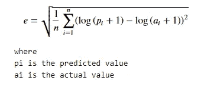

## 目标:

显然，我们解决这个问题的主要目标是预测一个准确的价格。基于对产品的描述，必须向卖家建议一个**真实价格**，以维持卖家和买家之间的可信度。

b)由于机器学习模型将作为 web 应用程序运行，预测的时间延迟必须更短。卖家不喜欢等很久才知道结果。从毫秒到几秒的时间范围应该是向销售者显示输出的适当时间。

# **3。先决条件**

在此，我假设读者知道经典机器学习和深度学习、数据预处理、探索性数据分析的基本概念。

# **4。数据来源**

数据集是通过 Kaggle 获取的，其中包含两个文件，一个用于训练，另一个是测试文件。训练文件包含超过 140 万条记录，测试文件包含大约 300 万条记录。文件在里面。tsv 格式，大小分别为 74MB 和 280MB，经过压缩。

# 5.现有方法

许多数据科学爱好者用各种方法解决了这个问题。比赛获胜者 Paweł和 Konstantin 采用了非常简单的方法，并结合了一些令人惊叹的技巧。他们用稀疏的输入训练了一个简单的 MLP。他们的技巧包括名称 chargrams，用 PorterStemmer 做词干，文本特征的连接。他们使用单词包-1，2-grams(有/没有 Tf-IDF)和一键编码作为分类特征( [*link*](https://gh.mltrainings.ru/presentations/LopuhinJankiewicz_KaggleMercari.pdf) )。其他人也尝试了基于 CNN 的模式。

# 6.理解数据

定型数据集的每一行都代表一个列出的产品，该产品包含有关它的某些信息。每列显示产品的具体细节。总共有以下七列:

***1。* *名称:*** 显示所列产品的标题

***2。item_condition_id:*** 卖家提供的物品状况。这是一个有序的分类特征，分类范围从 1 到 5，其中 1 比 5 好。

***3。类别名称:*** 该特性保存列表的类别名称。例如:“女人/运动服装/裤子，紧身衣，打底裤。

***4。*品牌名称:**该功能给出品牌的名称。该要素还包含空值。

***5。价格:*** 这是我们要预测的特征，也就是**目标变量**。单位为美元($)。

***6。shipping:*** 这是一个分类特征，告诉谁支付运费。如果卖家付款，则为“1”，如果买家付款发货，则为“0”。

***7。item_description:*** 此功能包含物品的完整描述

# 7.探索性数据分析

这一步是解决机器学习问题的关键步骤之一，因为它提供了探索和理解数据集的机会。这种对数据集的深入了解不仅对理解现有特征很重要，而且对开发新特征以输入到机器学习模型也很重要。现在我们知道为什么要做 EDA 了，让我们开始吧。

## 基本统计

在 EDA 的这一部分中，我们将尝试理解整个数据集，包括收集关于原始数据(如形状或数据类型)的初始统计数据。

```
df = pd.read_csv(“train.tsv”,delimiter=”\t”,index_col=[“train_id”])
print(df.shape)
df.info()
```

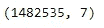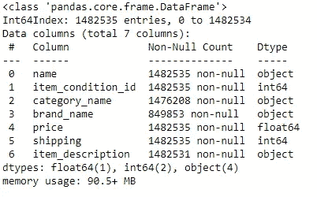

的输出。信息()

我们可以清楚地看到数据集有 1482535 行和 7 列。的。info()表示每列的数据类型，而“类别名称”、“品牌名称”和“项目描述”包含一些空值，我们将在数据处理部分处理这些值。

## 7.1 单变量分析:

简单地说，通过一次获取一个特征(列)来探索数据是单变量分析。这种方法有助于发展对所考虑的特定特征的理解。

## 7.1 .价格

我们知道这是我们的目标变量。这个特性的数据类型是 float，因此我们可以检查这个变量的统计数据

```
df.price.describe()
```

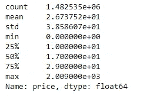

的输出。德塞利贝()

我们可以看到的一件事是，平均值为 26.7 美元，最大值约为 2000 美元，这意味着数据中肯定存在一些偏差。为了证实这一点，我们可以简单地用下面的图表绘制分布图。

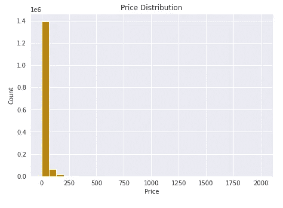

价格分布图

正如我们所料，情节严重扭曲。这看起来非常接近于[对数正态分布](https://en.wikipedia.org/wiki/Log-normal_distribution)。当分布是对数正态分布时，值的对数分布是高斯分布。这意味着，如果我们对价格取对数，其结果将接近高斯分布，如下所示:

```
# Note : We are adding 1 to aboid inf value for 0 price products
df["log_price"] = df.price.apply(lambda x:np.log(x+1))
plt.subplot(1,2,2)
plt.hist(df.log_price,bins=30,color="teal")
plt.title("Log(Price+1) Distribution")
plt.xlabel("log(Price+1)")
plt.ylabel("Count")
plt.show()
```

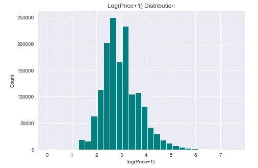

这种分布接近高斯分布，高斯分布比原始价格有一定的优势。

*   与对数正态分布不同，高斯分布中的值在所有范围内分布更加均匀，在对数正态分布中，很少有数据点可用于较高的价格值。
*   这有利于线性回归等模型，线性回归假设因变量呈正态分布。此外，对于其他模型，高斯分布的目标变量也提供了更好的性能。
*   无论如何，考虑到我们的性能指标，我们必须计算预测价格和实际价格的对数，因此最好将 log(价格+1)视为我们的目标价值，并计算它的 RMSE。

因此，我们将考虑 log(价格+1)作为我们的目标变量。
有些产品定价为 0 美元。我们稍后将对这些产品进行有趣的 EDA。

## 7.1.b 项目条件标识

[Mercari 将](https://www.mercari.com/us/help_center/article/316/)的产品状况分为 5 类。

*   新的
*   喜欢新的
*   好的
*   公平的
*   贫穷的；贫困的

这些分别表示在从 1 到 5 的数据集中。现在，让我们来看看这些类别中的产品。

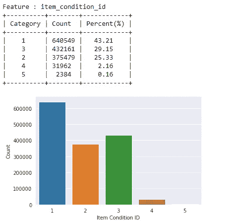

我们可以清楚地观察到，对于 item_condition_id，每个类别下的列表数量存在可变性。最大的组件属于类别 1，而类别 5 拥有最小数量的列表。这是有道理的，因为数字越低，产品的质量/状况就越好，没有人想把他们的产品评为状况不佳。

## 7.1.c 运输:

我们将对运输执行类似的分析

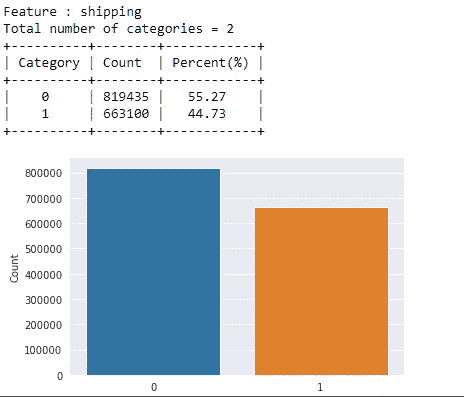

*   这里也有一个小的类别不平衡。这些特征随价格的变化将是一个有趣的分析，我们将在双变量分析部分看到。

## 7.1.d“品牌名称”

品牌名称是最初将大约 40 %的值保存为空的特征。我们将把这些空值视为“丢失”,我们将在预处理部分看到。我们还将从列表名称中提取品牌名称，这将未知品牌名称减少到 27%。

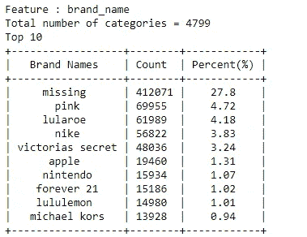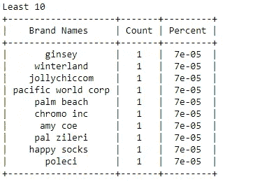

*   brand_name 中有将近 4800 个类别。出现次数最多的前 10 个品牌包括 ***pink、Lularoe、Nike、victorias secret、apple、Nintendo、forever 21、lululemon、Michael kors*** ，这些其实都是非常著名的品牌名称。出现最少的品牌有***警察、快乐袜、pal zileri 等。*** 其中很少听说过 ***。***

## 7.1.e 类别名称

***类别名称*** 是产品所属类别的名称。这是 Mercari 网站特有的。此功能还包含大约 6k 个空值，这些空值是用文本“缺失”输入的。

让我们先来全面了解一下 category_name。

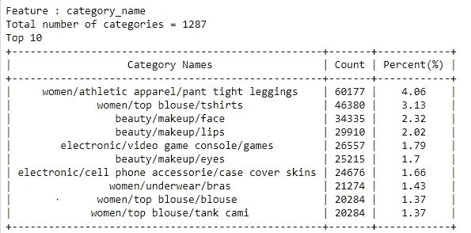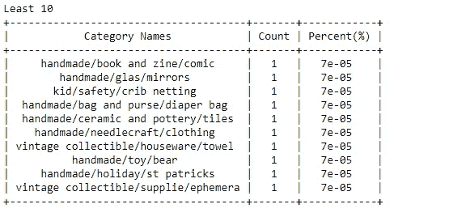

*   category_name 有 1287 个类别，其中大部分产品来自女装和美容产品。
*   我们可以在 Mercari 网站上看到，类别是分层的，这意味着一个主类别包含子类别等等，或者我们可以说有不同的层级(我们将使用这一术语)。这些由“/”分隔。

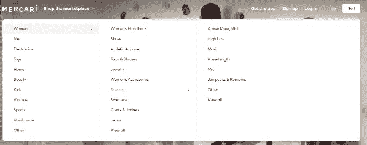

截图来自[https://www.mercari.com/](https://www.mercari.com/)

我们将在数据预处理中看到如何分离这些类别，但现在，我们可以假设类别分为三层(Tier_1、Tier_2、Tier_3)。

**7.1.f Tier_1**

在第一级中，共有 10 个类别(未知值被视为缺失)。几乎一半的产品属于“女性”类别，其次是美容和儿童，相比之下比例相当低。

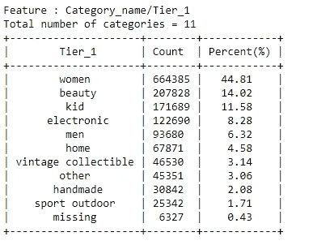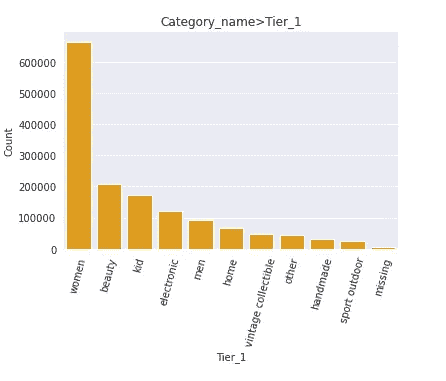

## 7.1.g '第二层'

在第二层，我们有 100 多个类别。不出所料，在 10 大女装中，美妆产品独占鳌头。最少出现的类别是'*被子'。*

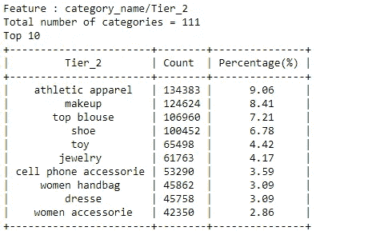

## 7.1.h 第三层

在第三层，我们可以观察到 800 多个类别。排名前十的产品包括 t 恤、紧身裤、游戏、鞋子和其他。最少 10 个产品类别包括视频游戏，瓷砖，教育(有趣)，清洁，袖口等。

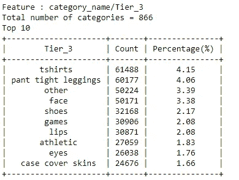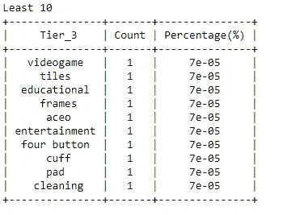

## **7.1 . I‘名称’**

接下来，我们有一个功能名称，它对于大多数产品都是唯一的，因为我们可以看到该功能中有 100k 个类别，但对于某些产品，它是相同的。出现次数最多的一个名称是“bundle”。这可能是为了大量销售的产品

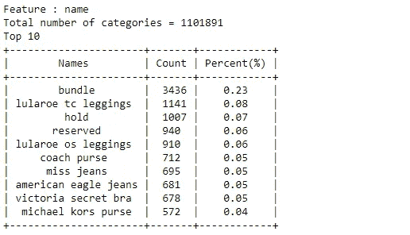

对于文本特征，我们还可以检查字符长度和字数的分布。

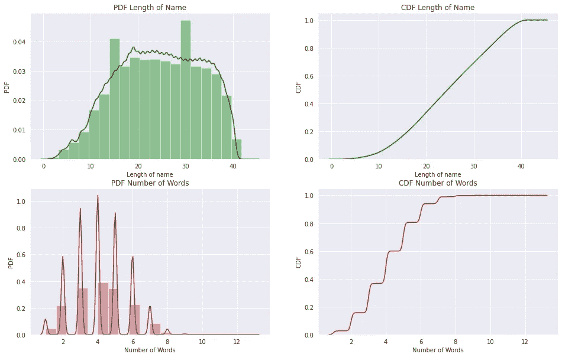

*   大多数卖家倾向于给出超过 20 个字符的名字，因为一些字符的分布是左偏的。
*   有些卖家给名字的字数特别多，比如超过 12 个

**7.1.j '项目 _ 描述'**

项目描述是建模的一个重要特征。它保存了卖方提供的关于产品的描述性信息。此功能包含 4 行空值，被估算为“缺失”。

当我们观察此功能中的类别时，发现大约 5%的列表由*【暂无描述】*占据主导地位。这些可能是在网站上注册列表时为该零件提供的默认值。

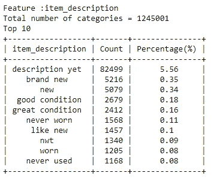

*   item_description 中的字符数分布描绘了高度倾斜的图。CDF 图显示大约 90%的描述长度小于 400。

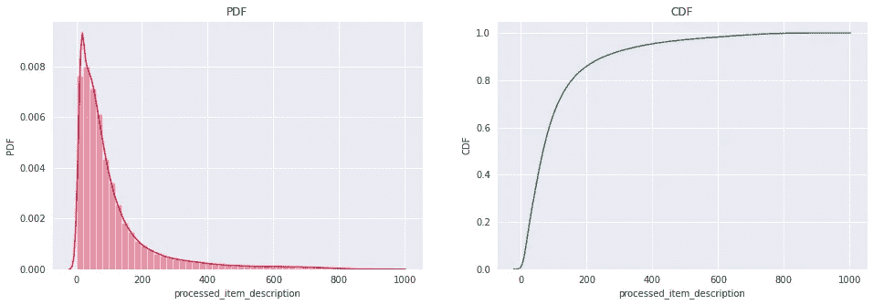

## 7.2 双变量分析

## 7.2 .项目条件标识与日志价格

这里我们绘制了 item_condition 中每个类别的 log_prices 的分布。

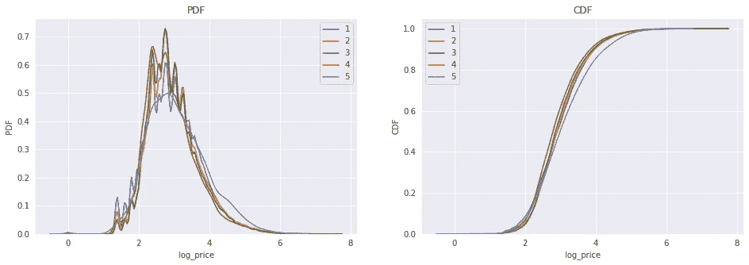

*   整个情节相当笨拙，但我们可以观察到的一件事是，item_condition_id =5 的 CDF 比其他的低，这是有意义的，因为 5 的条件很差，因此价格也应该很低。

## 7.2.b 运输与日志价格

在这里，我们分析 log_price 和 shipping 之间的关系，并为每一类 shipping 绘制分布图。

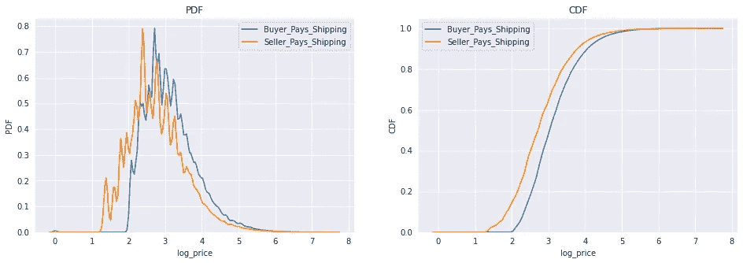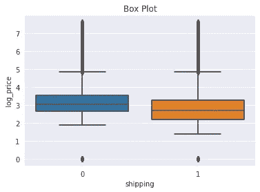

*   这个特征中有一些信息，因为类别的分布沿着轴移动。
*   **买方支付**的 CDF 图向右，显示买方支付运费的价格更高，这是合理的。
*   箱线图还表明类别 1 的价格低于类别 0 的价格。这是可以理解的，因为“1”表示卖家将支付运费，这使得产品价格更低。

## 7.2.c 品牌名称与价格

为此，我们在数据集中绘制了前 25 个最昂贵的品牌。

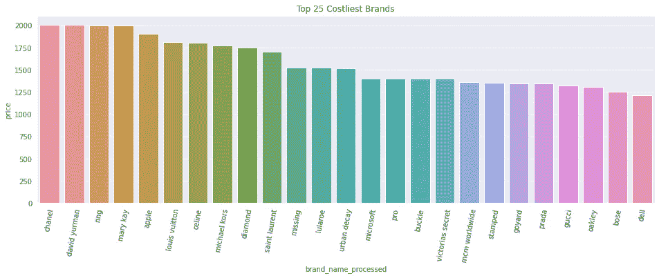

*   我们可以观察到，最昂贵的品牌价格可以高达 2000 美元。
*   这也取决于产品类型，因为有一个品牌**戒指**最有可能出售戒指。这种产品本身就是一种昂贵的产品，与品牌无关。

## 7.2.d Tier_1 与价格

现在，让我们看看 Tier_1 类别对产品价格的影响。这里我们绘制了 Tier_1 中每个类别的平均价格和中间价格值，从中我们可以观察到平均值高于中间值。这是右偏分布的性质，我们知道产品的价格是高度右偏的。

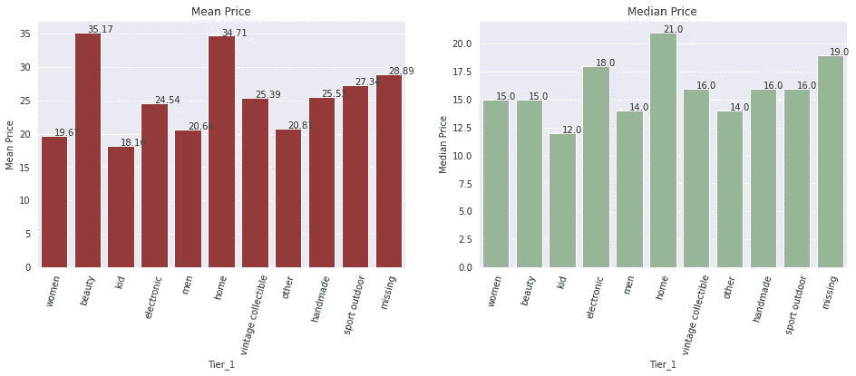

*   每个类别的 log_prices 的方框图表示电子产品、女性用品、美容用品、古董收藏品和手工制品的价格范围高于其他产品。

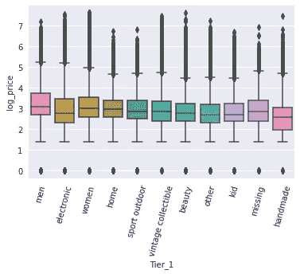

## 7.2.e 名称与项目条件标识

这是一个有趣的分析，它告诉我们这些名字是如何根据产品的状况而变化的。我们将利用 Wordcloud 进行分析。

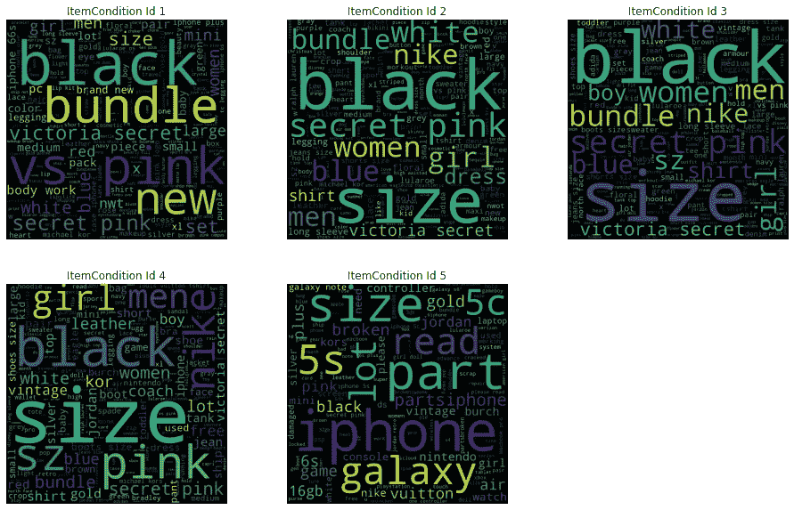

*   服装产品和品牌在所有图片中都可以看到，比如所有类别中都出现的“粉色”。
*   在 item_conditon_1 中,“新的”一词经常用于名称中，它还包括非常受欢迎的品牌名称，而在 item _ conditon _ 5 中可以看到“坏的”一词，这是有意义的，因为这一类别是针对劣质产品的。
*   由于没有单独的尺寸特征，所以在名称本身中提到了尺寸。因此，我们可以在几乎所有的单词 clouds 中看到“size”。

## 7.2.f 项目描述与项目条件标识

对 item_description 进行类似的分析，结果如下:

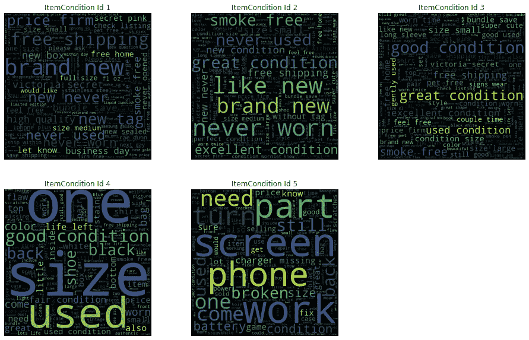

*   出现在每个类别中的所有单词都是可以理解的，而且相当真实。比如 item_condition_id =有**这样的词全新，从未用过，全新，高品质。**
*   现在，随着 item_condition_id 数量的增加，描述中使用的词语也会发生变化。在 item_condition_id =3 **使用的条件中，轻轻使用的**是最显著的字，其对于 item_condition_id =5 变为**零件、损坏、工作**。

## **7.3** 零价格产品分析

在本节中，我们将分析价格等于 0 美元的产品。首先让我们看看有多少产品的价格等于零。

```
zero_price = df[df.price<=0]
print("The shape of the df =",zero_price.shape)
```

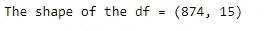

为了了解这些产品属于哪一类别，我们将在功能 Tier_1、Tier_2、Tier_3 的每个类别中绘制产品图。

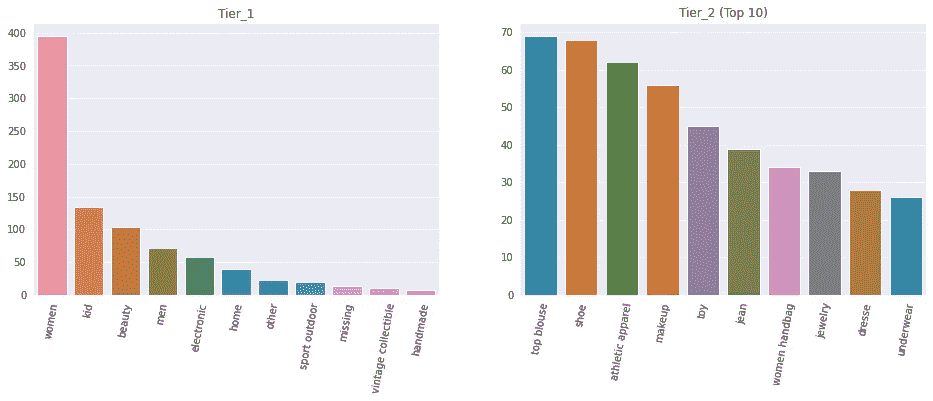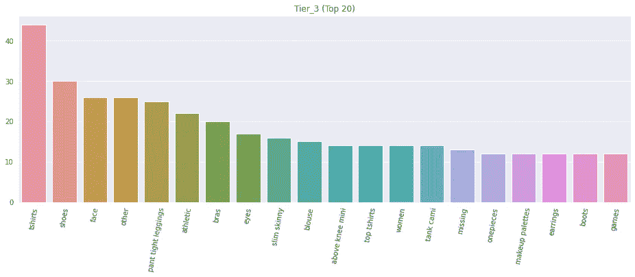

*   大多数价格为“0”的产品是**服装或美容产品**，属于**女性**类别。

我们还可以计算出每种情况下产品的百分比，并将其与总百分比进行比较。

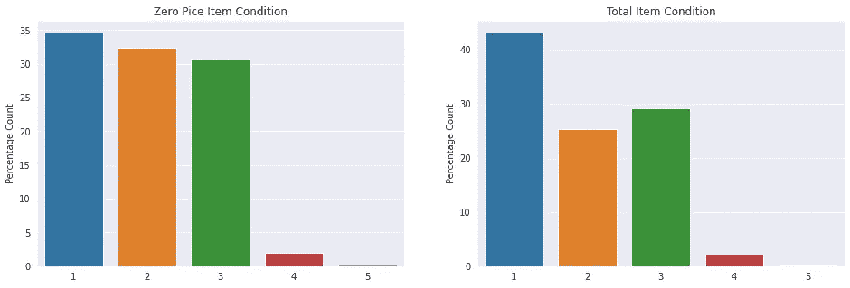

*   价格为零的产品在项目条件为 2、3、4、5 的产品中所占的百分比较高。这表明，可能有一些用过的物品，如衣服等，人们只是为了捐赠而免费发放。

# 8.数据预处理

数据预处理或数据清洗是构建机器学习模型的一个不可或缺的步骤。在这一步中，我们对数据集进行必要的更改，使其适合进一步处理。数据预处理步骤对于我们正在处理的问题或数据集来说是非常具体的。在这里，我们将看到数据清理的特点，特别是这个问题。

## 8.1 名称

对于文本特征，有许多技术用于数据预处理。这些包括去收缩、降低字符、词条化、记号化、词干化、停用词移除等等。在这里，我们做了非常简单的预处理，即去收缩、去除特殊字符、去除停用词和降低文本。它的代码如下:

#注意，解收缩功能的代码取自上面给出的 Ref

**例子:**

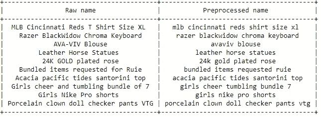

## 8.2 品牌名称

因此，对于 brand_name，不仅完成了基本的文本预处理，而且正如我们之前在 EDA 中讨论的那样，某些产品的名称中包含 brand _ name，因此我们必须提取它们。

**例子:**

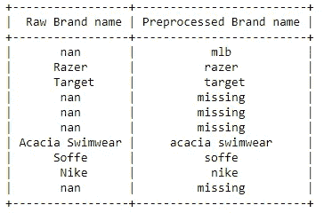

> 现在，在从名称中提取 brand_names 之前，我们有大约 42%的值“丢失”,但是在采用这种方法之后，我们将这一数字减少到了 27%!！

## 8.3 类别名称

在 catagory_name 中，也遵循相同的方法进行预处理。

**例子:**

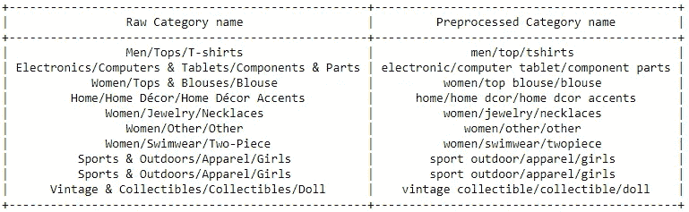

完成后，我们将通过在“/”处进行分割，将数据集分为三层。

**例子:**

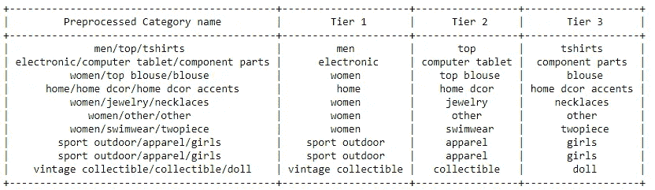

## 8.4 项目 _ 描述

该特征也是需要处理的文本特征。还有一些空值需要注意。以下函数用于相同的目的。

**举例:**

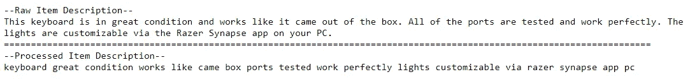

在这里，我已经展示了训练数据的预处理，测试数据也必须遵循同样的预处理。

# 9.基准模型

我们将使用这个模型来比较我们的机器学习模型的性能。我们在这里使用的基准模型是一个简单的平均模型，它根据两个特性“shipping”和“item_conditon”给出平均输出。简而言之，当我们输入 shipping (0 或 1)和 item_conditon_id(1 到 5)时，模型会提取 shipping 和 item_conditon_id 相似的所有数据。它取这些点的平均值并输出结果。

## 拆分数据

在测试模型之前，让我们将数据集分别以 9:1 的比例分成训练数据和验证数据。

```
df_train,df_val = train_test_split(df,test_size=0.1,random_state = 3)
print(df_train.shape)
print(df_val.shape)
```

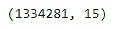

火车形状

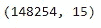

验证形状

当在验证数据上测试基准模型时，它提供 0.7255 的 RMSLE 值，这成为基准。任何度量值高于该值的模型都表现不佳。

# 10.首次切割方法

对于第一个 cut 解决方案，我尝试了不同的机器学习模型，但机器学习最重要的部分是特征化。我遵循了两种类型的特征化。

## 10.1 第一种方法

## 特征工程

在第一种方法中，我们将尝试保持输出向量的维数较低，以便我们可以更快地训练模型。因此，我们将对分类数据使用顺序编码，对文本数据使用平均 Word2Vec。让我们逐一看看:

## 分类数据

我们知道数据集中的分类数据由 shipping、item_condition_id、brand_name、Tier_1、Tier_2、Tier_3 组成，其中“shipping”和“item_condition_id”已经正常编码。所以对于剩下的特性，我将使用 Sklearn 库的 OrdinalEncoder 功能。

请注意，在验证数据中会有一些未知的类别，我给它们的值是-1。

## 文本数据

对于文本数据，我将连接 name 和 item_description。这实际上没有任何具体原因，只是为了减少维数。您也可以单独展示它们。我也分别尝试了它们，因为向量是密集的向量，需要更多的时间来训练。

因此，我在第一部分中使用的文本特征矢量化方法是平均 Word2Vec。在这里，我使用 Gensim 库的 Word2Vec 功能，并在连接数据(名称+项目描述)的语料库上训练它。

想法是每个句子在 Word2Vec 模型的帮助下向量化每个单词，然后取所有这些向量的平均值，这些向量将被视为句子的向量。

## 缺少 10.1.1.3

如果品牌名称或名称或项目描述中缺少一个值，此功能将给出 1，否则为 0。

```
df_train["is_missing"]  =  (df_train.brand_name_processed=="missing") | (df_train.name_processed =="missing")| (df_train.processed_item_description=="missing")df_train["is_missing"]  = df_train["is_missing"].astype(int)
```

## 堆叠所有特征

所有形成的特征水平堆叠在一起。

```
'''STACKING ALL FEATURES OF TRAIN DATASET'''
x_train = np.hstack((df_train.item_condition_id.values.reshape(-1,1)    ,          df_train.shipping.values.reshape(-1,1) ,\
           df_train.is_missing.values.reshape(-1,1) ,
           train_vec_brand , train_vec_t1 , 
           train_vec_t2,train_vec_t3 , train_vec_text))
```

## 建模

## a.套索

该模型是线性模型，通过 l1 正则化来减少平方损失。在这里，我为这个模型使用了 Sklearn 库。该模型是在一系列值上调整的超参数，并根据最佳参数进行训练。

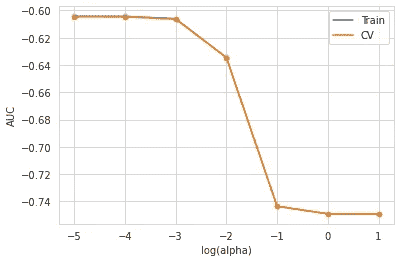

该模型在验证数据上的性能为 0.6037，在 Kaggle(公共分数)上的测试数据上的性能为 0.60476。

## b.山脉

脊模型也是线性模型，其减少了平方损失，但是具有 l2 正则化。

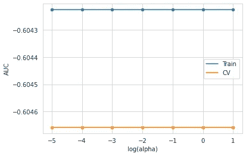

该模型的 RMSLE 在验证数据上是 0.6038，在测试数据 Kaggle 上是 0.6048。

## c.决策图表

顾名思义，决策树使用基于树的模型来预测输出。我这里用的是 Sklearn 的决策树模型。

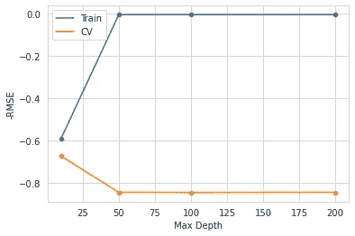

验证数据的 RMSLE 为 0.6353，测试数据的 RMSLE 为 0.63648。显然，与早期的模型相比，决策树的性能并不好。

> 我也尝试了随机森林的这些功能，但它的训练时间非常长，所以不得不停下来。如果感兴趣的话，你可以在 Github 知识库上看到完整的代码。

d.轻型 GBM

集成模型的轻 GBM 模型功能和训练更快，因此它适用于问题。

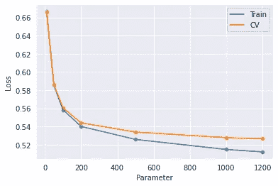

该模型在验证数据上的性能是 0.5008，在测试数据上的性能是 0.50049(私人 Kaggle 分数)。

## 10.2 第二种方法

## 特征工程

在第二种方法中，我们将对分类数据使用一种热编码，对文本数据使用 Tfidf。

## 10.2.1.1 分类数据(一个热编码)

对于包括运输在内的所有分类数据，项目条件 id、Tier1、Tier2、Tier3 是一个热编码。下面的代码用于实现这一点:

## 文本数据(Tfidf 矢量器)

Tfidf 声明“术语频率-逆文档频率”。它由两部分组成，第一部分是“词频”,它是一个单词与句子中单词总数的简单比率，它为句子中出现得越多的单词赋予越多的价值。“逆文档频率”是第二部分，它是总文档数与出现错误的文档数之比。IDF 对文档中较罕见的单词给予较高的价值。

我使用二元模型范围到 2，最大特征到 50000。

## 缺少 10.2.1.3

如果品牌名称或名称或项目描述中缺少一个值，此功能将给出 1，否则为 0。

```
df_train["is_missing"]  =  (df_train.brand_name_processed=="missing") | (df_train.name_processed =="missing")| (df_train.processed_item_description=="missing")df_train["is_missing"]  = df_train["is_missing"].astype(int)
```

## 堆叠

类似地，所有特征水平堆叠在一起，形成一个产品的一个向量。

```
'''STACKING ALL THE FEATURES'''# STACKING TRAIN FEATURES
x_train = hstack((train_vec_item_con,train_vec_shipping,
                  train_vec_name,train_vec_brand,
                  train_vec_t1,
                  train_vec_t2,
                  train_vec_t3,
                  df_train.is_missing.values.reshape(-1,1)
                   ,train_vec_desc))
```

## 型号

## a.线性回归

这种线性回归的实现减少了平方损失。这里我用的是 Sklearn 的线性回归实现。

```
'''TRAINING LINEAR REGERSSION'''lr = LinearRegression(normalize=True)
lr.fit(x_train,y_train)
```

这个简单的模型为验证数据提供了 0.4620 的性能指标，为测试数据提供了 0.4621 的性能指标(Kaggle 私人评分)

## b.岭模型

具有一个热内化和 tfidf 特征的脊模型是在各种参数上调谐的超参数。代码部分将保持与上面讨论的相同。

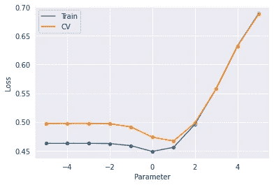

通过对最佳参数的训练，我们在测试数据(Kaggle Private Score)上得到了 0.4581 和 0.45831 的验证 RMSLE。

## 观察结果:

*   到目前为止，我们拥有的最佳模型是具有一个热编码和 TFIDF 特征的脊模型。
*   对于标签编码和 word2vec 功能，像 Light GBM 这样的复杂模型比像 lasso、ridge 这样的简单线性模型表现得更好。
*   但是对于 Tdidf 特征，这些特征变得相对较高，因此线性模型给出了相当不错的性能度量值
*   为了更好的性能，我们不得不尝试深度学习模型。

# 11.基于深度学习的解决方案

深度学习模型在网络的输入和输出层之间使用多个层，这使得它成为解决问题的强大方法。此外，它与人脑的相似性使这一想法的运作具体化了。

这里我们将使用 RNN 类型的 DL 模型。RNN 代表递归神经网络，包括基于 LSTM 或 GRU 的模型。RNN 模型用于文本数据(名称和商品描述)中具有长序列的数据。因此，你可以看到建筑 GRU 被用于这些功能。

## 11.1 标记和填充

在我们向网络提供数据之前，必须对其进行矢量化处理。Keras 为矢量化数据提供了嵌入层，但它需要特定格式的输入。为此，我们首先对文本数据进行了标记化。通过标记化，我们将把文本数据转换成数字，这些数字只不过是词汇中单词的索引值，而词汇是通过拟合训练数据来学习的。

接下来，需要对数据进行填充，使每个数据点的输入长度相同。此代码用于标记和填充。

## 11.2 架构

模型的架构是深度学习实现更高性能的最重要因素。我在这里遵循的架构如下:

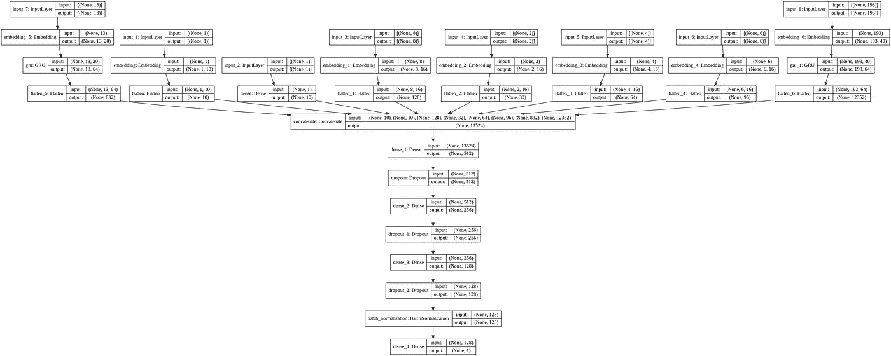

## 11.3 培训

模型的训练是用 Adam Optimizer 完成的，损失是 MSE，我采用的度量是 RMSE。还介绍了模型检查点的回调、学习率调度器和提前停止。

```
# FITTING THE MODELmodel.fit(x=x_train,y=y_train,validation_data=  (x_val,y_val),epochs=10,batch_size = 100,
callbacks=[save,lr,earlystop])
```

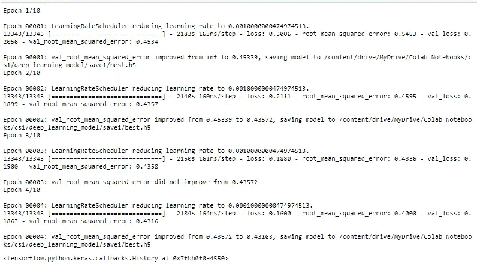

请注意，该模型适合 10 个时期，但由于提前停止回调，它在 4 个时期后停止。

深度学习模型给我们的性能指标是验证数据 0.4316，测试数据 0.4331(ka ggle 私分)。


# 12.模型比较和结论

这些是所有模型的性能，实际上显示了从作为基准的基本模型到复杂模型(如深度学习模型)的旅程，每一步都有改进。

它清楚地表明，对于这个问题，深度学习模型比机器学习模型表现得更好。

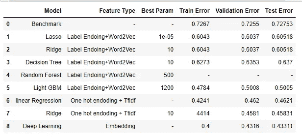

# 13.部署和预测

我已经在 AWS 上部署了这个模型。要试用该型号，请点击[链接](http://18.218.104.147:8080/)。下面是模型工作的视频和对其中一个产品的预测。请在评论中告诉我你的想法。

# 14.未来的工作

经过所有这些努力，我认为我已经达到了一个不错的性能指标值，但总有改进的余地。以下是我未来将努力的一些想法。

*   为机器学习模型执行更多功能工程技术。
*   使用 Tfidf 功能尝试更复杂的模型。
*   尝试基于 CNN 的模型。
*   在深度学习模型中尝试基于 Tfidf/CountVectorizer 的功能。

# 15.Github 知识库和 LinkedIn

这里是 [GitHub 库](https://github.com/pushapgandhi/Mercari_Price_Prediction)参考完整代码并在 LinkedIn [上与我联系点击这里](https://www.linkedin.com/in/pg1995/)。

# 16.参考

*   [https://www . Applied ai course . com/course/11/Applied-Machine-learning-course](https://www.appliedaicourse.com/course/11/Applied-Machine-learning-course)
*   [https://www.kaggle.com/c/mercari-price-suggestion-challenge](https://www.kaggle.com/c/mercari-price-suggestion-challenge)
*   [https://www.youtube.com/watch?v=QFR0IHbzA30&t = 2010s](https://www.youtube.com/watch?v=QFR0IHbzA30&t=2010s)
*   [https://GH . mltraints . ru/presentations/lopuhinjankeiewicz _ kagglemercari . pdf](https://gh.mltrainings.ru/presentations/LopuhinJankiewicz_KaggleMercari.pdf)