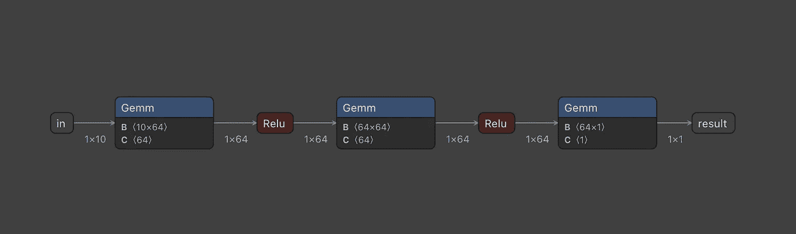
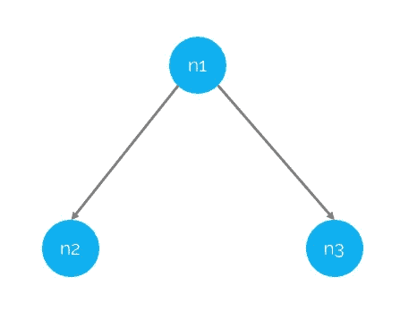
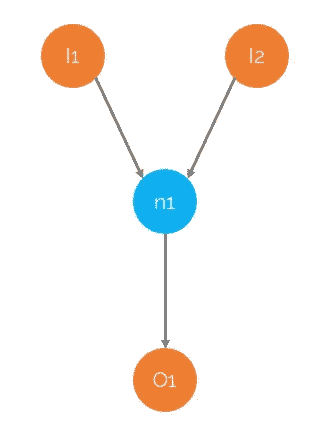
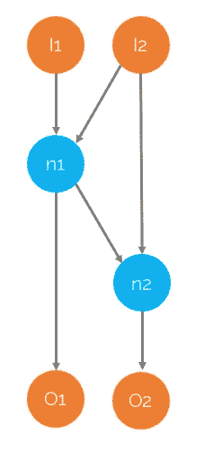

# 合并 ONNX 图

> 原文：<https://towardsdatascience.com/merging-onnx-graphs-da088dbaf9b4?source=collection_archive---------10----------------------->



(图片由作者提供)

## 使用 sclblonnx 连接、合并、分割和连接 ONNX 图形。

ONNX 越来越火了。虽然最初主要被认为是一种简单存储 AI/ML 模型的文件格式，但近年来它的用途已经发生了变化。如今，我们看到许多数据科学家使用 ONNX 作为构建和管理完整数据处理管道的手段。随着 ONNX 使用的增长，对创建、检查和编辑 ONNX 图形的良好工具的需求也在增长。幸运的是，ONNX 的大型生态系统正在出现；在这篇文章中，我们描述了由`[sclblonnx](https://pypi.org/project/sclblonnx/)`包(由 [Scailable](https://www.scailable.net) 策划)提供的 ONNX 连接、分割、合并和连接功能。请注意，当您主动管理有用的 ONNX“子图”时，合并、拆分和连接 ONNX 图非常有用:也就是说，您可能有以 ONNX 格式存储的数据管道中的首选预处理和后处理步骤，并且您希望将这些子图与您刚刚在 TensorFlow 或 PyTorch 中训练的模型连接起来。在这篇文章中，我试图解释这是如何做到的。

> **注:**我之前写过 ONNX 编辑合并，见[https://towardsdatascience . com/creating-editing-and-merging-ONNX-pipelines-897 e 55 e 98 bb 0](/creating-editing-and-merging-onnx-pipelines-897e55e98bb0)。然而，随着`[sclblonnx](https://pypi.org/project/sclblonnx/)` `0.1.9`的发布，功能得到了极大的扩展。

# 一些 ONNX 背景

在讨论由`sclblonnx 0.1.9`提供的 ONNX 图形的新的`merge`、`concat`、`split`和`join`功能之前，提供一点关于 ONNX 图形的背景是有用的。在本文的这一点上，我假设你知道一些 ONNX 的基础知识(如果不知道，请看[这篇文章](/creating-onnx-from-scratch-4063eab80fcd)，或者[这篇文章](/onnx-for-image-processing-from-scratch-6694f9b141b0))。因此，你知道 ONNX 提供了一个有向计算图的描述，它指定了在(强类型)输入张量上执行哪个[操作](http://onnx operators)来产生期望的输出张量。而且，你知道 ONNX 对于存储经过训练的 AI/ML 模型很有用，*和*用于创建数据科学管道，以一种独立于平台和部署目标的方式。*也就是*大家一般都知道 ONNX 是好玩的东西。

然而，为了理解如何合并、分割、连接和连接 ONNX 图，我们需要更多的背景知识。我们既需要理解*图中的边是如何创建的*，也需要更详细地理解图的输入和输出的*角色。*

## 按名称隐式创建边

让我们从边的创建开始。尽管 ONNX 图仅仅是一个[有向图](https://en.wikipedia.org/wiki/Directed_graph)，因此可以用它的节点和边来描述，但这不是我们创建(也不是存储)ONNX 图的方式。当创建 ONNX 图时，我们并不明确地创建邻接矩阵来标识节点之间的边。相反，我们创建一些`type`(不同的操作符)的节点，每个节点都有一个命名的`input`和`output`。这也是 ONNX 文件(实际上只是一个 protobuf)中存储的所有内容:该文件存储了一个操作符类型列表，每个类型都有自己命名的输入和输出。最后的名字允许在图中构造边:如果节点`n1`有一个名为`x1`的输出，节点`n2`有一个名为`x1`的输入，那么在`n1`和`n2`之间将创建一条(有向)边。如果随后添加另一个节点`n3`，该节点*也*有一个命名输入`x1`，我们最终得到下图:



(图片由作者提供)

因此，在合并、连接、连接和拆分 ONNX(子)图时，了解最终组合的图中存在的输入和输出名称是非常重要的——在某种程度上是内部的，如果您已经从各种培训工具之一导出到 ONNX，您可能不知道这些名称。如果两个图形中出现相同的名称，则不小心合并图形会导致绘制出可能不需要的边。

> 如果两个图形中出现相同的名称，则不小心合并图形会导致绘制出可能不需要的边。

## 图形的输入和输出

在合并、分割或编辑 ONNX 图时，另一个有点混乱但非常重要的概念是*节点*(正如我们刚刚讨论的，用于创建边)的输入和输出与*图*本身的输入和输出之间的区别。图形输入和输出分别表示输入到计算图形的张量，以及执行计算产生的张量。输入和输出以与创建边相同的方式隐式连接到图。实际上，图的输入和输出的一个合理的心理模型是，它们仅仅是只有一个输出(图的输入)或者只有一个输入(图的输出)的节点；这些不在张量上操作的特殊节点各自的输入和输出就是外界。

好吧，这有点神秘。

让我们用下面的符号举几个例子:

```
I1(name)  # An input (to the graph) with a specific name
O1(name)  # An output (to the graph) with a specific name
N1({name, name, ...}, {name, name, ...}) # A node, with a list of inputs and outputs.
```

给定这个符号，我们可以例如表示

```
# A simple graph:
I1(x1)
I2(x2)
O3(x3)
N1({x1,x2},{x3})
```

这将生成(使用橙色表示输入和输出)下图:



(图片由作者提供)

如果`N1`是加法运算符，这个图将简单编码为两个张量相加。

让我们做一个稍微复杂一点的图表:

```
I1(x1)
I2(x2)
N1({x1, x2}, {x3})
N2({x2, x3}, {x4})
O1(x3)
O2(x4)
```

这将在图形上导致:



(图片由作者提供)

好了，现在我们清楚了图的内部边、输入和输出是如何构造的；让我们仔细看看`sclblonnx`包中的工具！

# 使用`sclblonnx`操作 ONNX 图形

从版本`0.1.9`的更新开始，`sclblonnx`包包含了许多更高级的实用函数，将多个 ONNX(子)图合并成一个图。尽管该包的早期版本已经包含了`merge`函数来有效地将两个图形粘贴在一起(稍后将详细介绍)，但此次更新将`merge`、`join`和`split`作为一个更高级别的包装器，围绕着一个更加通用、也更难使用的函数`concat`。让我们从更高级的功能开始。

> 这里描述的所有函数都可以在`sclblonnx`包的例子中用 python 代码找到。这些可以在[https://github . com/scailable/sclblonnx/blob/master/examples/example _ merge . py](https://github.com/scailable/sclblonnx/blob/master/examples/example_merge.py)找到。另外，请参见所讨论的每个函数的文档:[https://github . com/scailable/sclblonnx/blob/master/sclblonnx/merge . py](https://github.com/scailable/sclblonnx/blob/master/sclblonnx/merge.py)

## 合并

`merge`有效地获取两个图形(父图形和子图形)，并将父图形的已识别输出粘贴到子图形的已识别输入。默认情况下，`merge`假设两个图都是完整的(即所有的边都匹配得很好，并且所有的输入和输出都已定义)。`merge`的签名是

```
merge(sg1, sg2, io_match)
```

其中`sg1`是父子图，`sg2`是子图，`io_match`给出了需要与`inputs` off `sg2`匹配的`sg1`输出名称对的列表。因此，根据我们在上一节中发展的符号，如果我们有:

```
# Parent (sg1)
I1(x1)
N1({x1},{x2})
O1(x2)# Child (sg2)
I2(z1)
N2({z1},{z2})
O2(z2)
```

对`merge(sg1, sg2, [(x2,z1)])`的调用将创建:

```
I1(x1)
N1({x1},{x2})
N2({x2},{z2})
O2(z2)
```

然而，正如你所想象的，我们可以使用这个函数进行更多的合并。注意`merge`假设两个图的内部命名没有“冲突”;如果不是这样，并且你想更详细地控制这种行为，我推荐使用`concat`；merge 仅仅是围绕`concat`的一个用户友好的包装器。

## `Split & Join`

和`merge`一样，`split`和`join`也是围绕`concat`的更高层次的包装器(我们将在下面详述)。行为相对简单:

*   `split`取一个有多个输出的“父”，将一个子图粘贴到这些输出的子集(通过匹配子图的输入)，将另一个子图粘贴到父输出的另一个子集。因此，实际上，`split`创建了一个分支，父图在这个分支中馈入两个子图。
*   `join`在很多方面与分裂相反:它需要两个“父母”，并且只有一个孩子。父母的输出与孩子的输入相匹配。因此，`join`有效地连接到更大的树中子图的分支。

## 串联

上述`merge`、`split`和`join`功能的工作台是更加通用的`concat`功能。理解其功能的最简单方法也许是看一看签名和文档:

```
def concat(
  sg1: xpb2.GraphProto,        
  sg2: xpb2.GraphProto,        
  complete: bool = False,        
  rename_nodes: bool = True,        
  io_match: [] = None,        
  rename_io: bool = False,        
  edge_match: [] = None,        
  rename_edges: bool = False,        
  _verbose: bool = False,       
  **kwargs): """  concat concatenates two graphs. Concat is the flexible (but also rather complex) workhorse for the merge, join, and split functions and can be used to pretty flexibly paste together two (sub)graphs. Contrary to merge, join, and split, concat does not by default assume the resulting onnx graph to be complete (i.e., to contain inputs and outputs and to pass check()), and it can thus be used as an intermediate function when constructing larger graphs. Concat is flexible and versatile, but it takes time to master. See example_merge.py in the examples folder for a number of examples.    Args:        
  sg1: Subgraph 1, the parent.        
  sg2: Subgraph 2, the child.        
  complete: (Optional) Boolean indicating whether the resulting     
             graph should be checked using so.check(). 
             Default False.         
  rename_nodes: (Optional) Boolean indicating whether the names of 
             the nodes in the graph should be made unique. 
             Default True.          
  io_match: (Optional) Dict containing pairs of outputs of sg1 that 
             should be matched to inputs of sg2\. 
             Default [].        
  rename_io: (Optional) Boolean indicating whether the inputs and 
             outputs of the graph should be renamed. 
             Default False.        
  edge_match: (Optional) Dict containing pairs edge names of sg1 
             (i.e., node outputs) that should be matched to edges of 
             sg2 (i.e., node inputs). 
             Default [].        
  rename_edges: (Optional) Boolean indicating whether the edges    
             should be renamed. 
             Default False        
  _verbose: (Optional) Boolean indicating whether verbose output 
             should be printed (default False) Returns: The concatenated graph g, or False if something goes wrong along the way.    
"""## The implementation...
```

从签名中可以清楚地看出，更高级别的包装器`merge`简单地调用`concat`一次，几乎是用它的默认参数。函数`split`和`join`分别调用`concat`两次，以获得它们想要的结果。请注意，参数`rename_edges`允许用户控制是否应该重命名子图中的所有边(从而避免可能不需要的隐式边创建)，而`complete`允许用户使用 merge 来操作部分图(即尚未定义所有边的图)。

# 包裹

我希望上面的内容能够揭示 ONNX 提供的巨大可能性，以及一些手动操作 ONNX 图形的工具。我们认为 ONNX 非常适合存储(子)图，这些图以独立于平台的方式存储与数据科学管道相关的有用信息。像`sclblonnx`包这样的工具使用户能够使用子图作为构建块来创建完整的管道。

> 在这篇文章中，我有意忽略了关于匹配节点的输入和输出的维度和类型的问题；我希望通过关注所涉及的图表的粗略结构，操作更容易理解；当创建实际的功能图时，显然所涉及的各种张量的类型和维数是很重要的。

# 放弃

*值得注意的是我自己的参与:我是* [*杰罗尼姆斯数据科学院*](https://www.jads.nl/) *的数据科学教授，也是*[*Scailable*](https://www.scailable.net/)*的联合创始人之一。因此，毫无疑问，我对 Scailable 有既得利益；我有兴趣让它成长，这样我们就可以最终将人工智能投入生产并兑现它的承诺。这里表达的观点是我自己的。注意*