# 使用 SQL 合并表

> 原文：<https://towardsdatascience.com/merging-tables-using-sql-a2e60ff687e9?source=collection_archive---------0----------------------->

## 本文讨论了如何使用 SQL 通过行和列合并多个表，并给出了一些例子


作者图片

实际上，很少会有只涉及一个表的 SQL 查询。我们可能需要按行(记录)或列(字段)合并多个表，以获得所需的结果。在本文中，我们将讨论 SQL 中的操作符/命令，这些操作符/命令支持按行或列合并表。

# 按列合并表格

在 SQL 中，可以使用联接通过列来合并多个表。联接基于指定的列(通常是一个表的主键和另一个表的外键)合并两个表。下面是 SQL 连接的一般语法。

```
**SELECT** 
 *
  **FROM** table_1
   **JOIN** table_2
    **USING** (id);
```

在上面的语法中， ***table_1*** 和 ***table_2*** 是带有 key 列的两个表(两个表中的匹配列)， ***id*** 。只有当键列在两个表中具有相同的名称时，我们才使用关键字**和**。否则，我们需要明确提到两个表的键列，如下所示。

```
**SELECT** 
 *
  **FROM** table_1 t1
   **JOIN** table_2 t2
    **ON** t1.t1_id = t2.t2_id;
```

在上面的语法中， ***t1*** 是 ***table_1*** 的别名， ***t2*** 是 ***table_2*** 的别名。当两个表中键列的名称不相同时，我们需要使用关键字上的**来匹配它们，如上所示。我们现在将讨论 SQL 中几个重要的连接。**

## 内部连接

内部联接按列合并两个表，并只返回两个表中匹配的记录(基于指定的列)。在下面的查询结果中，我们可以看到只返回了 ***left_table*** 和 ***right_table*** 中 id 相同的记录。

```
**SELECT** 
 *
  **FROM** left_table
   **INNER JOIN** right_table
    **USING** (id);
```

**或**

```
**SELECT** 
 *
  **FROM** left_table l
   **INNER JOIN** right_table r
    **ON** l.id = r.id;
```

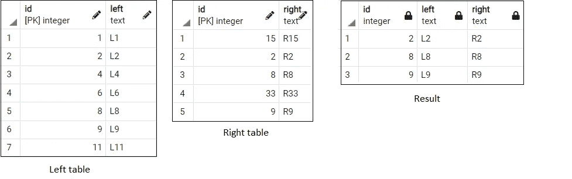

内部连接(作者图片)

## 左连接

Left join 按列合并两个表，并返回左表中的所有记录，但只返回右表中的匹配记录(基于指定的列)。在下面的查询结果中，我们可以看到两个表中 id 为*的记录以及 ***left_table*** 的所有记录。 ***中记录右 _ 表*** 中没有匹配的***id*******左 _ 表*** 中有空值。**

```
****SELECT** 
 *
  **FROM** left_table
   **LEFT** **JOIN** right_table
    **USING** (id);**
```

****或****

```
****SELECT** 
 *
  **FROM** left_table l
   **LEFT** **JOIN** right_table r
    **ON** l.id = r.id;**
```

****

**左连接(图片由作者提供)**

## **右连接**

**Right join 按列合并两个表，并返回右表中的所有记录，但只返回左表中的匹配记录(基于指定的列)。在下面的查询结果中，我们可以看到两个表中具有相同 ***id*** 的记录以及 ***right_table*** 的所有记录。 ***中的记录左 _ 表*** 中没有匹配的***id*******右 _ 表*** 中有空值。***

```
****SELECT** 
 *
  **FROM** left_table
   **RIGHT** **JOIN** right_table
    **USING** (id);**
```

****或****

```
****SELECT** 
 *
  **FROM** left_table l
   **RIGHT** **JOIN** right_table r
    **ON** l.id = r.id;**
```

**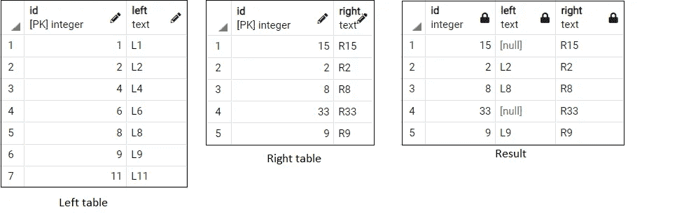**

**右连接(作者图片)**

## **完全连接**

**完全连接可以被认为是左连接和右连接的组合。完全联接按列合并两个表，并返回左表和右表中的所有记录。在下面的查询结果中，我们可以看到两个表的所有记录都被返回。另一个表中没有匹配 ***id*** 的记录为空。**

```
****SELECT** 
 *
  **FROM** left_table
   **FULL** **JOIN** right_table
    **USING** (id);**
```

****或****

```
****SELECT** 
 *
  **FROM** left_table l
   **FULL** **JOIN** right_table r
    **ON** l.id = r.id;**
```

****

**完全加入(图片由作者提供)**

## **交叉连接**

**交叉连接返回两个表的笛卡尔积。两个集合的笛卡尔积 A = {1，2}，B = {3，4}是 A x B = {(1，3)，(1，4)，(2，3)，(2，4)}。我们不需要在交叉连接中指定键列。**

```
****SELECT** 
 *
  **FROM** left_table
   **CROSS JOIN** right_table**
```

**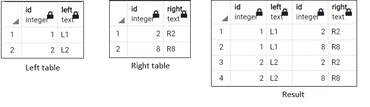**

**交叉连接(图片由作者提供)**

## **半连接**

**从技术上讲，半连接不是 SQL 连接，但其工作方式类似于连接。Semi join 根据右表中的键列返回左表中的匹配记录。半连接在查询结果中不包括右表的列。在下面的例子中，我们要返回来自 ***左 _ 表**中的记录，匹配****id********右 _ 表*** *。*换句话说，我们希望***中的记录出现在****left _ table****id****中****right _ table****。*************

```
****SELECT** 
 * 
  **FROM** left_table
  **WHERE** 
   id **IN** 
   (
    **SELECT** id **FROM** right_table
   )**
```

**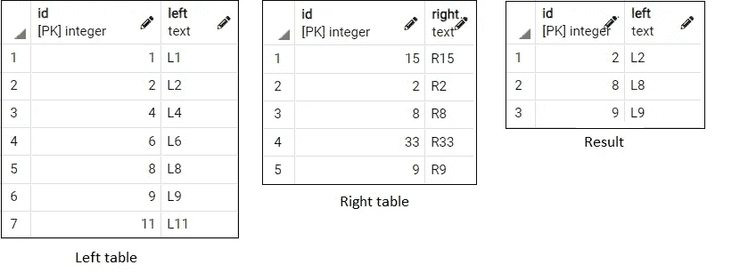**

**半连接(图片由作者提供)**

## **反连接**

**从技术上讲，反联接也不是 SQL 联接，但其工作方式类似于联接。Anti join 根据右表中的键列返回左表中不匹配的记录。反联接在查询结果中也不包括右表的列。在下面的例子中，我们要返回来自 ***左 _ 表*** 中 id*与 id*******右 _ 表*** *的记录。*换句话说，我们要的记录在****left _ table****who****id****中不存在于****right _ table****。*************

```
***SELECT** 
 * 
  **FROM** left_table
  **WHERE** 
   id
    **NOT IN** 
     (
      **SELECT** id **FROM** right_table
     )*
```

*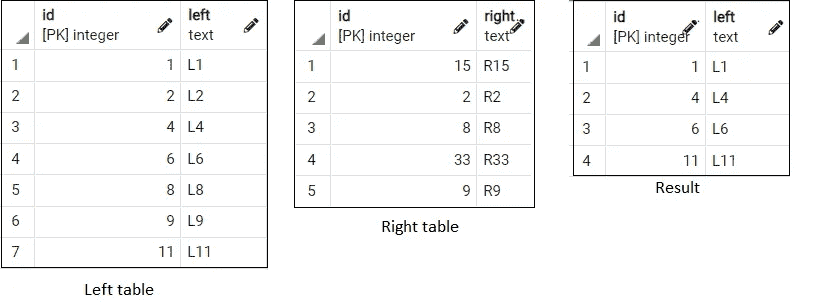*

*反对加入(图片由作者提供)*

## *自连接*

*自联接使我们能够将一个表与其自身联接起来。在下面的查询中，我们需要找到具有相同 ***左*** 值的记录。为此，我们将表与自身连接起来，过滤掉具有相同*值但不同 ***id*** 的记录。**

```
****SELECT** 
 *
  **FROM** left_table l1, left_table l2
  **WHERE** 
   l1.left = l2.left
   **AND** 
   l1.id <> l2.id
  **ORDER BY** l1.left**
```

**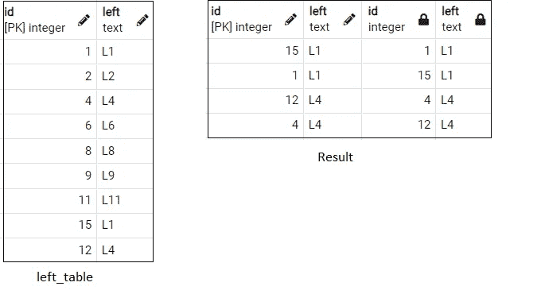**

**自连接(图片由作者提供)**

# **按行合并表格**

## **联盟**

**Union 按行合并两个表，前提是一个表的列的数据类型与另一个表的列的数据类型相匹配。我们不能将列数据类型为 integer 和 text 的表与列数据类型为 text 和 integer 的表合并。然而，我们可以合并两个表，即使一个表的列名与另一个表的列名不匹配。Union 只返回两个表的唯一记录。**

```
**(
 **SELECT** 
  * 
   **FROM** left_table
)
**UNION**
(
 **SELECT** 
  * 
   **FROM** right_table
)**
```

**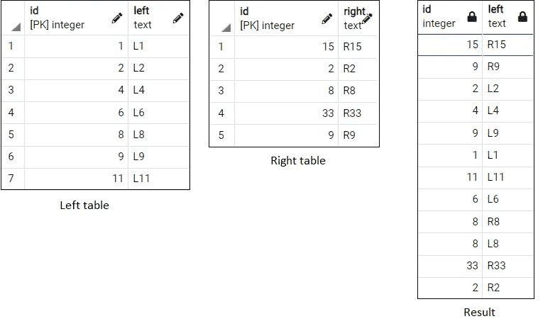**

**工会(图片由作者提供)**

## **联合所有**

**与 Union 类似，Union All 也按行合并表。与 Union 不同，Union All 保留两个表的重复记录。在下面的查询结果中，我们合并了 ***的***id***left _ table***和 ***right_table。我们可以在结果中看到一些重复。*****

```
*(
 **SELECT** 
  id 
   **FROM** left_table
)
**UNION ALL**
(
 **SELECT** 
  id 
   **FROM** right_table
)*
```

*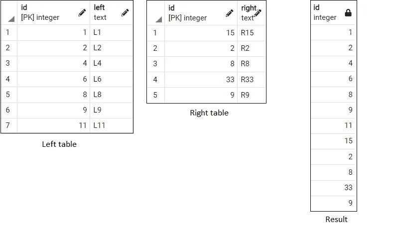*

*联合所有(图片由作者提供)*

## *横断*

*Intersect 返回两个表的公共记录。在下面的查询结果中，我们可以看到常见的***id***s***left _ table***和 ***right_table*** 。*

```
*(
 **SELECT** 
  id 
   **FROM** left_table
)
**INTERSECT**
(
 **SELECT** 
  id 
   **FROM** right_table
)*
```

*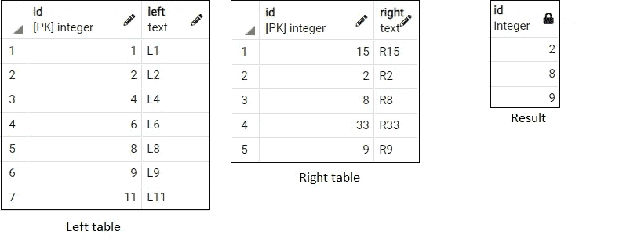*

*相交(作者图片)*

## *除...之外*

*Except 返回第一个表(左表)中不存在于第二个表(右表)中的记录。在下面的查询结果中，我们可以看到 ***left_table*** 的 ***id*** s 在 ***right_table*** 中没有。*

*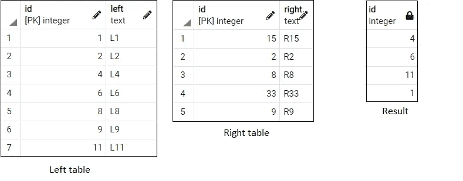*

*除外(图片由作者提供)*

# *示例查询*

*我们将使用从[这里](https://www.postgresqltutorial.com/postgresql-sample-database/)下载的 dvd_rental 数据库并恢复它。下面是在 PostgreSQL 中恢复数据库的文档。*

 *[## 还原对话框- pgAdmin 4 5.2 文档

### “还原”对话框提供了一种简单的方法来使用自定义、tar 或目录格式的备份，这些备份是通过 pgAdmin 对话框进行的…

www.pgadmin.org](https://www.pgadmin.org/docs/pgadmin4/development/restore_dialog.html)* 

## *1.五大常客*

*在本例中，我们需要找到租赁最多的前 5 名客户。为此，我们将*

1.  *使用 ***customer_id*** 连接 ***客户*** 和 ***租赁*** 表。*
2.  *通过分组***【customer _ id】****对客户进行计数(如 ***rental_count*** )。**
3.  *按照 ***rental_count*** 降序排列结果。*
4.  *将结果限制为前 5 条记录。*

```
***SELECT** 
  c.customer_id,
  c.first_name,
  c.last_name, 
  **COUNT**(c.customer_id) **AS** rental_count
  **FROM** customer c
    **INNER JOIN** rental r
      **USING** (customer_id)
  **GROUP BY** customer_id
  **ORDER BY** 
   **COUNT**(c.customer_id) **DESC**
  **LIMIT** 5;*
```

*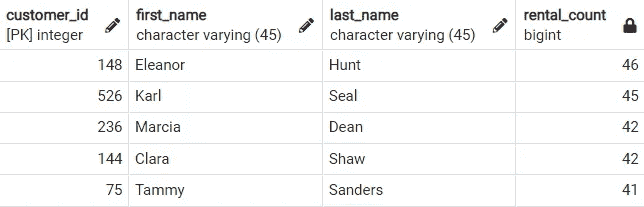*

*作者图片*

## *2.按产生的收入排列的前 5 名和后 5 名客户*

*在这个例子中，我们将使用通用表表达式(CTE)。使用 cte，我们可以为特定查询创建临时表。下面是 cte 的官方 Postgres 文档。*

*[](https://www.postgresql.org/docs/9.1/queries-with.html) [## 带查询(公共表表达式)

### WITH 提供了一种编写辅助语句的方法，以便在更大的查询中使用。这些经常被提及的陈述…

www.postgresql.org](https://www.postgresql.org/docs/9.1/queries-with.html) 

在本例中，我们需要找出收入最高的前 5 名和后 5 名客户。为此，我们将

1.创建一个名为**的 CTE*revenue _ per _ customer*by**

*   使用***customer _ id*****连接 ***客户****租赁*** 表。****
*   使用 ***租金 _id*** *将结果表与*付款表连接起来。**
*   *计算客户为每笔租赁交易支付的总金额(如 ***total_amount*** )按***customer _ id****分组。**
*   *最后，选择 ***customer_id*** *，****first _ name****，****last _ name***和***total _ amount****。**

*2.从上述 CTE 中按收入选择前 5 名客户*

*   *对 ***【收入 _ 每 _ 客户】***【CTE 结果】中的 ***合计 _ 金额*** 进行降序排序。*
*   *将结果限制为前 5 条记录。*
*   *添加注释，将记录指定为“前 5 条”。*

*3.根据上述 CTE 的收入选择排名后 5 位的客户*

*   *对 ***【收入 _ 每 _ 客户】***【CTE 结果】中的 ***合计 _ 金额*** 进行升序排序。*
*   *将结果限制为前 5 条记录。*
*   *添加注释，将记录指定为“底部 5”。*

*4.使用**合并上述两个结果。***

```
***WITH** revenue_per_customer **AS** 
 (**SELECT** 
   c.customer_id, 
   c.first_name,
   c.last_name,
   **SUM**(p.amount) **AS** "total_amount"
   **FROM** customer c
    **INNER JOIN** rental r
     **USING** (customer_id)
    **INNER JOIN** payment p
     **USING** (rental_id)
   **GROUP BY** c.customer_id)(**SELECT** 
  *,
  'Top 5' **AS** comment
  **FROM** revenue_per_customer
  **ORDER BY** total_amount **DESC**
  **LIMIT** 5)**UNION**(**SELECT** 
  *,
  'Bottom 5' **AS** comment
  **FROM** revenue_per_customer
  **ORDER BY** total_amount **ASC**
  **LIMIT** 5)
**ORDER BY** comment **DESC**, total_amount **DESC**;*
```

*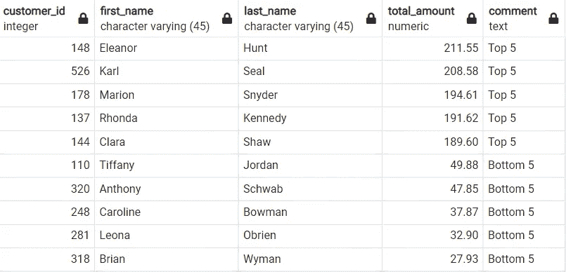*

*作者图片*

*我们也可以使用窗口函数得到上面的查询结果。下面是关于窗口函数的官方 Postgres 文档。*

*[](https://www.postgresql.org/docs/9.1/tutorial-window.html) [## 窗口功能

### 窗口函数对一组与当前行有某种关系的表行执行计算。这个…

www.postgresql.org](https://www.postgresql.org/docs/9.1/tutorial-window.html) 

为了找出使用窗口函数产生最多收入的前 5 名和后 5 名客户，我们将

1.创建一个名为**total _ AMT _ rank的 CTE**

*   使用***customer _ id****加入 ***客户*** 和 ***租赁*** 表。*
*   将结果表与 ***付款*** 表连接使用 ***租金 _id*** *。*
*   计算客户为每笔租赁交易支付的总金额(如 ***total_amount*** )按***customer _ id****分组。*
*   最后，选择***customer _ id****，* **， *first_name*** *，****last _ name****，****total _ amount****和排名 ***total_amount* 这将等级 1 赋予最高金额，依此类推。***

*2.从上述 CTE 中选择***total _ amount _ rank****在 1 到 5 之间**的客户，选择收入排名前 5 的客户。****

**3.从上述 CTE 中按收入选择排名后 5 位的客户**

*   **将***【total _ AMT _ rank***【CTE 结果】中的***total _ amount _ rank****按降序排序。***
*   ***将结果限制为前 5 条记录。***

***4.使用 **UNION 合并上述两个结果。*****

```
*****WITH** total_amt_rank **AS**
 (
  **SELECT**
      c.customer_id, 
      c.first_name,
      c.last_name,
      **SUM**(p.amount) **AS** "total_amount",
      **RANK**() **OVER** (**ORDER BY SUM**(p.amount) **DESC**) **AS** total_amount_rank
       **FROM** customer c
        **INNER JOIN** rental r
          **USING** (customer_id)
        **INNER JOIN** payment p
          **USING** (rental_id)
       **GROUP BY** c.customer_id
  )
(
 **SELECT** *
  **FROM** total_amt_rank
    **WHERE** 
     total_amount_rank **BETWEEN** 1 **AND** 5
)

**UNION**

(
 **SELECT** *
   **FROM** total_amt_rank
    **ORDER BY** total_amount_rank **DESC**
  **LIMIT** 5
)

**ORDER BY** total_amount_rank;***
```

***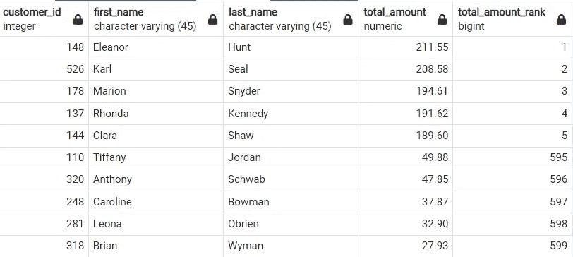***

***作者图片**** 

## ***3.租金最高的前 5 个国家***

***在本例中，我们需要找到租金最高的前 5 个国家。为此，我们将***

1.  ***使用 ***country_id*** 加入 ***country*** 和 ***city*** 表。***
2.  **使用 ***city_id*** 将结果表与 ***地址*** 表连接。**
3.  **使用 ***address_id*** 将结果表与*客户* 表连接起来。**
4.  **使用 ***customer_id*** 将结果表与 ***租赁*** 表连接起来。**
5.  **计数 ***country_id*** (为 ***出租 _ 计数*** )按分组***country _ id****。*我们也可以用***rental _ id****来得到****rental _ count****。*****
6.  **按 ***rental_count*** 降序排列结果。**
7.  **将结果限制为 5 条记录。**

```
****SELECT** 
 co.country_id, 
 co.country,
 **COUNT**(co.country_id) **AS** rental_count
  **FROM** country co
   **INNER JOIN** city ci
    **USING** (country_id)
   **INNER JOIN** address a
    **USING** (city_id)
   **INNER JOIN** customer cu
    **USING** (address_id)
   **INNER JOIN** rental r
    **USING** (customer_id)
  **GROUP BY** co.country_id
  **ORDER BY** 
   **COUNT**(co.country_id) **DESC**
  **LIMIT** 5;**
```

**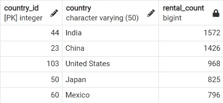**

**作者图片**

**有几个地址和城市没有客户。使用 inner join 可以省略这些记录。在下面的查询中，我们将看看在使用 left join 时，结果如何包括没有客户的地址。**

## **4.没有客户的城市/地址？**

**有几个城市和地址没有任何客户(这些可能是商店地址)。使用内部连接会将它们从结果中忽略，因为在另一个表中没有匹配的条目。例如，加拿大一个名为伦敦的城市在地址表中没有匹配的 ***city_id*** 。使用 inner join 会从结果中忽略加拿大的伦敦。同样，加拿大和澳大利亚的四个地址在 ***客户*** 表中没有匹配的 ***address_id*** 。**

```
****SELECT** 
 co.country, 
 ci.city, 
 a.address, 
 cu.customer_id 
  **FROM** country co
   **LEFT JOIN** city ci
    **USING** (country_id)
   **LEFT JOIN** address a
    **USING** (city_id)
   **LEFT JOIN** customer cu
    **USING** (address_id)
  **WHERE** cu.address_id **IS NULL**;**
```

**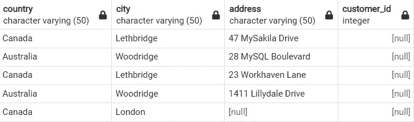**

**作者图片**

## **5.没有客户的国家**

**在本例中，我们将通过查找没有客户的国家**

**1.通过创建子查询来查找至少有一个客户的国家**

*   **加入 ***国家*** 表与 ***城市*** 表使用 ***国家 _id*** *。***
*   **使用 ***city_id*** 将余数表与 ***地址*** 表连接起来。**
*   **使用 ***address_id*** 将剩余表与 ***客户*** 表连接。**

**2.从***国家*** 表中选择 ***国家*****国家* ***国家 _id*** 不在上述子查询的 ***国家 _id*** 中。***

```
***SELECT** 
 country 
    **FROM** country
     **WHERE** country_id 
       **NOT IN** 
        (
         **SELECT** 
          co.country_id
           **FROM** country co
            **INNER JOIN** city ci
              **USING** (country_id)
            **INNER JOIN** address a
              **USING** (city_id)
            **INNER JOIN** customer
              **USING** (address_id)
        );*
```

**

*作者图片*

## *6.澳大利亚有商店吗？*

*在上面的例子中，我们看到澳大利亚没有客户。在本例中，我们将查看澳大利亚是否有商店*

1.  *加入 ***国家*** 表与 ***城市*** 表使用 ***国家 _id*** 。*
2.  *使用 ***city_id*** 将结果表与 ***地址*** 表连接起来。*
3.  *使用 ***address_id*** 将结果表与 ***store*** 表连接。*
4.  *选择在澳大利亚***store _ id*****不为空**的记录。*

*Left join 确保没有城市的国家和没有商店的城市也包含在查询结果中。*

```
***SELECT** 
 st.store_id, 
 co.country, 
 ad.address
  **FROM** country co
   **LEFT JOIN** city ci
    **USING** (country_id)
   **LEFT JOIN** address ad
    **USING** (city_id)
   **LEFT JOIN** store st
    **USING** (address_id)
  **WHERE** 
   (st.store_id **IS NOT NULL**) 
    **AND** 
     (co.country = 'Australia');*
```

**

*作者图片*

*澳大利亚有一家商店。事实上，整个数据库中只有两家商店。我们将使用下面的查询来查看它们。*

```
***SELECT** * **FROM** store;*
```

*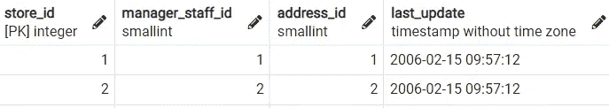*

*作者图片*

## *7.没有电影的语言*

*在这个例子中，我们将看看是否有没有电影的语言*

1.  *加入 ***语言*** 表格与 ***电影*** 表格使用 ***语言 _id*** 。左连接确保没有任何电影的语言也包括在内。*
2.  *过滤 ***film_id* 为空**的记录。*

```
***SELECT** 
 *
  **FROM** language l
   **LEFT JOIN** film f
    **USING** (language_id)
  **WHERE** f.film_id **IS NULL**;*
```

*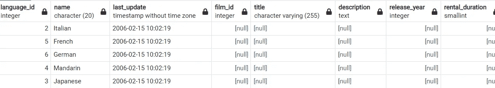*

*作者图片*

*我们看到一些语言在数据库中没有电影。我们将通过从 ***电影*** 表中选择(2，3，4，5，6)中带有 ***language_id*** 的电影来确保这不是一个错误。查询结果不应返回任何记录。*

```
***SELECT** 
 * 
  **FROM** film
   **WHERE** language_id **IN** (2,3,4,5,6);*
```

**

*作者图片*

## *8.电影在印度的受欢迎程度*

*在本例中，我们将通过连接前面的示例和中讨论的所需表来查找印度每个电影类别的租赁数量*

1.  *按 ***国家*** 和 ***类别*** 分组，过滤来自印度的记录，统计电影类别名称(如***film _ category _ count***)。*
2.  *按国家升序排序结果，按 ***降序排序*** 电影 _ 类别 _ 数量。*

```
***SELECT** 
 co.country, 
 cat.name **AS** film_category,
 **COUNT**(cat.name) **AS** film_category_count
  **FROM** country co
   **INNER JOIN** city ci
    **USING** (country_id)
   **INNER JOIN** address ad
    **USING** (city_id)
   **INNER JOIN** customer cu
    **USING** (address_id)
   **INNER JOIN** rental re
    **USING** (customer_id)
   **INNER JOIN** inventory inv
    **USING** (inventory_id)
   **INNER JOIN** film fi
    **USING** (film_id)
   **INNER JOIN** film_category fc
    **USING** (film_id)
   **INNER JOIN** category cat
    **USING** (category_id)
   */* 
    Using
    WHERE co.country = 'India'
    here, instead of 
    HAVING co.country = 'India'
    reduces the query execution time.
   */*
  **GROUP BY** (co.country, cat.name)
  **HAVING** co.country = 'India'
  **ORDER BY** 
   co.country **ASC**, 
   **COUNT**(cat.name) **DESC**;*
```

*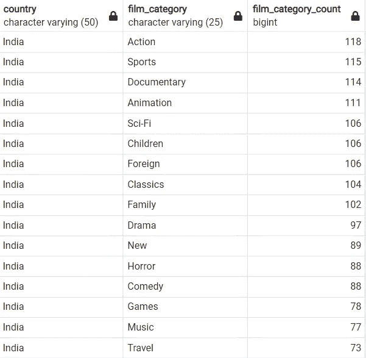*

*作者图片*

## *9.只有一个演员的电影*

*在本例中，我们将通过以下方式查找只有一个演员的电影*

1.  *加入 ***电影*** 表与 ***电影 _ 演员*** 表使用 ***电影 _id*** 。*
2.  *按 ***film_id*** 分组，统计演员人数(如 ***actor_count*** )。*
3.  *过滤 ***actor_count*** 为 1 的记录。*

```
***SELECT** 
 f.film_id, 
 f.title, 
 **COUNT**(fa.actor_id) **AS** actor_count
  **FROM** film f
   **INNER JOIN** film_actor fa
    **USING** (film_id)
  **GROUP BY** f.film_id
  **HAVING COUNT**(fa.actor_id) = 1;*
```

*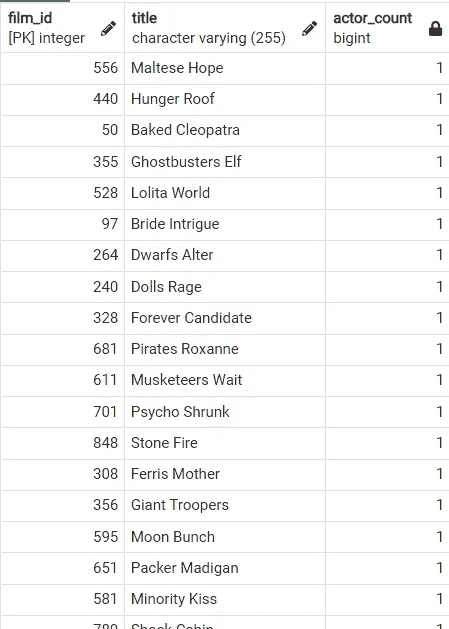*

*作者图片*

## *10.一个演员的电影数量(按类别)*

*在本例中，我们将通过以下方式按电影类别查找演员的电影数量*

1.  *创建一个名为***actor _ cat _ CNT***的 CTE，返回每个 ***actor_id*** 和***category _ id****的电影数量。**
2.  *将上面的 CTE 与 ***类别*** 表格用 ***类别 _id*** 连接起来。*
3.  *使用 ***actor_id*** 将结果表与 ***actor*** 表连接。*
4.  *按升序排列演员姓名(串联 ***名字*** 和 ***姓氏)*** 和 ***电影数量*** )。*

```
***WITH** 
 actor_cat_cnt **AS**
 (
  **SELECT** 
   fa.actor_id, 
   fc.category_id, 
   **COUNT**(f.film_id) **AS** film_count 
    **FROM** film_actor fa
     **INNER JOIN** film f
      **USING** (film_id)
     **INNER JOIN** film_category fc
      **USING** (film_id)
    **GROUP BY** 
     fa.actor_id, 
     fc.category_id
 )**SELECT** 
 **CONCAT**(ac.first_name, ' ', ac.last_name) **AS** actor,
 ca.name **AS** category,
 film_count
  **FROM** actor_cat_cnt
   **INNER JOIN** category ca
    **USING** (category_id)
   **INNER JOIN** actor ac
    **USING** (actor_id)
  **ORDER BY** 
   **CONCAT**(ac.first_name, ' ', ac.last_name) **ASC**,
   film_count **DESC**;*
```

*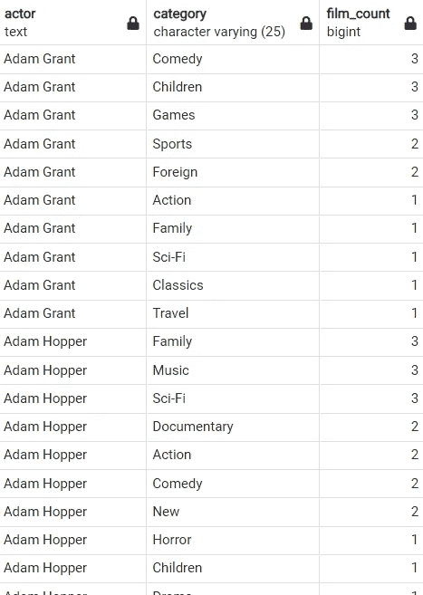*

*作者图片*

## *11.演员的流行类别*

*在上面的例子中，我们通过电影类别找到了一个演员的电影数量。在本例中，我们将通过以下方式找到演员的热门类别(即演员拥有最多电影的类别)*

1.  *创建一个名为 ***actor_cat_cnt*** 的 CTE，返回每个 ***actor_id*** 和 ***category_id*** 的电影数量，并按电影数量降序排列每个演员的类别(如***cat _ rank***)*。**
2.  *将上面的 CTE 与*的类别表用 ***的类别 _id*** 连接起来。**
3.  **使用 ***actor_id*** 将结果表与 *actor* 表连接。**
4.  **过滤 cat_rank = 1 的记录。**
5.  **按升序排列演员姓名(串联 ***名*** 和 ***姓)*** 和 ***片数*** )。**

```
****WITH** 
 actor_cat_cnt **AS**
 (
  **SELECT** 
   fa.actor_id, 
   fc.category_id, 
   **COUNT**(f.film_id) **AS** film_count,
   **RANK**() **OVER** 
    (**PARTITION BY** fa.actor_id 
      **ORDER BY COUNT**(f.film_id) **DESC**) **AS** cat_rank 
    **FROM** film_actor fa
     **INNER JOIN** film f
      **USING** (film_id)
     **INNER JOIN** film_category fc
      **USING** (film_id)
    **GROUP BY** 
     fa.actor_id, 
     fc.category_id
 )**SELECT** 
 **CONCAT**(ac.first_name, ' ', ac.last_name) **AS** actor,
 ca.name **AS** category,
 film_count
  **FROM** actor_cat_cnt
   **INNER JOIN** category ca
    **USING** (category_id)
   **INNER JOIN** actor ac
    **USING** (actor_id)
  **WHERE** cat_rank = 1  
  **ORDER BY** 
   **CONCAT**(ac.first_name, ' ', ac.last_name) **ASC**,
   film_count **DESC**;**
```

****

**作者图片**

**本文到此结束。我们已经讨论了使用 SQL 按行或列合并表的方法，以及一些使用 dvd_rental 数据库的例子。这些是我们用 SQL 编写的几乎每个查询中使用的基本概念。我们在实践中可能不会经常使用其中的一些，但是了解它们是必要的。***