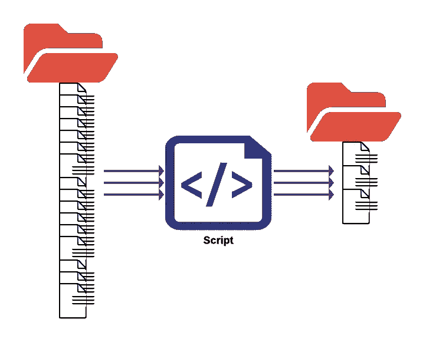

# 使用 Apache Spark 将 Datalake 中过多的小文件合并到较少的大文件中

> 原文：<https://towardsdatascience.com/merging-too-many-small-files-into-fewer-large-files-using-apache-spark-in-datalake-ff9a32807056?source=collection_archive---------7----------------------->

## *提高对大型数据集的读取查询性能*

作者图片

T 在数据平台中存储大量数据的现代方法是将每个数据集分布在集群中的几个节点上。如果使用云，整个数据集将被分成多个对象。这可能会导致“太多的小文件”，这是大数据领域的一个众所周知的问题。创建小文件的原因有几个，比如一条消息一条消息地保存传入的流数据，按具有数据倾斜的键进行分区，等等。当通过 Namenode、MapReduce 或 Spark 作业维护或读取该数据集时，驱动程序必须跟踪所有文件的元数据，以便规划分布式数据处理。当它们太多时，保存元数据会有内存开销，而且列出它们会花费更多的网络 I/O 时间。

在数据湖中工作时，您可能已经注意到，Spark 作业花费太多时间读取 s3/HDFS 上的数据集，甚至需要一段时间才能看到执行器启动。或者您的 Hive 查询需要一两分钟来启动任务。最有可能的是，这是由于驱动程序花费了大部分时间首先在 s3 中检查数据集的文件/对象的所有元数据，尤其是当有太多小文件时。这是因为驱动程序执行数据集中的文件列表，估计大小/分区，然后将实际处理分配给执行器。因此，拥有太多的小文件可能会导致性能瓶颈，在最坏的情况下，驱动程序可能会因内存不足异常而失败。

这是一个简单的 Spark 作业，它可以接收数据集和估计的单个输出文件大小，并将输入数据集合并到更大的文件中，最终减少文件的数量。同时，拥有一个非常大的文件也不好。一般来说，1gb 或 512MiB 的文件是标准的。

[*这里有完整的剧本*](https://github.com/justhackit/spark-utils/blob/main/src/main/scala/com/sparkutils/io/FileMerger.scala) 。让我给你介绍一下剧本…

## 司机:

这是接受三个参数的主要方法..1)小文件所在的源 s3 路径 2)作业将合并文件写入的目标 s3 路径，以及 3)单个合并文件的最大目标文件大小。

这个脚本假设输入目录(第 5 行)再次包含子目录，这些子目录实际上包含最终文件。通常，分区数据集就是这种情况。但是，如果我们只有一个存放所有文件的目录，那么您可以调整第 5 行，将单个元素传递给列表。

接下来，第 9 行到第 11 行很有趣，它使用 Scala 的并行集合来并行提交多个 spark 作业。是的，你没看错。当从每个线程提交时，我们可以运行并行的 Spark 操作。如您所见，所有的多线程都通过使用并行集合被抽象掉了。第 9 行设置并行度，即并行处理多少个目录。在这里，我只是将它设置为子目录的数量。如果超过一百个，我建议成批运行它们，因为集群可能会过载(当然，这取决于集群的大小)。

从第 12 行开始，处理开始于遍历每个输入目录并并行处理它们。每个目录的整个过程可以分为三个步骤:

## 步骤 1:找到文件大小

这很简单。我只是使用“com . Amazon AWS:AWS-Java-SDK”**库列出目录中的文件。在列表过程中，我还发现了每个对象的大小，并将 Map < file-prefix，size >返回给调用者。**

## **步骤 2:确定要合并的文件组**

**在这里，我们可以找到可以合并的一组较小的文件。如您所见，该方法采用了映射<file>和目标文件大小。在按文件大小对映射进行排序后，它将多个文件分组到一个批处理中，以便该批处理的总大小小于或等于目标文件大小。当然，这可能不是最好的群集，因为我们可能最终得到小于目标文件大小的文件，但不能与其他此类文件进行批处理，因为总批处理大小可能会超过目标文件大小。幸运的是，由于我们是按照文件大小升序对地图进行排序的，所以最小大小的文件会被组合在一起，只有那些已经接近目标大小的文件会保留下来。该函数最后返回一个 List[List[file]]，其中包含要合并为单个文件的一批文件的列表。</file>**

## **第三步:合并文件并写出它们**

**现在到了最后一步，即将前一步中的分组文件合并成一个文件。你可以猜到，这是一个简单的任务。只需使用 spark.read()函数读取文件(在上面的代码中，我读取的是 Parquet 文件，但可以是任何文件格式),方法是传递该组中的文件列表，然后使用 coalesce(1)将它们合并成一个文件。这是另一个有趣的作品。我们再次使用并行集合来执行合并，因此合并同一目录中的每个组是并行进行的。因此，如果每个目录中有 *m 个*目录和 *n 个*组，那么就会有 *m x n 个*并行作业在运行。**

**当写出合并的文件时，写模式是“追加”，因为，正如我前面提到的，多个目录被并行处理，并且所有目录的目标目录都是相同的，“覆盖”模式将失败，表示“目录已经存在”。因此，您需要确保目标目录是一个新目录。**

**仅此而已。现在，即使是 KiB 的文件也会被合并成 100 兆或 100 兆字节.当要扫描的文件数量较少时，您可以很容易地看到读取查询的性能提升。**

**下一步是什么？
1。对这个脚本的一个可能的即兴创作是，在进行磁盘 IO 之前，最好通过写作业合并数据集，而不是合并已经存在的文件。我将分享另一个可以做到这一点的帖子。同时，该脚本可用于合并历史数据集。
2。正如我已经提到的，第 2 步，即确定要合并的文件组，并不是最好的。如果你知道一个聚类算法，可以以一种最佳的方式对文件进行分组，这样我们在合并后就有最少的文件，我欢迎 PR 的:-)**