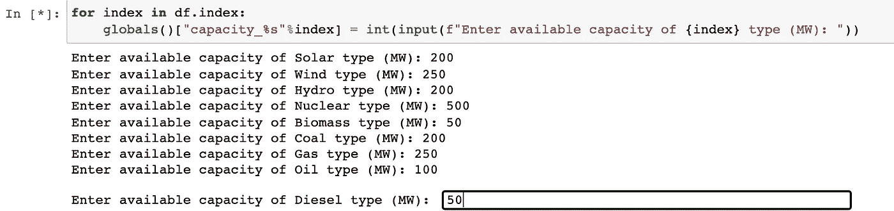
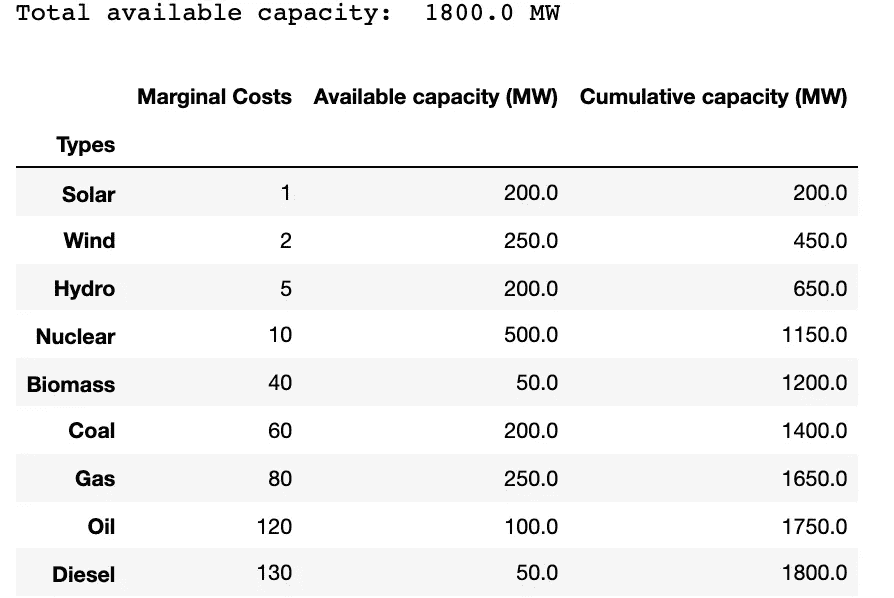
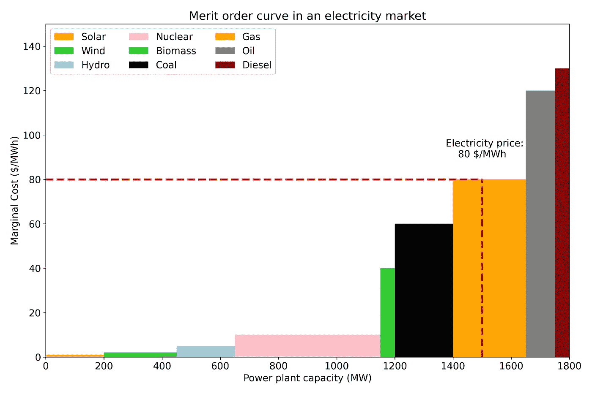
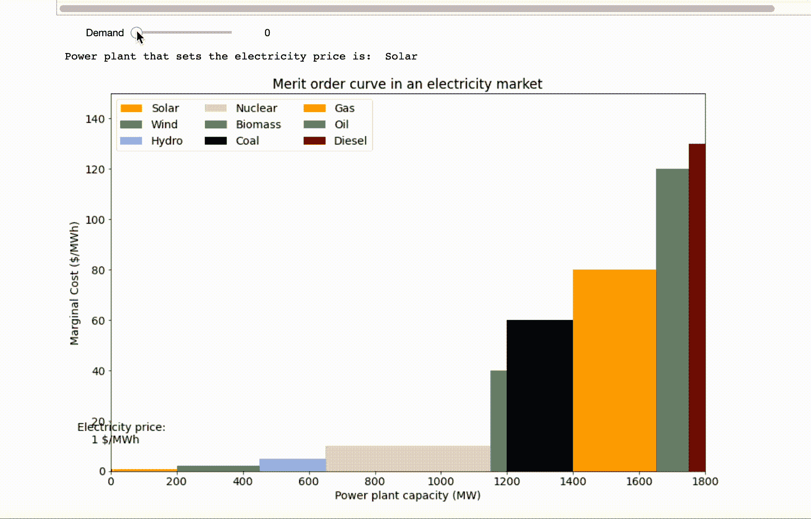
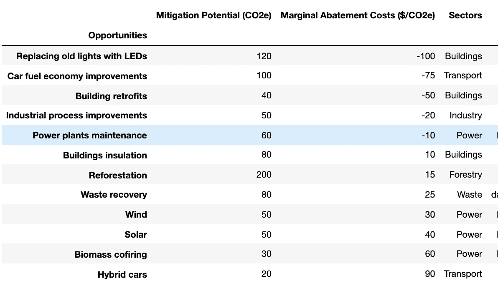
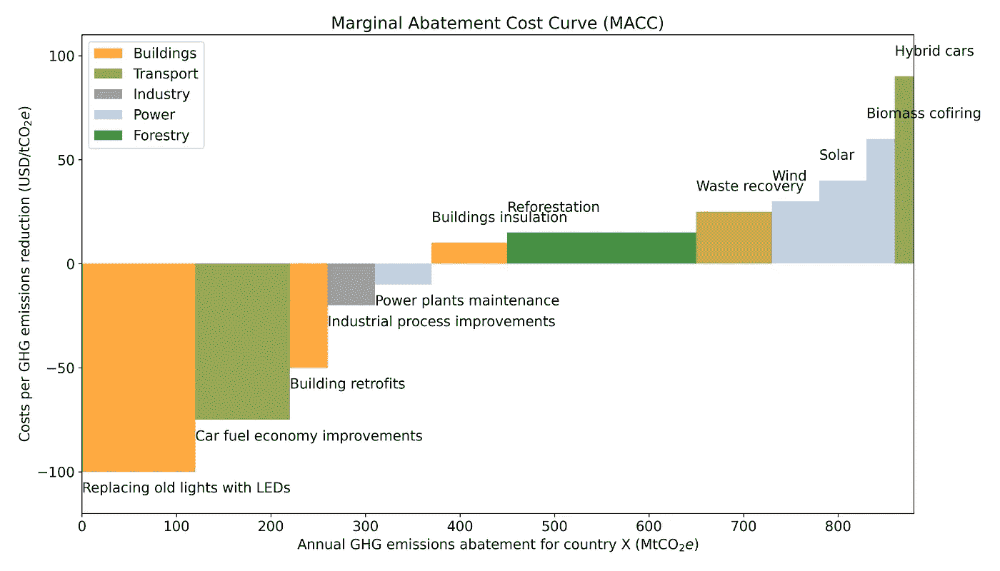

# Python 中的价值排序和边际减排成本曲线

> 原文：<https://towardsdatascience.com/merit-order-and-marginal-abatement-cost-curve-in-python-fe9f77358777?source=collection_archive---------5----------------------->

## 制定批发电价并探索脱碳机会

为了实现《巴黎协定》设定的本世纪末全球气温限制 1.5 摄氏度的目标，不同机构提出了不同的情景。缓解方案中有一个共识，可再生能源等低碳技术的份额需要增加，化石燃料需要在未来的能源组合中稳步下降。

缓解技术方案的部署(如可再生能源、电动汽车、绿色氢等)。)想出自己的一套成本和收益。在一个国家的发电组合中，可再生能源和化石燃料的组合不仅决定了二氧化碳的排放量，还会影响电价。在这篇文章中，我将讨论如何通过**优值顺序曲线(**基于**边际成本或产量的概念)**在批发电力市场中确定电价，以及如何根据**边际减排成本曲线评估一个国家或地区或组织的脱碳机会的成本效益。**我将使用 Python 来构建这两条曲线，并在此过程中讨论其实现。

我们开始吧！

# 优级曲线

一个国家的电力局或公用事业公司可以在其投资组合中拥有不同类型的相互竞争的发电厂，以向零售商提供电力输出。这就是所谓的[电力批发市场](https://fsr.eui.eu/electricity-markets-in-the-eu/)(也称为现货市场)。发电的成本根据发电厂的类型而不同。例如，太阳能光伏或风力涡轮机发电的成本为零或极低，因为它们不需要任何燃料。另一方面，基于化石燃料的发电厂的运行成本较高，这取决于燃烧发电的燃料(如煤、石油或天然气)的价格。用经济学的语言来说，生产一个额外单位产品的成本叫做 [**边际生产成本**](https://www.investopedia.com/terms/m/marginalcostofproduction.asp) 。

在电力系统中，基于电力生产的短期边际成本的升序，组合中的可用发电厂被安排在线**。该序列被称为**绩效等级**。边际成本最低的发电厂将首先满足需求，其次是边际成本较高的发电厂，以优化电力供应成本。**

在本节中，我将实施不同的步骤来构建 Python 中的价值排序曲线，并讨论价值排序如何设定批发电价。

## 履行

让我们考虑在一个国家的电力组合中有九种类型的发电厂，如列表`power_plants`所示。这些电厂必须按照`marginal_costs`的升序排列。本例中使用的数据是基于我的假设，可以视为虚拟数据集。

```
power_plants **=** ["Solar", "Wind", "Hydro", "Nuclear", "Biomass",
               "Coal", "Gas", "Oil", "Diesel"]

marginal_costs **=** [0, 0, 5, 10, 40, 60, 80, 120, 130]
```

首先，我将这些数据转换成索引中有`power_plants`列中有`marginal_cost`的 dataframe。接下来，我遍历 dataframe 的索引，并要求用户输入每个电厂的可用容量。每个发电厂的可用容量使用如下所示的`globals()`方法存储在一个单独的变量中。



使用 for-loop 和 globals()方法请求用户输入每个电厂类型的可用容量。

X 国投资组合中的总可用容量总计为 1800 兆瓦。然后，我创建一个名为`Cumulative capacity (MW)`的新列，它是`Available capacity (MW)`的累积和。



包含 x 国每种电厂类型的边际成本和可用容量的数据框架。

我要求用户输入给定时间段 X 国的电力需求。

```
demand = int(input(“Enter total demand (MW): “))
```

我们假设`demand`是 1500 MW。

现在，数据准备好了，我可以开始编译价值排序曲线的构建模块了。在优值排序曲线中，发电厂以条形图的形式按发电边际成本的升序排序。条形的宽度代表每种发电厂类型的可用容量，高度代表相应的边际成本。由于条形的宽度不相等，它们看起来与正常的条形图有很大的不同。

第一个条形(此处为 Solar)在 x 轴上的刻度位置与其`Available capacity (MW)`的一半相同。对于另一种电厂类型，位置的计算方法是:直到它之前的电厂类型的`Cumulative capacity (MW)`和它的`Available capacity (MW)`的一半之和。我准备了一个 for 循环来获得`df`的`xpos`列中的这个位置，如下面要点的第一部分所示。

接下来，我分析需求在 x 轴上的位置。功率需求与累积功率供应在 x 轴相交的位置决定了`cut_off_power_plant`。反过来，`cut_off_power_plant`的边际成本决定了在它之前的所有参与批发市场的发电厂的清算价格。这个批发市场的电力购买者都将支付同样的价格。

顶部的 For 循环确定了 x 轴上各电厂类型的条形的位置。底部的 cut_off 函数确定与电力需求相交的电厂类型。

生成优次曲线的代码如下所示。

函数来生成电力市场中的优序曲线。

结果图如下所示。



给定电力市场的优序曲线。x 轴代表发电厂的可用容量。y 轴代表每个发电厂的边际成本。垂直的红色虚线表示与燃气相交的需求。水平的红色虚线代表天然气发电的边际成本，它决定了市场清算价格。图片作者。

在结果图中，1500 MW 的功率需求由垂直的红色虚线表示。这与所有电厂按边际成本升序排列时，燃气供电相吻合。因此，天然气发电的边际成本，即 80 美元/兆瓦时，是市场清算价格。这意味着在 X 轴上的垂直红色虚线之上和之前的所有发电厂，即太阳能、风能、水能、核能、生物质能、煤和天然气需要输送电力来满足需求。所有这些公司都按照天然气生产的边际成本来定价。

## 优序效应

当电力系统的需求水平发生变化时，批发电价也会做出相应的反应。这一点在下面的 GIF 图片中有所展示。为了获得 Python 中的动画，我使用了来自`ipywidgets`的`interact`函数，如下所示。我还使用了`IntSlider`小部件将`demand`设置为用户自定义的参数来进行交互。为了避免拖动滑块时闪烁，我将`continuous_update`设置为假。

```
from ipywidgets import *demand = widgets.IntSlider(
                value = 100,
                min = 0,
                max = df[“Available capacity (MW)”].sum(),
                step = 10, 
                description = “Demand”,
                continuous_update = False #False to avoid flickering
                )interactive_plot = interact(merit_order_curve, demand = demand)
```



动画展示了当需求变化时切断发电厂和批发电价的变化。图片作者。

如上面的 GIF 图所示，当需求增加时，需要调度更多位于价值顺序右侧的电厂，这增加了清算价格，反之亦然。如果投资组合中有更多的可再生能源发电厂，那么更多的需求份额将由可再生能源满足。这往往会降低电价，这被称为**优序效应**。

# 边际减排成本曲线

[**减排成本**](https://www.investopedia.com/terms/a/abatementcost.asp#:~:text=An%20abatement%20cost%20is%20a,negative%20byproducts%20created%20during%20production.&text=The%20most%20common%20scenario%20in,spills%2C%20whether%20accidental%20or%20intentional.) 是企业为消除或减少生产过程中产生的外部性(负副产品)而承担的成本。**边际减排成本**衡量减少一个额外外部性单位的成本，例如二氧化碳排放。价值排序曲线是基于按边际生产成本对技术进行排序，而边际减排成本(MAC)曲线是基于按边际减排成本的升序对不同减排机会进行排序。

在 MAC 曲线中，条形的宽度代表任何技术或选项的温室气体(GHG)减排潜力。条形图的高度代表在给定的机会下，减少一个额外单位 GHG 排放量的成本。



包含不同机会的缓解潜力和边际减排成本的数据框架。数据基于作者的假设。

本例中的数据基于我的假设，可以被视为虚拟数据集。Python 中 MAC 曲线的实现类似于优级曲线的实现。



x 国某一年的 MAC 曲线。条形的宽度代表缓解机会的年度 GHG 减排潜力。条形图的高度代表在给定年份减少 1 tCO2e 排放量的估计成本。图片作者。

如上图所示，用 LED 灯替换旧灯是最具成本效益的脱碳措施。某些机会的负边际减排成本意味着当实施这些措施时有净成本节约(或利润)。当我们向 MAC 曲线中 X 轴的右端移动时，减少一个单位的 GHG 排放量会变得更加昂贵。在 MAC 曲线上最宽的横条，重新造林具有 GHG 减排的最大整体潜力。

因此，MAC 曲线允许在同等条件下比较不同部门(此处为电力、交通、建筑、林业和废物)的衡量标准。虽然 MAC 曲线提供了对各种缓解机会的潜力和成本效益的关键初步评估，但将这种评估与来自其他建模工具的见解相结合，为制定政策和投资决策提供了坚实的基础。

# 结论

随着我们正在经历全球能源转型，燃烧更多的化石燃料来满足我们的能源需求将导致很快超过我们需要遵守的排放预算，以满足全球气候目标。已经存在技术上成熟、经济上可行的机会，可以大幅减少能源和非能源部门的 GHG 排放量。此外，由于规模经济，成熟的减排技术(如风能和太阳能)每年都变得越来越便宜。

重要的是利用已被证明的缓解技术选项来大幅减少排放。缓解方案有自己的一套成本和收益。在这篇文章中，我讨论了可再生能源和化石燃料在一个国家的电力系统组合中的份额如何影响批发电价，其概念是**优值曲线** ( **基于边际生产成本**)。我还介绍了如何根据**边际减排成本曲线**评估一个国家的减排潜力和减排机会的成本效益。这些曲线在 Python 中的实现可以在这个 [GitHub 库](https://github.com/hbshrestha/Data_Analytics)中找到。