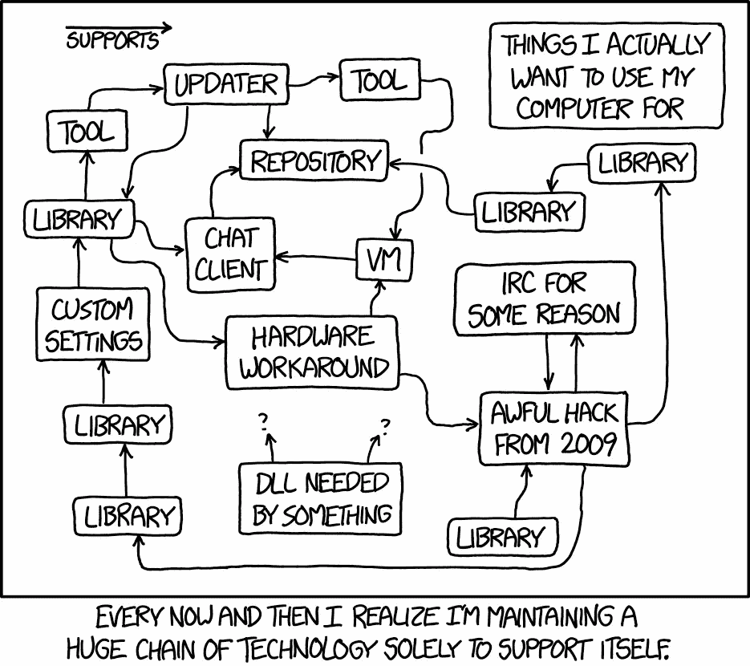
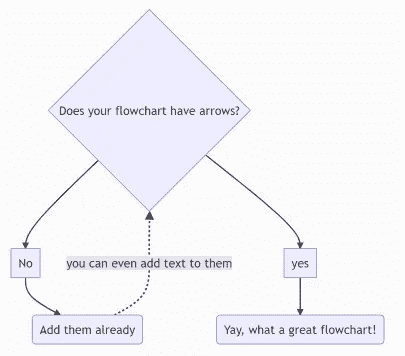
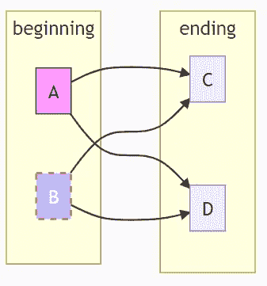
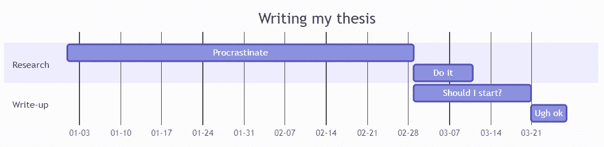
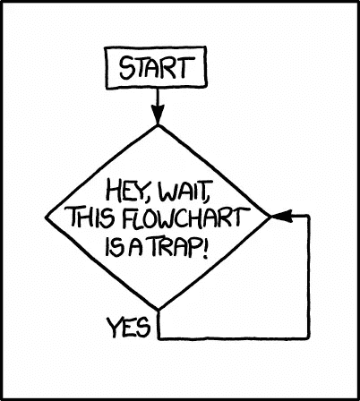

# 美人鱼:快速而轻松地创建图表

> 原文：<https://towardsdatascience.com/mermaid-create-diagrams-quickly-and-effortlessly-d236e23d6d58?source=collection_archive---------1----------------------->

如果你曾经试图解释任何复杂的东西——无论是算法、代码基础结构还是项目计划——你可能知道好的图表有多有用。


你怎么会*不想*使用一个叫做美人鱼🧜‍♀️的工具呢？安妮特·巴蒂斯塔日照片

然而，随着我们许多人远程工作，当解释不足时，分享自发的绘画变得更加困难。虽然在办公室进行白板会议很容易，但在网上就要尴尬得多。至少可以说，当你的同事在通话中观看你的共享屏幕时，试图用你的鼠标在绘图应用程序中画出不稳定的方框，或者拖动笨重的箭头，并不好玩。

但是有一种方法可以只用代码快速、轻松地生成所有的图表，所以*你再也不用画盒子了*！

Mermaid 是一个让你在 Markdown 中创建复杂图表的工具——它使用简单的命令和直观的语法。什么都不用画，写下你想看的就行了！

您可以创建**流程图**来帮助您理解算法，**甘特图**用于项目管理，**饼图**以及许多其他常见的图表类型。

Mermaid 为您合理地安排了图表，因此，如果您忘记了流程图中的某个中间步骤，您将不必担心手动重新安排所有方框。

在这篇文章中，我将告诉你使用美人鱼的不同方法，并向你展示它的能力的一些例子。这当然是我最喜欢的创建图表的工具，我希望它也能成为你的！

# 但是我们为什么需要图表呢？

人类的大脑在理解图像和模式方面比文本要好得多。如果我们看到一个复杂的结构的视觉表现，我们处理它的速度会更快，而且我们也能更好地记住它——这被称为图片优势效应。这也很直观——你可以从条形图或饼图中得出结论，比阅读一系列数字要快得多。

图片也**抓住观众的注意力**。如果你在没有视觉辅助的情况下给出一个冗长复杂的解释，大多数听众会在一分钟后走神，或者已经忘记了开头。如果你包括一个图表，他们可以找到他们的方式回到你的解释。

如果你只是想理解一些需要比你的工作记忆所能处理的更多信息的东西，它们也有助于你自己画。绘制高层代码基础架构，组件或较低层 OOP 类设计中的信息流可以帮助你**提前**发现设计错误，这是最便宜的纠正方法。

图的一个非常被低估的用途是在你的 **GitHub 库** README 文件中放一个，显示代码架构的**。特别是对于许多人贡献的开源 repos，它允许新人快速熟悉代码库，而不是浏览每个目录中的内容。同样的情况也适用于你公司的新员工——他们真的很希望每个存储库都有一个图表。**



一个设计图表可以把你从这个困境中解救出来——xkcd[的漫画](https://xkcd.com/1579/)

# 是什么让美人鱼变得如此酷

与许多其他基于 GUI 的图形绘制软件不同，Mermaid 是完全基于文本的。没有痛苦的拖动框和箭头，你只需根据 **Markdown 启发的语法**键入代码。这使得图表非常容易维护。您将始终拥有生成该图的代码，因此您将不会得到一个漂亮的、但是已经过时的、您不能再修改的图像文件。

这也意味着您可以很容易地看到图表的变化，不像其他任何基于图像的方法。如果您将您的图表置于**Git**版本控制之下(这很容易，因为它是以文本形式存储的)，一个简单的`git diff`将以人类可读的方式向您展示**发生了什么变化**。

我已经提到过，如果你决定在你的图表中添加更多的东西，美人鱼会为你重新排列这些盒子。这使得在视频通话中即时生成图表成为可能，比在笔记本电脑上手绘要快得多。我发现，如果你花大约半个小时学习语法，你可以完全取代你使用的任何其他图形绘制工具。就我个人而言，我发现用鼠标绘图真的很难，所以对我来说，美人鱼比使用油漆或 OneNote 更好，经过一些练习，它的使用速度比 [draw.io](http://draw.io/) 快得多。

# 美人鱼能做什么？

让我们来看一些美人鱼可以为我们呈现的例子，以及生成它的代码是什么样子的:

```
graph TD
    A{Does your flowchart have arrows?} --> B[No]
    A --> C[yes]
    B --> D(Add them already)
    C --> E(Yay, what a great flowchart!)
    D -.->|you can even add text to them| A
```



6 行代码的流程图

起点`graph TD`表示图形的**方向:自上而下，与 LR(左右)、RL(左右)或 BT(自下而上)相反。
您可以通过一个短标识符(这里是 A、B、C)来指定节点，并使用括号来指示它应该具有的形状和文本。您可以指定许多形状，包括圆形、菱形或梯形。要指定从一个框到另一个框的箭头，您只需键入由箭头连接的两个节点 id，这取决于您想要的箭头类型。您可以通过目标节点前的`|<text>|`向箭头添加文本。**

还有一种表达更复杂依赖关系的简写方式，可以节省键入所有箭头的时间，使用`&`将节点捆绑在一起。要创建子图，你可以在声明完里面的内容后输入`subgraph <name>`和`<end>`。美人鱼使用 CSS 样式进行定制，如果你愿意，你可以改变你的节点的样式。虽然仅仅记忆有点困难，但是如果你熟悉 CSS 的话应该没问题:

```
graph LR

A & B--> C & D
style A fill:#f9f,stroke:#333,stroke-width:px
style B fill:#bbf,stroke:#f66,stroke-width:2px,color:#fff,stroke-dasharray: 5 5

subgraph beginning
A & B
end

subgraph ending
C & D
end
```



子图、时髦的箭头和颜色

另一个例子，这是甘特图，通常用于项目管理:

```
gantt
title Writing my thesisdateFormat  MM-DD
axisFormat  %m-%dsection Research
Procrastinate           :a1, 01-01, 59d
Do it     :after a1  , 10dsection Write-up
Should I start?     :03-01 , 20d
Ugh ok      : 6d
```



甘特图总是有助于项目管理

我们必须指定日期格式，我们的部分是什么，任务是什么，什么时候开始，持续多长时间。直截了当，不需要样板陈述。

要了解更多关于语法和不同选项如饼图和状态图的信息，请点击这里查看 [Mermaid 语法指南。](https://mermaid-js.github.io/mermaid/#/./n00b-syntaxReference)

# 美人鱼怎么用？

你可以用很多不同的方式使用美人鱼:

*   在线实时编辑器
*   GitLab
*   网站(包括 GitHub 页面)
*   代码编辑器
*   浏览器扩展
*   命令行

[完整的集成列表可在此处找到。](https://mermaid-js.github.io/mermaid/#/./integrations)

## 在线实时编辑器

这是试用美人鱼最简单的方法，使用他们的在线工具。您可以从模板开始，并验证您的更改如何影响最终结果。你可以直接保存你的图片，或者创建一个链接。作为奖励，它还可以用 cookies 保存您最近的更改，因此您不必担心第二天继续。本文中的所有例子都是用 live 编辑器制作的。

## GitLab / GitHub

GitLab 在其 Markdown 文件中默认支持 Mermaid。您可以用下面的语法添加您的图，它会神奇地工作:

```
```mermaid
graph TD;
A →B;
A →C;
B →D;
C →D;
```
```

然而，如果你是 GitHub 的用户，我将不得不让你失望——到目前为止，他们还没有正式与美人鱼整合。有一个项目可以把你的[美人鱼图编译成 GitHub 动作](https://github.com/neenjaw/compile-mermaid-markdown-action)，所以你仍然可以不做任何事情把图像插入到一个 README 文件中，让管道来处理。

## 网站

*   如果你有一个用 Yarn 作为包管理器的**网站**，添加美人鱼作为依赖项很简单:

```
yarn add mermaid
```

*   如果你**没有捆扎机**，使用以下:

```
<script src="https://cdn.jsdelivr.net/npm/mermaid/dist/mermaid.min.js"></script>
<script>mermaid.initialize({startOnLoad:true});</script>
```

这将使 Mermaid 解析器寻找带有类 Mermaid 的

标签，并将它们呈现在图中。所以你会把它当作

```
<div class="mermaid">
graph TD;
A-->B;
A-->C;
B-->D;
C-->D;
</div>
```

*   如果您使用 **GitHub pages** ，只需将以下内容添加到您的***‘header . html’，*** 或从相对路径下载文件和源代码:

```
<script src="https://cdn.jsdelivr.net/npm/mermaid/dist/mermaid.min.js">
```

然后，要在你的降价帖子中包含一个图表，使用

```
```html
<div class="mermaid">
graph TD;
A-->B;
A-->C;
B-->D;
C-->D;
</div>
```
```

*   或者，如果你有一个不在 GitHub 页面上的 **Jekyll 站点**，你可以使用[Jekyll-美人鱼插件](https://github.com/jasonbellamy/jekyll-mermaid)。
*   如果你使用 **WordPress** ，[也有适合你的插件。](https://wordpress.org/plugins/wp-mermaid/)

## **代码编辑**

可能编辑支持美人鱼，包括[原子](https://atom.io/packages/markdown-preview-enhanced)、 [VIM](https://github.com/zhaozg/vim-diagram) 和 [VS 代码](https://marketplace.visualstudio.com/items?itemName=bierner.markdown-mermaid)。我个人用的是 VS 代码，扩展 [Markdown 预览美人鱼支持](https://marketplace.visualstudio.com/items?itemName=bierner.markdown-mermaid)对 Markdown 预览中的图形渲染很有帮助。

## **浏览器扩展**

浏览器扩展处理在 Markdown 文档中找到的所有 Markdown 语法，这意味着即使 GitHub 不会向您呈现图形，您仍然可以在本地查看图形。这个扩展可以在 Chrome 和 Firefox 上运行。当然，如果你想让其他人也看到这个图，他们也必须下载这个扩展。

## 命令行

Mermaid-CLI 的存在使得您可以使用 CLI 从输入文件中直接创建图表。它在 Docker 容器中工作，你可以在这里看到如何使用它。



漫画作者 [xkcd](https://xkcd.com/1195/)

# 🧜‍♀️现在去和它一起玩吧，🧜‍♀️

一旦你习惯了，Mermaid 是一个非常有趣的工具，当你试图不用纸来创建图表时，它可以节省很多时间和精力。我希望这个简短的指南对你有用，它可以为你的下一张图节省一些时间！

## 你可以在这里找到更多关于美人鱼的信息:

【https://mermaid-js.github.io/ 

## 相关文章:

*   [博客——使用 Mermaid 语法创建图表](https://www.diagrams.net/blog/mermaid-diagrams)
*   [Mermaid —使用类似 Markdown 的语法创建图表|作者 Trevor Lasn |更好的编程](https://betterprogramming.pub/mermaid-create-charts-and-diagrams-with-markdown-88a9e639ab14)
*   [用美人鱼做图好玩。有时候，一个好的图表是最好的……|奥赞·通卡|更好的编程](https://betterprogramming.pub/making-diagrams-fun-again-with-mermaid-8a2c9ea3e471)
*   [图为代码:美人鱼(freshbrewed.science)](https://www.freshbrewed.science/diagrams-as-code-mermaid/index.html)