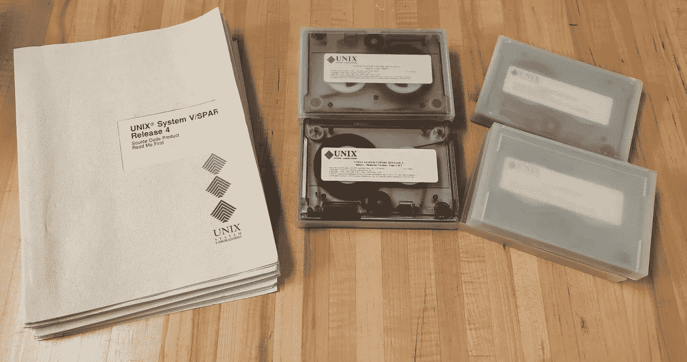
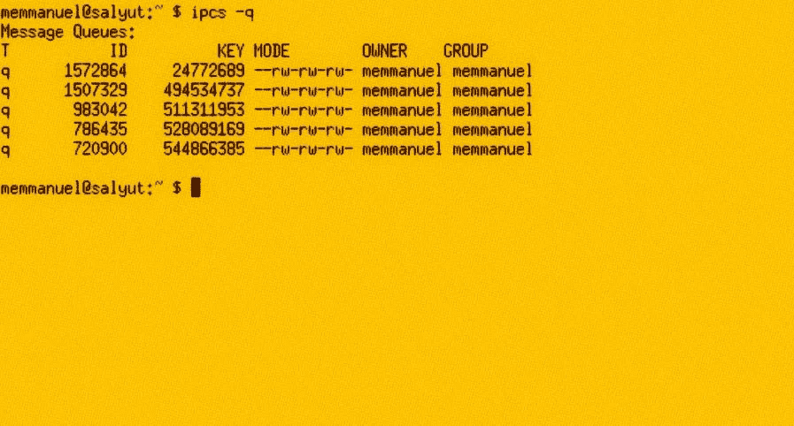
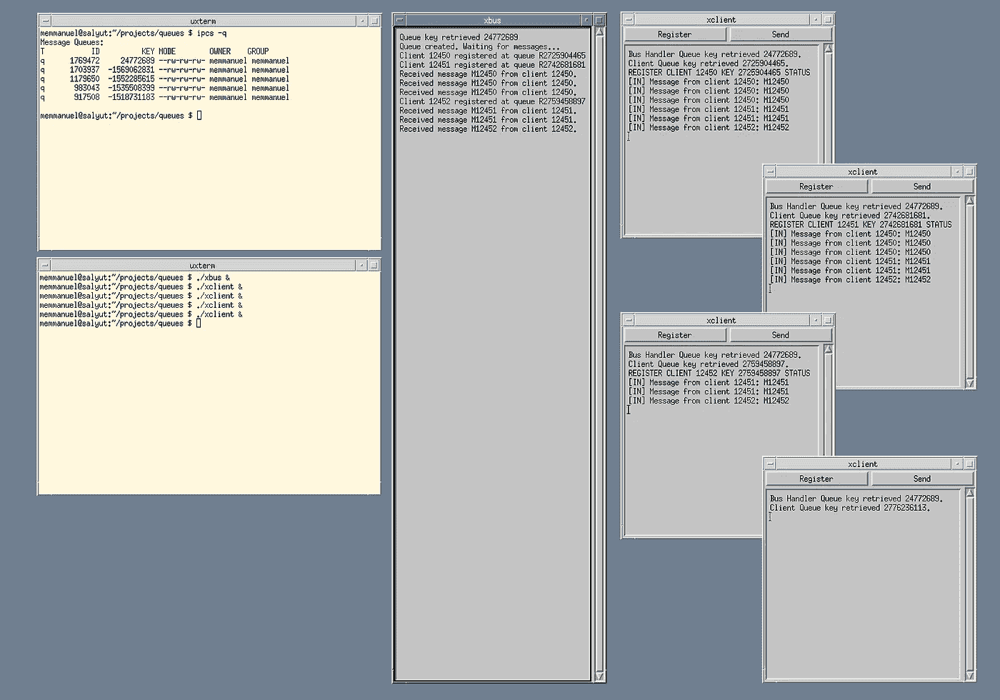

# 数据 UI 的消息队列

> 原文：<https://towardsdatascience.com/message-queues-for-data-ui-2d31029ea2?source=collection_archive---------34----------------------->

## IPC 简化大中型应用程序开发

IPC 队列从 UNIX SysV 开始就已经存在了。照片由 Ioannis Nompelis 提供。

## 介绍

数据科学可视化通常倾向于显示单独的图表和图形。因此，有大量的材料涵盖了图形库和生成图表的框架。

大多数高级图表和绘图库允许与数据进行交互，但通常这种交互仅限于 web，并涵盖单个图表。

有时，数据需要具有可操作性。在我工作的行业中，一个典型的例子是交易软件，其中多个图表显示关于给定金融工具或资产的信息，交易者或分析师需要与数据进行交互。通常，与一个图表的交互需要生成事件并暗示其他图表的变化，例如添加标记或开仓或平仓。这种情况可能会变得复杂，因为涉及到不同的特征、图表类型、时间范围、增强的数据处理系统和源数据源。

通常，在最初的开发阶段，常见且简单的策略是在不同的图形用户界面实例之间共享所有图表的引用，无论是其他图表还是设置面板。虽然这种方法很简单，并且可以在小项目中工作，但是它通常会以太多的实例被其他太多的实例引用而结束。当您开始忘记引用时，明智的做法是开始考虑一个更加分布式和松散耦合的架构，比如这里描述的通过消息进行同步的架构。

## 作为 IPC 机制的队列

我假设大多数人已经熟悉队列，因为它们在许多环境中被广泛使用；但是对于那些可能不知道队列是什么的人来说，它基本上是一个异步消息传递系统，其中一个系统、进程或应用程序线程可以与其他系统、进程或应用程序线程进行通信。

一个类似的例子是一个共享的邮箱，你可以随时随地发送信件。这些信件被存储在这个临时空间，即邮箱中，直到另一个进程以一种排序的方式选取这些信件。

通过遵循这种方法，您可以设法分离软件的不同区域，因为流程既可以生成事件，也可以对其他参与者的事件做出反应。

队列可以实现一对一、多对一或一对多的通信路径，它们也可以实现总线，这就是我在这里描述的情况。

## 实现总线的队列

在简单的队列中，一个进程传递消息，另一个进程使用消息，作为进一步的发展，我们可以使所有消息在一个总线中对所有进程可用，这样每个进程可以选择与其目的相关的消息。

当在用户界面的上下文中讨论总线时，我想到了两个参考::D 总线(在现代的 Linux/UNIX 系统中)和 ToolTalk(在传统的 UNIX 系统中)。这些可能是图形环境使用的最广为人知的总线框架，允许跨组件的通信。

另一种选择是消息队列系统的众多库和实现之一。其中一些面向集成完整的系统，而另一些旨在充当应用程序中不同模块的通信层。

虽然这些替代方案功能强大，具有许多特性和功能，但它们很可能被过度设计为只交流应用程序的某些部分。他们需要部署和管理服务，并提出了一个不太友好的学习曲线。

不太为人所知的是，UNIX 系统从 80 年代中期就提供了这样的消息队列作为内核服务:最初的 System V 队列和它的现代对应物 POSIX 队列；两种机制是等效的。

## 系统 V IPC

1984 年，美国电话电报公司发布了 UNIX System V，其中包括一套 IPC(进程间通信)机制。这些机制有三种:共享内存、信号量和消息队列。虽然它们现在可以被视为标准功能，但这些改进在当时是一个重要的里程碑。

SysV 队列在类 UNIX 系统中仍然可用。图片由作者准备。

正如已经提到的，现代的替代品是存在的，但是基本原理还是一样的。我决定尝试一下遗留的 System V UNIX 消息队列，并使用它们编写这个示例。大多数(如果不是全部的话)UNIX、类 UNIX 和 Linux 系统都支持它们。具体来说，FreeBSD 和 Linux 都支持它们，这是我主要使用的两个平台。

## 系统 V 消息队列

UNIX 队列由一个数字键标识，对队列的访问受标准 UNIX 权限的限制。因此，任何知道数字键并具有适当权限的进程都可以访问队列。

鉴于该机制的简单性，所需的代码非常简单。您通过`msgget`获得一个处理程序，以便稍后使用`msgsnd`和`msgrcv`函数发送和接收消息。额外的`msgctl`可用于进一步控制队列的参数和状态。

为了实现总线，使用应用程序范围的已知队列创建一个中央进程，该队列从所有客户端接收寄存器和消息，以便稍后将消息分发到所有客户端。因此，总线是分发接收到的消息的消息接收中心。订阅不同类型消息的替代方案也是可用的。

这些模式可以在具有更复杂和精密的队列实现的大型 web 应用程序中找到，但是 UNIX 队列的吸引力在于它们的简单性，并且它们已经可以使用了。因此，该模式可以很容易地应用于单个应用程序。

缺点是，它们只对小消息和可能的轻负载有效(虽然我没有执行任何性能测试)，但是在用于用户交互的模块之间的用户界面通信的上下文中，它们就足够了。

## 带有队列的 X11 示例

我提供了一个基本总线系统的源代码，该系统通过一个中心集线器将消息分发给所有客户机。

使用经典 UNIX 系统工具(Motif 和 SysV 队列)的模式实现示例。图片由作者准备。

如图所示，客户端向总线管理器注册，之后消息可以被传送到那些已经注册的客户端。在我们的示例中，第四个客户端没有注册，因此没有接收到任何消息。实用程序命令 ipcs 允许检查系统中的现有队列。

## 源代码

下面的代码实现了总线驱动程序事件。实现总线的进程监听客户端连接，注册这些客户端的队列键，并将接收到的消息分派给所有参与者，从而实现简化的总线。关键在于，当每个客户机注册时，它向总线管理器提供它的队列信息，这样它就可以从其他客户机向它们发回消息。

该代码应包括被认为是完整的其他特征:允许总线清除不再活动的队列的保持活动消息，可以连接的客户端数量的更好管理，在程序退出时终止的队列，以及避免客户端注册两次的检查。为了简单起见，代码没有这些特性。如果需要，它们很容易合并。

它所包含的示例是 X11 代码，用于说明队列如何通过 POSIX 线程与 X11 用户界面分离，因为这是应用程序上下文中的常见场景，通常在 Internet 上的示例中找不到。

这个例子是用 ANSI C 和 Xt/Motif 编写的，这可以被认为是一个遗留的技术栈，但是使用任何其他更新的技术，这个设计模式同样有效。

完整的代码库可以在[这里](https://github.com/marioemmanuel/messagequeues.git)找到。

bus.c 实现

client.c 实现