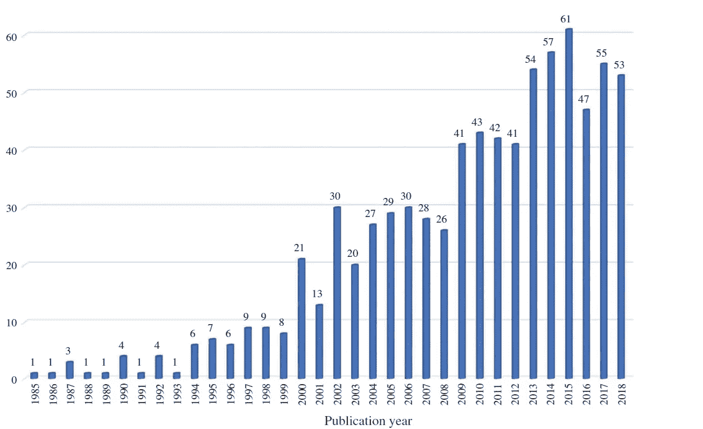
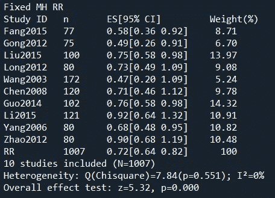
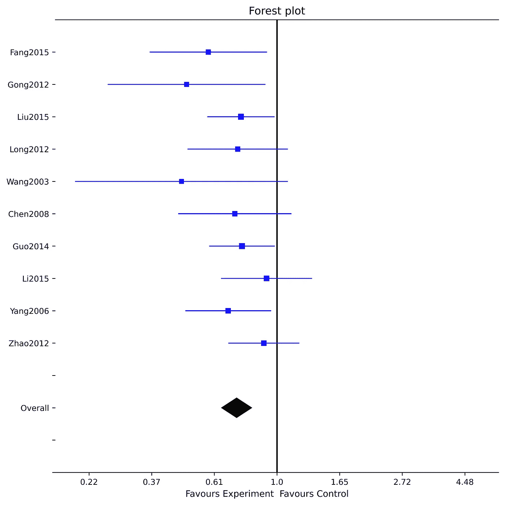

# Python 中的元分析:PythonMeta、PyMARE 和 NiMARE 简介

> 原文：<https://towardsdatascience.com/meta-analysis-in-python-introduction-to-pythonmeta-pymare-and-nimare-e6efd7bdbe87?source=collection_archive---------11----------------------->

## Python 中三个主要元分析库的介绍

在 [Unsplash](https://unsplash.com?utm_source=medium&utm_medium=referral) 上由 [Cameron Cress](https://unsplash.com/@cam_cress?utm_source=medium&utm_medium=referral) 拍照

M eta 分析是一种研究综合的定量方法，最初被开发用于评估医学研究的结果。在医学中，元分析经常用于得出关于医学实例对各种疾病的治疗效果及其副作用强度的结论。其背后的主要思想是，研究人员收集所有相关的研究，并使用元分析对其进行评估。每篇文章中的结果可能大不相同。因此，做一个荟萃分析对了解真实效果是什么非常有用。

1990 年，元分析开始扩展到经济学和其他社会科学，在那里它发现了许多用例。这里的一些例子包括评估自然资源对经济增长的影响，学费对大学入学率的影响，日光节约对能源消耗的影响等。元分析的复兴出现在 2010 年代，当时它成为了实证经济学的传统方法。

注:论文标题中带有“荟萃分析”或“元回归分析”的 EconLit 注册作品数量。资料来源:岩崎一郎(2020)。新兴市场和经济体的元分析:特刊介绍。新兴市场金融和贸易，56(1)。

统计元分析方法是在大多数标准软件包中实现的。r 包含了大量的库，提供了各种各样的估计、绘图和统计测试。他们精疲力尽的概述是[这里](https://cran.r-project.org/web/views/MetaAnalysis.html)。大多数经济学家使用 STATA，这是元分析中学术经济研究事实上的主流工具。[本页](https://www.stata.com/features/meta-analysis/)展示了 STATA 为研究人员提供的可能性。

由于许多数据科学社区都使用 Python，所以我将介绍三个主要的专门用于执行元分析的 Python 库:PythonMeta、PyMARE 和 NiMARE。

# PythonMeta

PythonMeta 提供了用于效果测量、异质性测试和绘图(森林图、漏斗图等)的基本模型。).它只包括广泛使用的方法，缺乏许多更高级的功能(如多变量元分析，这是 [STATA 17](https://www.stata.com/new-in-stata/multivariate-meta-analysis/) 中的新功能)。在[包站点上描述了 PythonMeta 中的所有元素。](https://pypi.org/project/PythonMeta/)

我将展示一个森林图的实现，用于显示我的样本和一些主要测试中的研究结果。经过一些修改，您可以在其他数据集上使用该代码。

首先，让我们导入 PythonMeta。

接下来，该函数计算每个研究的效果、总体效果的权重、置信区间、所有研究的总体效果以及异质性检验。

该函数加载内置的 PythonMeta 类，从字典中获取数据、模型和算法设置，并绘制结果和森林图。

这是 Python 的输出:

调用*主*函数产生了这个森林图:

来源:使用[样本数据](https://pypi.org/project/PythonMeta/#files)的 PythonMeta。

# **皮马雷**

这个库明确关注元回归。这是一种通过对一组虚拟变量进行回归来探索数据异质性的技术，这些虚拟变量捕捉了样本中研究的各种特征(发表年份、经验方法、区域焦点等)。)

我想避免代码和文档的复制和粘贴。GitHub 网站上对一切都有很好的解释，所以请在这里查看。

# ***尼玛雷***

NiMARE 是 Python 中最令人兴奋的元分析实现。这是一个由图书馆、方法和工具组成的生态系统，用于进行集中于神经影像文献的荟萃分析。要探索它们，请前往[主站点。](https://nimare.readthedocs.io/en/latest/about.html)

例如，它包含:

*   超过 14，000 篇神经影像论文的数据库
*   神经影像学研究的坐标和地图库
*   为预测性荟萃分析构建的库和坐标数据库
*   图像数据库。

NiMARE 的一大局限是它专注于大脑和神经科学的元分析。研究人员和数据科学家应该意识到，它在这个领域之外的应用可能会导致一些问题。

# 结论

尽管 Python 目前还不是可以用于元分析中所有任务的主流程序，但是这些 Python 包可以很好地服务于较小的项目，并且非常容易实现。STATA 或 R 包含了更多开发的包，但是如果你很了解 Python，购买 STATA 的预算有限，或者 R 语法看起来太复杂，这三个库都适合你。

*PS:你可以订阅我的* [*邮箱列表*](https://medium.com/subscribe/@petrkorab) *每次我写新文章都会收到通知。如果你还不是中等会员，你可以在这里加入*<https://medium.com/@petrkorab/membership>**。**