# 元政策梯度:一个综述

> 原文：<https://towardsdatascience.com/meta-policy-gradients-a-survey-78dc742d395d?source=collection_archive---------31----------------------->

## [理解大数据](https://towardsdatascience.com/tagged/making-sense-of-big-data)

## 自动化超参数调整和 RL 目标发现

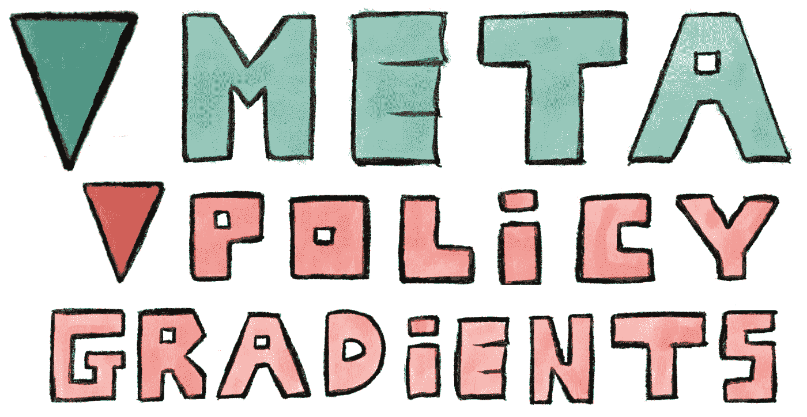

大多数学习曲线趋于平稳。在初步吸收了统计规律之后，系统饱和了，我们达到了手工制作的学习规则和归纳偏差的极限。在最坏的情况下，我们开始过度适应。但是，如果学习系统能够批评自己的学习行为，那会怎么样呢？以一种完全自我参照的方式。学会学习…如何学习如何学习。内省和对先前学习经验的递归引导——这是智力的关键吗？如果这听起来对你来说很熟悉，你可能已经有幸听过[的于尔根·施密德胡伯](http://people.idsia.ch/~juergen/)。

> 每一个真正自我参照的进化系统都应该加速它的进化。— [施密德胡伯(1987 年，第 45 页)](http://people.idsia.ch/~juergen/diploma1987ocr.pdf)

早在 90 年代，这些想法是有远见的——但非常不切实际。但是随着可扩展的自动分化工具箱的出现，我们正在向元-元-学习系统靠近。在这篇文章中，我们回顾了一组新颖的强化学习(RL)算法，这些算法允许我们自动化许多“手动”RL 设计工作。它们被称为元策略梯度(MPG ),可以通过高阶梯度调整 RL 管道中几乎所有可区分的成分。

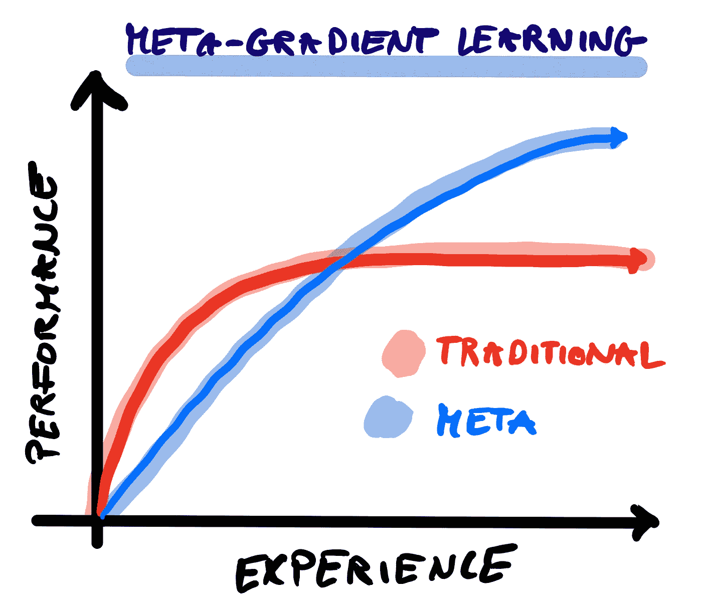

迭代学习改进的元范式。灵感来自大卫·西尔弗的 ICML 2020 研讨会。

# 解开元算法& RL 代理➰

“元学习”或“学会学习”旨在通过将整个学习过程分解为两个阶段来自动发现学习算法:智能体“生命周期”的内环展开和经验的外环内省。这种一般的两阶段范式可以有许多不同的风格，这里仅列举几种:

*   在任务分配上训练具有内部存储器的基于 RNN 的代理(例如 R1； [Hochreiter 等人，2001](http://snowedin.net/tmp/Hochreiter2001.pdf)；[段等，2016](https://arxiv.org/pdf/1611.02779)；[王等，2016](https://arxiv.org/pdf/1611.05763.pdf) 。
*   在任务分配上训练外部记忆增强代理(例如，MANN[桑托罗等人，2016](http://proceedings.mlr.press/v48/santoro16.pdf)；[里特等人，2018](https://arxiv.org/pdf/1805.09692)；[格雷夫斯等人，2016 年](https://ora.ox.ac.uk/objects/uuid:dd8473bd-2d70-424d-881b-86d9c9c66b51/download_file?file_format=pdf&safe_filename=outline.pdf&type_of_work=Journal+article)。
*   训练一个 RNN 来增强智能体内循环中基于梯度的优化更新(例如 [Andrychowicz 等人，2016](http://papers.nips.cc/paper/6461-learning-to-learn-by-gradient-descent-by-gradient-descent.pdf)；[梅斯等人，2019](http://proceedings.mlr.press/v97/metz19a/metz19a.pdf)；[梅斯等人，2020 年](https://arxiv.org/pdf/2009.11243)。
*   对代理的初始权重进行元优化，以便在几个梯度下降步骤(例如 MAML；[芬恩等人，2017](https://arxiv.org/pdf/1703.03400)；[尼科尔等人，2018](https://pdfs.semanticscholar.org/672c/586880655dc544474280a6e086c1fc901c85.pdf)； [Flennerhag 等人，2019](https://arxiv.org/pdf/1909.00025) 。

但是大多数传统的元学习算法很难将元学习算法与代理本身分开。元学习算法很难解释，并且其元测试泛化能力有限。例如，在 RL 中，递归权重动态通过调整有效策略来编码学习算法。在 MAML 中，元学习初始化与代理的网络架构固有地纠缠在一起。另一方面，元策略梯度方法旨在通过优化元级别来为较低级别提供目标，从而最大化后续学习进度，从而克服这些限制**。**这可以从单独优化单个参数到学习黑盒神经网络参数化的内环目标。但是外环目标是什么？最常见的选择是强化学习问题本身，我们使用由强化估计器产生的伪梯度([威廉姆斯，1992](https://link.springer.com/content/pdf/10.1007/BF00992696.pdf) )。因此，命名为*元策略梯度*。接下来跟随[徐等(2018)](https://papers.nips.cc/paper/7507-meta-gradient-reinforcement-learning.pdf) 介绍所需的数学背景。

# 背景:二阶政策梯度∇

让我们假设我们想要训练一个由θ参数化的代理(例如，一个策略/价值网络)。标准的学习循环(如图 1 所示)将重复执行 3 个步骤:

1.  通过在代理的网络中执行正向传递来收集环境中的轨迹𝜏。
2.  评估 RL 目标 L，例如均方 Bellman 误差或具有熵正则化、基线校正等的策略梯度目标。
3.  计算梯度估计值以最小化损失，并使用更新函数 f(例如，您最喜欢的梯度下降变量)更新网络参数θ→θ’。

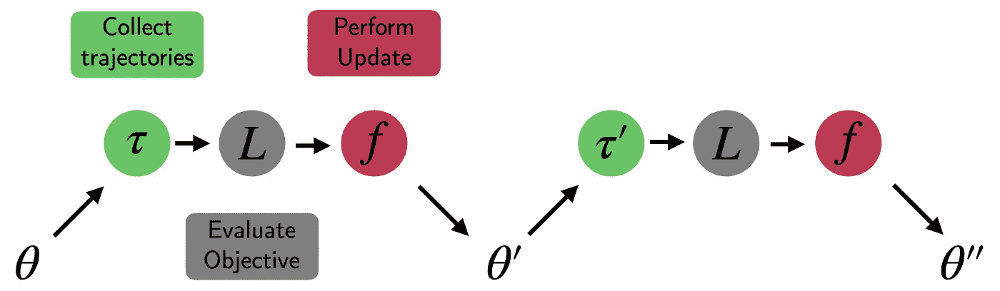

*图 1:RL 中传统的一阶参数更新:收集、评估、更新。*

现在让我们假设我们的更新函数明确地依赖于一组元参数η(例如折扣因子γ):

重要的是，假设更新函数相对于 η **是可微的。**然后我们可以问以下问题:更新后的性能如何依赖于用于执行更新的元参数？给定代理的当前状态，我们应该如何为下一次更新选择η？为了回答这个问题，我们需要一个元目标来评价一个候选人η？一种方法是使用从更新后策略收集的另一个拒绝轨迹𝜏'，由( [Sutton，1992](http://www.incompleteideas.net/papers/sutton-92a.pdf) )执行**在线交叉验证**。为简单起见，我们可以假设元目标 l(我们用它来评估𝜏'上的η)与内环目标 l 相同(例如，某个加强变量)。因此，我们想要估计元梯度:

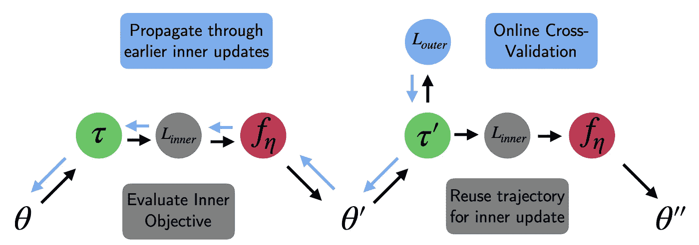

*图 2:基于在线交叉验证的元策略梯度更新。*

使用链式法则，我们可以重写更新参数θ’相对于η的导数:

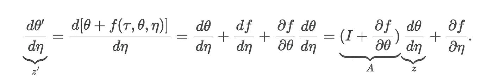

更新参数对η的依赖性归结为一个动力系统:

当我们展开网络时，可以在线累积这个加法序列的参数和相应的雅可比矩阵。这又为我们提供了执行外环梯度下降更新以改进超参数η的所有必要成分:

注意，我们只考虑了单次更新后元参数对性能的影响。考虑多个步骤在概念上很简单，但是数学要求我们通过时间反向传播来传播梯度。我们可以使用一组固定的 K 步骤和自动微分工具箱来进行梯度簿记。完整的元策略梯度过程可以归结为重复 3 个基本步骤(参见图 2):

1.  使用更新函数 f 和 l 基于𝜏更新θ。将得到的梯度累积到轨迹{z，z '，…}中。
2.  之后，使用元目标 l 交叉验证更新的代理在新的后续轨迹𝜏上的性能
3.  使用 SGD 根据元策略梯度∂ L/∂η更新元参数η。

有多种计算上的考虑:首先，**在线交叉验证并不意味着样品效率的降低**。我们可以简单地在下一个过程迭代的步骤 1 中重用它，而不是在元评估后丢弃𝜏'。第二，**更新 f 相对于元参数的导数计算起来很昂贵**。这是因为我们必须通过(多步)内循环优化过程来执行“展开”优化。存在一组启发式解决方案，其导致半/伪元策略梯度更新:

*   使用 df/dθ的廉价近似值。这可以是例如对角化的版本。
*   使用衰减因子，该指数忘记了早期更新的重要性。
*   完全截断序列，只考虑η对几个步骤的影响。

最后，MPG 的**记忆复杂度随着“元轨迹长度”K** 的增加而增加。选择小的 K 会引入截断偏差，而较大的 K 会遭受高方差。此外，计算元策略梯度所需的 z 轨迹可能很难适应内存(取决于θ和 K 的维数)。现在我们已经介绍了正式的 MPG 框架，让我们看看如何利用它。

# 用于在线深度 RL 超参数调谐的 MPGs💨

RL 问题假设了一个人工代理，该代理最大化其期望的贴现累积报酬。这个奖励是从一个**随机且未知的奖励函数**中抽取的。因此，在监督学习的情况下，不存在简单和明确的可微分目标。相反，我们必须想出一个代理目标，如均方差贝尔曼误差或政策梯度目标。这些目标都有自己的超参数，这些超参数通常很难调整，并且可能需要动态调度。 **MPG 方法承诺在学习过程的任何给定时间发现能够提供最佳可能代理的适应性目标**。在下一节中，我们将重点关注 MPG 设置如何使用演员-评论家(AC)目标来改善控制问题。我们涵盖了标准交流设置([徐等人，2018](https://papers.nips.cc/paper/7507-meta-gradient-reinforcement-learning.pdf) )以及 IMPALA 架构[(等人，2020)](https://roberttlange.github.io/posts/2020/12/meta-policy-gradients/#zahavy_2020) 。

## 徐等(2018)——元梯度强化学习

[Xu et al. (2018)](https://papers.nips.cc/paper/7507-meta-gradient-reinforcement-learning.pdf) 将 MPG 框架应用于整个基于价值的 RL 和政策梯度基线修正中使用的返回函数。元参数η = {γ，λ}控制 RL 中的偏差-方差权衡。我们在多大程度上依赖蒙特卡罗估计，在多大程度上依赖未来回报的自助估计？g 定义关键目标，基线修正强化项:

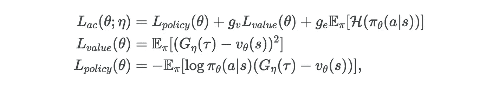

其中 g 重新调整了临界和熵损失项的有效学习速率。对于一组固定的超参数η，内环更新 f 归结为:

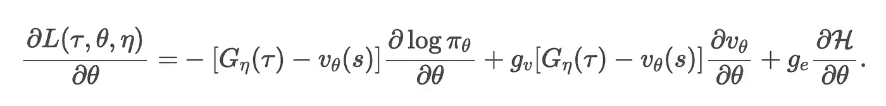

元策略梯度的下一个要素是更新操作相对于元参数η的导数:

最后，在线验证损失的导数 wrt。更新的参数由下式给出:

现在，我们可以将所有这些连接在一起，存储我们的轨迹并更新元参数γ，λ。太好了！但是还有一个基本的挑战:**我们的内环函数逼近器正在追踪一个移动的目标。如果目标的性质随着每次元参数更新而改变，我们如何学习值？以下是一些解决方案:**

*   调整学习率标度(外环/内环比率)或使用信赖域约束更新来确保优化过程本身在元参数中足够平滑。
*   [徐等(2018)](https://papers.nips.cc/paper/7507-meta-gradient-reinforcement-learning.pdf) 提出不仅学习单个元参数集的值函数&策略，而且学习所有η！实际上，这意味着我们提供元参数的嵌入作为价值/政策网络的输入(如在 UVFA 中； [Schaul 等人，2015 年](http://proceedings.mlr.press/v37/schaul15.pdf)。

在徐等人(2018) 的最初论文之后，这种方法被扩展到更多的超参数。以下是参考文献列表，将 mpg 应用于大量基本 RL 设计选择:

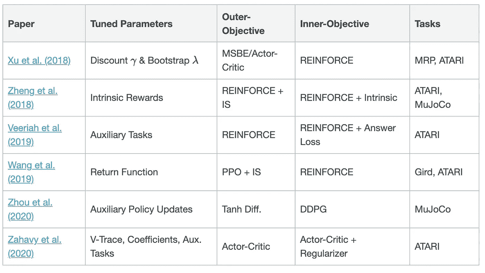

*表 1:超参数调整的 MPG 方法概述。*

## 萨哈维等人(2020)——一种自调整演员-评论家算法

虽然这些项目主要关注于调整小的超参数集，但最终我们希望自动调整整个 RL 管道。[萨哈维等人(2020)](https://arxiv.org/pdf/2002.12928) 通过优化 IMPALA ( [埃斯佩霍尔特等人，2018](https://arxiv.org/pdf/1802.01561) )架构的几乎所有超参数，向这个方向迈出了一大步。但这还不是全部:他们还调整了网络架构和目标，以最大限度地利用 mpg 的功能。但让我们先退后一步:IMPALA 是一个大规模的非策略演员-评论家算法，它使用**分布式演员-学习者框架**允许高数据吞吐量。许多工作人员异步收集轨迹，然后将轨迹发送给集中的学习者。这个学习者处理经验并执行梯度更新。有一个警告:轨迹很可能不是使用最近的策略收集的。因此，该算法并不完全符合策略，并且梯度(根据过时的策略展开估计)将变得“陈旧”。IMPALA 通过使用一种叫做 **v-trace** 的程序来校正这种协变量偏移。V-trace 通过修改的重要性采样(IS)比率来应对转换的非策略性质，该比率明确控制梯度估计量的方差和收缩速度:

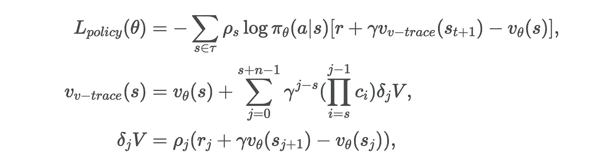

其中ρ通过充当折扣比例来控制目标价值函数的性质。另一方面，c 执行一种形式的轨迹切割(à la Retrace， [Munos 等人，2016](http://papers.nips.cc/paper/6538-safe-and-efficient-off-policy-reinforcement-learning.pdf) )。限幅阈值限制了重要性权重乘积的方差:

那么 mpg 在哪里发挥作用呢？STAC 算法[(萨哈维等人，2020)](https://arxiv.org/pdf/2002.12928) 然后旨在通过利用 V-trace 参数的凸组合版本来学习校正程度:

然后，元目标可以相对于α进行微分，并且可以在目标策略 **π** 的近似贝尔曼迭代的固定点和行为策略之间进行平滑插值。较低的α_c 使 IS 的权重更大，这反过来意味着收缩更大，但方差也更大。另一方面，大的α_c 强调 v-trace，这导致较小的收缩，但也导致较低的方差。为了稳定外环非平稳性的影响，[萨哈维等人(2020](https://arxiv.org/pdf/2002.12928) )修改了元目标并添加了一个类似于 TRPO 的 KL 正则化子:

为了确保内部和外部损耗幅度之间的适当缩放，作者建议对损耗系数进行 sigmoid-squash 和缩放。

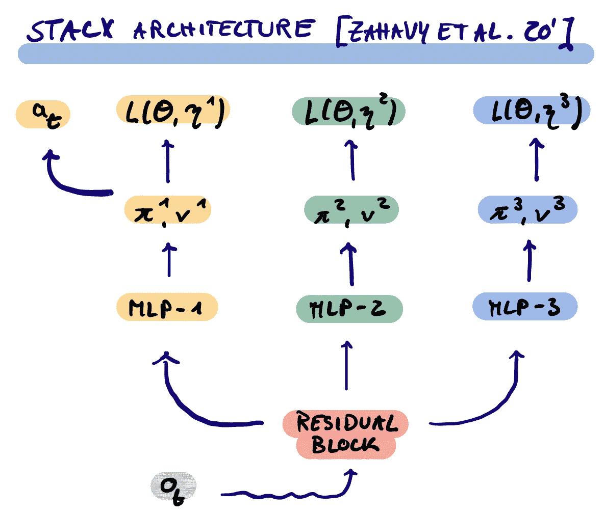

[萨哈维等人(2020)](https://arxiv.org/pdf/2002.12928) 的第二个创新是在共享躯干的顶部添加了一组辅助输出头，对应不同的策略和批评家参数化，它们有自己的元参数。然后，元控制器可以针对潜在的不同时间尺度来控制进入躯干的梯度流。只有第一个头部被用于生成训练轨迹，而其他头部充当隐式正则化器。该论文表明，在 ATARI 上，MPG 改进增加，我们用 MPG 设置优化的参数越多(图 3 中的面板 B)。

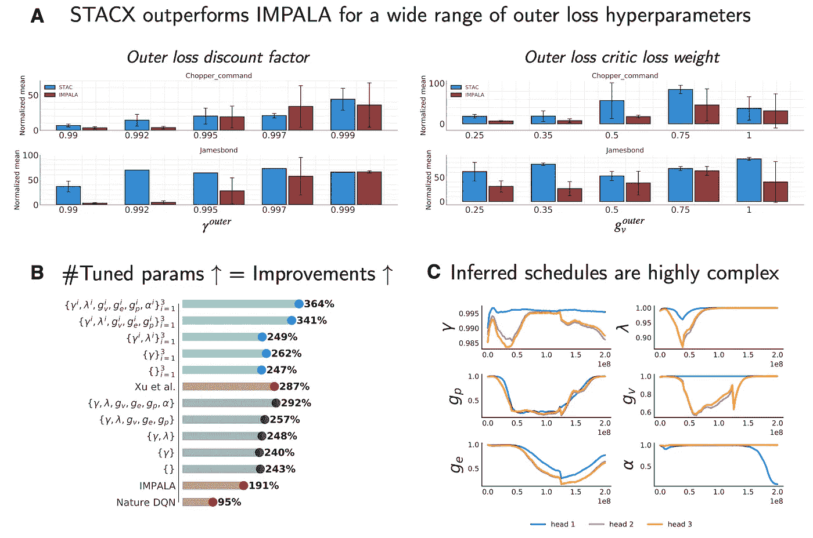

*图 3: STACX ATARI 关键结果。来源:改编自* [*萨哈维等(2020)*](https://arxiv.org/pdf/2002.12928)

根据经验，外环中的高折扣和价值损失系数似乎表现更好(图 3 中的面板 A)。最后，当检查詹姆斯·邦德雅达利游戏的在线优化元参数时间表时，我们可以看到三个头部之间的显著变化和训练过程中的强非线性动力学(图 3 中的面板 C)。

# 用于离线发现目标的 mpg📖

RL 问题本质上是被错误指定的。代理人的任务是最大化折扣奖励的预期金额，而无需访问基础奖励功能。为了克服这个基本问题，我们定义了代理目标。但是可以肯定的是，对于我们人类来说，目标函数在我们的一生中是变化的。潜在地使学习变得更容易。有没有可能完全抛弃理查德·贝尔曼的巧妙遗产，并学会预测什么来最好地解决 RL 问题？以下部分中介绍的思想扩展了 MPGs，不仅优化了特定的超参数，还对整个参数化代理目标函数进行了**元优化，其目的是为 RL 代理提供最佳的学习课程。第一组方法是**离线**并且跨大量训练内循环和不同 MDP 进行元学习。元学习参数化的损失函数 L_φ的优点在于，当改变任务分布时，可能更加鲁棒。优化问题的隐含特征允许超越元训练分布的一般化，并解决了核心的激励问题:从学习代理中解开学习的学习算法。**

## Houthooft 等人(2018 年)——演变的政策梯度(EPG)

计算高阶梯度是昂贵的，并且截断展开的优化具有在梯度估计中引入偏差的不期望的效果。为了克服这一技术困难， [Houthooft 等人(2018)](https://papers.nips.cc/paper/7785-evolved-policy-gradients.pdf) 提出使用**进化策略，利用元损失参数化群体进行梯度估计**。(潜在不可微的)函数 L 的梯度使用基于总体的蒙特卡罗估计器来近似，例如通过对偶采样:

其中ϵ是多元高斯变量。p 表示估计的群体大小，σ控制扰动方差，β有效地重新调整学习速率。可以并行收集单个功能/网络/代理评估。 [Houthooft 等人(2018)](https://papers.nips.cc/paper/7785-evolved-policy-gradients.pdf) 引入了元损失的参数化，它使用了代理人先前经验的时间卷积。它考虑了最近的历史(见图 4)。扩展的记忆有助于激励长时间范围内问题的结构化探索。

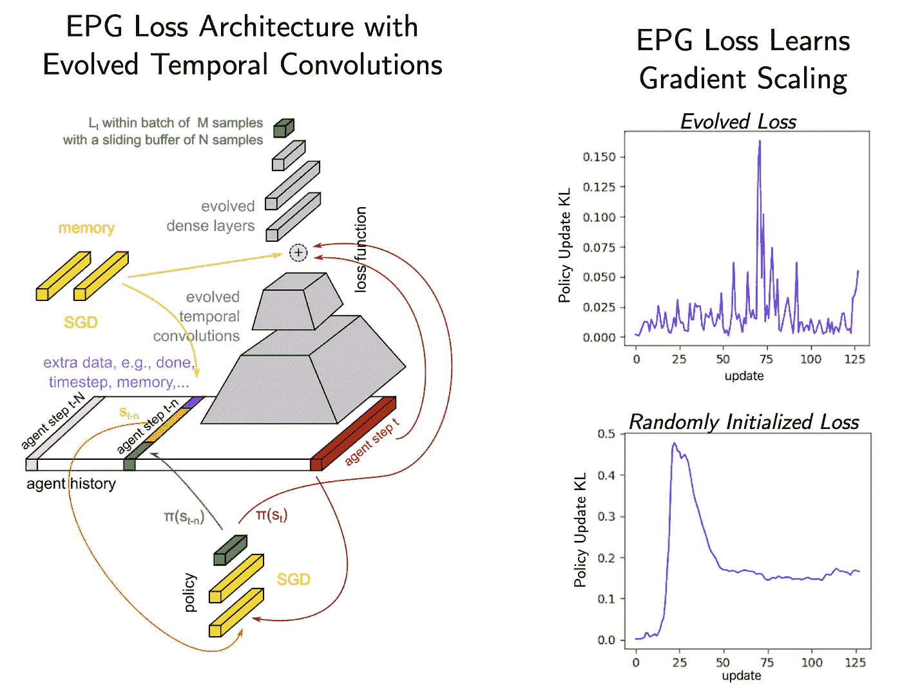

图 4: EPG 的建筑。来源:改编自 [*Houthooft 等人(2018)*](https://papers.nips.cc/paper/7785-evolved-policy-gradients.pdf)

此外，额外的输入可以允许 los 执行环境/任务识别，并将其目标追踪到特定的应用。此外，元丢失被输入一个 1 的向量，它可以作为一个显式的存储单元。在内环优化过程中，代理使用元损失，通过标准 SGD 来优化它们的策略网络参数。内环的总损耗由参数化损耗和标准 PPO 损耗的凸组合给出。一组 MuJoCo 实验揭示了 EPG 优于普通 PPO 目标，并且所得梯度相关但不同(相关性约为 0.5)。有趣的是，作者发现 EPG 损失学会了自适应梯度重标度，这让人想起 TRPO 和 PPO 中明确实施的政策更新平滑正则化思想(见图 4)。人们必须注意到，这是以元损失优化的进化外环的巨大成本为代价的。最后，作者表明，可以将该方法与学习的策略初始化(如 MAML)相结合，并且这种损失确实推广到更长的训练范围、不同的架构以及新的任务。

离线学习损失的一般思想后来由 [Chebotar 等人(2019)](https://amolchanov86.github.io/pdf/bechtle19icml.pdf) 扩展，他们使用基于梯度的元优化，并根据额外的任务和上下文信息明确限定元损失。有趣的是，作者表明，预处理有助于塑造损失景观，以提高内环优化的平滑度。

## Kirsch 等人(2020)——使用学习目标提高元强化学习的泛化能力

虽然之前的工作主要考虑了基于策略的 RL 代理， [Kirsch 等人(2020)](https://arxiv.org/pdf/1910.04098) 将元策略梯度扩展到非策略设置，这允许利用重放缓冲区。因为在“浅”非元 RL 中，这可以提高采样效率，因为多次重复使用过渡来构建梯度。从概念上讲，提议的 *MetaGenRL* 框架建立在非策略连续控制算法 DDPG ( [Lillicrap 等人，2015](https://arxiv.org/pdf/1509.02971.pdf?source=post_page---------------------------) )及其扩展 TD3( [Fujimoto 等人，2018](https://arxiv.org/pdf/1802.09477.pdf) )的基础上:

> *“我们的关键见解是，可微分的评论家 Q_* θ *: S x A* → R *可用于衡量基于相应政策梯度的质量局部改变目标函数参数* α *的效果。”—* [*基尔希等人(2020 年，第 3 页)*](https://arxiv.org/pdf/1910.04098)

那么这在算法层面上意味着什么呢？标准 DDPG 在最小化评论家 Q_θ的均方 Bellman 误差和使用价值函数 wrt 的确定性梯度的策略改进之间交替。政策参数。在 MetaGenRL 中，添加了一个额外的转换中间层:

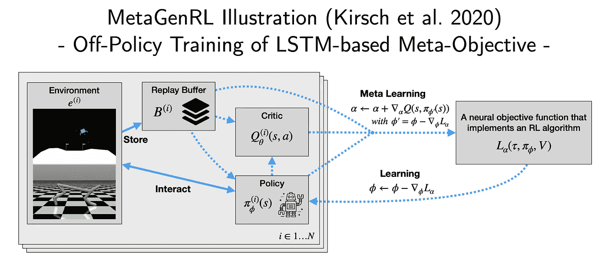

*图 5: MetaGenRL 图解。来源:改编自* [*基尔希等人(2020)*](https://arxiv.org/pdf/1910.04098)

批评家现在的任务是改进目标函数 L_α，然后用它来构建政策梯度。实际上，L 由一个小 LSTM 参数化，它以相反的顺序处理轨迹数据。这允许学习目标基于一集内的未来经历来评估特定的过渡，并模仿伪引导的形式。作者以 MuJoCo 和传统元学习(如 RL 和 EPG)为基准。他们发现 *MetaGenRL* 不仅样本效率更高，还允许推广到全新的环境。此外，他们执行了一组消融研究，表明元目标即使在没有时间戳输入的情况下也能很好地执行，但需要一个值估计输入来诱导学习进度。

## Oh 等人(2020)——发现强化学习算法

习得性政策梯度 [(LPG，Oh 等人，2020)](https://arxiv.org/pdf/2007.08794) 在几个方面扩展了 MetaGenRL。他们不依赖于批评家的概念，而是通过学习他们自己的表征来克服手工制作的语义，这些表征对于在一组代表性的马尔可夫决策过程中进行预测可能是重要的。它们不对代理的向量值预测施加任何意义。相反，元学习者决定必须预测什么，从而发现自己的更新规则。

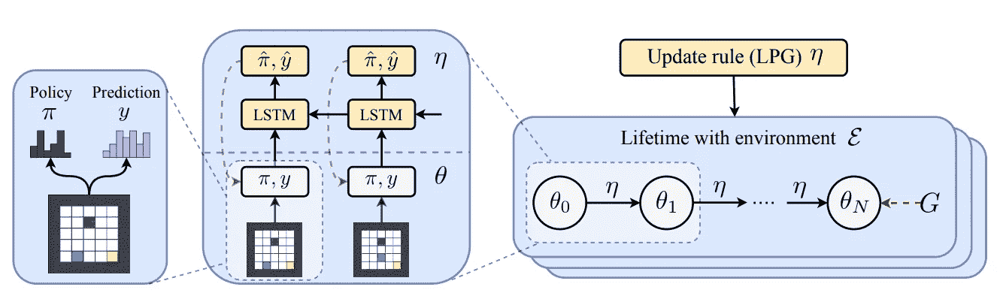

*图 6:习得性政策梯度示意图。来源:* [*Oh 等(2020)*](https://arxiv.org/pdf/2007.08794)

LPG 框架建议使用递归神经网络来发出内部循环优化目标(参见图 6)。 **π** -hat 表示政策调整目标，而 y-hat 表示与特定状态相关的分类分布的输出。同样，RNN 以相反的顺序处理一个情节，并且通过对由先前的目标参数化产生的内环梯度下降更新序列执行梯度下降来训练。**但与 MetaGenRL 不同，它不依赖于值函数的概念来进行引导。** y-hat 可以自由学习自己的语义。LPG 目标然后可以用于基于交叉熵和 KL 散度项的组合来构建内环更新:

内环中的 KL 损失项让人想起诸如 C51 ( [Bellemare 等人，2017](https://arxiv.org/pdf/1707.06887.pdf?source=post_page---------------------------) )的分布式 RL 中的思想，并且允许比期望值更详细的学习信号/信念估计。外环损耗类似于前面介绍的目标，但也包括一组额外的正则项，旨在确保整个优化过程 wrt 的稳定性。敬η。在图 7 面板 A 中，我们可以看到不同的维度如何对不同的价值相关估计进行编码，类似于经典的价值函数自举。

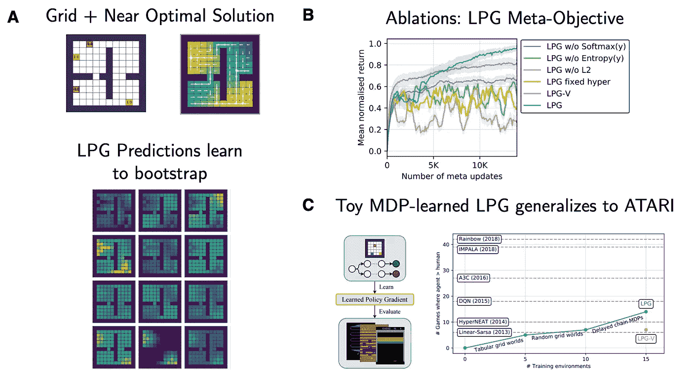

*图 7:习得性政策梯度关键结果。来源:改编自* [*Oh 等(2020)*](https://arxiv.org/pdf/2007.08794)

给我留下深刻印象的是图 7 面板 C 中描绘的结果:作者表明**在一组玩具 MDP(grid world 和 delayed chain MDPs)上学习提供目标的 RNN 是可能的，它几乎能够推广到 ATARI** 以及带有奖励剪辑和所有额外调料的手动调整的 DQN 目标。由于 MDP 的底层元训练分布编码了一组基本 RL 问题(例如，长期信用分配和传播状态知识的需要)，LPG 能够进行大量的分布外推广。此外，向元训练集添加更多类型的环境提高了 lpg 的测试性能。

# 用于在线发现目标的 mpg🔛

上一节回顾的论文涉及离线发现目标或参数表。但是，我们能不能让 mpg 发现潜在的甚至更好的支柱来在线和在单次优化运行期间解决 RL 问题？

## 徐等(2020)——在线发现目标的元梯度强化学习

[徐等(2020)](https://arxiv.org/pdf/2007.08433.pdf) 提出 FRODO 算法，与珠宝、妖精无关，代表网上发现的柔性强化目标。弗罗多的特别之处在于，天真的外在迷失和复杂的内在迷失之间的相互作用是在单个任务和单个代理人的一生中在线训练的。它不需要任何任务分配或重置环境的能力。目标只是随着主体经历世界而适应。有点像真正的终身学习！在离线情况下，η不再是低维的，即一个单一的超参数，而是一个参数化整个目标回波的神经网络 G(𝜏) = g_η(𝜏).

内环目标值不必编码至关重要的贝尔曼一致性，即当前状态值可以分解成奖励和折扣的下一个状态值。相反，这可能(也可能不会)被外部循环发现。你可能会想象，从非静态学习动力学的角度来看，在线培训整个网络可能更加棘手。你是对的。为了克服这一点( [Xu et al .，2020](https://arxiv.org/pdf/2007.08433.pdf) )提出在元级别上添加预测一致性正则化器:

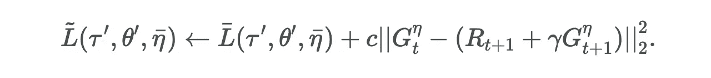

*图 8:佛罗多关键雅达利结果。来源:改编自* [*徐等(2020)*](https://arxiv.org/pdf/2007.08433.pdf)

作者在 ATARI 基准测试中验证了 FRODO，图 8 的面板 A 清楚地表明，FRODO 诱导的学习进度在整个学习过程中都有所提高(正如本文开头的漫画草图所示)。此外，消融研究为稠度损失的重要性提供了证据(图 8 的 B 图)。最后，C 图显示了不同 ATARI 游戏以及训练过程中学习目标的变化。对于一些游戏，FRODO 学习提供接近 v-trace 的目标回报(例如，对于像 Pong 和 Seaquest 这样的简单游戏)，而对于其他更具挑战性的游戏，学习的回报目标可能会有很大差异。

# 开放研究问题？

在这篇文章中，我们回顾了一组算法，这些算法使用高阶梯度来调整 RL 管道的大部分。这不仅实现了非常重要的训练计划，而且让系统决定在过程的不同阶段学习什么是重要的。这种层次化的优化范式能推进多远？以下是一组我个人的开放式问题:

*   我们如何改变架构和一般 RL 设置以达到“最佳可调”？像 STACX 那样增加额外的输出头只是一种方式，但可能还有其他方式。什么样的环境集合包含了所有相关学习问题的大部分方面？换句话说——什么是通用元训练分布？
*   Schmidhuber 的自我参照学习系统的愿景需要内省的概念，这超越了简单的基于梯度的学习。我们如何推动当前的元学习设置更接近理论上的最佳 AIXI 模型？
*   里奇·萨顿(Rich Sutton)写了一篇观点鲜明的博客[‘痛苦的教训’](http://www.incompleteideas.net/IncIdeas/BitterLesson.html)，认为机器学习领域最近的大部分突破仅仅是基于计算资源的急剧增加。MPG 属于同一个伞下，增加了研究的障碍。但是，我们如何进一步降低计算要求并提高采样效率呢？