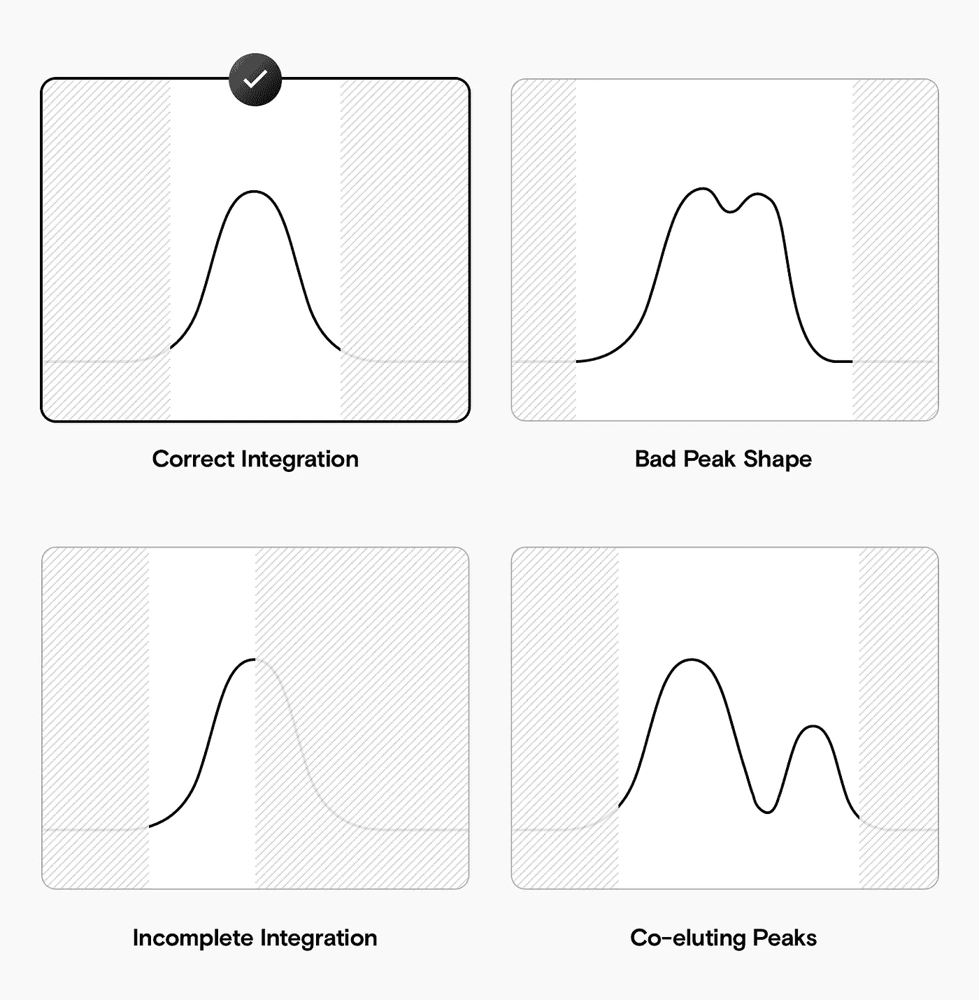
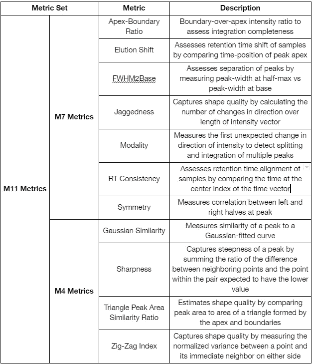
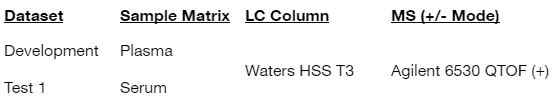
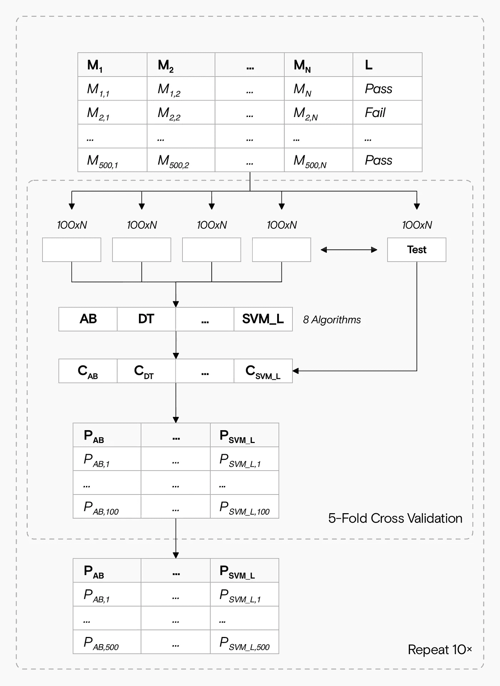
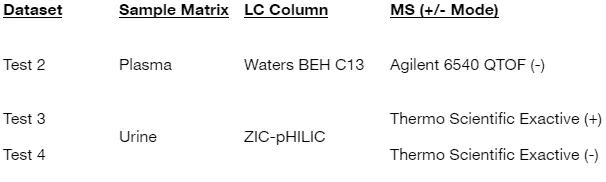
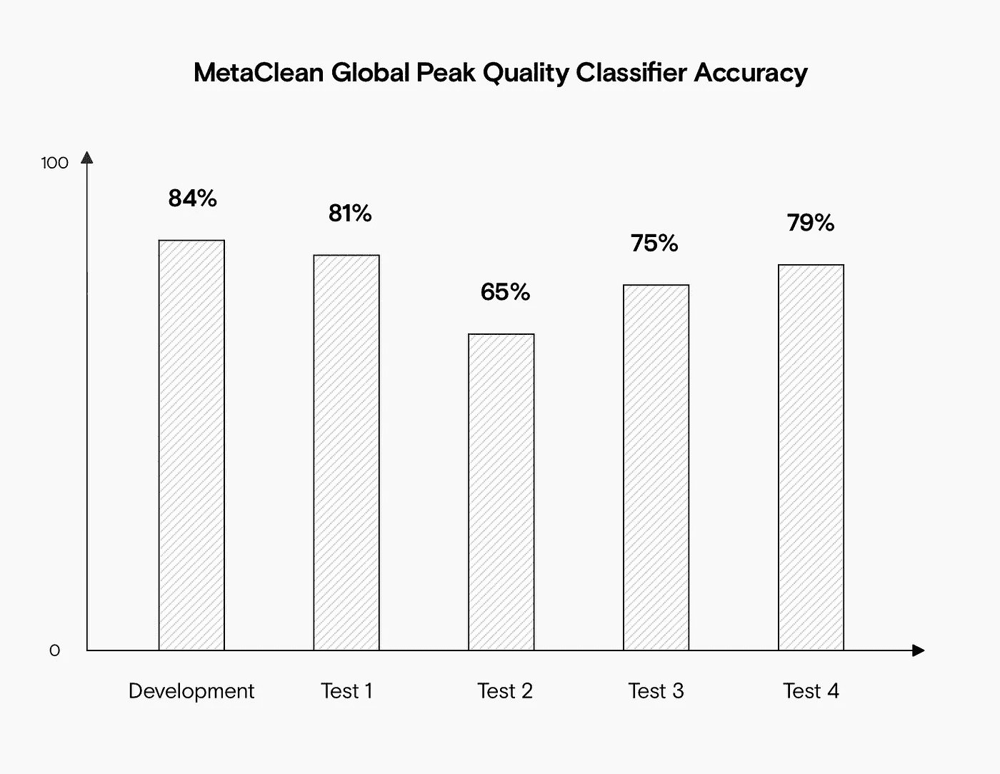
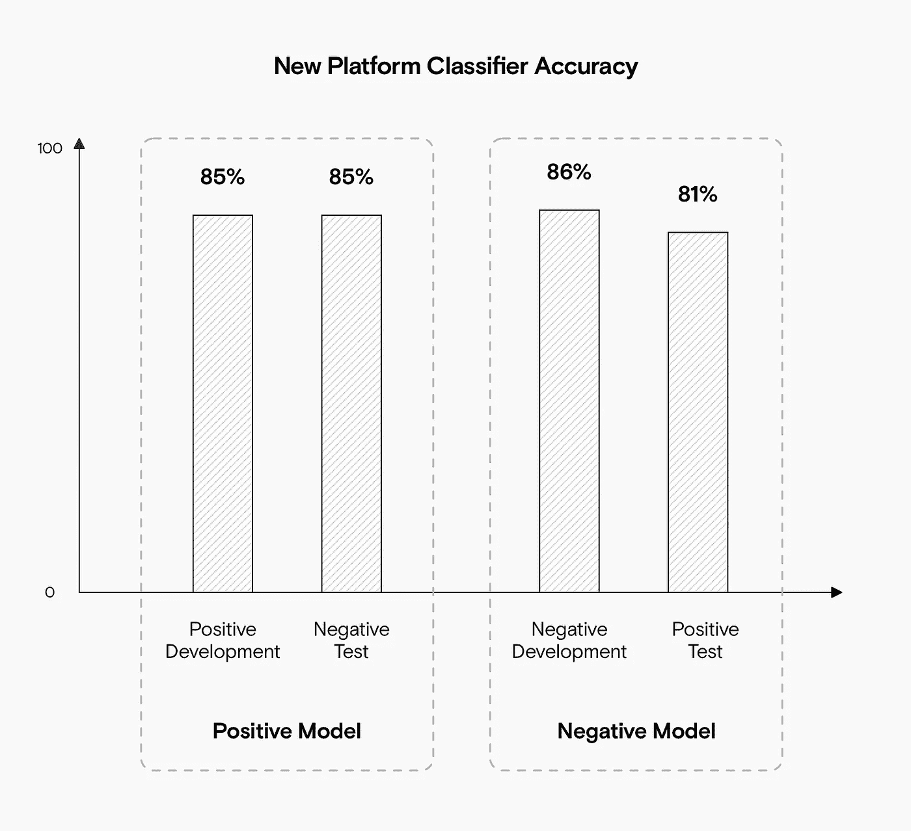

# MetaClean 自动化最高质量评估

> 原文：<https://towardsdatascience.com/metaclean-automates-peak-quality-assessments-3786f4c026b4?source=collection_archive---------14----------------------->

## 利用机器学习来检测低质量的集成，节省手动评估峰值的时间

来源:作者

即使是最好的代谢组学管道也有一定程度的差异，这可能导致样品之间的峰整合不佳。这降低了您准确定量代谢物的能力，通常意味着您必须手动检查每个(感兴趣的)峰的质量。

Kelsey Chetnik、Lauren Petrick 和 Gaurav Pandey 开发了一个新的框架和 R 包，称为 MetaClean。这结合了 11 个峰质量指标和 8 个机器学习算法，以自动检测集成较差的峰。

我们采访了 Petrick 和 Pandey 关于代谢组学的最新论文[，并了解了 MetaClean 的工作原理以及如何将其应用于您的数据。](https://link.springer.com/article/10.1007/s11306-020-01738-3)

# 当前的自动峰值积分是不可靠的

液相色谱-质谱联用(LC-MS)是代谢组学工作流程中鉴定和定量化合物的标准工具。在 LC-MS 中，相同化合物(代谢物)的保留时间和峰形会因测量而略有不同。轻微的波动是正常的，但是自动积分仍然会错误地表征峰，并使样品间的比较复杂化。

在许多情况下，通过标准后处理工具积分的**高达 30%** 的峰可能无法通过人工检查。低质量的峰可能是共洗脱分析物、错误校准或背景噪音的产物。因此，您不能期望任何两个样品具有完全相同的峰，即使它们的组成和浓度相匹配。但是为了比较浓度，您仍然需要对不同样品的峰进行精确积分。

LC-MS 常见的三个可能的集成问题示例。来源:作者

评估峰积分的一种方法是手动查看并判断峰形和包含区域。这不仅极其耗时；当你分析每批数千个峰时，这几乎是不可能的。因此，手动 QC 通常只针对一小部分数据，而且通常只针对感兴趣的峰。虽然这可能会从您的分析中消除假阳性，但它不能解决假阴性，并且集成不良的峰可能会漏掉。

# 机器学习可以自动进行峰值评估

个体质量度量可以量化个体峰值质量。然而，这些度量本身通常不足以完全区分低质量和高质量的集成。

机器学习模型可以找到复杂而有价值的指标组合，有助于这种区分。您所需要的只是描述峰值积分是高质量还是低质量(您的目标变量)的指标(您的特征)和标签。

有了这些特征和目标变量，您可以训练模型并评估它们对未知示例的峰值积分的预测程度。如果您发现模型非常准确，您可以轻松地将这些模型应用于数据集中的每个峰(包含数千个峰)。然后，您可以在分析数据之前过滤掉低质量的峰。

# MetaClean 特性:11 个峰值质量指标

Chetnik，Petrick 和 Pandey 探索了质量度量的组合是否可以更好地作为峰值质量分类器的有效特征集。该团队创建了 MetaClean 来生成这些分类器，并针对几个数据集评估它们的性能。

该团队使用了来自[张等人](http://doi.org/10.1186/1471-2105-15-S11-S5)(度量)的四个度量和来自 [Eshghi 等人](https://doi.org/10.1186/s1201%204-018-9209-x) (M7 度量)的七个度量，以及由所有度量组成的组合 M11 集合。这些指标用于量化样品之间的总体峰形和保留时间一致性。

来源:作者

# 元清理训练数据:500 个人工审查的峰值

该团队对 89 份血浆样本中的 500 个预处理过的峰进行了手工分类:**几乎 40%没有通过手工目测**。他们确保训练数据中有各种不同的峰形，因此模型将在一组有代表性的峰上进行训练。

来源:作者

# 元清洁模型:八种最大似然分类算法中的佼佼者

下一步是找到对峰值质量进行最佳分类的机器学习算法。MetaClean 评估了八种最常用的算法，每种算法都与 M4、M7 和 M11 指标配对，以开发 24 种不同的峰值质量分类器。每个分类器的性能通过五重交叉验证进行评估，重复十次，并对结果进行平均。为此，MetaClean 评估了:

*   决策树；
*   逻辑回归；
*   朴素贝叶斯；
*   神经网络；
*   线性核的 SVM；
*   AdaBoost
*   模型平均神经网络；
*   随机森林。

MetaClean 使用五重交叉验证评估了 24 个不同的潜在峰值分类器，这些分类器是从三个峰值质量度量集和八个机器学习算法的组合中构建的。来源:作者

在比较了每个模型的性能后，该团队观察到使用 M11 度量集的 AdaBoost 算法性能最佳。他们称这个模型为“全局峰值质量分类器”，它在开发数据集上的分类达到了几乎 85%的准确率。

然而，仅仅在同一批样本上测试该模型并不能提供该模型在真实情况下表现如何的准确描述。有效的模型还需要在跨批次和跨平台方面表现良好:

*   **跨批次**:来自不同批次的其他样品，在同一台机器上以相同的设置进行测量。
*   **跨平台**:在不同机器上测量样品，设置不同。

因此，研究小组评估了另外四个数据集的 500 个峰值进行测试。他们对 Global Peak Quality 分类器进行了评估:

*   来自相同仪器的不同数据集，用于测试相同平台的性能；
*   来自不同平台的三个数据集，用于测试跨平台性能。

# MetaClean 在分析来自同一平台的数据时表现出色

全局峰质量分类器评估了来自同一仪器的不同数据集(测试 1)。该分类器在几乎 81%的情况下准确地对峰进行了分类，即使该数据集来自不同的样本类型。

# MetaClean 在跨平台分析中表现相当好

该团队将 Global Peak Quality 分类器应用于四个可公开访问的数据集，每个数据集使用不同的 MS 仪器、LC 色谱柱和/或电离模式:

来源:作者

即使有这些平台和样品基质的可变性，分类器也能准确地对 65-80%的峰进行分类。然而，这些数据集的性能下降表明，跨平台分析仍然非常具有挑战性。

全局峰值质量分类器对所有测试集(包括来自不同平台和/或样本矩阵的测试集)实现了超过 65%的准确率。来源:作者

# 基于每个平台培训元清理

该团队使用来自不同于生成开发集的实验室的两个数据集(测试 3 和测试 4)作为独立案例，根据他们的数据重新训练和评估模型。他们用来自同一个平台的正面和负面模式数据训练了两个新模型，相互评估。他们表明，针对另一个数据集使用每个模型会产生很好的跨模式结果。每个模型都可以以特定于平台的方式进行优化，甚至可以应用于不同的电离模式。

当在每个平台的基础上训练时，在正模式数据上训练的模型相对于负模式数据表现得非常好，反之亦然。来源:作者

# MetaClean 与 RSD 过滤法的比较

随机分析误差可能难以解决，尤其是在复杂样品中。通常，它们是背景噪音或前一次运行的样品残留的产物，与当前问题无关。这些峰值通常变化很大，它们的积分也不一致。

发现这些误差的一种方法是通过相对标准偏差(RSD)过滤，其中混合样本被分析多次。丢弃随机峰，并评估共有峰的一致性。当峰面积的标准偏差超出临界值时，它们将被移除。

由于 MetaClean 的运行独立于 RSD 过滤，研究小组认为首先对数据进行 RSD 过滤可以达到双重目的:

*   将 MetaClean 的性能与已建立的方法进行比较；
*   通过结合 RSD 过滤提高 MetaClean 的性能。

该小组发现，MetaClean 在所有测试案例中的表现都优于 RSD 过滤法，比这种广泛使用的方法更能准确地对峰的质量进行分类。

虽然 RSD 在确保随机分析误差最小化方面做得很好，但 MetaClean 专注于消除可能通过 RSD 过滤的整合问题。由于 RSD 和 MetaClean 是数据质量过滤的互补方法，它们结合使用非常有效。

# 对您的数据使用元清理

在您的数据上训练一个元清理模型对您的工作流可能是有价值的。只需很少的前期时间投入，您就可以在实验室中快速分析所有运行的所有峰，并大大降低错误积分率，而无需花费数小时进行手动峰审查。

Kelsey、Lauren 和 Gaurav 提供了一个 open R 包，它根据八个 ML 和三个质量度量集来评估您的数据，以开发一个模型。您可以立即[下载软件包](https://cran.r-project.org/package=MetaClean)并训练您的模型来评估您的 LC-MS 集成。

请务必阅读发表在代谢组学上的 [MetaClean 文章，以了解关于该平台的更多信息。](https://link.springer.com/article/10.1007%2Fs11306-020-01738-3)