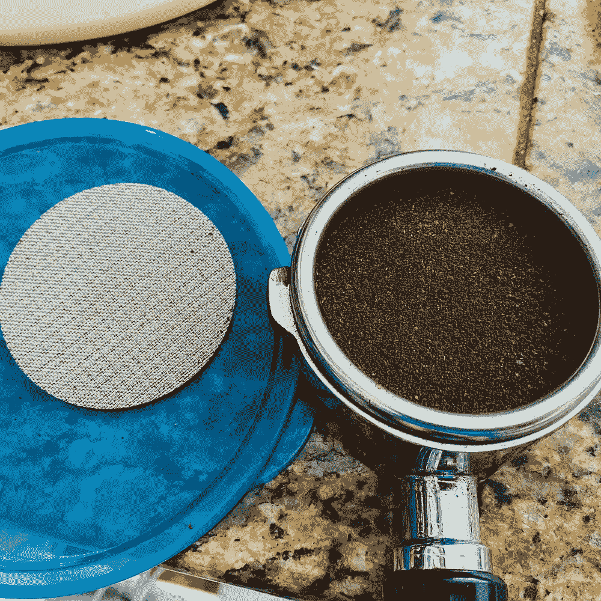
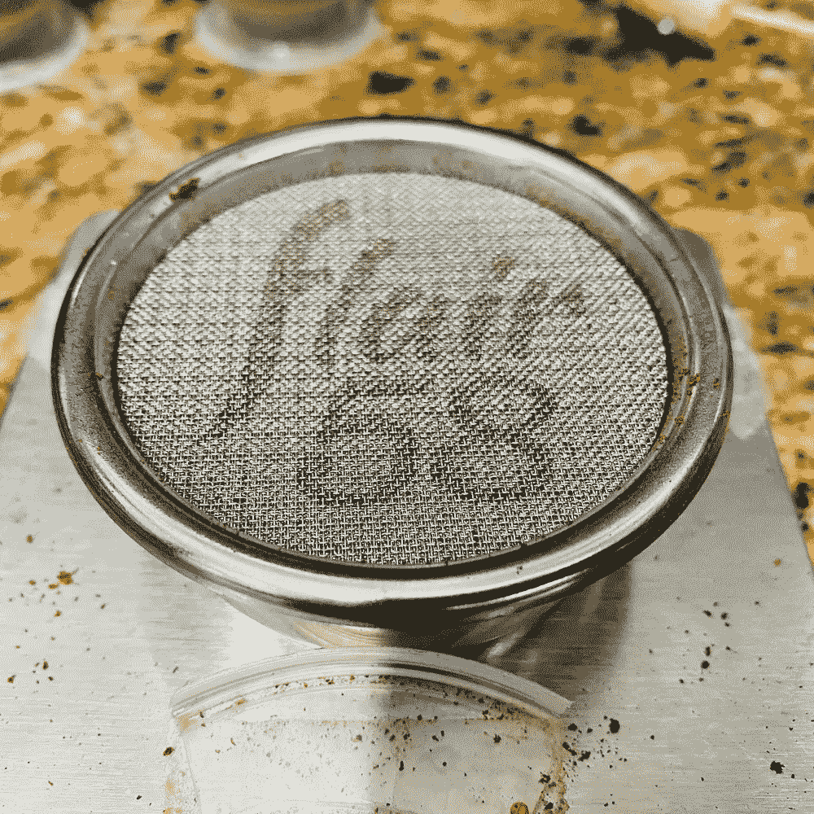
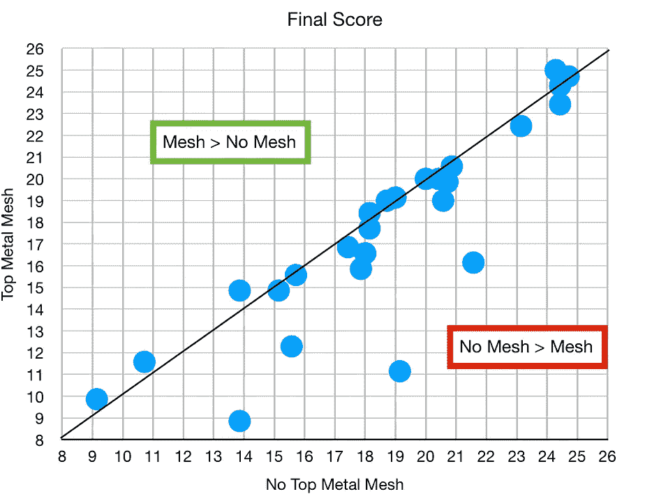
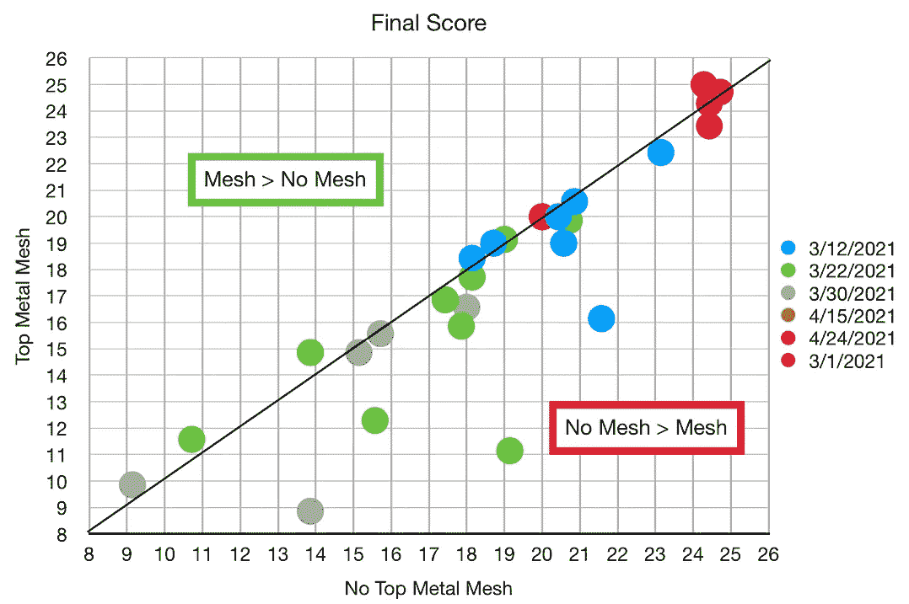
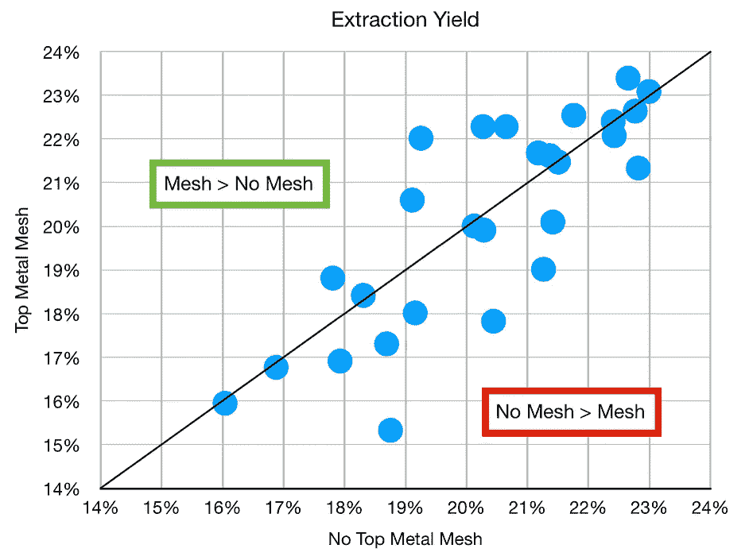
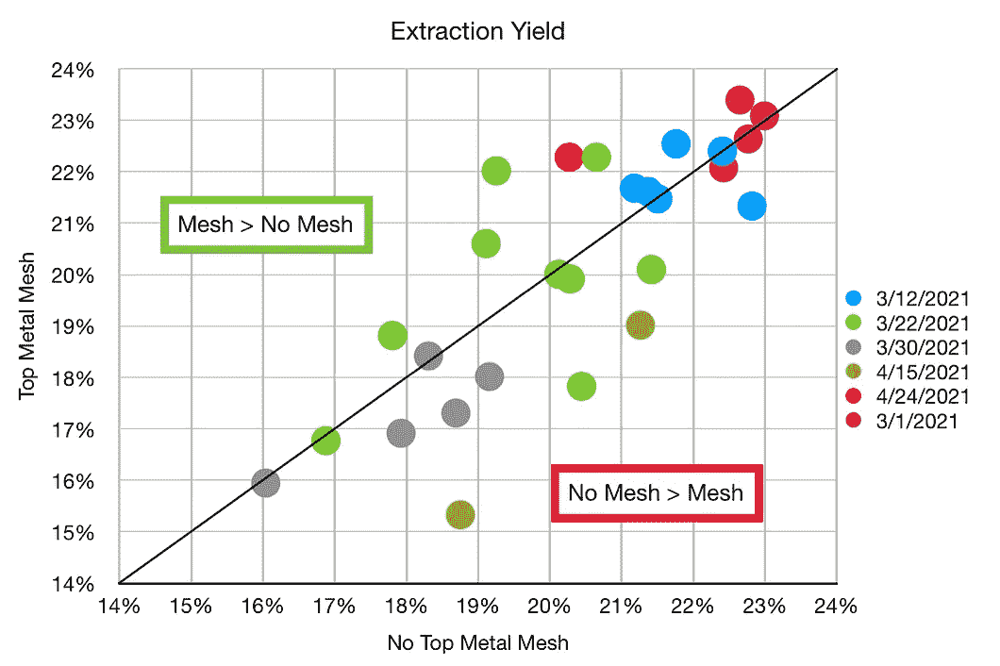
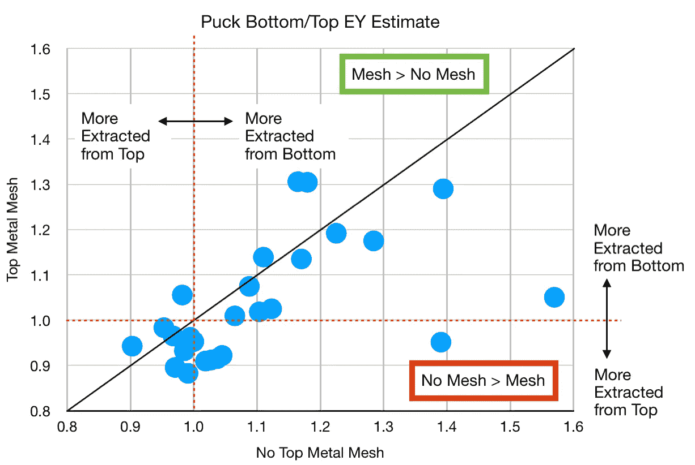
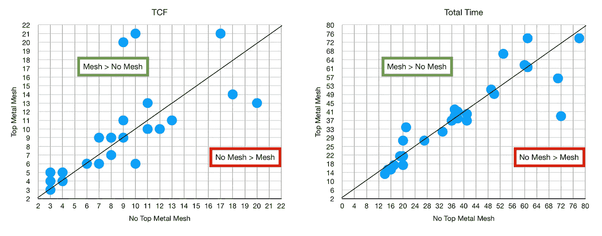
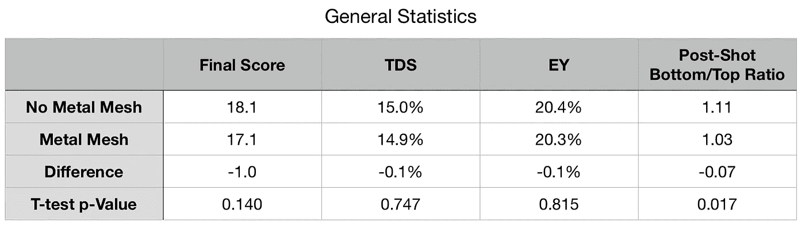

# 金属网和浓缩咖啡

> 原文：<https://towardsdatascience.com/metal-meshes-and-espresso-389d29c832c5?source=collection_archive---------26----------------------->

## 咖啡数据科学

## 使用顶部金属网检查

在过去的几年里，有一个想法是在浓缩咖啡过滤篮的顶部使用一个纸过滤器来提高流量。我没有发现一个改进，但这可能是由于顶部纸过滤器使杠杆机器更糟糕的通道。不过金属网滤网出来的时候我还在关注。

几年前，受纸质过滤器的启发，金属网过滤器上市了。据我所知，他们是从杠杆机器 La Pavoni 开始的。

所有图片由作者提供

大多数杠杆机器没有三通阀来释放注射后的压力。因此，在拍摄结束时，冰球中的水和咖啡可以通过淋浴屏幕向上流动。对我来说，这导致了一年几次拔出活塞进行更深入的清洁。金属网过滤器解决了这个问题，它迫使水在拍摄过程中更均匀地流出。

当 Flair 推出 Flair 58 时，他们为他们的新机器出售了这个[屏幕](https://flairespresso.com/product/flair-58-puck-screen/)，但他们也单独提供它。我有一个天赋签名，我喜欢控制淋浴屏幕相对于冰球的位置。这些金属筛网是由 [BPlus](https://www.bplus.biz/products/lower-shower-screen-contact-shower-screen-puck-screen) 制造的。

我想知道这如何影响拍摄，所以我做了一些顶部有和没有金属过滤器的配对拍摄。这个实验中一个令人困惑的变量是金属网很厚，它会对顶部空间(冰球顶部和淋浴屏幕之间的空间)产生影响。我不确定它的影响有多大，但保持顶部空间不变将会改变剂量或夯实。所以我觉得不容易分开。

对于照片，我正在拉[两双](/designing-the-double-double-sudo-staccato-espresso-shot-5c435c292672)，这是复杂的分层拍摄。然而，它们具有非常高的提取率。如果对拍摄有任何影响，我会看到的。我还在底部和中间使用了布过滤器。

# 镜头性能指标

我使用了两个指标来评估镜头之间的差异:[最终得分](https://link.medium.com/uzbzVt7Db7)和[咖啡萃取](https://link.medium.com/EhlakB9Db7)。

最终得分是 7 个指标(强烈、浓郁、糖浆、甜味、酸味、苦味和余味)记分卡的平均值。当然，这些分数是主观的，但它们符合我的口味，帮助我提高了我的拍摄水平。分数有一些变化。我的目标是保持每个指标的一致性，但有时粒度很难，会影响最终得分。

使用折射仪测量总溶解固体(TDS ),该数字用于确定提取到杯中的咖啡的百分比，并结合一杯咖啡的输出重量和咖啡的输入重量，称为提取率(EY)。

# 数据分析

首先，我们来看口味或者最终评分。我在散点图上比较了它们，如果它们落在 y=x 线上，那么就没有区别。有些结果似乎是异常值。我也用烤的方法把它们分开。

对于提取率(EY)，这一点更加不清楚。我不认为这些数据中的任何一个显示一个比另一个更好。

我也比较了 TDS 和 EY，但模式非常一致。

## 冰球后分析

一个有趣的现象是投篮后的冰球。过去几个月我一直在测量后期拍摄。因为我在圆盘中间使用了一个布过滤器，所以顶部和底部很容易分开。所以我在拍摄后的几分钟内称量了每一个。

从这个测量值和我的 EY 测量值，我可以估计每一半的 EY 贡献，并做出底部/顶部重量的比率或 EY 估计值。似乎有了金属网，冰球内部的工作方式发生了变化。

## 时间分析

以防万一，我检查了拍摄的时间。TCF 是时候覆盖过滤器，我发现它是一个非常有价值的衡量标准，以了解拍摄质量。然后是总时间。两者都没有显示出有趣的模式，但是我提供它只是为了以防有人想看。

## T-Test！

我对这些数据使用了双尾配对 T 检验，唯一具有统计显著性的差异(T 检验 p 值< 0.05)是拍摄后的底部/顶部比率。

从我看到的数据来看，冰球顶部的金属网滤网并不影响投篮的表现，无论是正面还是负面。然而，过滤器使清理更容易，减少了机器的维护，所以在我看来这是一个胜利。

如果你愿意，可以在 Twitter 和 YouTube 上关注我，我会在那里发布不同机器上的浓缩咖啡视频和浓缩咖啡相关的东西。你也可以在 [LinkedIn](https://www.linkedin.com/in/robert-mckeon-aloe-01581595?source=post_page---------------------------) 上找到我。也可以关注我[中](https://towardsdatascience.com/@rmckeon/follow)。

# [我的进一步阅读](https://rmckeon.medium.com/story-collection-splash-page-e15025710347):

[浓缩咖啡系列文章](https://rmckeon.medium.com/a-collection-of-espresso-articles-de8a3abf9917?postPublishedType=repub)

[工作和学校故事集](https://rmckeon.medium.com/a-collection-of-work-and-school-stories-6b7ca5a58318?source=your_stories_page-------------------------------------)

[个人故事和关注点](https://rmckeon.medium.com/personal-stories-and-concerns-51bd8b3e63e6?source=your_stories_page-------------------------------------)

[乐高故事启动页面](https://rmckeon.medium.com/lego-story-splash-page-b91ba4f56bc7?source=your_stories_page-------------------------------------)

[摄影启动页面](https://rmckeon.medium.com/photography-splash-page-fe93297abc06?source=your_stories_page-------------------------------------)

[使用图像处理测量咖啡研磨颗粒分布](https://link.medium.com/9Az9gAfWXdb)

[改善浓缩咖啡](https://rmckeon.medium.com/improving-espresso-splash-page-576c70e64d0d?source=your_stories_page-------------------------------------)

[断奏生活方式概述](https://rmckeon.medium.com/a-summary-of-the-staccato-lifestyle-dd1dc6d4b861?source=your_stories_page-------------------------------------)

[测量咖啡磨粒分布](https://rmckeon.medium.com/measuring-coffee-grind-distribution-d37a39ffc215?source=your_stories_page-------------------------------------)

[咖啡萃取](https://rmckeon.medium.com/coffee-extraction-splash-page-3e568df003ac?source=your_stories_page-------------------------------------)

[咖啡烘焙](https://rmckeon.medium.com/coffee-roasting-splash-page-780b0c3242ea?source=your_stories_page-------------------------------------)

[咖啡豆](https://rmckeon.medium.com/coffee-beans-splash-page-e52e1993274f?source=your_stories_page-------------------------------------)

[浓缩咖啡用纸质过滤器](https://rmckeon.medium.com/paper-filters-for-espresso-splash-page-f55fc553e98?source=your_stories_page-------------------------------------)

[浓缩咖啡篮及相关主题](https://rmckeon.medium.com/espresso-baskets-and-related-topics-splash-page-ff10f690a738?source=your_stories_page-------------------------------------)

[意式咖啡观点](https://rmckeon.medium.com/espresso-opinions-splash-page-5a89856d74da?source=your_stories_page-------------------------------------)

[透明 Portafilter 实验](https://rmckeon.medium.com/transparent-portafilter-experiments-splash-page-8fd3ae3a286d?source=your_stories_page-------------------------------------)

[杠杆机维护](https://rmckeon.medium.com/lever-machine-maintenance-splash-page-72c1e3102ff?source=your_stories_page-------------------------------------)

[咖啡评论和想法](https://rmckeon.medium.com/coffee-reviews-and-thoughts-splash-page-ca6840eb04f7?source=your_stories_page-------------------------------------)

[咖啡实验](https://rmckeon.medium.com/coffee-experiments-splash-page-671a77ba4d42?source=your_stories_page-------------------------------------)