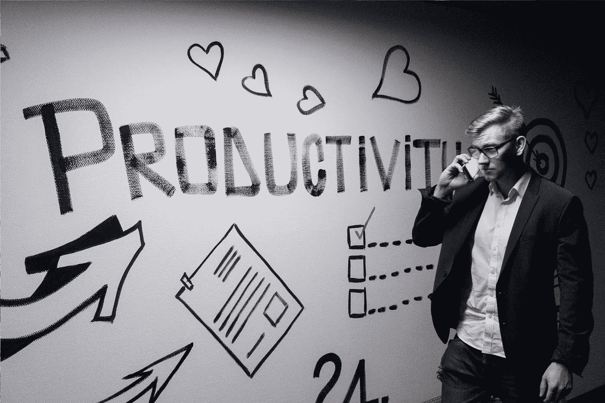
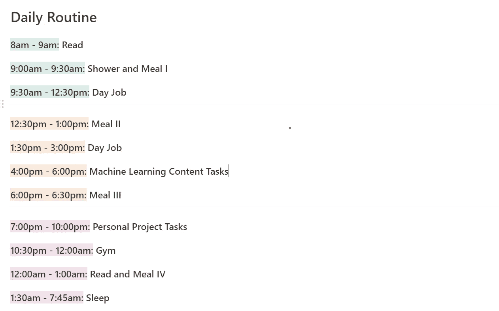
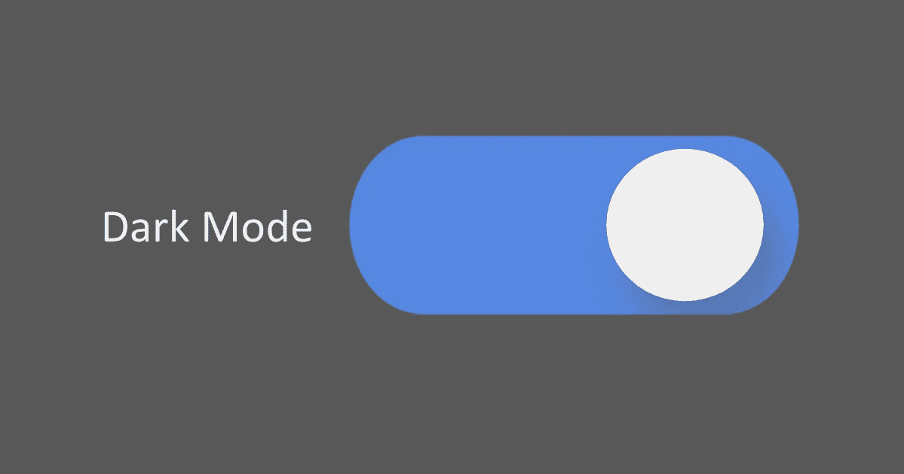
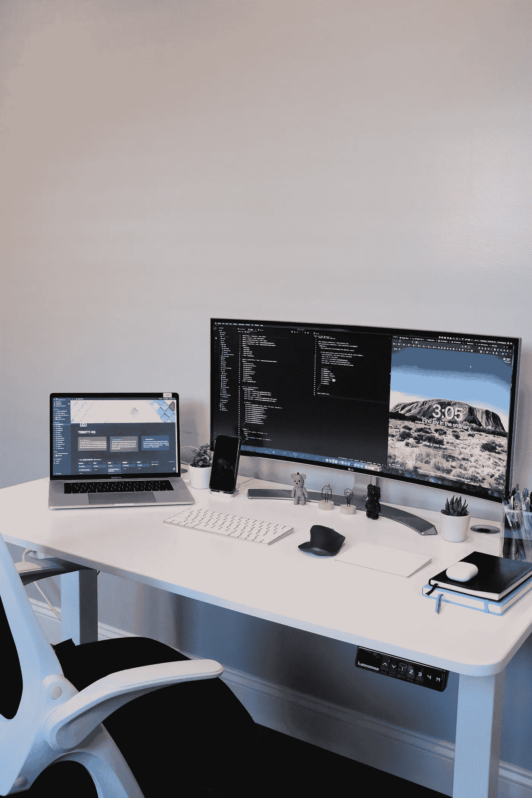
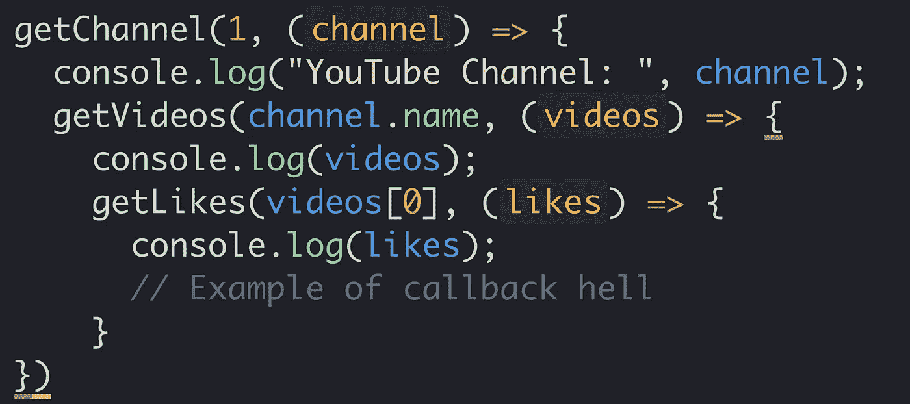

# 我在机器学习生涯中保持高效的方法

> 原文：<https://towardsdatascience.com/methods-i-use-to-stay-productive-within-a-machine-learning-career-12c2aa18ff05?source=collection_archive---------22----------------------->

## 生产力技巧、惯例、习惯追踪等等

安德里亚斯·克拉森在 [Unsplash](https://unsplash.com/s/photos/productivity?utm_source=unsplash&utm_medium=referral&utm_content=creditCopyText) 上拍摄的照片

> 生产力不是目的地，而是一段旅程。

简单地认识到生产力不是一个目的地，目标或指标，而是一个以不同速度接近的旅程，让我们接受我们在最大化生产力时会遇到的共同缺点。

机器学习学科关注过程的优化和自动化。我发现自己在用不同的超参数重新训练机器学习模型，以挤出小单位精度。如果我在日常活动中遇到重复的任务，我的大脑会立即想办法自动完成这个手工过程。

这是大多数机器学习实践者随着时间的推移而获得的思维模式，所以我们作为机器学习实践者寻求优化我们生活领域的方法也就不足为奇了。你可以通过提高生产率来实现实际生活过程的优化。

但我不得不让你失望了。

读完这篇文章后，你的生产率不会提高十倍。

我试图让你做好准备的是，为了看到一些显著的改善，一些活动必须持续进行，直到它们在你的个性中根深蒂固，成为习惯。

本文介绍了机器学习从业者或任何技术人员可以采用的方法，以提高他们的产出，并充分利用一天的时间。

生产力在基于技术的角色中是必不可少的，因为机器学习相关学科通常需要个人同时平衡学习和交付软件功能。

# 制定日常计划

照片由 [Prophsee Journals](https://unsplash.com/@prophsee?utm_source=unsplash&utm_medium=referral&utm_content=creditCopyText) 在 [Unsplash](https://unsplash.com/s/photos/routine?utm_source=unsplash&utm_medium=referral&utm_content=creditCopyText) 上拍摄

> 你可以主宰一天，也可以让它主宰你。

让我们将常规定义为根据资源(如时间、能力(精神、身体)和可用性)计划的活动的结构化组织。一个体面的、经过深思熟虑的日常工作感觉就像是让你的一天和任务自动安排。

就我个人而言，例行公事可以让我对我为任务付出的努力设定时间表，这样就不会让自己筋疲力尽。对我来说，花 3 个多小时修复漏洞或实现新功能很容易，但事实是，在一项任务上花这么多时间，另一项任务就会受到影响。

这让我们看到了制定计划的另一个重要好处，那就是能够相应地进行优先排序。

下面是我在一个典型工作日的日常工作的快照。

我理想的日常生活

像大多数人一样，我会绊倒并偏离我设定的常规，有时会突然出现意想不到的会议，或发生紧急情况。不管怎样，有一个计划良好的日常工作能让我重新回到高效的道路上。

在我的日常工作中，我会花 2-3 个小时来完成任务，通常包括编码。我发现保持完全集中注意力超过一个小时有点难，所以我利用了[****番茄工作法**。**](https://en.wikipedia.org/wiki/Pomodoro_Technique)

**我仍然每个月都在我的日常时间和活动中玩耍。我总是试图找到最佳生产率和产量的最佳点。下面的步骤应该可以帮助你开始整理一个适合你的体面的日常工作。**

## **你如何计划一个好的日常？**

*   **把你的一天分成一两个小时的时间段。**
*   **确定你所执行任务的类别。例如，白天工作，学习，烹饪等。**
*   **尝试执行任务的最佳时间。例如，我晚上锻炼，晚上做一些个人项目。**
*   **对基本任务有一个特定的模块。这些是具有高优先级的任务。**
*   **让你的日常活动可见**

**如果你喜欢的话，规划一个好的日常生活的步骤可能会很复杂和漫长。但是说实话，没必要把一些鸡毛蒜皮的事情复杂化。**

***里士满，如果这么琐碎，为什么我觉得很难养成好的习惯和套路？***

**是的，我也觉得很难。**

**在读了一些自助书籍后，我发现了几个可以让旅程变得更轻松的主意。**

**第一是将你的日常事务和习惯与身份联系起来。想一想你想要效仿的理想人物，然后像你想象中的“完美”人物那样度过你的一天。**

**第二个想法是加入一个奖励/惩罚系统。奖励好行为，惩罚坏习惯。**

**最后一个想法是套路很无聊。它们最终变得单调。随着时间的推移，一个新的惯例或习惯的兴奋消失了。为此做好准备，学会热爱无聊。**

**作为一名机器学习实践者，我习惯于在执行 ML 相关任务时遵循某些[例程和流程](/10-stages-of-a-machine-learning-project-in-2020-and-where-you-fit-cb73ad4726cb)。有经验的 ML 从业者会告诉你，跳过一个步骤会降低项目成功的机会。**

**拥有一个经过深思熟虑的程序就像拥有一辆特斯拉，或者更确切地说，一辆 2 级自动驾驶汽车。你深思熟虑的日常工作可以引导你的一天，加快或减慢你完成任务的速度。尽管如此，偶尔你还是需要亲自动手，针对旅途中不可预见的颠簸和障碍调整你的日常安排。**

> ****关键外卖****
> 
> **一个深思熟虑的日常工作指引着一天的方向。**
> 
> **通过对一天中的各种任务进行结构化的时间分配，大脑不必去想“下一步是什么？”。**
> 
> **经过测试和完善的常规让你可以轻松地确定优先级，同时培养习惯。**

# **有责任**

**在我的 ML 职业旅程的早期，我一直保持在我的学习之上，并熟悉常见的机器学习技术和概念。我甚至写了大量的文章来转述我所学到的东西。**

**但是，我不得不承认，最近，我已经慢下来了。我仍然渴望成为一名伟大的 ML 从业者，所以现在我对自己负责。**

**为了确保我每天都能学到新的东西，我给自己定了一个任务，写 1000 字任何与 ML 相关的东西；它可能是一项新技术，一篇新发表论文的摘要，或者只是一些修改笔记。**

**我只需要写至少 1000 字。**

**有一天我写不出 1000 字，我会转 5 到我信任的朋友的银行账户。五英镑是一个很大的损失，但打破习惯的惩罚必须是痛苦的，否则我不会认真对待它。**

**通过连续五天写 1000 字，我有办法拿回我被没收的任何钱。每当你的自我激励储备不足时，对自己设定的习惯和目标负责会给你额外的动力。**

**我上面提到的场景是一对一责任的一个例子。在数字时代，你可以利用互联网让自己负起责任。**

**在线问责的一个很好的例子是 [#66daysofdata](https://www.66daysofdata.com/) 。66daysofdata 是由[肯·吉](https://medium.com/u/6ee1f7466557?source=post_page-----12c2aa18ff05--------------------------------)发起的一个在线学习项目，他是数据科学领域的一个热门 YouTuber。**

> ****关键外卖****
> 
> **责任感确保你“出现”。**
> 
> **通过对你为自己设定的目标和职业抱负负责，你反过来允许自己变得更加富有成效。**

# **软件是你的朋友**

****

**照片由 [Fotis Fotopoulos](https://unsplash.com/@ffstop?utm_source=unsplash&utm_medium=referral&utm_content=creditCopyText) 在 [Unsplash](https://unsplash.com/s/photos/software?utm_source=unsplash&utm_medium=referral&utm_content=creditCopyText) 上拍摄**

**我不可能是唯一一个通过无数生产力工具和应用程序来寻求成为生产力的物理体现的人。**

**事实证明，在一个社交媒体应用程序是生产力黑洞的世界里，一些应用程序实际上站在你这边，帮助你进步。下面列出了一些应用程序，它们让我作为一名 ML 工程师保持了良好的工作效率。**

## **1.[森林](https://www.forestapp.cc/)**

**这款手机应用在苹果应用商店(在撰写时*排名第一是有原因的。***

**Forest 是一款移动应用，它将自己定位为一款帮助用户保持专注和“活在当下”的工具。森林是一个番茄工作狂应用程序。它能让用户设定一个专注于任务的时间，这个时间会倒数到零，完成后，一棵植物就会从曾经的种子中发芽。**

**我利用 forest 来确保我的一天在编码相关的活动和休息之间有一个很好的平衡。我通常花一个小时编码/学习/写作，然后休息 15 分钟。**

## **2.[观念](https://www.notion.so/)**

**观念是很多东西。它是一个数据库，日历，提醒和更多。但对我来说，观念是第二个大脑。**

****

**[西格蒙德](https://unsplash.com/@sigmund?utm_source=unsplash&utm_medium=referral&utm_content=creditCopyText)在 [Unsplash](https://unsplash.com/s/photos/notion?utm_source=unsplash&utm_medium=referral&utm_content=creditCopyText) 上拍照**

**如果你感兴趣，你可以阅读[我如何使用概念](/creating-a-data-science-and-machine-learning-portfolio-with-notion-25888cf19356)建立机器学习组合。**

**以下是我在机器学习生涯中运用概念的几种方式:**

*   ****任务规划者**:在我的工作场所内运行计算机视觉计划意味着提前规划未来的发展和任务。目前，预计每个季度都会有功能开发。我使用观念[看板](https://www.notionwizard.com/how-to-create-a-kanban-board-in-notion/)结合日历提醒作为跟踪任务完成和交付的方式。**
*   ****文档**:有许多文档工具可供技术人员利用和记录软件实现细节。我发现 ideas 是一个与非技术团队成员交流想法、概念和实现的好地方。在概念编辑器中，您可以使用@特性提及个人，向文本部分添加注释，轻松集成代码等等。**
*   ****项目管理** : [Trello](https://trello.com/en-GB) 曾经是我多年来选择的项目管理工具。每个人都用 Trello，我打赌你甚至用过(或者仍然用过)。我可能会对此有一些反弹，但得出这样的结论是否安全:这种观念已经取代了 Trello 作为中小型创业公司项目管理工具的选择？**

## **3.[谷歌日历](https://www.google.com/calendar/about/)**

****

**照片由 [Nadeena Granville](https://unsplash.com/@gainingvisuals?utm_source=unsplash&utm_medium=referral&utm_content=creditCopyText) 在 [Unsplash](https://unsplash.com/s/photos/google-calendar?utm_source=unsplash&utm_medium=referral&utm_content=creditCopyText) 上拍摄**

**毫不奇怪，谷歌日历是我用来确保高效工作的主要工具。谷歌日历是生产力工具的“OG”。**

**虽然，谷歌日历的功能对于不常使用的用户来说并不明显。例如，在日历视图上显示多个时区。**

**我参与的项目涉及来自美国、巴基斯坦和英国的团队，因此每当我安排会议时，在我的日历上看到所有相关时区会有所帮助。Google Calendar 允许用户在日历显示中添加几个时区。不用再去想在世界的另一个地方下午 5 点是什么时间了。**

**如果您有兴趣了解与 Google 日历相关的更多提示和技巧，请查看 Jeff Su 制作的[短片](https://www.youtube.com/watch?v=4GqqptRI4Do&ab_channel=JeffSu)。**

## **4.[黑暗阅读器](https://darkreader.org/)**

**Dark Reader 是 chrome 的一个扩展，它可以将你访问的几乎所有网站变成黑色版本(负对比度)，或者在黑色背景上放置白色文本。**

****

**图片作者:里士满·阿拉克(作者)**

**机器学习从业者花费大量时间盯着显示器，显示器的炫目光线会导致长时间的眼睛疲劳。**

**使用黑暗版本的网站让你的眼睛休息一下。我们已经在黑暗模式下使用 ide 了。**

**这篇[文章](https://www.nngroup.com/articles/dark-mode/)提供了一些关于阅读更多与屏幕亮度变化模式及其优势相关的文献的深刻信息。**

> ****关键外卖****
> 
> **利用生产工具，大多数这些软件产品都是为了简化您生活而构建的。**
> 
> **你可以识别这些工具，因为它们旨在消除分散注意力的因素，强化良好的习惯，或者帮助创造一个高效的环境。**
> 
> **不要用大量的生产力工具来淹没自己。尝试各种工具，并在 2-3 个你会经常使用并适合你生活方式的应用程序中进行选择。**

# **硬件也是你的朋友**

****

**照片由[崔妮蒂阮](https://unsplash.com/@trinwin?utm_source=unsplash&utm_medium=referral&utm_content=creditCopyText)在 [Unsplash](https://unsplash.com/s/photos/setup?utm_source=unsplash&utm_medium=referral&utm_content=creditCopyText)**

**2020 年 3 月 23 日，星期一，英国开始封锁。六个月后，我房间/工作环境的四面墙成了我因不出门而感觉到的被困的字面上和隐喻上的代表。**

**我必须承认，我否认封锁对我的精神健康的影响，更影响我的生产力和工作效率。原本需要 30 分钟的任务似乎需要几个小时。我必须找到动力来度过一个工作日。**

**我知道你环境中的微妙变化会有很大的帮助。**

**首先，我重新安排了我的床的位置，整理了我的衣柜，最后用一个[三星 49 英寸曲面超宽 LED 显示器](https://www.samsung.com/uk/business/business-monitors/curved-chg90d/lc49hg90dmuxen/)取代了我的显示器。我通常一天盯着我的显示器超过六个小时，所以这是我能改变的工作环境中最重要的方面。它得到了回报。**

**人类的大脑被新奇的事物所吸引。我们的大脑会捕捉日常事务或环境的微小变化。新的闪亮的东西吸引我们的注意力。对我来说，我看待我的想法、文章和视频的方式的不同足以让任务看起来令人兴奋。**

**我在 ML 角色中使用的硬件的变化导致了对我工作的看法的积极转变，从而提高了工作效率。**

**而它没有；必须全是硬件。给我的工作空间带来意想不到的影响的是我现在工作的公司送给我的[台式空气植物](https://www.etsy.com/uk/listing/974251790/diy-terrarium-air-plant-kit-hanging?ga_order=most_relevant&ga_search_type=all&ga_view_type=gallery&ga_search_query=air+plant+stand&ref=sr_gallery-1-1&frs=1)。他们也意识到，工作环境的微小变化有助于在禁闭中重振灵魂。**

**如果您对硬件以及它们如何提高生产率感兴趣，可以看看本文末尾链接到的文章。**

> ****关键外卖****
> 
> **有研究表明，当引入新奇事物时，人脑中的多巴胺水平会增加。**
> 
> **竞争是无聊的，而变化是令人兴奋的，利用这一知识，通过改变你在职业生涯中使用的硬件来重新点燃失去的火花。更换记事本、键盘或显示器。**

# **你的环境是你思想的反映**

****

**照片由[诺贝特·昆德拉](https://unsplash.com/@trebron?utm_source=unsplash&utm_medium=referral&utm_content=creditCopyText)在 [Unsplash](https://unsplash.com/s/photos/mind?utm_source=unsplash&utm_medium=referral&utm_content=creditCopyText) 上拍摄**

**工作环境的设计有助于确保你快速进入并保持高效状态。**

**两年前，在我的硕士学习期间，我很难集中注意力并保持良好的习惯——我无法保持专注反映在我的一些课程相关的工作中。在期末考试来临之前，我知道我必须全力以赴。**

**在尝试设计创造和坚持好习惯的新方法时，我看到了詹姆斯·克利尔的《原子习惯》这本书。詹姆斯用整整一章的篇幅讲述了环境的重要性，以及环境设计如何有助于保持好习惯，消除坏习惯。**

> **你不必成为环境的受害者。你也可以成为它的建筑师。**
> 
> **—詹姆斯·克利尔，《原子习惯》**

**当时，我意识到我所处环境的设计确保了我长时间保持注意力分散，短时间保持高效。我的手机总是触手可及；我的游戏机离我只有两步之遥，朋友们离我的房间只有几层楼梯。**

**对我的环境进行简单的重新设计产生了积极的结果。在不到一分钟的时间里，我可以轻松地花三个小时写论文(由 cans Red bull 提供动力)，这一切都是因为我把手机放在厨房里或在图书馆学习。**

**对于现在没有论文要写或课程要交的职业中的机器学习从业者来说，我们也可以从环境重新设计中受益。**

**作为 ML 从业者，我们可能每天大部分时间都盯着屏幕并连接到网络，因此将我们的环境想象成物理和虚拟的会有所帮助。**

*   **在需要全神贯注的时候，把你的手机移到另一个房间。**
*   **如果你想补充更多的水分，在办公桌上放一升水。在你的桌子上放一个瓶子是提醒你喝酒的视觉信号。**
*   **你曾经在无精打采的时候感到有动力或有效率吗？购买一把符合人体工程学的办公椅有助于提高工作效率，并有助于保持良好的姿势和健康。**

> ****关键外卖****
> 
> **你的环境设计直接影响到你的工作效率。环顾你的工作空间，用那些能强化你想成为的人的东西来代替那些分散注意力的东西。**
> 
> **用一本书代替电话支架，或者用一株小植物代替零食抽屉。**

# **结论**

**让我给你介绍一下生产力地狱🔥。**

**你听说过*“回调地狱”吗？***

**在异步编程中，这是指几个函数的嵌套。看看下面的图片，理解回调函数在编程上是什么样子的。这被认为是不好的做法，会产生容易出错的代码。**

****

**里士满·阿拉克的回调地狱图像**

**你可以把生产力地狱想象成回调地狱。首先，你尝试一两个提高效率的小技巧，它们很有效，事实上非常有效。**

**然后你再尝试一两次，然后越来越多。**

**最终，你会面临选择疲劳，不知道该使用哪种生产力工具，黑客还是技巧。你花了太多的时间和精力去研究和选择生产力工具，以至于忘记了生产力。**

**如果你从这篇文章中得出的只是一种提高你职业生涯生产率的方法，那就很好。**

**正如我在文章开头提到的，生产力是一个旅程，而不是目的地。做一些小的渐进的改变，享受这个过程。**

## **在开始之前，让我们重温一下你可以利用的生产力技巧和窍门:**

*   **每天都要有一个常规，把一天中特定的时间用于重要的任务**
*   **对你的目标负责。找一个负责任的伙伴(朋友、同事、直线经理或在线社区)**
*   **请利用生产力应用程序，但不要被它们淹没**
*   **在技术角色中，硬件变化可以提高工作效率和专注度**
*   **你所处的环境对你的工作效率至关重要。清除工作场所周围令人分心的东西。**

## **硬件和生产力**

** [## 帮助你在 2021 年更聪明地工作的 7 个日常生产力技巧

### 如果你像我一样，在屋子里徘徊，喃喃自语着“新年，新的我”，却不知道到底发生了什么…

www.fastcompany.com](https://www.fastcompany.com/90590901/best-productivity-software-hardware-for-2021)  [## 2020 年提高您工作效率的硬件

### 如何投资购买合适的硬件来帮助您更有效地投入深度工作

betterhumans.pub](https://betterhumans.pub/hardware-to-boost-your-productivity-in-2020-670c08e0ded1) 

## 我的更多文章

 [## 用概念创建数据科学和机器学习组合

### 传统简历的现代化

towardsdatascience.com](/creating-a-data-science-and-machine-learning-portfolio-with-notion-25888cf19356)  [## 一年的计算机视觉工程师

### 一个机器学习实践者的所有学习、兴奋、失败、成功和事件浓缩成一个…

towardsdatascience.com](/one-eventful-year-as-a-computer-vision-engineer-3e8899cafce3)**