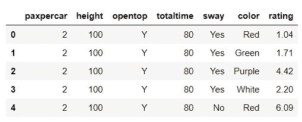
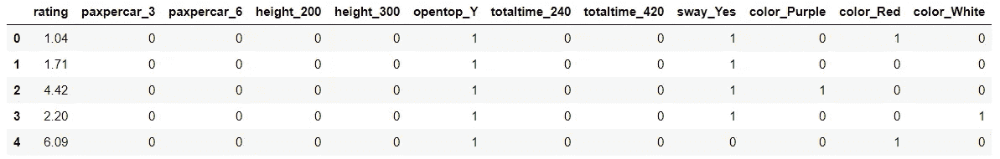
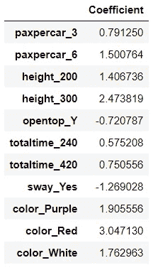

# 基于度量(基于评级)的联合分析

> 原文：<https://towardsdatascience.com/metric-based-ratings-based-conjoint-analysis-844655f4e269?source=collection_archive---------24----------------------->

## 用于洞察消费者偏好的技术

**由吉纳·戈麦斯
与格雷戈·佩奇**

在营销分析中，联合分析是一种用于获得关于消费者偏好的具体见解的技术。联合分析通常来源于消费者调查，可以告诉我们，例如，手机购买者更关心更大的屏幕、更大的硬盘容量还是更长的电池寿命。此外，通过测量特定功能对消费者选择的精确影响的模型，这种分析可以告诉我们*消费者对这些功能的每个选项有多关心。*

为了做出这样的决定，营销人员首先向调查对象提供假设的功能组合或捆绑。一个手机套装可能包括 5 英寸屏幕、16 千兆字节硬盘和 12 小时空闲电池寿命，而另一个包括 7 英寸屏幕、32 千兆字节硬盘和 8 小时空闲电池寿命。捆绑销售可以附有价格，以衡量消费者对成本的敏感度，也可以不带价格信息，以简单地衡量各种选择的偏好。

有几种类型的联合分析方法，其中包括基于选择的联合分析(向消费者提供一系列非此即彼的选择)、全排名联合分析(要求消费者对一系列捆绑包进行排名，从最好到最差)，以及基于指标或评级的联合分析。

在基于度量的联合分析(本文的主题)中，消费者被要求对一系列捆绑包进行评级，通常从 1 到 10。在营销人员汇总了所有调查数据后，可以建立一个模型来“连接”功能选项和调查受访者评级之间的点。这种模型中使用的输入可以是连续的或分类的。因为结果变量是数字，所以线性回归是这种情况下的理想建模工具。

基于度量的方法的效用函数是:

γ=X1β1+X2β2 +X3β3… + ε

其中γ是每个完整配置文件的评级或可接受性度量，Xn 是输入要素，n 是与属性集相关的回归系数，ε是随机误差项。

在接下来的部分中，我们将展示一个基于度量的联合分析的完整例子。

首先，将干净的数据集读入环境:

这个数据集中有七个变量。其中六个是自变量，第七个变量(评级)是因变量。数据集描述如下所示:

**Pax percar:**“Pax”是乘客的缩写。选项包括每节车厢 2、3 或 6 名乘客。

高度:离地面 100、200 或 300 英尺，从上到下测量。

**opentop:** 每辆摩天轮“车”是应该完全遮盖，还是顶部大开。

**总时间:**从上车到下车的时间长度，以秒计算。选项有 80、240 或 420 秒。

**摇摆:**如果用户摇晃汽车，汽车应该能“摇摆”吗？(是或否回答)。

**颜色:**颜色选项有绿色、白色、红色、紫色。

**评级:**每个捆绑包的评级或可接受性度量

paxpercar 有三个选项，三个高度选项，两个开放式选项，三个总时间选项，两个摇摆选项，四个颜色选项，共有:

3 x 3 x 2 x 3 x 2 x 4 = 432 种可能的独特功能组合。

数据集有 432 行，每行代表一个唯一的包或要素组合。结果变量 rating 表示看到该捆绑包的所有调查受访者对该捆绑包的平均评分。请注意，*每个*调查受访者并没有对*每个*捆绑包进行评级——这将导致相当大的“调查疲劳”问题！但是，如果成千上万的调查受访者每个人对 6-8 个捆绑包进行评级，那么所有这些评级的结果可以汇总起来，生成一个数据集，就像这里使用的数据集一样。

从上面的描述中，我们知道 sway、opentop 和 color 是分类输入变量，而 height、totaltime 和 paxpercar 是数字输入变量。要为基于度量的联合分析准备数据，所有变量都应该虚拟化(即使是数字变量)。这样，模型会将这些变量的值视为一系列特定的离散选项，而不是一个连续的范围。对数字输入进行虚拟化的失败会导致两个问题:首先，它会错误地表达数据，暗示选项是连续存在的；第二，也是更重要的，如果最理想的选项落在选择范围的中间，可能会导致重大的解释问题。由于线性回归模型只为数值变量分配了一个系数，因此该模型会根据系数的符号给出一个结果，表明较大的值或较小的值是最佳值。

如下所示，pandas 的 get_dummies()函数用于为线性建模准备这些变量。请注意，包含了 drop_first = True 参数-这是避免由于输入中的多重共线性而导致模型结果不可靠的风险的重要步骤。

当我们解释模型结果时，我们需要记住，每个变量的第一级不会出现在系数列表中。作为“参考水平”，它可以被视为一个零当量:任何正系数表明一个选项比参考水平更可取，而任何负系数表明一个选项不如参考水平可取。

然后，使用 scikit-learn 的 LinearRegression 模块，以评级为输出变量，以所有其他变量为输入变量，构建了一个线性模型。(使用不同的库，我们验证了模型的 f 检验分数显示了总体显著性，并且预测变量也具有统计显著性)。

在所有的分析之后，结果向我们展示了调查中所有特性中最受欢迎的选项。从上面显示的输出中，我们可以看到受访者最希望的属性是:每辆车 6 名乘客，离地 300 英尺的高度，摩天轮“车”应该完全覆盖，乘坐时间长度应该是 420 秒，非摇摆的汽车，以及红色。

然而，这并不意味着委托这项调查的公司应该立即实施所有这些功能！如果这个分析的目标是简单地确定最受欢迎的包，我们可以跳过整个建模过程，只使用一个 pandas 函数从上到下对 432 个包评级进行排序。相反，我们可以通过查看系数的相对差异和某些特征系数的大小来增加对这些系数值的分析洞察力。我们还可以指出字面解释模型结果的一些潜在问题，并思考这如何指导未来的其他研究工作。

系数值的相对大小让我们了解人们意见的强度。看看颜色——这往往会引起人们的强烈反应，在 10 分制的评分系统中，红色占三分以上。与绿色(参考水平)相比，紫色和白色也引起了相当强烈的反应。一个可能的原因是人们很容易想到颜色。虽然其中一些特征看起来有点抽象，不在摩天轮上或附近很难想象，但是颜色很容易想象，也很容易形成一个观点。

我们还可以从我们在各种特征中看到的任何模式中收集见解。由于对敞篷汽车的明显偏好，以及对摇摆汽车的反对，调查受访者中可能存在一种普遍的“支持安全”态度，如果他们被纳入未来的调查，这种态度将延续到其他与安全相关的选项中。

在这些调查中，在数字变量选择中也出现了一种模式:在所有情况下，人们都倾向于“最大”的选项——他们选择最高的高度、最长的乘坐时间和最大的摩天轮车。

亚历克斯·奇斯托尔，摄影师。(2020 年 2 月 23 日)。摩天轮。从 Pexels 检索。

然而，这真的是人们想要的吗？上图中的伦敦眼有 443 英尺高。即使从这张照片中，也很难获得 443 英尺离地面到底有多高的视角。最有可能的是，人们在回答这项调查时没有任何关于身高的真实参考框架，他们可能认为最高的选项将是最有趣的。当建造实际的游乐设施时，公园可能希望考虑对高度的总体偏好趋势，但也可能不得不考虑工程挑战、保险成本以及与建造如此高的游乐设施相关的其他实际问题。

至于乘车时间变量，受访者表现出对较长乘车时间的偏好。当人们回答这个问题时，他们最有可能想象自己在骑行，玩得开心——但他们不太可能事先考虑到他们需要排队等候的长度。公园运营专家可能还必须考虑排队等候时间来确定最佳乘车时间。

此外，我们这里没有任何关于谁参加了这项调查的具体细节——这些人可能是主题公园的游客吗？如果是的话，他们有可能乘坐摩天轮或类似的游乐设施吗？或者，受访者只是普通大众的一个代表？

基于这些结果，我们可能产生的潜在问题从理论上讲是无穷无尽的。基于度量的联合分析最终并不是要得出某种确定的解决方案。然而，这种模糊不清不应被视为一个问题——我们可以从基于指标的联合分析中获得的大部分价值来自它帮助我们产生的问题，以及它可以揭示的关于消费者偏好的总体趋势和见解。