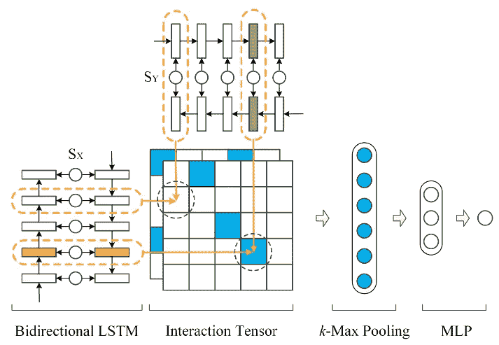
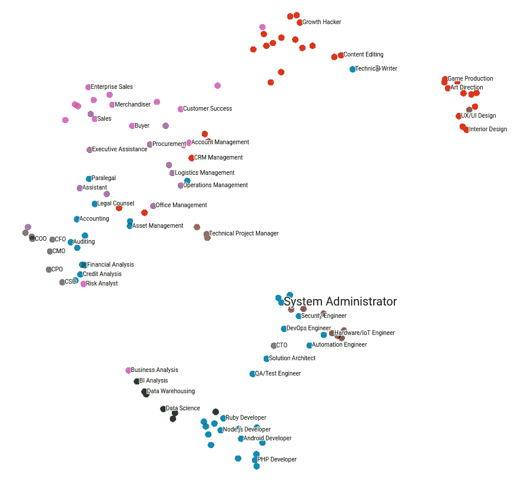
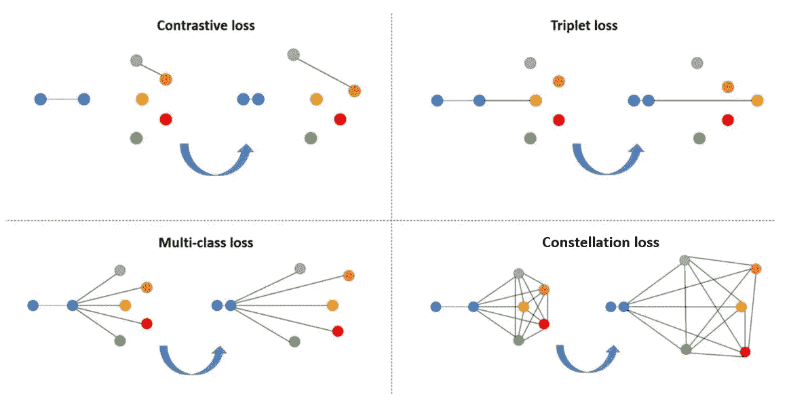
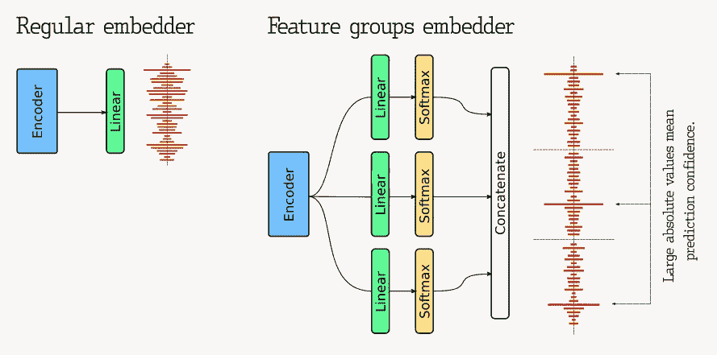
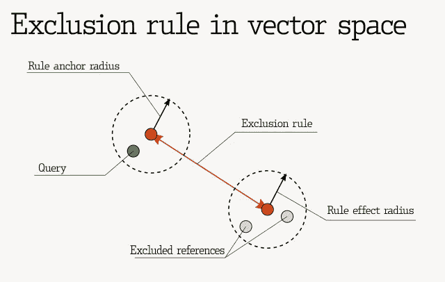

# 度量学习技巧和诀窍

> 原文：<https://towardsdatascience.com/metric-learning-tips-n-tricks-2e4cfee6b75b?source=collection_archive---------5----------------------->

## [实践教程](https://towardsdatascience.com/tagged/hands-on-tutorials)

## **如何在没有标记数据的情况下训练对象匹配模型并用于生产**

目前，大多数机器学习相关的商业案例都是作为分类问题来解决的。分类算法在实践中得到了很好的研究，即使原始问题不是直接的分类任务，它通常也会被分解或近似转换成一个分类任务。

然而，尽管分类任务很简单，但其要求可能会使生产集成和扩展变得复杂。例如，它需要固定数量的类，其中每个类应该具有足够数量的训练样本。

在本文中，我将描述我们如何通过切换到度量学习来克服这些限制。通过匹配职位和候选人的例子，我将展示如何在没有人工标记数据的情况下训练度量学习模型，如何估计嵌入置信度，以及如何在生产中服务度量学习。

**什么是度量学习，为什么要使用它？**

根据维基百科的说法，[度量学习](https://en.wikipedia.org/wiki/Similarity_learning)是学习对象上的距离函数的任务。在实践中，这意味着我们可以训练一个模型，为任何一对给定的对象给出一个数字。并且这个数字应该表示这些给定对象之间的相似度或相似度分数。例如，得分为 0.9 的对象可能比得分为 0.5 的对象更相似。实际分数及其方向在不同的实现中可能有所不同。

在实践中，有两种主要的度量学习方法和两种相应类型的神经网络结构。第一种是基于*交互的*方法，它首先在两个对象之间建立本地交互(即本地匹配信号)。深度神经网络学习分层交互模式进行匹配。神经网络架构的示例包括 MV-LSTM、ARC-II 和 MatchPyramid。



MV-LSTM，基于互动的模型示例，[万圣贤等人](https://www.researchgate.net/figure/Illustration-of-MV-LSTM-S-X-and-S-Y-are-the-in_fig1_285271115)通过 Researchgate

第二种是基于*表示的*方法。在这种情况下，距离函数由两个部分组成:*编码器*将一个对象转换为嵌入表示——通常是一个大的浮点向量，而*比较器*从编码器获取一对对象的嵌入，并计算它们的相似性。这种嵌入表示最著名的例子是 Word2Vec。

比较器通常是一个非常简单的函数，计算速度非常快。这可能是余弦相似性，甚至是一个点产品。两阶段模式允许每个对象只执行一次复杂的计算。一旦被转换，比较器可以独立于编码器更快地计算对象相似性。

为了更方便，嵌入可以放入专门的存储或矢量搜索引擎。这些搜索引擎允许使用 API 管理嵌入，使用向量执行搜索和其他操作。


C-DSSM，基于表示的模型的例子，[李雪等人](https://arxiv.org/abs/1901.10710v2)通过 arXiv

也可以使用预先训练的神经网络。倒数第二层的输出可以作为嵌入式表示。在本文的后面，我将重点介绍基于表示的方法，因为它被证明更加灵活和快速。

那么，与分类相比，使用度量学习有什么优势呢？对象编码器不假定类的数量。所以，如果你不能把你的对象分成类，如果类的数量太多，或者你怀疑它将来会增长，考虑使用度量学习。

在我们的案例中，业务目标是为指定所需职位名称的候选人找到合适的空缺。为了解决这个问题，我们使用分类器来确定空缺职位和候选人的工作类别。但是这个解决方案仅限于几百个类别。候选人抱怨说他们找不到适合自己的类别。为新类别训练分类器将会太长，并且需要为每个新类别提供新的训练数据。切换到度量学习允许我们克服这些限制，得到的解决方案可以比较任何配对位置描述，即使我们还没有这个类别参考。



T-SNE 与工作样本，由作者图像。自己玩[嵌入投影仪](https://projector.tensorflow.org/?config=https://gist.githubusercontent.com/generall/7e712425e3b340c2c4dbc1a29f515d91/raw/b45b2b6f6c1d5ab3d3363c50805f3834a85c8879/config.json)

通过度量学习，我们学习的不是具体的工作类型，而是如何将候选人简历中的工作描述与空缺职位相匹配。其次，有了度量学习，不需要模型再训练，很容易增加更多的参考职业。然后，我们可以将引用添加到矢量搜索引擎中。下一次我们将匹配职业——这个新的参考向量将是可搜索的。

**公制学习数据**

与分类器不同，度量学习训练不需要特定的类标签。所需要的只是相似和不相似物体的例子。我们称之为阳性和阴性样本。

同时，它可能是一对对象之间的相对相似性。例如，双胞胎看起来比一对随机的人更像。随机的人比一个人和一只猫更相似。模型可以使用这样的相对例子来学习。

好消息是，分类只是确定相似性的一个特例。要使用这样的数据集，只需将一个类的样本声明为阳性，而将另一个类的样本声明为阴性。通过这种方式，可以将几个具有不匹配类的数据集组合成一个用于度量学习的通用数据集。

但并不是只有划分成类的数据集才适合提取正反例。例如，如果在对象的描述中有附加特征，这些特征的值也可以用作相似性因子。可能没有类成员关系那么明确，但是相对的相似度也适合学习。

在工作描述的情况下，有许多职业的本体，由于这种方法，它们能够被组合成一个单独的数据集。我们甚至更进一步，使用相同的职位来寻找相似的描述。

结果，我们得到了一个自我监督的通用数据集，不需要任何手动标记。

不幸的是，普遍性不允许在训练中应用某些技术。接下来，我将描述如何克服这个缺点。

**训练模型**

有几种方法来训练度量学习模型。其中最流行的是使用三元组或对比损失函数，但我不会在本文中深入探讨它们。然而，我将告诉你一个有趣的技巧，它帮助我们使用统一的训练示例。

有效训练度量学习模型的最重要的实践之一是*硬负挖掘*。该技术旨在包括负样本，在该负样本上，模型在上一个训练时期给出了更差的预测。大多数描述这种技术的文章都假设训练数据由许多小类组成(大多数情况下是人脸)。有了这样的数据，就很容易找到不好的样本——如果两个来自不同类别的样本有很高的相似度得分，我们就可以把它作为负样本。

但是我们的数据中没有这样的类别，我们仅有的是假定在某些方面相似的职业对。我们不能保证在这一对中没有更好的匹配了。这就是为什么我们不能对我们的模型使用硬负挖掘。



[Alfonso Medela 等人](https://arxiv.org/abs/1905.10675) via arXiv

为了弥补这一限制，我们可以尝试增加随机(弱)阴性样本的数量。实现这一点的一种方法是训练模型更长的时间，这样在训练结束时它会看到更多的样本。

我们在调整损失函数时找到了一个更好的解决方案。在三联体或收缩损失的常规实施中，将每个阳性对与一些或几个阴性样本进行比较。我们所做的是允许在整批中进行配对比较。在这种情况下，损失函数惩罚所有的随机对象对，如果它的分数超过一批中的任何正分数。

这个扩展给出了 **~N × B** 的比较，其中 **B** 是批次的大小， **N** 是批次的数量。远大于常规三重态损耗中的 **~ N × B** 。

这意味着增加批次的大小会显著增加负比较的数量，因此应该会提高模型的性能。

我们能够在实验中观察到这种依赖性。类似的想法我们也在文章[监督对比学习](https://arxiv.org/abs/2004.11362)中发现。

**模型置信度**

在现实生活中，经常需要知道模型在预测中的可信度。是否需要手动调整或验证结果。

使用常规分类，很容易通过分数了解模型对结果的置信度。如果不同类别的概率值彼此接近，则模型是不自信的。相反，如果最可能的类别相差很大，则该模型是可信的。

乍一看，这不能应用于公制学习。即使预测的对象相似性分数很小，也可能仅仅意味着参考集没有合适的对象可以比较。相反，该模型可以对得分较大的垃圾对象进行分组。

幸运的是，我们发现了对嵌入生成器的一个小修改，它允许我们以与使用 Softmax 激活函数的传统分类器相同的方式定义置信度。

修改在于构建嵌入作为特征组的组合。每个特征组在嵌入中被表示为一个独热编码子向量。如果模型可以有把握地预测特征值，则相应的子向量在其一些元素中将具有高绝对值。为了更直观的理解，我建议不要把嵌入看作空间中的点，而是一组二进制特征。

为了实现这种修改并形成适当的特征组，我们需要将一个常规的线性输出层改为几个 softmax 层的*连接。每个 softmax 组件将代表一个独立的特征，并迫使神经网络学习它们。*

例如，我们有 4 个 softmax 组件，每个组件有 128 个元素。每一个这样的组件都可以被粗略地想象成一个 0 到 127 范围内的热编码数字。因此，得到的矢量将代表 128⁴可能的组合之一。如果训练好的模型足够好，你甚至可以尝试单独解释奇异特征的值。



Softmax 特征嵌入，作者图片。

**神经规则**

机器学习模型很少训练到 100%的准确率。在传统的分类器中，误差只能通过修改和重复训练过程来消除。然而，度量训练在这方面更加灵活，它允许您引入额外的步骤来纠正已经训练好的模型的错误。

度量学习模型的一个常见错误是错误地声明对象是封闭的，尽管实际上它们不是。为了纠正这种错误，我们引入了排除规则。

规则由编码到向量空间中的 2 个对象锚组成。如果目标对象落入锚点的效果区域之一，就会触发规则。它将从预测结果中排除第二锚区域中的所有对象。



神经排除规则，作者图片。

使用嵌入的便利之处在于，不管有多少规则，您只需要对每个对象执行一次编码。然后，为了找到合适的规则，比较目标对象的嵌入和预先计算的规则锚的嵌入就足够了。当被实现时，它只转化为对向量搜索引擎的一个额外的查询。

**生产中的矢量搜索**

当在生产中实现度量学习模型时，出现了关于向量的存储和管理的问题。如果服务中出现新的工作描述，应该很容易添加新的向量。

在我们的例子中，我们还需要对搜索应用附加条件。例如，我们需要筛选候选人的位置和语言熟练程度。

我们没有找到现成的工具来进行这种向量管理，所以我们创建并开源了我们内部的向量搜索引擎，名为 [Qdrant](https://github.com/qdrant/qdrant) 。

它允许你用一个简单的 API 添加和删除向量，独立于你正在使用的编程语言。您也可以将有效载荷分配给向量。这个有效负载允许在搜索请求期间进行额外的过滤。

Qdrant 有一个预建的 docker 映像，开始使用它就像运行一样简单

```
docker run -p 6333:6333 generall/qdrant
```

带示例的文档可以在[这里](https://github.com/qdrant/qdrant/blob/master/QUICK_START.md)找到。

**结论**

在本文中，我展示了度量学习如何比分类模型更具可伸缩性和灵活性。我建议在你的任务中尝试相似的方法——可能是匹配相似的文本、图像或音频数据。利用现有的各种预训练神经网络和矢量搜索引擎，很容易构建基于度量学习的应用程序。

在 [MoBerries](https://moberries.com/qdrant) 尝试 ML-powered 求职。

订阅我的[电报频道](https://t.me/neural_network_engineering)，在那里我谈论神经网络工程，发表度量学习和神经搜索应用的其他例子。