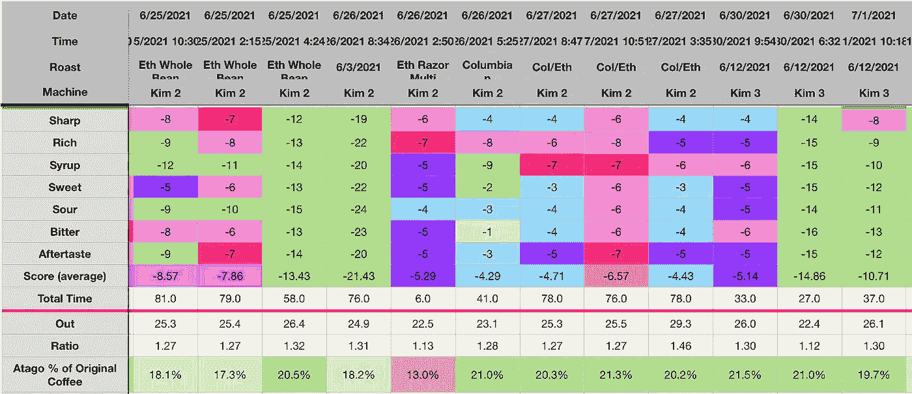
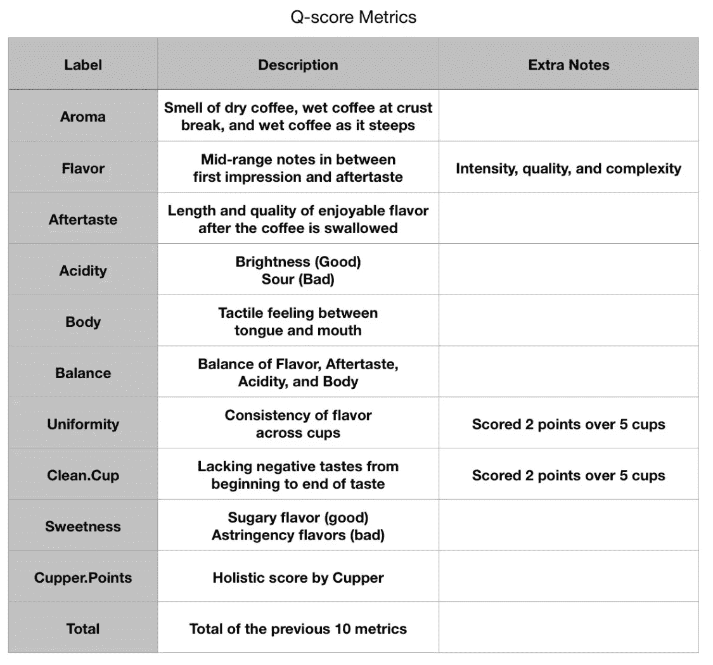
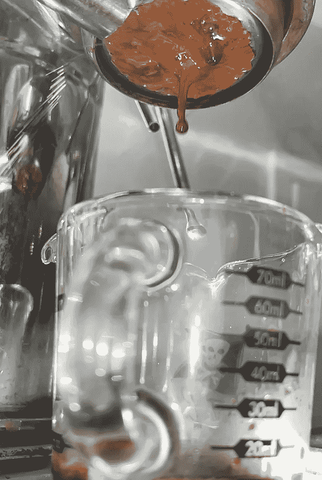
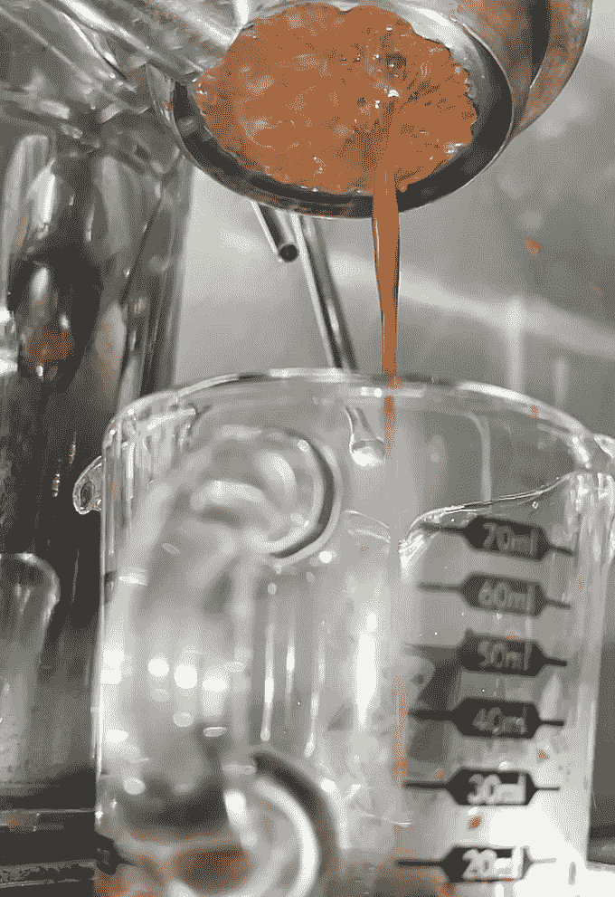
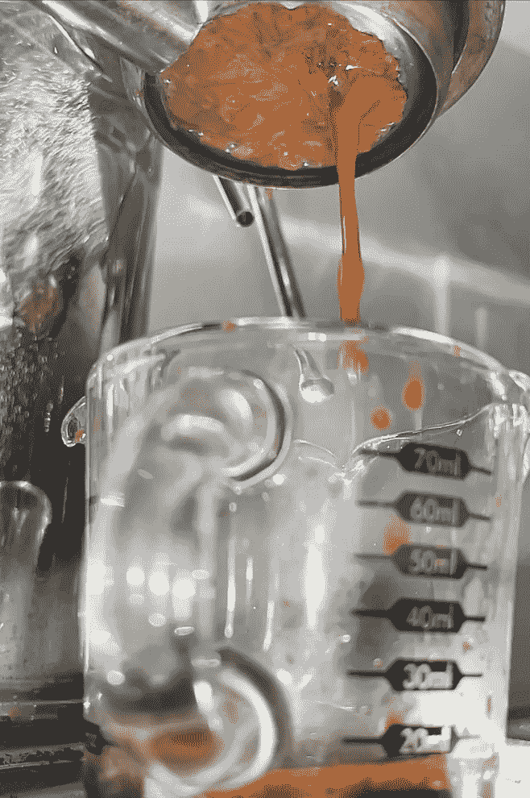
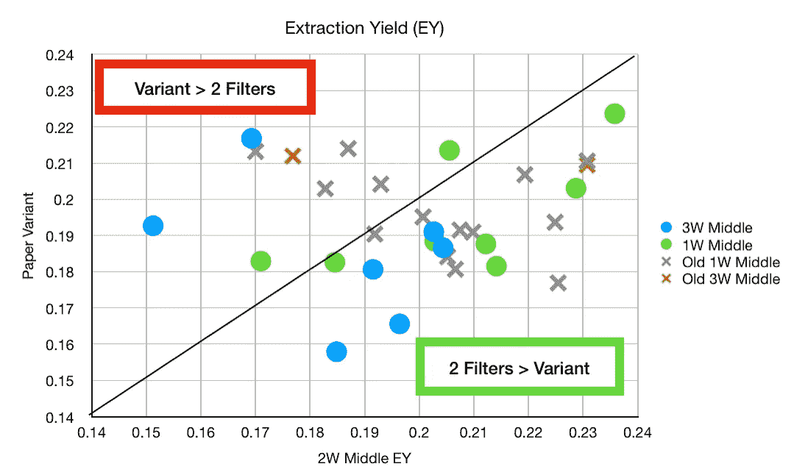
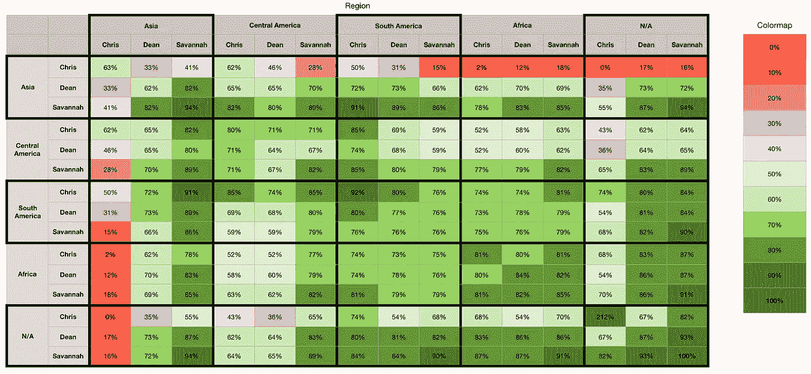
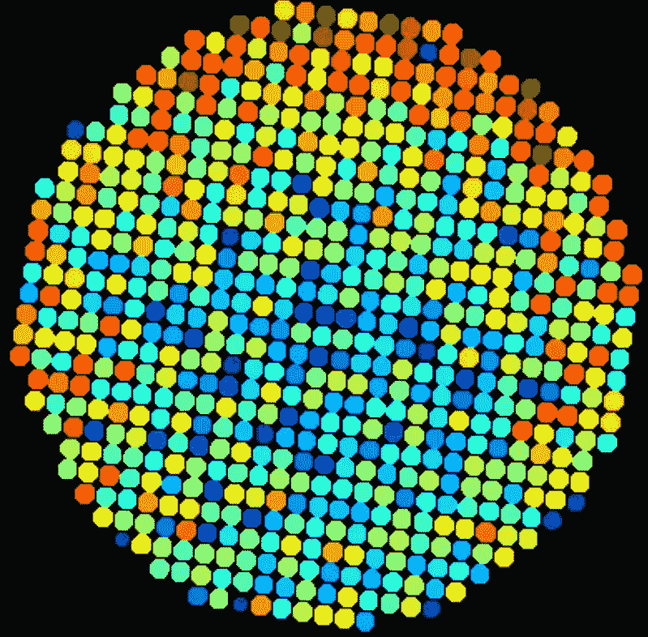

# 绩效指标:浓缩咖啡

> 原文：<https://towardsdatascience.com/metrics-of-performance-espresso-1ef8af75ce9a?source=collection_archive---------30----------------------->

## 咖啡数据科学

## 设计你的品味尺度！

浓缩咖啡是一种很难掌握的饮料，但也不是不可能。在过去的几年里，我已经通过这些不同的方法以及一张[数据表](/coffee-data-sheet-d95fd241e7f6)极大地提高了我的技术。因此，我将回顾一下我所使用的性能指标，以帮助那些有兴趣收集自己的数据来帮助改善他们的浓缩咖啡实验的人有一个更广泛的概述。

# 味觉测量

[**最终得分**](https://towardsdatascience.com/@rmckeon/coffee-data-sheet-d95fd241e7f6) 是记分卡 7 个指标(尖锐、浓郁、糖浆、甜味、酸味、苦味和回味)的平均值。当然，这些分数是主观的，但它们符合我的口味，帮助我提高了我的拍摄水平。分数有一些变化。我的目标是保持每个指标的一致性，但有时粒度很难确定。

所有图片由作者提供

前三个测量值需要解释，因为其他四个是不言自明的:

**尖锐**指的是当浓缩咖啡第一次触及你的舌头时的尖锐程度，以及它对你的味觉的震撼程度。我不喜欢因为喝了这么烈的东西而咳嗽，但这是我喜欢的尖锐的标志。这个标准的一个问题是，一个平滑的镜头不会很锐利，但这并不意味着它是一个糟糕的镜头。因此，这让我开始审视我所使用的衡量标准的变化，甚至是通过 Q-gradier 认证。

**丰富**是指镜头整体的丰富和复杂。我更喜欢 1:1 的比例(输入重量与输出浓缩咖啡的重量)，因为我想重温我喝的第一杯浓缩咖啡。我的第一枪尝起来就像在嘴里融化了一块巧克力；它完全占据了我的舌头。

**糖浆**指的是质地，我的目标是我记忆中的第一个镜头。浓咖啡在我的舌头上感觉很浓，像糖浆或融化的巧克力。另一个词是口感。我坚持用糖浆来赞美我第一份工作的日子。

我的评分不同于 Q 级选手用杯装咖啡时的评分。Q 分数是在咖啡杯过程中记录的 10 个因素的顶点。我根据自己对 [SCA 杯状协议](https://sca.coffee/research/protocols-best-practices)的理解，总结了每个指标。他们定义了如何准备咖啡样品，如何品尝，以及如何评分。我相信网上有很多资源可以帮助你通过快速搜索了解如何拔火罐。

作者提供的图片与本文中的所有图片一样

# 重量/时间指标

**重量测量:**

1.  输入重量(咖啡渣)
2.  输出重量(称量液体咖啡)
3.  射击时的输出重量

重量有助于控制一致性，并允许更好的拍摄比较。

**时间** **度量**:

1.  总拍摄时间
2.  预输注时间
3.  [时间覆盖过滤器(TCF)](/pre-infusion-for-espresso-visual-cues-for-better-espresso-c23b2542152e) 。

这些指标有助于保持一致性。

来自更好的天平的流量测量可以提供一些见解，它们可以帮助复制拍摄。最重要的是，在击球时使用秤可以让你每次都打出相同的重量。

# 高级指标

[**圆盘底部**](/espresso-puck-analysis-from-the-bottom-2019074abad7) 我观察了圆盘的底部，以帮助找到较暗的斑点或图案，这些斑点或图案表明我的分配或夯实工作存在问题。

[**无底的入口滤镜**](https://medium.com/geekculture/getting-naked-making-my-portafilter-bottomless-6dfd63d54e7c) 在拍摄过程中非常有用，可以看到滤镜上发生了什么。如果你看到喷水，你可以减少一些机器(杠杆机器)的压力，或者如果时间太长，你可以强迫更多的水通过，暂停，让咖啡沸腾。

**总溶解固体(TDS)是用折射仪测量的，这个数字结合弹丸的输出重量和咖啡的输入重量用来确定提取到杯中的咖啡的百分比，称为**提取率(EY)。****

**[**提取率(EY)**](https://rmckeon.medium.com/coffee-extraction-splash-page-3e568df003ac) 是溶解到咖啡杯中的咖啡渣的百分比。通常情况下，只有 30%的咖啡是可溶的，对于浓缩咖啡，你的目标是 18%到 22%，如果没有涩味的话，可能的话再高一点。**

# **超过最高指标**

**这些指标应用于数据，以了解镜头内部发生了什么。它们需要更多的时间和专业知识以及大量的实验。**

****图**可以帮助可视化不同的指标，以帮助人们看到模式。从这些图中，最佳拟合线可用于给出一个指标，衡量趋势线与数据的拟合程度。**

****

**[**相关性**](https://en.wikipedia.org/wiki/Correlation_coefficient) 是表示两个变量彼此相似程度的度量。高度相关并不意味着一个变量会引起另一个变量，而是当情况发生变化时，两个变量的涨跌幅度相同。我从一开始就假设一些分级变量有很高的相关性，因为它们从不同的时间点观察味道，如丰富度和回味。**

****

**[**咖啡颗粒分析**](https://link.medium.com/K3oOe2bqxib) 可用于帮助了解您的研磨机如何工作，以及哪些设置最适合您的设置。这通常必须使用筛选或成像来完成。**

****

**[**过滤篮分析**](https://link.medium.com/PSrfXPaqxib) 可用于了解屏幕上的图案是否与过滤篮的孔尺寸和间距有关。它也可以用来帮助理解总孔面积和比较一个过滤篮与另一个。**

****

**[**咖啡等级和风味分析**](https://link.medium.com/DkcPwCdqxib) 可以用来寻找相互补充的咖啡，也可以更好地了解世界各地咖啡之间的差异以及它们在当地的相似性。**

********

**我不建议任何人使用我使用的所有指标。我发布它们是为了鼓励人们找到对他们最有意义的指标。当我第一次设计我的味觉量表时，我没有使用 Q 级量表。我深入思考了一杯浓缩咖啡对我最重要的意义，然后试图找到合适的词来描述它。最终，制作浓缩咖啡是根据你最喜欢的口味来酿造的，你的口味偏好是一些严肃的个人事务。**

**如果你愿意，可以在推特[和 YouTube](https://mobile.twitter.com/espressofun?source=post_page---------------------------)上关注我，我会在那里发布不同机器上的浓缩咖啡照片和浓缩咖啡相关的视频。你也可以在 LinkedIn 上找到我。你也可以关注我的[媒体](https://towardsdatascience.com/@rmckeon/follow)。**

# **[我的进一步阅读](https://rmckeon.medium.com/story-collection-splash-page-e15025710347):**

**[浓缩咖啡系列文章](https://rmckeon.medium.com/a-collection-of-espresso-articles-de8a3abf9917?postPublishedType=repub)**

**[工作和学校故事集](https://rmckeon.medium.com/a-collection-of-work-and-school-stories-6b7ca5a58318?source=your_stories_page-------------------------------------)**

**[个人故事和关注点](https://rmckeon.medium.com/personal-stories-and-concerns-51bd8b3e63e6?source=your_stories_page-------------------------------------)**

**[乐高故事启动页面](https://rmckeon.medium.com/lego-story-splash-page-b91ba4f56bc7?source=your_stories_page-------------------------------------)**

**[摄影启动页面](https://rmckeon.medium.com/photography-splash-page-fe93297abc06?source=your_stories_page-------------------------------------)**

**[使用图像处理测量咖啡研磨颗粒分布](https://link.medium.com/9Az9gAfWXdb)**

**[改进浓缩咖啡](https://rmckeon.medium.com/improving-espresso-splash-page-576c70e64d0d?source=your_stories_page-------------------------------------)**

**[断奏生活方式概述](https://rmckeon.medium.com/a-summary-of-the-staccato-lifestyle-dd1dc6d4b861?source=your_stories_page-------------------------------------)**

**[测量咖啡磨粒分布](https://rmckeon.medium.com/measuring-coffee-grind-distribution-d37a39ffc215?source=your_stories_page-------------------------------------)**

**[咖啡萃取](https://rmckeon.medium.com/coffee-extraction-splash-page-3e568df003ac?source=your_stories_page-------------------------------------)**

**[咖啡烘焙](https://rmckeon.medium.com/coffee-roasting-splash-page-780b0c3242ea?source=your_stories_page-------------------------------------)**

**[咖啡豆](https://rmckeon.medium.com/coffee-beans-splash-page-e52e1993274f?source=your_stories_page-------------------------------------)**

**[浓缩咖啡滤纸](https://rmckeon.medium.com/paper-filters-for-espresso-splash-page-f55fc553e98?source=your_stories_page-------------------------------------)**

**[浓缩咖啡篮及相关主题](https://rmckeon.medium.com/espresso-baskets-and-related-topics-splash-page-ff10f690a738?source=your_stories_page-------------------------------------)**

**[意式咖啡观点](https://rmckeon.medium.com/espresso-opinions-splash-page-5a89856d74da?source=your_stories_page-------------------------------------)**

**[透明 Portafilter 实验](https://rmckeon.medium.com/transparent-portafilter-experiments-splash-page-8fd3ae3a286d?source=your_stories_page-------------------------------------)**

**[杠杆机维修](https://rmckeon.medium.com/lever-machine-maintenance-splash-page-72c1e3102ff?source=your_stories_page-------------------------------------)**

**[咖啡评论和想法](https://rmckeon.medium.com/coffee-reviews-and-thoughts-splash-page-ca6840eb04f7?source=your_stories_page-------------------------------------)**

**[咖啡实验](https://rmckeon.medium.com/coffee-experiments-splash-page-671a77ba4d42?source=your_stories_page-------------------------------------)**