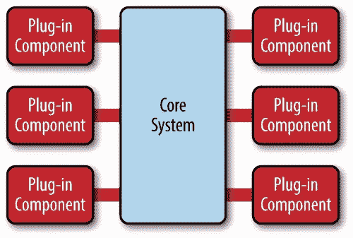
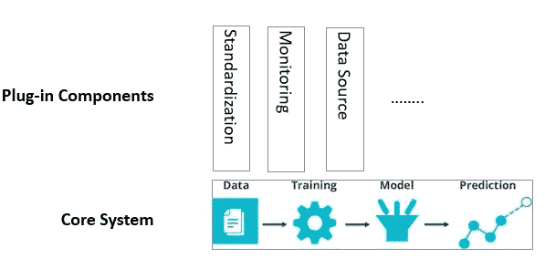

# 机器学习库的微内核体系结构

> 原文：<https://towardsdatascience.com/microkernel-architecture-for-machine-learning-library-c04b797e0d5f?source=collection_archive---------38----------------------->

## [实践教程](https://towardsdatascience.com/tagged/hands-on-tutorials)

## Python 元类的微内核架构示例

# **什么是微核架构**

[微内核架构有时被称为插件架构。它由核心系统和插件组成](https://learning.oreilly.com/library/view/software-architecture-patterns/9781491971437/ch03.html)。

核心系统包含使系统运行所需的最少功能。插件组件是独立的，彼此独立，每个组件都用附加功能增强或扩展了核心系统。

核心系统还维护一个插件注册表，它定义了核心系统和每个插件组件之间的信息和契约，如输入/输出签名和格式、通信协议等。



图片来自 O'Reilly: [软件架构模式](https://www.oreilly.com/library/view/software-architecture-patterns/9781491971437/)

微核架构的利弊是相当明显的。一方面，关注点的分离使得它非常灵活和可扩展，并且易于维护、测试和发展。它特别适合于基于产品的应用程序，在这种应用程序中，您可以向客户提供一个 MVP，并在这个过程中添加更多的版本和特性，而几乎不做任何更改。

另一方面，这种体系结构不适合需要频繁通信和不同组件之间依赖的系统。您当然可以在插件模块之间添加依赖项，但是依赖项的数量越多，维护成本将呈指数级增长，这超过了它带来的好处。

# 为什么机器学习库采用微内核架构

除了训练和预测，典型的机器学习库还有许多关注点，如数据源的可配置源/汇，以及标准化、监控、安全等跨领域关注点。这些方面和问题是孤立的，独立于数据科学家的建模技术和算法。最好由其他工程师来解决。

微内核架构非常适合这样的目的。它支持数据科学和插件工程组件的并行开发，同时保持高度的灵活性和可维护性。

# Python 元类的微内核架构示例

## **什么是 Python 元类**

在 Python 中，元类是类的类。它定义了一个类的行为方式以及该类的实例是如何被实例化的。您可以将元类视为类工厂，这允许您在创建类时做一些额外的事情。在我们的例子中，我们创建了一个元类，用于向主模型类注册插件组件。从而将建模实例与工程模块分离。数据科学家可以将所有注意力集中在建模上，而工程师可以并行处理工程组件。

## 这个例子

我为这个微内核架构创建了一个 PyPi 包 [**mkml**](https://pypi.org/project/mkml/0.0.2/) 。如何使用请参考 [**github**](https://github.com/ahhuisg/mkml) 库。



具有微内核架构的 ML 库

出于演示目的，我创建了 3 个插件组件，分别是**标准化**、**监控**和**数据源**插件:

*   **标准化插件**实施模型类的方法签名。在我们的例子中，模型类必须有**拟合、预测**和**评分**方法
*   监控插件监控模型类的所有功能。在我们的例子中，它记录了输入参数、异常以及模型类中每个函数的持续时间
*   LocalDataSourcePlugin 帮助在本地加载数据。它动态地将数据加载函数接收到模型类中，帮助数据科学家检索数据，而不用担心如何检索

**从 PyPi 安装**

```
pip install mkml
```

**通过从链接到自定义元类的 BaseModel 扩展来创建你自己的模型**

```
from sklearn.linear_model import LinearRegression
from mkml import BaseModel

class UserModel(BaseModel):
    def __init__(self):
        self._model = LinearRegression()

    def fit(self, features, labels):
        self._model.fit(X_train, y_train)

    def predict(self, features):
        self._model.predict(features)

    def score(self, features, labels):
        return self._model.score(features, labels)
```

**实例化模型类实例，加载用于训练和预测的特征和标签**

```
um = UserModel()

features = um.get_local_data(feature_mart_location='data', group_id='train_features')
labels = um.get_local_data(feature_mart_location='data', group_id='train_labels')

um.fit(features, labels)

test_features = um.get_local_data(feature_mart_location='data', group_id='test_features')
test_labels = um.predict(test_features)
```

创建你自己的定制插件模块(即远程数据源的插件)

```
from mkml import BasePlugin

class RemoteDataSourcePlugin(BasePlugin):

    def __init__(self, name):
        self._name = name

    def apply(self, attrs, **kwargs):
        logger.debug('Entering data source plugin')
        attrs['get_remote_data'] = self._get_remote_data

    def _get_remote_data(self, feature_mart_location, group_id):
        # To be implemented
        pass
```

**向元类注册自定义插件模块**

```
## You can add additional instantiation parameters to the Plug-in class as well	
MKMLMetaclass.register('remote_datasource', RemoteDataSourcePlugin, 'remote_ds_plugin')
```

元类 **MKMLMetaclass** 控制**用户模型**类的实例化行为。因此，一旦 **RemoteDataSourcePlugin** 向元类注册，UserModel 类将具备插件带来的能力。

**使用新的远程数据源插件检索特征和标签**

```
um = UserModel()

features = um.get_remote_data(feature_mart_location='http://fm', group_id='train_features')
labels = um.get_remote_data(feature_mart_location='http://fm', group_id='train_labels')
```

样本用法请参考本[笔记本](https://github.com/ahhuisg/mkml/blob/main/notebooks/mkml.ipynb)。

# 结论

在本文中，我介绍了什么是微内核架构，并且我还创建了一个 PyPi 包 [**mkml**](https://pypi.org/project/mkml/0.0.2/) 来演示这种架构如何给 ml 库设计带来好处。

在我看来，微内核架构的最大优势是数据科学和工程工作负载之间的解耦，同时保持系统非常高的可扩展性和可维护性。**一个好的架构设计总是追求控制、逻辑和数据的清晰分离。**该架构清楚地展示了这样一个特征。

最后一点要注意的是，虽然 Python 的元类用于实现，并且它是一个非常强大的工具，但是在尝试使用它时要非常小心，因为如果使用不当，它会导致许多问题。