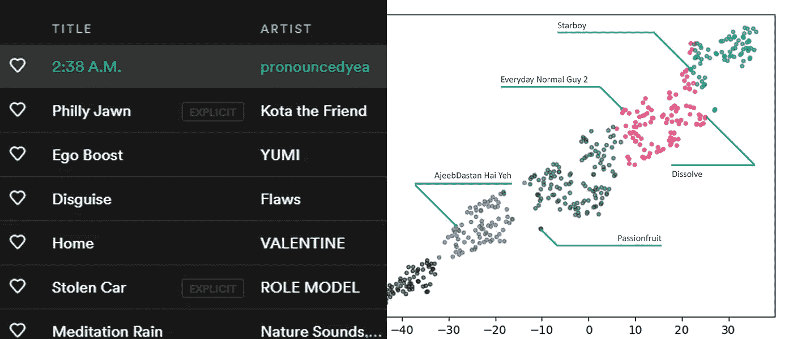
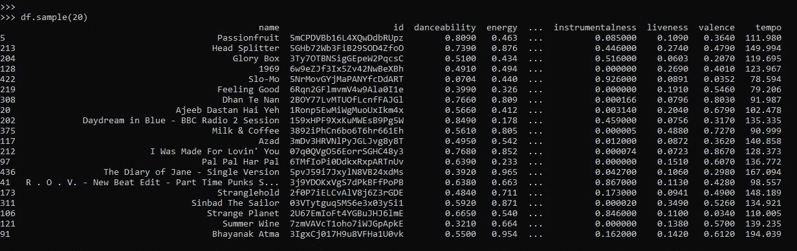
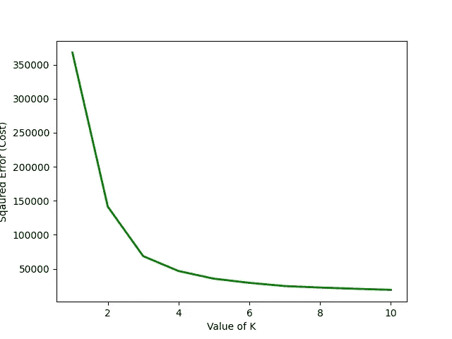
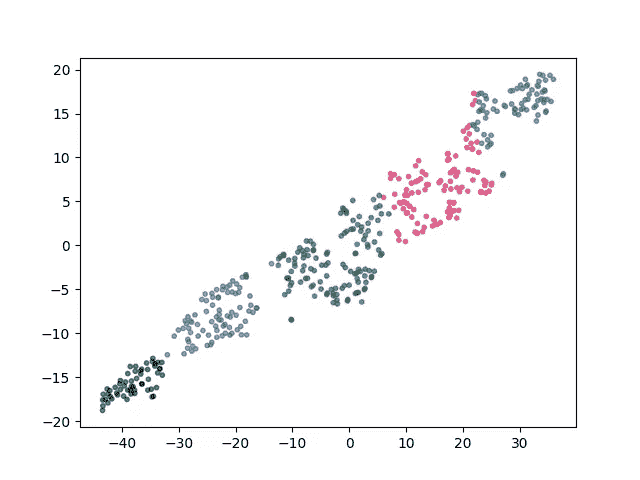
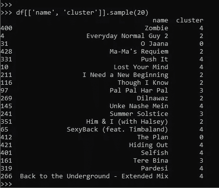
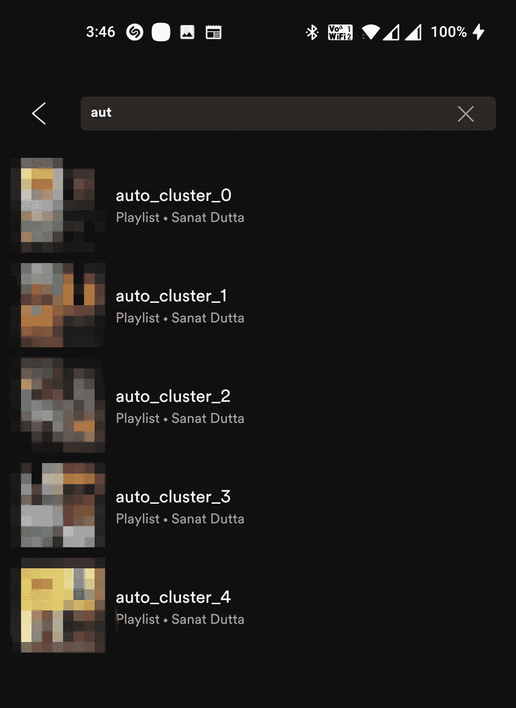
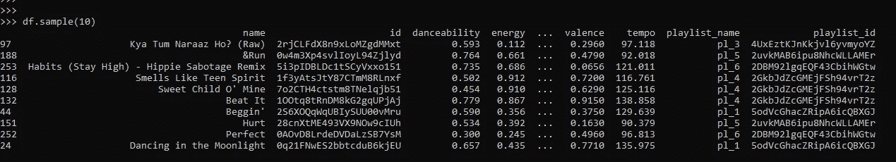
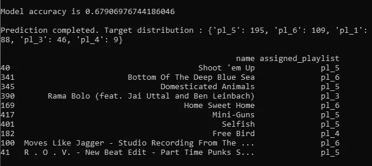

# 午夜黑客 5:使用机器学习对 Spotify 播放列表进行分类

> 原文：<https://towardsdatascience.com/midnight-hack-5-using-machine-learning-to-categorize-spotify-playlists-57dc492fc3e6?source=collection_archive---------16----------------------->

## 使用 KNN 和随机森林对 Spotify 曲目进行分类和聚类。

向播放列表中添加一首曲目可能只需要一秒钟，但作为精英拖延者的代表，我拒绝这样做。相反，当我喜欢一首歌的时候，我只需要点击喜欢按钮，然后永远把它留在那里。

偶尔，你会有给自己的生活带来一些秩序的冲动，这通常发生在凌晨 2 点。所以你坐下来，打开 [Spotify](https://www.spotify.com/) ，随机播放你喜欢的歌曲，并试图一首接一首地将它们添加到播放列表中，结果却不知所措，中途退出，在网上订购食物。

在这里，我将向你展示如何不像我一样，利用机器学习为你带来优势。在这篇文章中，我们将涵盖监督和非监督的方法。在无监督的方法中，我们将使用歌曲特征来聚类音轨。在监督方法中，我们将使用现有的播放列表来训练一个模型，以了解曲目和播放列表之间的关系，并使用该模型将喜欢的曲目分类到这些播放列表之一。

我们还将介绍自动创建播放列表，以及使用 Spotify APIs 向播放列表添加曲目。如果你不熟悉 Spotify 认证和范围，我建议你看看我以前的[文章](https://betterprogramming.pub/midnight-hack-episode-4-automating-spotify-mapping-spotify-functions-to-keyboard-shortcuts-3ea5302bb2cb)。

**数据准备:**

*   获取喜欢的曲目并生成音频特征。

**无监督方法:**

*   使用 [KNN](https://en.wikipedia.org/wiki/K-nearest_neighbors_algorithm) 将喜欢的曲目分类成簇。
*   基于群集组创建播放列表并将曲目添加到播放列表。

**监督方法:**

*   获取现有的播放列表和曲目，并生成训练数据。
*   训练一个[随机森林模型](https://en.wikipedia.org/wiki/Random_forest)进行轨迹分类。
*   使用训练好的模型将喜欢的曲目分类到现有播放列表中。

**数据准备:**

我们可以通过 [spotipy](https://spotipy.readthedocs.io/) 包轻松访问 Spotify APIs。查看上面提到的文章，获取 Spotify `client_id` 和`client_secret.`

一旦我们准备好 Spotify 客户端，我们就可以通过客户端使用所有 Spotify APIs。在这里，我们可以使用`current_user_saved_tracks()` API 来获得一个喜欢的曲目列表。Spotify 的大部分列表 API 都是分页的，以限制 API 过载。在处理了分页逻辑之后，我们得到了我们喜欢的曲目的完整列表。

Spotify 存储了大量曲目元数据。这里我们只保存了曲目的`id`和`name`。

为了生成音频特征，最初我想下载所有曲目的音频波形，并使用类似`**librosa**` 的库来手动生成音频特征，但在浏览 Spotify API 文档时，我遇到了返回类似`danceability, energy, key, loudness`和 7 个其他音频特征的`audio_features()` API。

为了获得更好的准确性，我们应该用正确的函数对特征和每个特征进行规范化。例如，音量以分贝为单位，这是一个对数标度，因此最小-最大标度并不准确。对于这个项目，我没有标准化的功能。

我只为自动化使用了这些功能，但附加功能如地区/语言信息，轨道长度等。也可用于提高模型精度。

**无监督方法:**

现在我们有了轨迹数据，我们可以对轨迹进行聚类。但是在分组之前，我们需要确定应该生成多少个聚类(K)。我们可以使用[弯头方法](https://en.wikipedia.org/wiki/Determining_the_number_of_clusters_in_a_data_set)来完成。在这种方法中，用不同数量的 K 值来拟合模型。成本值是相对于 K 值绘制的，曲线断裂的地方被认为是最佳 K 值。这不是一个固定的规则，但它缩小了 K 范围，以便更好地进行聚类。

正如你在上面的图中所看到的，曲线在 K=3 附近断裂，但是直到 K=5 才开始饱和。我使用 K=5，并将我的曲目分成 5 个播放列表。

因为我使用了 11 个音频特征，所以很难在 2d 图上显示 11 维向量。因此，我使用 [TSNE](https://scikit-learn.org/stable/modules/generated/sklearn.manifold.TSNE.html) 来降低音频向量的维数，以便进行聚类分析。

在上面的图中，每个点代表一首曲目，每种颜色代表一个播放列表。既然我们已经将喜欢的曲目映射到组，我们可以使用 Spotify APIs 为每个组创建播放列表，并将各自的曲目添加到播放列表中。

这是自动创建的播放列表的屏幕截图，其中包含已整理的轨道。

**监督方法:**

无监督 KNN 方法简单快速，但也有问题。它假设所有的特性都是同等重要的，我们没有任何衡量标准来确定哪个特性比其他特性更重要。

在无监督的方法中，我们拟合了一个模型，根据音频特征对曲目进行分组，但我们能教会它去爱吗？表现情绪？大概不会。但我们肯定可以教它学习现有播放列表及其曲目之间的关系。

当我们已经有几个播放列表时，我们有一个目标变量。我们可以识别用户逻辑，并推断用户下意识地用来将某个音轨分类到播放列表的权重。当然，这里我们假设用户也下意识地使用了相同的音频特征。因此，相关功能是重要的，但我们将与我们现有的工作。

首先，我们需要准备训练数据，我们将在这些数据上训练我们的机器学习模型。

我选择了一些我的播放列表，其中有合理数量的曲目。我们拥有的数据越多越好。

这个数据结构与喜欢的曲目数据相同，但是这里每个曲目都被映射到一个播放列表。

有了训练数据，我在 70%的数据上使用默认配置训练了一个随机森林分类器。这里可以增加`max_depth`以获得更好的准确性，但这可能会导致模型过度适应训练数据。

在对剩余的 30%的数据进行测试时，模型精度达到了 67%左右，考虑到有限的数据集和最小的超参数调整，这是相当不错的。

现在，我们可以使用这个经过训练的模型来预测和分配喜欢的曲目的播放列表，并使用我们在上一节中使用的相同 API 来将曲目添加到播放列表。

**脚注:**

这里讨论的方法并不完美，仅仅是概念上的证明。通过使用相关特征、适当的数据标准化、测试不同的分类器和使用适当的超参数，我们可以极大地提高模型的准确性。

直到下一次…