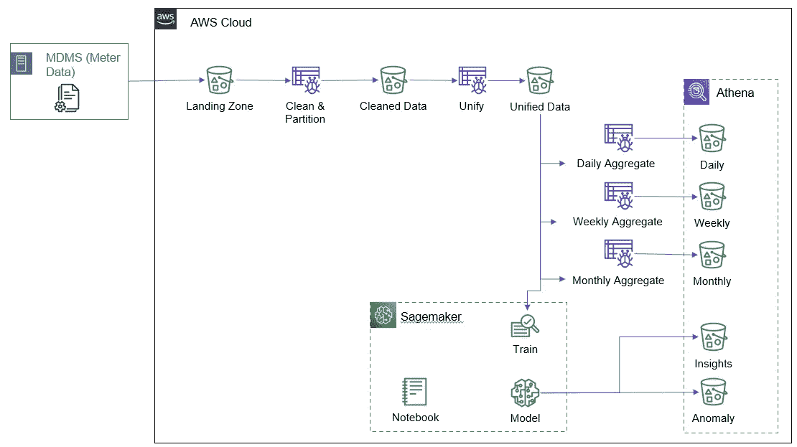
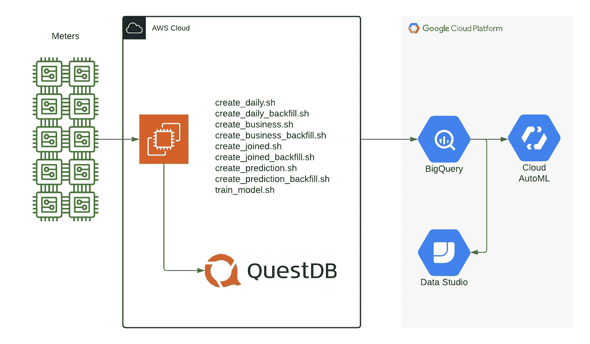
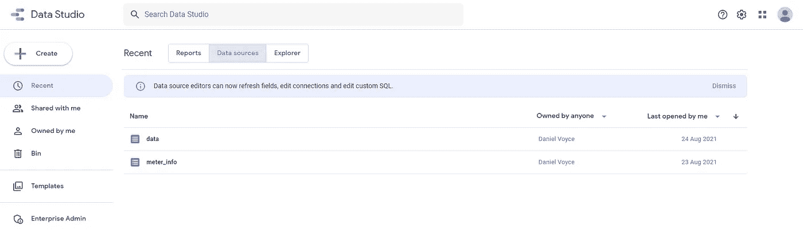
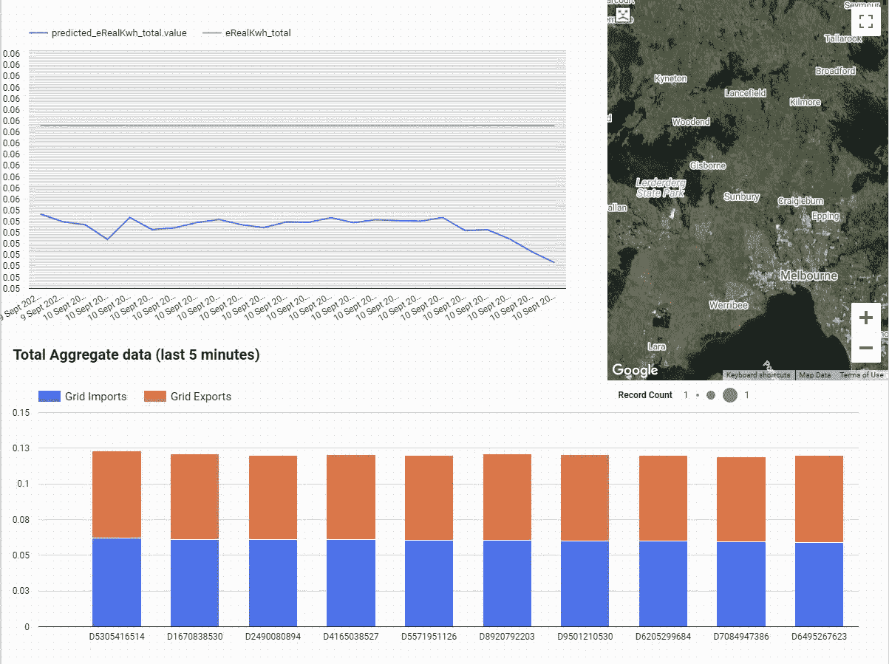
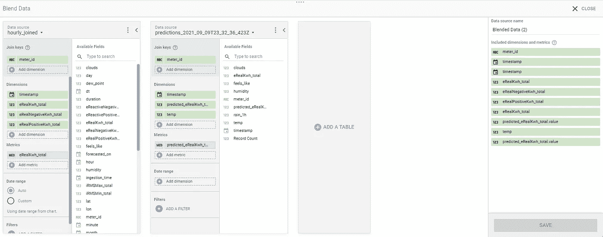

# 从 AWS Glue 迁移到 BigQuery 进行 ETL

> 原文：<https://towardsdatascience.com/migrating-from-aws-glue-to-bigquery-for-etl-ac12980f2036?source=collection_archive---------16----------------------->


安德鲁·鲁伊斯在 [Unsplash](https://unsplash.com?utm_source=medium&utm_medium=referral) 上的照片

我用大量 AWS 胶水记录了我们的旅程【https://tymlez-au.medium.com/ 

# 为什么要迁移？

自从几年前在 AWS re:invent 上看到关于 AWS Glue 的主题演讲，我就对它感兴趣，它似乎在“你知道的工具”和“没有设置”之间取得了很好的平衡，有一段时间它工作得很好。
它在某种程度上填补了这些工具通常具有的无服务器编排的空白&。

不幸的是，为了做到这一点，它必须清除这些工具所具有的一些 USP，这样做会造成复杂性。

AWS Glue 为我们的批量摄取提供了很好的服务，但很快就发现，尽管 AWS Kinesis 是一个受支持的输入，但它在当前版本中无法扩展到实时摄取。

我们需要一种不那么痛苦的替代解决方案。

# 我们的胶水管道



TYMLEZ 的 AWS 仪表数据设置(图片由作者提供)

简而言之，glue pipeline 接收批量数据，这些数据是我们的计量技术和智能仪表读数转储到 S3 的(稍后将详细介绍这一点，因为这很重要)，并通过各种脚本运行这些数据，以将数据转换为我们需要的数据。

具体设置可以在这里了解更多:[https://tymlez-au . medium . com/smart-meter-data-ETL-systems-at-tymlez-5643 e 232 dfbb](https://tymlez-au.medium.com/smart-meter-data-etl-systems-at-tymlez-5643e232dfbb)

编排是通过 AWS Glue 触发器串行完成的(例如，当这一步完成时，运行下一步)，不幸的是，这意味着每次都需要部署来使用它们，这大大减慢了开发过程，并且由于其他问题(这里讨论:[https://tymlez-au . medium . com/AWS-Glue-is-a-mess-886 cc 1d 13 ca 9](https://tymlez-au.medium.com/aws-glue-is-a-mess-886cc1d13ca9))没有简单的方法来设置一个简单的本地环境来手动运行这些项目。

简而言之——它制造的麻烦比解决的问题还多。

# 为什么是 GCP？

很简单——因为 BigQuery。当谈到轻松处理大量数据时，市场上没有像 Google BigQuery 这样的产品。

归结起来就是简单，我们的工作流在从设备读取时非常标准，设备每 x 分钟发出一次 JSON——我们需要获取该 JSON 并将其写入我们的数据仓库。

## AWS 流程:

设备->*处理器** " - > Kinesis - > AWS 胶表- >雅典娜

让 Kinesis 与 AWS Glue Tables 一起工作几乎是不可能的(试图在本地开发这一点甚至更难)。

## GCP 流量:

设备->*处理器**->big query

**处理器是某种形式的处理能力，如 EC2、Lambda、云函数等*

GCP 流只是工作，它工作得如此简单，以至于我可以在这里包含我用来为开发摄取的代码:

一旦数据进入 BigQuery，我们只需使用一个标准的 ELT 模式，根据需要将数据分成一堆新表，并设置它们通过 cron 运行。

我们的管道现在看起来像这样:



多重云设置(图片由作者提供)

大型 PySpark 脚本被直接处理 BigQuery 中导入数据的 SQL 数据所取代。

```
CREATE OR REPLACE TABLE data_clean AS ( SELECT x FROM data…)CREATE OR REPLACE TABLE data_business AS ( SELECT x FROM data_clean…)CREATE OR REPLACE TABLE prediction_input AS ( SELECT x FROM data_business…)CREATE OR REPLACE MODEL usage_forecast OPTIONS(model_type=’ARIMA_PLUS’...
```

注意，作为使用 SQL 的这一步骤的一部分，我们还可以直接从 BigQuery 中训练一个模型？我们不仅将数据 ETL 到 BI 和其他报告所需的表格中，还生成了一个 ARIMA+模型，用于根据大量不同的输入预测数据。此外，我们可以单独使用相同的数据来训练 AutoML 模型进行测试。

# ML 管道— Sagemaker vs Vertex。人工智能

Sagemaker 很棒，它允许通过 SAGEMAKER.invoke_endpoint 请求进行真正干净的模型部署。它可以处理很多事情，比如为训练好的模型轻松地创建端点，以便进行预测。

GCP 有顶点。AI 与此类似，尽管它不太成熟，不支持 AutoML 模型的端点创建，但目前更简单的是简单地批处理日期预测模型，并使它们在 BigQuery 或其他表中可用，然后可以通过静态 API 查询。

这也可以通过 Cron 非常简单地完成，方法是基于以前的日期批量创建日期预测输入，并针对重新训练的模型运行批量预测。

不需要步进机、触发器或任何东西——如果一天内需要更新，这也是很好的幂等方法。

# 数据可视化— Quicksight 与 Data Studio

AWS 有 Quicksight 作为它的 BI 工具，但是我从来没有用过它，它看起来总是限制太多。有时，您希望快速搭建一个仪表盘，从数据中获得一些高管或董事会层面的见解，而无需花费大量时间。

谷歌有 Data Studio，在我看来，这是一个非常好的产品，感觉就像是谷歌产品套件的一部分。

我可以创建一个数据集，并与我们业务中的任何人共享，以便创建特定的 BI 仪表板。



然后，谁可以拖放图表并将其与易于理解的数据表示联系起来:



我们的数据工作室设置(图片由作者提供)

我特别喜欢 Blend Data 接口，它抽象了许多需要完成的底层连接，以便从系统中获取大部分数据，并允许您轻松地连接几个表以获得所需的结果:



混合数据界面(图片由作者提供)

# 结论

当我们开始深入挖掘它的流功能时，我们的 AWS Glue 之旅有点艰难，如此多的层的编排增加了我们没有预料到的巨大开销，虽然大多数都是在 AWS 产品套件中处理的，但将我们的管道切换到 GCP 和 BigQuery 有太多的好处不容忽视。

下一步是通过使用 Cloud Composer (Airflow)来协调每个表的创建，并提供一个监控仪表板来帮助我们检测故障并采取行动，从而完成我们的部署。

## *更新—2021 年 9 月 13 日*

我要说的是，在我发表上一篇文章后，AWS 与我取得了联系，我与 AWS Glue 产品团队通了电话，用他们的话说，我已经“触及了几乎所有可能的尖锐边缘”(这似乎是我的一个持续主题——也许我应该转行做 QA 工程师？)，他们有一系列令人兴奋的更新正在进行中，应该可以解决其中的许多问题，我期待着看到它们，因为我仍然坚持认为，对于不太复杂的数据批处理，AWS Glue 是一个具有很高可见性的优秀产品。

# 关于作者


**首席技术官丹·沃伊斯**

Dan 负责 TYMLEZ 的技术战略、架构和开发。
一位从业超过 20 年的创业老手，擅长建立高绩效开发团队，并带领他们成功地为澳大利亚和英国的一些大公司提供解决方案。