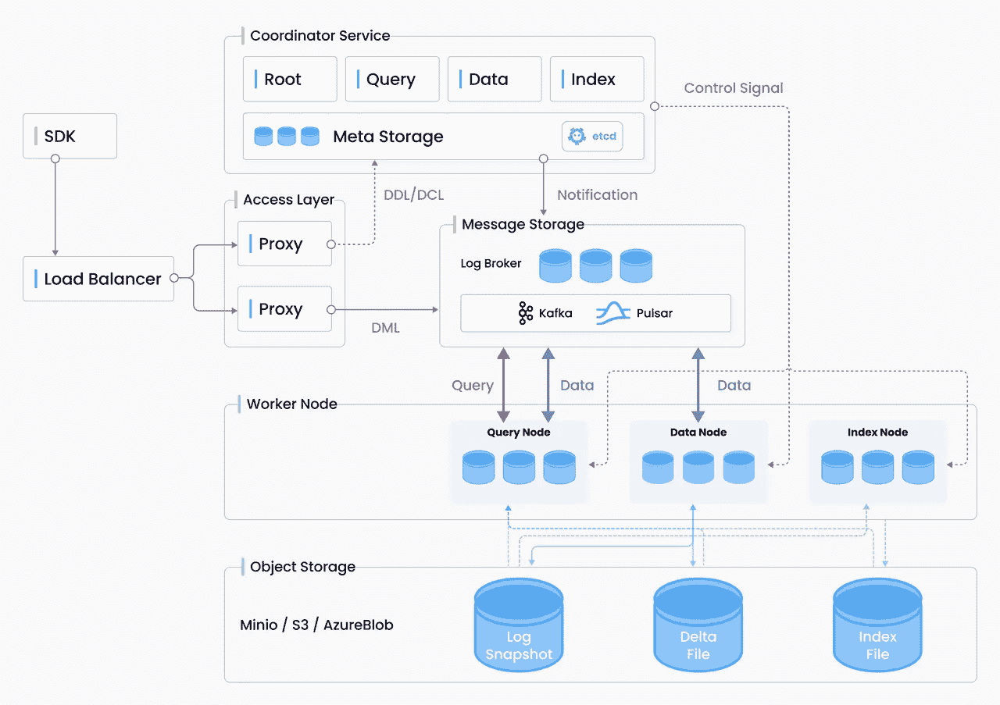
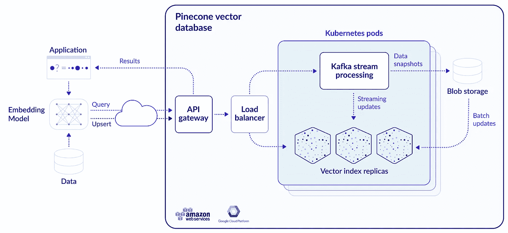
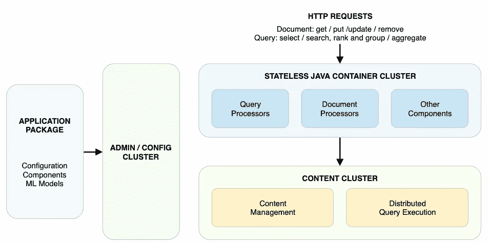
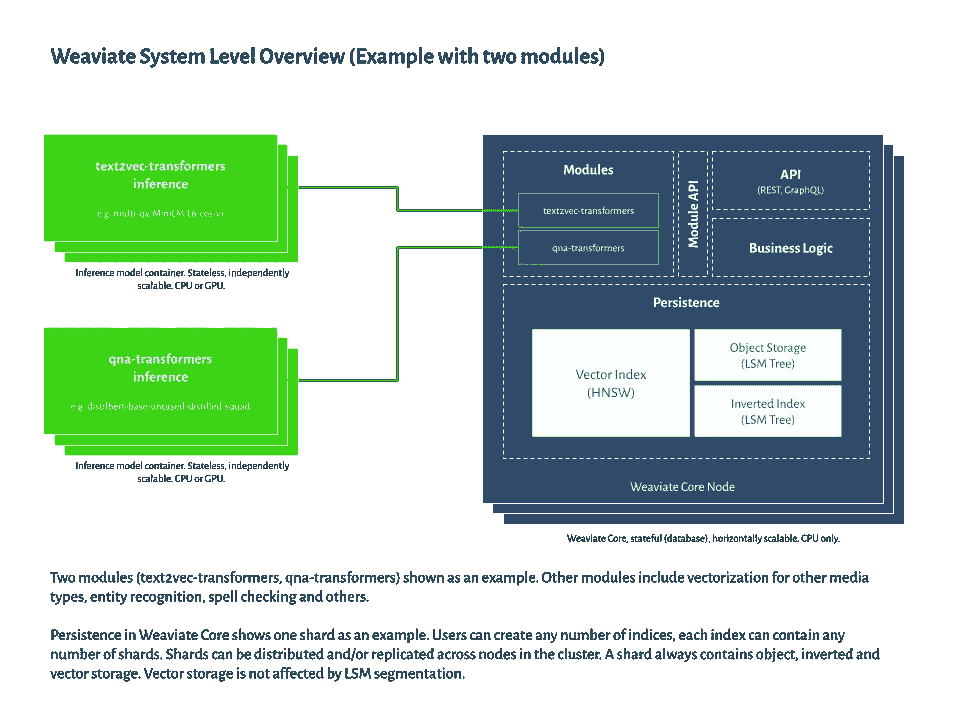
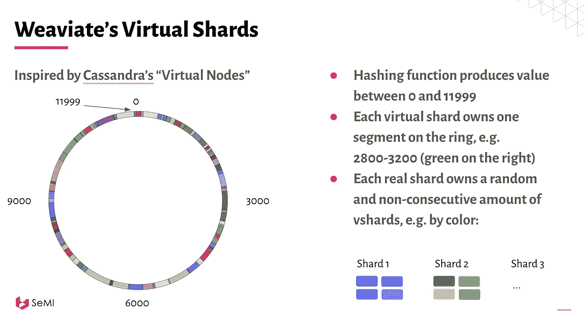
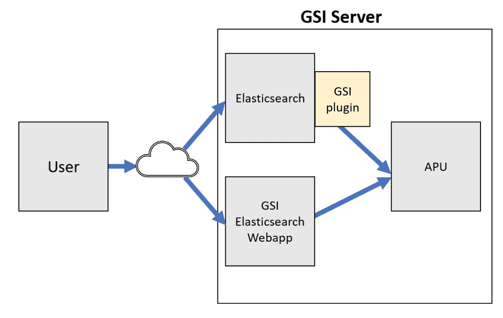
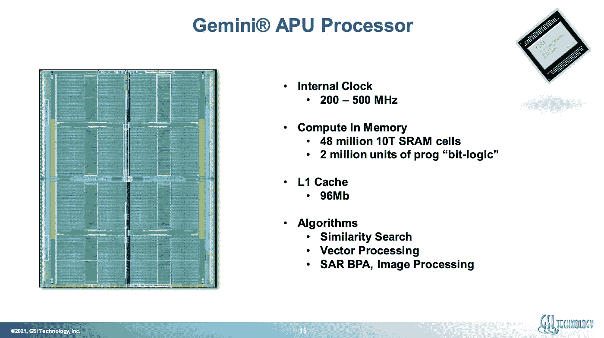

# 并不是所有的矢量数据库都是相同的

> 原文：<https://towardsdatascience.com/milvus-pinecone-vespa-weaviate-vald-gsi-what-unites-these-buzz-words-and-what-makes-each-9c65a3bd0696?source=collection_archive---------1----------------------->

## Milvus、Pinecone、Vespa、Weaviate、Vald、GSI 和 Qdrant 的详细比较

在撰写这篇博文的过程中，我有幸与所有搜索引擎的主要开发人员/领导进行了交流:鲍勃·范·路易特和艾蒂安·迪洛克(Weaviate)、格雷格·科岗(松果)、帕特·拉塞尔、乔治·威廉姆斯(GSI 科技公司)、菲利普·哈尔特迈尔(Milvus)、乔·克里斯蒂安·贝尔古姆(Vespa)、汤川纪一郎(Vald)和安德烈·扎亚尼(Qdrant)

这个博客已经在 https://news.ycombinator.com/item?id=28727816 的[HN](https://news.ycombinator.com/item?id=28727816)上被讨论过

更新:矢量播客[推出](https://dmitry-kan.medium.com/vector-podcast-e27d83ecd0be)！

更新 2:这篇博客构成了 Deepset 的 NLP meetup 上以下演示的基础:

向量数据库的前景:在 Deepset 的 NLP 会议上与[Max Irwin]([https://medium.com/u/ef0b7261dd17](https://medium.com/u/ef0b7261dd17))共同展示

更新 3:在 Sease 组织的伦敦 IR Meetup 上做了一个新的演示，讨论了矢量搜索的参与者:

向量搜索中的玩家:算法、软件和用例。在由 Sease 组织的伦敦 IR Meetup 上展示

照片由 [XVIIIZZ](https://unsplash.com/@xviiizz?utm_source=medium&utm_medium=referral) 在 [Unsplash](https://unsplash.com?utm_source=medium&utm_medium=referral) 上拍摄

我们已经接近在搜索引擎体验的基础层面上涉及机器学习:在多维多模态空间中编码对象。这不同于传统的关键字查找(即使增加了同义词/语义)，在很多方面都很有趣:

*   对象级的集合级相似性。您可以使用相似性函数(距离度量)而不是稀疏关键字查找来查找查询的邻居。在带有分片的 BM25/TF-IDF 方法中，您将拥有来自不兼容的分片级集合的文档分数(除非您设置了全局更新的 [IDF](https://stackoverflow.com/questions/51096175/idf-similarity-across-shards-does-not-work-as-expected-uses-only-local-shard-in) 缓存)。
*   将几何相似性的概念作为语义的一个组成部分，而不仅仅是原始对象的特定属性(在文本的情况下——它的关键字/术语)。
*   多模态:对任何对象进行编码——音频、视频、图像、文本、基因组、[软件病毒](https://medium.com/gsi-technology/application-of-ai-to-cybersecurity-part-3-19659bdb3422)，一些复杂的对象(比如[代码](https://github.blog/2018-09-18-towards-natural-language-semantic-code-search/)，你有一个编码器和一个相似性度量标准——并在这些对象之间进行无缝搜索。

同时，关键字可以以互补的方式与相似性搜索相结合，特别是在你面临长尾零命中问题的情况下(这可能相当大，就像在[电子商务](https://lucidworks.com/post/how-zero-results-are-killing-ecommerce-conversions/)领域)。

这篇博客文章独立地试图强调 7 个向量数据库之间的共性和差异，每个向量数据库都提供商业云支持。七分之五的人提供他们的代码作为你自己主机的开源。帖子**不**包括神经搜索框架(像[纪娜。AI](https://jina.ai/) 、 [FAISS](https://faiss.ai/) 或者 deepset 的[草堆](https://github.com/deepset-ai/haystack))，这些都配得上自己的博文。此外，它没有专注于大型云供应商的垂直搜索引擎，如必应或谷歌的矢量搜索引擎。算法基准测试超出了这个范围，因为你可以随时求助于[https://github.com/erikbern/ann-benchmarks](https://github.com/erikbern/ann-benchmarks)来找到关于单个算法性能和权衡的细节。如果你对在 [Apache Lucene](https://medium.com/swlh/fun-with-apache-lucene-and-bert-embeddings-c2c496baa559) 、 [Solr](https://dmitry-kan.medium.com/neural-search-with-bert-and-solr-ea5ead060b28) 、 [Elasticsearch 和 OpenSearch](/speeding-up-bert-search-in-elasticsearch-750f1f34f455) 中的矢量搜索感兴趣——我在以前的博客文章中已经提到过。

我冒昧地从以下五个角度来考虑每个搜索引擎:

1.  **价值主张**。让整个向量搜索引擎脱颖而出的独特之处是什么？
2.  **类型。**本引擎通用类型:向量数据库，大数据平台。托管/自托管。
3.  **建筑。**高级系统架构，包括分片、插件、可伸缩性、硬件细节(如果有的话)。
4.  **算法。**该搜索引擎采用了什么算法来进行相似性/向量搜索，它提供了什么独特的功能？
5.  **代码**:是开源还是闭源？

每个搜索引擎都附有元数据:

🌍链接到描述该技术的主网页

💡类型:自托管和/或托管

🤖源代码的代码链接(如果有)

📹与这个数据库的创建者的矢量播客插曲

# 米尔乌斯

🌍链接:【https://milvus.io/ 

💡类型:自托管矢量数据库

🤖代码:[开源](https://github.com/milvus-io/milvus/)

📹矢量播客:[https://www.youtube.com/watch?v=fHu8b-EzOzU](https://www.youtube.com/watch?v=fHu8b-EzOzU)

1.  **价值主张**:关注整个搜索引擎的可扩展性:如何高效地索引和重新索引矢量数据；如何缩放搜索部分？独特的价值是能够使用[多种人工神经网络算法](https://www.youtube.com/watch?v=MLSMs5ORfrQ)对数据进行索引，以比较它们在您的用例中的性能。
2.  **架构**:

Milvus 实现了四层:接入层、协调器服务、工作节点和存储。这些层是独立的，以实现更好的可伸缩性和灾难恢复

3.**算法**:允许多个基于 ANN 算法的索引:FAISS、airy、HNSW、RNSG。

# 松果

🌍链接:[https://www.pinecone.io/](https://www.pinecone.io/)

💡类型:托管矢量数据库

🤖代码:关闭源代码

📹矢量播客:[https://www.youtube.com/watch?v=jT3i7NLwJ8w](https://www.youtube.com/watch?v=jT3i7NLwJ8w)

1.  **价值主张**:全面管理的矢量数据库，支持您的非结构化搜索引擎之旅。最近的 [2.0 版本](https://www.pinecone.io/learn/pinecone-v2/)带来了单阶段过滤功能:在一个查询中搜索您的对象(毛衣)并根据元数据(颜色、尺寸、价格、可用性)进行过滤。
2.  **建筑**:

Pinecone 是一个托管矢量数据库，采用 Kafka 进行流处理，采用 Kubernetes 集群实现高可用性以及 **blob 存储**(矢量和元数据的真实来源，实现容错和高可用性)

3.**算法**:FAISS 供电的精确 KNN；由专有算法驱动的人工神经网络。支持所有主要的距离度量:余弦(默认)、点积和欧几里德。

# Vespa

🌍链接:[https://vespa.ai/](https://vespa.ai/)

💡类型:托管/自托管矢量数据库

🤖代码:[开源](https://github.com/vespa-engine/vespa)

📹矢量播客:【https://www.youtube.com/watch?v=UxEdoXtA9oM 

1.  **价值主张**:引用[官方文档](https://docs.vespa.ai/en/overview.html):“Vespa 是针对大型数据集的低延迟计算引擎。它存储和索引您的数据，以便可以在服务时对数据进行查询、选择和处理。功能可以通过托管在 Vespa 中的应用组件进行定制和扩展。”Vespa 提供面向深度学习的深度数据结构，如数据科学，例如张量。
2.  **架构**:

Vespa 的鸟瞰图

3.**算法** : HNSW(针对实时 CRUD 和元数据过滤进行了修改)；一套[重排序](https://docs.vespa.ai/en/ranking.html)和密集检索方法。[相关视频](https://www.youtube.com/watch?v=vFu5g44-VaY)。

# 变弱

🌍链接:[https://www.semi.technology/developers/weaviate/current/](https://www.semi.technology/developers/weaviate/current/)

💡类型:托管/自托管矢量数据库

🤖代码:[开源](https://github.com/semi-technologies/weaviate)

📹矢量播客:[https://www.youtube.com/watch?v=iHC5oeAN29o](https://www.youtube.com/watch?v=iHC5oeAN29o)

1.  **价值主张**:用 [Graphql-like](https://console.semi.technology/console/query#weaviate_uri=https://demo.dataset.playground.semi.technology&graphql_query=%7B%0A%20%20Get%20%7B%0A%20%20%20%20Article(%0A%20%20%20%20%20%20%23%20this%20is%20the%20scalar%20filter%0A%20%20%20%20%20%20where%3A%20%7B%0A%20%20%20%20%20%20%20%20path%3A%20%5B%22inPublication%22%2C%20%22Publication%22%2C%20%22name%22%5D%0A%20%20%20%20%20%20%20%20operator%3A%20Equal%0A%20%20%20%20%20%20%20%20valueString%3A%20%22Wall%20Street%20Journal%22%0A%20%20%20%20%20%20%7D%0A%20%20%20%20%20%20%23%20this%20is%20the%20vector%20filter%0A%20%20%20%20%20%20nearText%3A%20%7B%0A%20%20%20%20%20%20%20%20concepts%3A%20%5B%22housing%20prices%22%5D%0A%20%20%20%20%20%20%20%20certainty%3A%200.8%0A%20%20%20%20%20%20%7D%0A%20%20%20%20)%20%7B%0A%09%09%09title%0A%20%20%20%20%20%20inPublication%20%7B%0A%09%09%09%09...%20on%20Publication%20%7B%0A%20%20%20%20%20%20%20%20%20%20name%0A%20%20%20%20%20%20%20%20%7D%0A%20%20%20%20%20%20%7D%0A%20%20%20%20%7D%0A%20%20%7D%0A%7D) 接口支持表达性查询语法。这允许您在丰富的实体数据上运行探索性数据科学查询。该产品最重要的元素是矢量搜索、对象存储和用于布尔关键字搜索的倒排索引的组合，以避免数据漂移和存储与对象/倒排索引分开的矢量数据的不同数据库之间的延迟。 **Wow-effect** :有一个令人印象深刻的[问答组件](https://youtu.be/Ufs0cU-gaeM?t=1409)——可以带来一个 Wow！-将一项新的搜索功能作为现有产品或新产品的一部分进行演示。
2.  **建筑**:

这是 Weaviate 的系统级架构图。它显示了索引组成:您可以存储向量、对象和倒排索引数据，以混合和匹配适合您的用例的搜索功能。支持不同任务的模块，如问答。

系统级概述

使用虚拟碎片将碎片分发到节点上(受[卡珊德拉碎片](https://www.youtube.com/watch?v=6hdEJdHWXRE&t=1841s)的启发)

3.**算法**:定制实现的 HNSW，调整到可扩展，并支持完整的 CRUD。系统支持[插件](https://www.semi.technology/developers/weaviate/current/vector-index-plugins/#can-weaviate-support-multiple-vector-index-ann-plugins) ANN 算法，只要能做 CRUD。

# 瓦尔德

🌍链接:[https://vald.vdaas.org/](https://vald.vdaas.org/)

💡类型:自托管矢量搜索引擎

🤖代码:[开源](https://github.com/vdaas/vald)

1.  **价值主张** : Vald 在十亿向量规模上使用，提供云原生架构。来自[官方文档](https://vald.vdaas.org/docs/overview/about-vald/):“Vald 具有自动矢量索引和索引备份，以及从数十亿特征矢量数据中进行搜索的水平缩放。”该系统还允许插入带有出口过滤器的自定义重新排序/过滤算法。额外收获:可以直接安装在 macOS 上。
2.  **架构**:

Vald 运行在 Kubernetes 集群之上，以利用其 HPA 和分布式功能

3.**算法**:基于最快的算法: [NGT](https://github.com/yahoojapan/NGT) ，比很多强算法都快，比如 Scann，HNSW。

# 用于弹性搜索和开放搜索的 GSI APU 板

🌍链接:[https://www.gsitechnology.com/APU](https://www.gsitechnology.com/APU)

💡类型:矢量搜索硬件后端为您的[elastic search](https://www.gsitechnology.com/sites/default/files/AppNotes/GSIT-Elasticsearch-Plugin-AppBrief.pdf)/[open search](https://www.gsitechnology.com/OpenSearch)

🤖代码:关闭源代码

📹矢量播客:[https://www.youtube.com/watch?v=EerdWRPuqd4](https://www.youtube.com/watch?v=EerdWRPuqd4)

1.  **价值主张**:十亿级搜索引擎后端，将你的[elastic search](https://www.elastic.co/elasticsearch/)/[open search](https://opensearch.org/)能力扩展到相似性搜索。你可以实现一个能量和时间有效的多模态搜索，增加你的关键词检索。它以内部 APU 板的形式提供，并通过插件与你的 Elasticsearch / OpenSearch 部署相连。
2.  **建筑**:

GSI APU 供电的 Elasticsearch 架构的架构(截图由 [GSI 科技](https://www.gsitechnology.com/)提供)

APU 板特征

**3。算法**:汉明空间局部保持神经哈希。阅读更多[在这里](https://www.gsitechnology.com/sites/default/files/Whitepapers/GSIT-Hamming-Space-Locality-Preserving-Neural-Hashing-for-Similarity-Search.pdf)或观看这个[视频](https://www.youtube.com/watch?v=M3UojGU35gc)。

# Qdrant

🌍链接:[https://qdrant.tech/](https://qdrant.tech/)

💡类型:托管/自托管矢量搜索引擎和数据库

🤖代码:[开源](https://github.com/qdrant/qdrant)

📹矢量播客:

[https://www.youtube.com/watch?v=kVCIDTmiZyk](https://www.youtube.com/watch?v=kVCIDTmiZyk)(用户)

[https://www.youtube.com/watch?v=AU0O_6-EY6s](https://www.youtube.com/watch?v=AU0O_6-EY6s)(qdr ant 的工程师)

1.  **价值主张**:具有扩展过滤支持的向量相似度引擎。Qdrant 完全用 Rust 语言开发，实现了动态查询规划和有效负载数据索引。Vector payload 支持多种数据类型和查询条件，包括字符串匹配、数值范围、地理位置等。有效负载过滤条件允许您构建几乎任何定制的业务逻辑，这些逻辑应该在相似性匹配的基础上工作。
2.  **建筑**:

集合级架构

3.**算法** : [自定义](https://github.com/qdrant/qdrant/tree/master/lib/segment/src/index/hnsw_index) HNSW 在 Rust 中实现。

这篇博客文章给了你一个当今市场上正在开发的 7 个矢量搜索引擎的简明摘要。随着我对这些系统的进一步研究，我将增加更深入研究的链接，所以回到这个帖子或者简单地[订阅](https://dmitry-kan.medium.com/subscribe)来获得及时更新是个好主意。