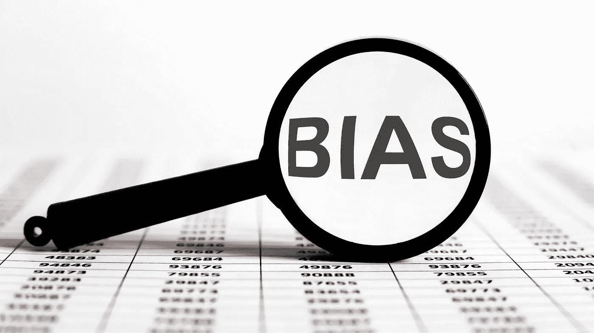

# 有头脑的数据科学家:创建一个无偏见的模型

> 原文：<https://towardsdatascience.com/mindful-data-scientists-create-a-biased-free-model-aaa5a9035e59?source=collection_archive---------36----------------------->

在[坎瓦](https://www.canva.com/)上由[伊琳娜·德罗兹](https://www.canva.com/photos/MAEIVZDfR9c-magnifier-with-text-bias-on-the-chart-background/)拍摄的照片

## 意识到认知偏差

如果数据科学家不仔细考虑认知偏差，他们可能容易受到他们建立的模型中固有缺陷的影响。这些偏见可能会导致对变量之间的因果关系和联系的错误结论，从而导致不正确的预测和判断。对于任何数据科学家来说，了解认知偏差都是非常重要的，这样你就可以确保你的模型尽可能地公正！

认知偏差可能源于多种原因，但思维捷径可能起着重要作用。虽然这偶尔会令人惊讶地正确，但它可能会导致不正确的想法。随着年龄的增长，认知灵活性可以减少认知偏差。年龄和人类思维的认知灵活性(或缺乏)是这些偏见的其他原因。当一个人在做决定时必须考虑每一个可能的选择时，认知偏差通常更容易发生。

让我们来看看其中的一些。

# 1.确认偏差

确认偏差是一种心理现象，在这种心理现象中，人们寻找、解释和记忆证实他们先入为主的想法和态度的信息。确认偏差是一个数据科学问题，因为数据科学家必须愿意用数据测试假设，以便在他们分析的数据中找到模式或真理。它可能导致数据科学家确认数据样本，创建偏向于某一组信念或价值观的数据模型，并不准确地解释数据。这种数据偏差可能会导致数据科学家得出无效的结论，这可能具有潜在的危险。

数据科学家在创建数据模型时应始终保持公正，重要的是找出矛盾的数据，以测试假设，避免数据科学过程中的确认偏差，并为数据消费者创建有用的数据产品。

为了减少数据科学过程中的确认偏差，数据科学家必须创建专注于数据本身而不是他们个人信念的数据模型。保持不偏不倚很重要，这样才能生产出提供价值的数据产品，而不会对特定的价值观、信念和观点造成伤害或偏见。

意识到确认偏差和其他认知偏差可以帮助数据科学家克服这些行为挑战。你仍然可以通过思想开放，准备从一个你不习惯的新角度来审视事物，来对抗确认偏见。这种倾向是无意识的，但是训练你的思维模式更加灵活可以帮助减轻确认偏差的影响。

# 2.可用性偏差

可用性偏差(也称为可用性启发法)指的是倾向于相信容易浮现在脑海中的事物的例子比它们更普遍。这不是错误记忆的结果，而是对记忆的夸大。

如果你能立即想象出支持一个判断的几个事实，你大概可以认为这个判断确实是正确的。如果你看到关于酒精和酒吧斗殴的故事和头条，你应该考虑什么？当信息持续存在时，你的记忆会更强。根据研究，记忆中容易找到的信息似乎比看起来更可靠。

作为数据科学家，我们努力构建由数据驱动和数据支持的公正模型。意识到可用性偏差是构建数据模型的一个关键因素，尤其是不要忽略潜在的相关数据或特性。

# 3.锚定偏差

与可用性偏差类似，锚定偏差与过分强调一条信息和潜在忽略相关信息有关。锚定偏差是指做决定时过度依赖第一手信息的倾向。你在研究早期学到的东西会对你的假设和建模产生更大的影响。

一旦获得锚定数据，它就成为数据分析和解释的基础。这通常会导致数据模型有偏差，因为它们过分强调了可能与问题陈述不相关的数据点。

当数据科学家过于重视一个数据点而没有考虑其他数据点时，就会出现锚定偏差，从而导致他们误入歧途或做出不正确的决策。锚定偏差可能以多种方式出现，这些方式是由于在数据分析中对初始数据点进行过度加权而导致的。

锚定偏差会影响数据科学家，使他们在为特定结果分析数据集时容易出现某些类型的错误。这是因为数据科学涉及统计思维和对不确定性的推理。数据科学家应该总是问这样一个问题:我们可能遗漏了什么？

为了解决潜在的锚定偏差，数据科学家必须形成不仅仅依赖于一个数据点或数据源的数据采集策略。数据科学家应该问这样一个问题:如果我只看这个数据集，我会错过什么？此外，不要忘记质疑第一个数据集的适用性。

# 4.自私偏见

利己偏见是一个心理学概念，指的是人们倾向于将好的结果归功于个人，而将不好的结果归咎于外部环境。我们的大脑更喜欢重申我们的信念，当我们正确的时候，我们会感觉很好。知道我们所相信的是真的，对我们来说是安全的。基本上这样，人们会喜欢我们，不会对我们生气。

你在工作中已经看到了。当你的模型成功时，我们中的一些人很快就把功劳归于它，把成功归因于我们的辛勤工作和奉献，但当它失败时，却指向外部因素，如外部环境的变化或意想不到的事件。

我们没办法。我们希望自己是对的，希望自己的工作得到认可，但当事情没有按照我们希望的方式发展时，我们希望避免承担责任。这导致对不支持我们现有想法的数据不开放。我们只寻找数据来证实我们已经相信的东西，而忽略挑战我们的数据或结果。此外，当别人试图给我们有价值的反馈时，我们通常会变得有所防备。

认知偏差只是数据科学家应该在工作中保持警惕的众多原因之一。重要的是，在构建模型时要小心，这样它们才不会因错误或错误的结论而产生偏差，这可能会对您的业务及其成功产生不利影响！

你能想到我没有提到的其他常见认知偏见吗？在下面留下你的评论，让我知道！