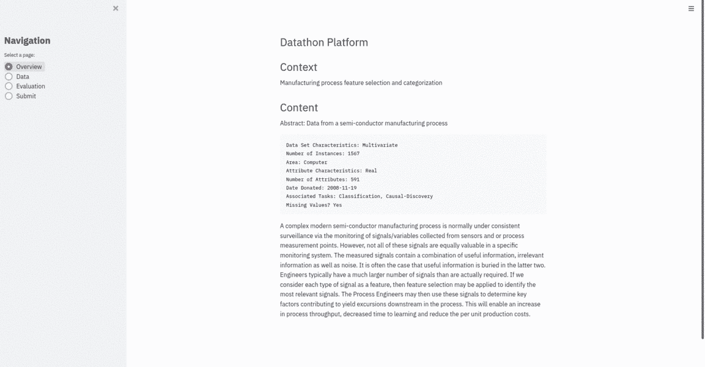

# 迷你数据马拉松:数据科学黑客马拉松需要的平台

> 原文：<https://towardsdatascience.com/mini-datathon-the-platform-you-need-for-your-data-science-hackathon-b386cd125ca2?source=collection_archive---------30----------------------->

## 3 个步骤，这就是全部！


Alex Kotliarskyi 在 [Unsplash](https://unsplash.com/@frantic?utm_source=unsplash&utm_medium=referral&utm_content=creditCopyText) 上的照片

你听说过多少次黑客马拉松很难举办？我是来给你展示另一面的！

# TL；速度三角形定位法(dead reckoning)

我在努力寻找一个简单的实现方法后开发了这个工具，以便在英特尔建立我们一年一度的内部黑客马拉松。有了这个工具，您可以在几分钟内建立自己的完全运行的[数据通平台](https://github.com/jeremyatia/mini_datathon)，并提供完整的排行榜和评估。[下面是一个例子](https://minidatathon.herokuapp.com/)。



heroku 上托管的迷你数据通平台(图片由作者提供)

# 显示本用户信息

嘿你！我是通用汽车公司研究自动驾驶汽车的技术主管，在数据科学领域工作了 8 年多。
我喜欢数据马拉松，我已经在公共部门、法国数据( [2016](https://youtu.be/Uzi8sPo_N0o) 、 [2018](https://youtu.be/n-YFtc3YqRs) 和 [2019](https://youtu.be/TrCUX5G4YCE) )、以色列数据( [2019](https://www.facebook.com/events/2516008141966278/) 、 [2022](https://www.linkedin.com/feed/update/urn:li:activity:6966427054112145408) )和私营部门组织了大量数据马拉松，并在英特尔举办了内部黑客马拉松。

# 语境

每当您想要创建一个 Datathon 时，您都需要考虑相当多的元素，包括:

1.  定义问题
2.  为它获取数据
3.  向入职培训参与者(以及可选的赞助商)宣传活动
4.  后勤:在哪里举行，奖励，食物，参与者和组织者所需的计算能力，等等。
5.  **搭建数据通平台，评估参与者**

在本帖中，我们将只讨论**数据通平台和参与者的评价**。这是技术难度最大的一步，也是大多数人纠结的地方。我发现现有的工具很难安装，或者缺少一些功能。*

这就是为什么我建立了我的平台。它完全是在 [streamlit](https://streamlit.io/) 中完成的，包含很少几行代码。我邀请你看一看代码！

*PS:如果你对构建数据马拉松的其他元素感兴趣，请在评论中告诉我，我可以在未来就这些主题发表文章。*

# 怎么设置？

*3 个简单的步骤！*

1.  在您的服务器中克隆 repo 或简单地提取 [docker 映像](https://hub.docker.com/repository/docker/spotep/minidatathon)。

2.修改管理员用户的密码，并在 [users.csv](https://github.com/jeremyatia/mini_datathon/blob/main/users.csv) 中添加其他参与者

3.修改 [config.py](https://github.com/jeremyatia/mini_datathon/blob/main/config.py) 文件&的内容，在终端中运行命令`streamlit run main.py`

瞧啊。您的数据马拉松已经准备就绪:)

*请不要忘记通知参与者，提交文件需要是 csv 格式，订购方式与 train 中提供的相同。*

# 例子

heroku 上部署了代码的一个示例版本，如下: [web app](https://minidatathon.herokuapp.com/)


Datathon 平台(图片由作者提供)

# 幕后…

## 数据库

该平台只需要保存 2 个组件:

## 1.排行榜

排行榜实际上是一个 csv 文件，每次用户提交他们的预测时都会更新。csv 文件包含 4 列:

*   *id* :用户的登录
*   *得分*:用户的最高分
*   *nb_submissions* :团队上传的提交数量
*   *等级*:团队的直播等级

每个用户只有一行，因为只有最大分数被保存。

默认情况下，基准分数会推送到 leaderboard.csv

```
| id        | score |
|-----------|-------|
| benchmark | 0.6   |
```

更多详情请参考脚本 [leaderboard.py](https://github.com/jeremyatia/mini_datathon/blob/main/leaderboard.py)

## 2.用户

和排行榜一样，这是一个 csv 文件。它应该由竞赛的管理者来定义。它包含两列:

*   *登录*
*   *密码*

首先创建一个默认用户，开始使用该平台:

```
| login     | password |
|-----------|----------|
| admin     | password |
```

为了添加新的参与者，只需将行添加到当前的 [users.csv](https://github.com/jeremyatia/mini_datathon/blob/main/users.csv) 文件中。

更多细节请参考脚本 [users.py](https://github.com/jeremyatia/mini_datathon/blob/main/users.py)

所有这些解释和脚本都可以在我的个人回购中找到:【https://github.com/jeremyatia/mini_datathon

如果你喜欢这个项目，请[给我买杯咖啡](https://www.buymeacoffee.com/jeremyatia):)告诉我

# *您可能想尝试的其他平台…

我通常尽量不去多此一举。随着时间的推移，我发现一些 Datathon 平台并不完全符合我的需求。
我想要一个可以在几分钟内完成设置和编辑的平台。
根据您的需求，以下平台可能与您相关:

*   EvalAI :很好的用户界面和非常完整的工具，但是不容易安装。如果你组织一个**大型**黑客马拉松，我建议这个。
*   由朋友[杨奇煜·沃切尔斯](https://medium.com/u/1a74cb63bc11?source=post_page-----b386cd125ca2--------------------------------)开发的这个平台有一个非常好的用户界面。这是我们用于 [FrenchData 黑客马拉松](https://www.datascience-olympics.com/)的工具。
*   [提交](https://github.com/dynilib/submission):我在英特尔的内部黑客马拉松中使用了这个。设置一般，用户界面很简单，我们在排行榜上有问题。

其他我没试过的工具: [Dribdat](https://github.com/dribdat/dribdat) 、[ML _ Competition _ Platform](https://github.com/AillisInc/ml_competition_platform)、[DataScienceLeaderboardPlatform](https://github.com/thenomemac/dataScienceLeaderboardPlatform)、 [Internal-kaggle](https://github.com/MingStar/internal-kaggle) 、 [Datathon_builder](https://github.com/mingot/datathon_builder) 、 [Yairf11 的 Streamlit-Leaderboard](https://github.com/yairf11/streamlit-leaderboard) 、 [Vindruid 的 Streamlit-Leaderboard](https://github.com/vindruid/streamlit-leaderboard)