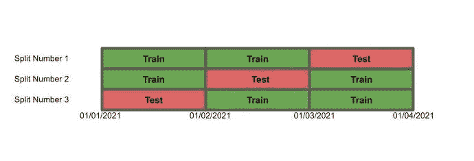
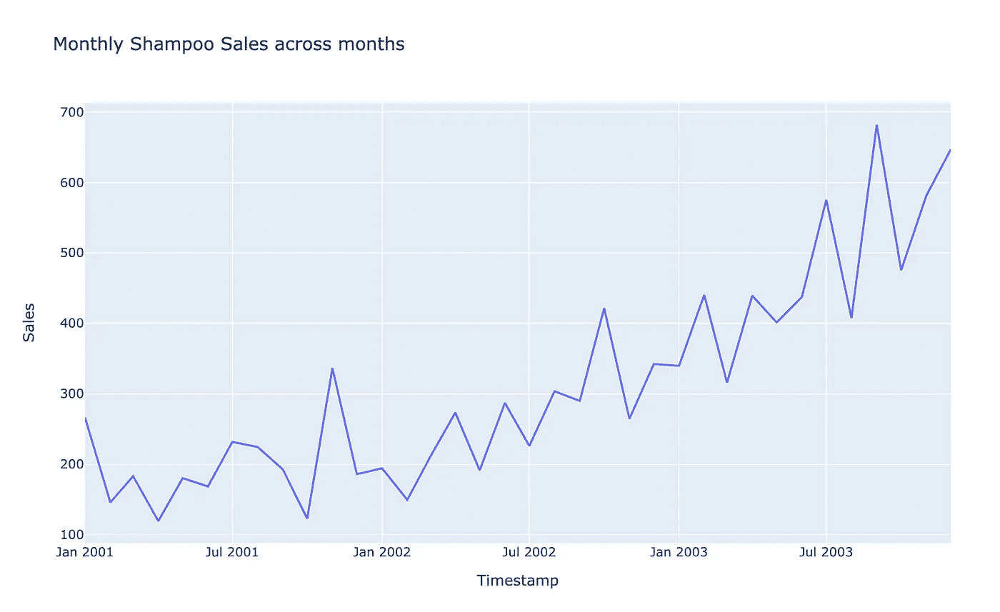
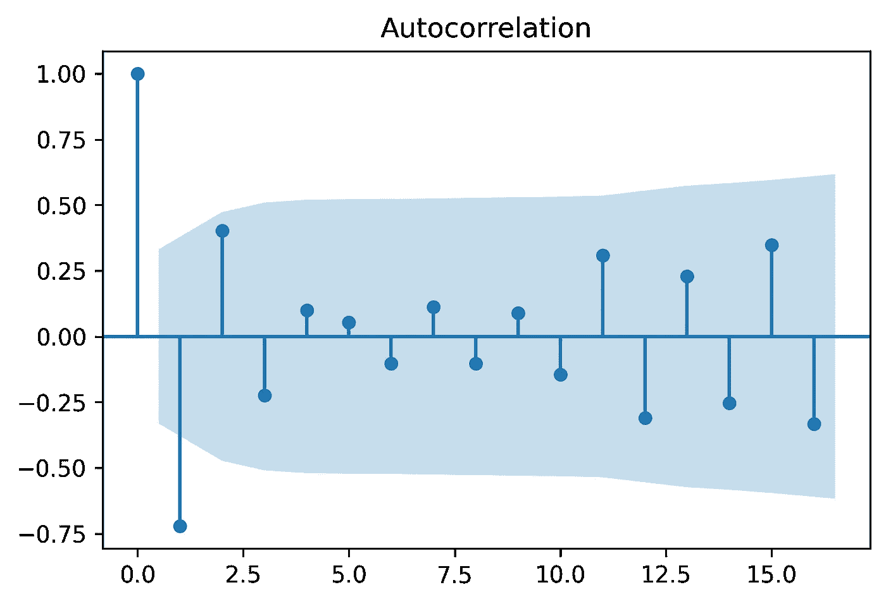
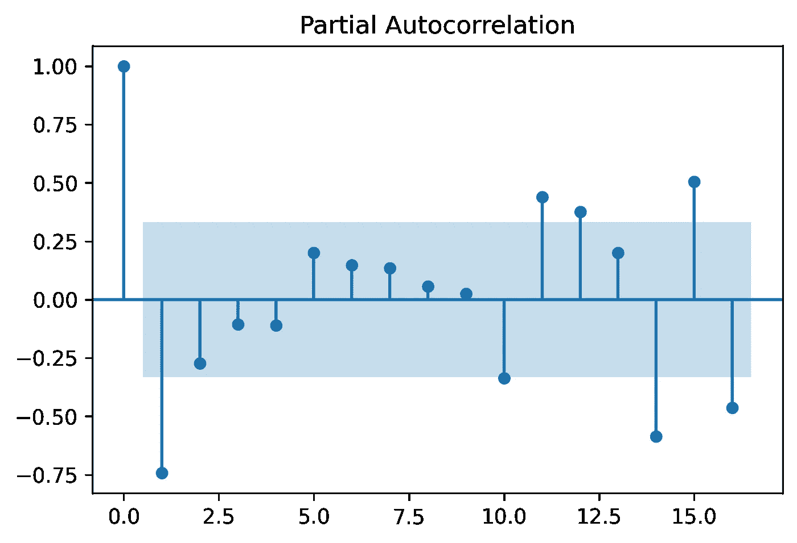

# 时间序列预测的监督学习迷你指南

> 原文：<https://towardsdatascience.com/mini-guide-to-supervised-learning-for-time-series-forecasting-fc0bd36d8f81?source=collection_archive---------23----------------------->

## 通过监督学习进行时间序列预测的模型训练、特征工程和误差计算技术


斯蒂芬·道森在 [Unsplash](https://unsplash.com?utm_source=medium&utm_medium=referral) 上拍摄的照片

我学到的第一个时间序列预测技术是 ARIMA。但是当我开始构建预测模型时，我看到了关于使用监督学习模型预测时间序列数据的研究论文和博客。这些模型比 ARIMA 更有优势，尤其是在预测需要多种粒度的情况下。在这篇博文中，我将总结我在构建这些模型时学到的知识，以及一些应该做/不应该做的事情。我将介绍一些关于交叉验证和模型训练、特征工程、目标变量工程和误差计算的知识。

1.  **数据拆分和测试**

要将您的预测问题转换为基于监督学习的回归问题，您需要重构您的数据，使其具有一个目标变量，即*y .**简单的数据重构可能看起来像 t-5、t-4、t-3、t-2 和 t-1 时间戳的特征集，而目标变量是 t。*

*为了解释这一点，我使用了众所周知的来自 [Kaggle](https://www.kaggle.com/redwankarimsony/shampoo-saled-dataset) 的洗发水销售时间序列数据集，其中包含了 3 年期间洗发水每月的销售数量。我应用了一些预处理来为数据集生成时间戳，并创建了一个函数来从单个时间序列生成特性集和目标变量。*

```
*import pandas as pddef supervised_sets(data, lookback):
    '''
    params:
    data - df with series 
    lookback - number of time periods to look back 
    return:
    X - feature set
    y - target variable
    '''

    X = pd.DataFrame()
    y = pd.DataFrame()

    for i in range(0, len(data) - lookback):

        train = data.iloc[i : lookback + i]
        test = data.iloc[lookback + i]
        X = pd.concat([X, pd.DataFrame(train[['Sales']].values.T)])
        y = pd.concat([y, pd.Series(test[['Sales']].values[0])])

    for k in range(lookback):
        X = X.rename(columns = {k : 't' + str(k)})

    return X.reset_index(drop = True), y.valuesdata = pd.read_csv('shampoo_sales.csv')
data['Timestamp'] = pd.to_datetime(data['Month'].apply(lambda x : '200' + x))X, y = supervised_sets(data, 5)*
```

*一旦您拆分了数据并准备好供模型使用，一个基本问题就是如何拟合和测试数据。在没有时间结构的监督学习问题中，我们可以简单地进行 k-fold 分裂来训练和测试整个数据集。但是，如果您正在提供一个时间序列，您会希望测试数据集具有在训练后发生的时间戳。如果我们进行 k-fold 分裂，那么当我们在行为开始之前的观察结果上测试它时，我们有训练数据集泄露新的前瞻性行为的风险。*

*我会试着用一张图来解释清楚:*

**

*作者图片*

*对于分割数 2 和 3，训练数据将具有来自未来的数据。此外，分割数 3 的平均误差将是不准确的，因为前瞻行为的任何变化将导致对过去的不准确值的预测。*

*为了解决这个问题，我们可以通过日前向链接利用嵌套的交叉验证。我将使用 sklearn 的一个函数来拆分数据。*

```
*import numpy as np
from sklearn.model_selection import TimeSeriesSplittscv = TimeSeriesSplit(n_splits = 10)
for train_index, test_index in tscv.split(X):
    print("TRAIN:", train_index, "TEST:", test_index)
    X_train, X_test = X.iloc[train_index], X.iloc[test_index]
    y_train, y_test = y[train_index], y[test_index]*
```

*这个函数以这样一种方式拆分数据，即我们迭代地向训练数据集添加时间段，同时使用后续时间段作为测试数据。我添加了上面代码中的几行结果，以更好地解释该函数的作用:*

```
*TRAIN: [ 0 1 2 3 4 5 6 7 8 9 10] TEST: [11 12]
TRAIN: [ 0 1 2 3 4 5 6 7 8 9 10 11 12] TEST: [13 14]
TRAIN: [ 0 1 2 3 4 5 6 7 8 9 10 11 12 13 14] TEST: [15 16]
TRAIN: [ 0 1 2 3 4 5 6 7 8 9 10 11 12 13 14 15 16] TEST: [17 18]*
```

***2。时态特征的特征工程***

*时间序列预测基于这样的假设，即历史时间戳遵循可用于预测未来时间戳的模式。因此，时态要素的要素工程是构建性能良好的模型的关键部分。*

*分析时间序列数据的第一步是绘制时间序列的线图。*

**

*作者图片*

*当我绘制洗发水销售图时，我观察到倍增的季节性，不同时间段之间的变化随着时间而增加。我们还可以观察到两个月的弱季节性，之后每个月我们都会观察到洗发水销售的增加/减少。*

*从特征工程开始的一个好地方是绘制自相关函数(ACF)和部分自相关函数(PACF)。这将使您了解哪些滞后是重要的，以及数据集中的季节性。季节性分解也是理解数据中潜在的时间模式的好方法(尽管这需要一些参数调整)。*

*在绘制相关函数之前，我们将对序列进行差分，使其稳定，这样序列的统计特性就与时间无关。*

```
*from statsmodels.graphics.tsaplots import plot_acf, plot_pacf
import matplotlib.pyplot as pltplot_acf(data['Sales'].diff().dropna().values)
plt.show()plot_pacf(data['Sales'].diff().dropna().values)
plt.show()*
```

**

*作者图片*

*这里，ACF 表明滞后 1 是重要的，即先前的时间戳是重要的。此外，滞后的交替符号证实了每个时间段后增加/减少的假设。然而，这种趋势并不是在所有滞后中都是一致的。将 t-1 作为一个特征包含在模型中会有所帮助。*

**

*作者图片*

*我们看到 PACF 表明第一个滞后是显著的，随后是 11 到 15 之间的一些滞后。这些孤立的滞后影响当前时间戳。最好将这些时间戳作为单独的特征，其中滞后 1 可能指示水平，而 11–15 指示弱季节性。我们可以在模型中添加年份和月份特征作为指示变量，以及这些滞后值。*

*以上讨论是关于如何使用数据分析启动要素生成过程的一些想法。当然，反复试验会产生最好的结果:)*

***3。说明基于时间的特征的周期性***

*我们可能希望将记录观察结果的时间戳的特征(日期、日期、月份、小时、年份)放入特征集中。例如，我们可能希望输入观测记录的月份和年份(如果我们知道系列的级别每个月都在增加)，或者我们可能希望输入观测记录的小时(如果我们知道每小时级别有很强的季节性)。*

*您不希望将这些值直接作为整数使用，因为这意味着与 9 月份(月份= 9)记录的观测值相比，12 月份(月份= 12)记录的观测值与 1 月份(月份= 1)记录的观测值之间的距离更大。我们知道事实并非如此。我们希望模型知道 1 月比 9 月更接近 12 月，23 小时比 4 小时更接近 0 小时。我们可以通过获取时间特征的正弦和余弦来捕捉周期性。*

```
*data['sin_month'] = np.sin(data['Timestamp'].dt.month)
data['cos_month'] = np.cos(data['Timestamp'].dt.month)*
```

***4。设计您的目标变量***

*当我为时间序列预测建立第一个监督学习模型时，我使用了一阶滞后作为我的特征之一，并且我能够获得极低的误差指标。在进一步的检查中，我意识到这个模型只是在执行随机漫步，因为我的下一个时间步严重依赖于前一个时间步，所以我能够获得很好的度量。*

*为了避免这种情况，将目标变量定义为一阶差分是很有用的。因此，ML 模型不是预测 t + n + 1 时间戳的值，而是预测{ t + n + 1 时间戳} — {t+ n 时间戳}的值。以这种方式，该模型将不仅依靠前一个时间戳来预测下一个时间戳，而且将使用历史滞后和外生回归量。阅读 Vegard 的文章可以获得关于这个主题的深入解释:[https://towards data science . com/how-not-to-use-machine-learning-for-time-series-forecasting-avoiding-the-陷阱-19f9d7adf424](/how-not-to-use-machine-learning-for-time-series-forecasting-avoiding-the-pitfalls-19f9d7adf424)*

***5。错误监控***

*为了跟踪基于监督学习的预测模型的准确性，平均绝对误差(MAE)和均方根误差(RMSE)是很好的指标，但我去年发现并经常使用的一个指标是平均绝对标度误差(MASE)。如果我们使用随机游走方法，其中上一个时间戳的值将是下一个时间戳的预测值，则此指标考虑了我们会得到的误差。它将模型的误差与简单预测的误差进行比较。这也有助于你从数字上评估你的模型比天真的预测好多少。*

```
*def MASE(y_train, y_test, pred): 

    naive_error = np.sum(np.abs(np.diff(y_train)))/(len(y_train)-1)        
    model_error = np.mean(np.abs(y_test - pred))return model_error/naive_error*
```

*您还可以根据数据集的季节性来自定义 MASE 指标。例如，如果您正在处理显示每周季节性的数据集，您可以执行 7 阶而不是 1 阶的差分来计算原始误差。您可以根据您的预测频率和数据集季节性来设置自己的基准模型。*

*如果 MASE > 1，则该模型的性能比基线模型差。MASE 越接近 0，预测模型越好。*

*如果你做到了这一步，感谢你的阅读！在使用监督模型进行时间序列预测的过程中，我试图捕捉我的一些经验。我很乐意在评论中听到你的意见。我相信我们需要更多的博客/文章来分享预测领域的经验。让我知道你的想法:)*