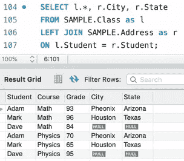
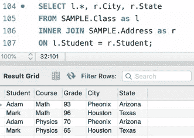
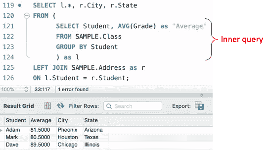

# 面向 2021 年数据科学家的最小 SQL

> 原文：<https://towardsdatascience.com/minimal-sql-for-a-2021-data-scientist-fc3c17f1434c?source=collection_archive---------59----------------------->


本·怀特在 [Unsplash](https://unsplash.com?utm_source=medium&utm_medium=referral) 上的照片

## 有志成为数据科学家或分析师的基本必备 SQL

时不时看到新媒体文章说“7 个必备技能”“10 个重要技能”“3 大技能”等。对于一个数据科学家来说。所有这些帖子都承认 **SQL 是数据科学家**的必备技能。在我进入这个行业之前，来自计算物理学背景的 SQL 对我来说是陌生的。在学术上，你用的不多。然而，对于大多数公司来说，数据通常存储在关系数据库中。SQL 是一种查询语言(结构化查询语言),用于通信(获取、存储、操作等)。)用一个数据库。你可以把 SQL 想象成数据科学家 与数据交流的 ***通用语。事实是，学习起来同样容易，因为它是一项必不可少的技能。***

这篇文章告诉你作为一名数据分析师/科学家，你需要知道的最基本的 SQL。

**注意:** **这篇文章并不是关于 SQL 的详尽、全面的课程。当然，为了精通您的工作，您将每天学习和提高您的 SQL 技能。**

通常，真实的数据库(一个数据库有几个表)是巨大的；一个表可能包含超过 10 亿行数据。然而，要处理如此庞大的数据，您只需要知道 SQL 构建块。

因此，我将从创建一个简单的数据库开始，它有一个非常小的表，仅包含 6 行。同样的概念可以用在拥有数百万或数十亿条目的真实数据集上。

# 1)在哪里键入和执行 SQL 查询？

您可以分两步在您的 PC 上练习您将在这里阅读的所有查询/命令:1)从[这里](https://dev.mysql.com/downloads/mysql/)安装开源 MySQL 社区服务器，2)安装服务器后，安装 MySQL 工作台(编辑器)以运行从[这里](https://dev.mysql.com/downloads/workbench/)的 SQL 查询。只要继续遵循安装说明。

# 2)创建数据库和表格，并在其中存储数据

数据存储在一个可以有多个表的数据库中。假设一个城市有几所学校，每所学校代表一个数据库，其中不同的班级/年级代表一个数据库(学校)中不同的表。简单来说，一个公司就像一个城市，有不同的数据库。

让我们创建一个简单的**数据库**(与在 [**MySQL**](https://dev.mysql.com/doc/refman/8.0/en/glossary.html#glos_schema) 中使用**模式同义)，名为**示例**。下面这段代码首先检查名为 SAMPLE 的数据库是否存在。如果有，它将被丢弃(删除)。然后创建数据库。也可以把`DROP DATABASE`写成`DROP SCHEMA`。**

接下来，我们在示例数据库中创建一个名为 **Class** 的表，因此，您必须在创建该表时指定“ **SAMPLE.class** ”。在创建表之前，再次检查该表是否存在。一个表可以有几个相同或不同数据类型的列。创建表时，必须指定列名及其各自的数据类型。

现在已经创建了该表。现在您可以在其中插入条目(行形式的数据)。代表数据的**值**应该与创建表格时指定的列顺序相同。

> 注意:SQL 是不区分大小写的。习惯上用大写字母写关键词，但这不是必须的。


创建一个名为“SAMPLE”的数据库/模式，并在其中创建第一个名为“Class”的表。

# 3)从表中访问/查询数据

恭喜你。您已经创建了您的第一个数据库和一个表。您在上面看到的所有代码行都被称为查询。您正在数据库和表格中查询某些数据/信息。

您可以使用“**选择** ***** ”命令显示表格的内容。此处的星号(*)代表所有列。下图显示了上面创建的表格内容。


显示“类”表的所有内容。

如果只想查询(选择/显示)某些列，可以指定所需的列名，用逗号分隔，如下所示。


仅显示从“类”表中选择的列。

请注意，数据的打印(查询)顺序与插入顺序相同。要按一定的顺序打印，在按关键字排序的**之后，指定要排序的字段。您可以指定多个列名，以便按多个字段排序。例如，以下查询显示了按学生姓名(学生)和成绩的升序打印的数据。默认情况下，数据按升序排序。要按降序排序，请在要排序的字段后指定关键字`desc`。比如`ORDER BY Student desc, Grade desc`。**


按多列对表格内容进行排序。

# 4)在查询输出中添加新列

如果要打印基于现有列的附加列，请在星号(*)后用逗号分隔指定它们。例如，下面的代码添加了一个将等级除以 100 的列。如果不指定输出列名(通过使用`AS 'Grade_new'`)，它将留空。


基于算术计算添加新列。

# 5)过滤数据

您可以使用 **WHERE** 关键字过滤满足特定条件的数据。例如，以下查询获取得分超过 85 分的学生的信息。您还可以通过`AND`关键字使用多个字段过滤查询结果。例如，尝试使用`WHERE Grade > 85 AND Course = 'Math'`。注意，您也可以通过在最后使用 **ORDER BY** 关键字来对过滤后的结果进行排序。由于 WHERE 关键字的优先级，不能在 WHERE 关键字之前指定 ORDER BY。


使用 WHERE 关键字过滤查询结果。

# 6)计算行数

要获得表中的总行数，可以使用`SELECT count(*) FROM SAMPLE.class`。如果想统计等级超过 85 的行，可以添加`WHERE`关键字。尝试使用**和**关键字指定多个条件，如前所示。


对满足条件的行进行计数(这里:等级> 85)。

# 7)对数据进行分组

有时，对于一些统计分析，您需要根据一些字段对数据进行分组。这是使用 **GROUP BY** 关键字完成的。这是最常用的 SQL 关键字之一。当然，当您分组时，您会对一些聚合值感兴趣，例如平均值、最小值、最大值、标准偏差等。一个团体。

以下查询返回学生姓名及其平均分数。


查询以获得每个学生的平均成绩。

## 过滤分组数据

假设您只想显示或查询平均成绩(上面计算的)大于 81 的学生。HAVING 关键字在这里派上了用场。以下查询显示了如何使用平均分数过滤结果。


将筛选器与 GROUP BY 关键字一起使用的查询。

您也可以在 HAVING 关键字中组合多个过滤器(条件)。例如，尝试使用`HAVING AVG(Grade) > 80 and AVG(GRADE) < 88`。

# 8)案例陈述

**CASE** 关键字非常有用。它用于 **if-else 情况**中，如果条件为真，您必须分配一个值，如果条件为假，您必须分配其他值(您也可以有多个 else 情况)。以下是 SELECT 语句中 CASE 语句的语法。

```
CASE WHEN condition_1 THEN value_1
     WHEN condition_2 THEN value_2
     WHEN condition_3 THEN value_3
     ...
     ELSE some_value END AS output_columnname
```

下面说明了**类**表的 CASE 关键字的用法。


CASE 关键字的用法。

## 组合事例和分组依据

下面显示了 CASE 和 GROUP BY 关键字的用法。


# 9)连接表格

这可能是真实 SQL 应用程序中使用最广泛的操作。这个想法是将一个表与一个或多个表连接起来，从后者获得**附加** **信息**。

有几种方法可以连接两个表。例如，您可以拥有两个表中的所有合并数据、两个表中的公共数据、一个表中的数据而另一个表中的数据，反之亦然。这个页面用简单的例子解释了所有的连接。

我将展示两个这样的连接操作，名为**左连接**和**内连接**。到目前为止，我们的数据库中有一个名为 **Class** 的表。我们创建第二个表 **Address，**包含数据库中学生的姓名、城市和州。


在示例数据库中创建第二个名为“Address”的表。

让我们看看**地址**表的内容。


查询地址表的内容。

## 左连接

根据我的经验，左连接是最常用的操作。下图解释了左连接的要点。该操作返回左表中的所有行和右表中相应的匹配条目。


左连接操作的示意图。

假设我们想查询学生的城市和州，以及他们的课程和成绩。现在，我们的左桌(主桌)是**级**。为了从右表( **Address** )中获取城市和州，我们需要一个公共列来进行一对一的匹配。在我们的两个表中， **Student** 是公共列。

以下代码显示了如何使用 LEFT JOIN 将**类**表连接到**学生**列上的**地址**表。正如您所注意到的，Dave 的**城市和州字段是空的**。这是因为右表(地址)不包含 Dave 的数据，因此，**左连接找不到任何匹配的条目**。我们使用别名作为表名，使用"**作为"**关键字，来引用列(这里左边的是 *l* ，右边的是 *r* )。



左连接主表“类”和“地址”表。

您还可以在使用 WHERE 关键字进行左连接时使用过滤。将下面的输出与上面不带 WHERE 关键字的输出进行比较。


在左连接期间过滤数据。

## 内部连接

在上面，您看到左连接查询也为 Dave 生成了行，尽管在右(地址)表中没有 Dave 的地址。如果要排除这样的空(不可用)条目，可以使用内部联接，如下图所示。该操作返回在两个表中具有匹配值的条目(行)。


内部联接操作的示意图。

语法与 left join 相同，只是现在使用关键字 **INNER JOIN** 。正如您所注意到的，内部连接不会产生戴夫的数据**，因为它对两个表**来说不是公共的。



内部连接主表" Class "和" Address "表。

我建议读者访问[这篇](https://medium.com/@josemarcialportilla/review-of-sql-joins-ac5463dc71c9)文章，查看所有 SQL 连接。

# 10)嵌套查询

到目前为止，简单的例子允许您使用 WHERE 和 HAVING 关键字以及 GROUP BY 来过滤结果。在上面的内部连接(或左连接)的输出中，注意城市和州是重复的，因为每个学生在表中都有多个条目。假设您想要他们的平均成绩和地址(城市+州)。您需要 1)使用 GROUP BY 计算平均值，2)使用 LEFT JOIN 获得地址。

下面的代码包含一个计算平均值的内部查询。内部查询的输出充当左连接的表。内部查询输出别名为 ***l*** 。这两个查询一起构成了一个嵌套查询。



嵌套查询的示例。

# 结论

这篇文章中介绍的 SQL 基础知识构成了作为数据科学家、分析师或 ETL 相关职位的人开始处理数据所需的最基本的基础知识。真正的表可能包含几十或几百列，几百万或几十亿行，选择查询跨越大量的行。然而，这里获得的知识将帮助您理解复杂的 SQL 查询。

由于 python 编程语言是数据科学家另一个最受欢迎的技能，你也可以参考我在 python 上的以下帖子:

</data-structures-in-python-da813beb2a0d>  </python-in-2021-timeline-and-upcoming-features-c8369abbcc52> 