# 最小可行开发人员:在软件领域的第一个月表现出色

> 原文：<https://towardsdatascience.com/minimal-viable-developer-acing-your-first-month-in-software-8273663edb38?source=collection_archive---------25----------------------->

## [办公时间](https://towardsdatascience.com/tagged/office-hours)

## 开发软件不仅仅是编码——这里有一个关于编程的所有东西的指南，将帮助你在你的第一个角色中取得成功

无论是实习还是全职，你很容易被第一个软件角色的新奇感和要求所淹没。

这是一个你在真实的软件商店中会遇到的工具、技能和仪式的指南。它假设您已经知道编码的机制，并且关注于从事学校项目和为业务关键代码库做贡献之间的主要区别。

它适用于数据科学、后端或前端角色；这是关于所有的事情，不是写你喜欢的代码风格的*。*

这份指南对加入创业公司的人来说比加入老牌公司更有用。FAANG 公司会让你经历超过 4 周的正式入职培训。在一家初创公司，你更有可能得到一台笔记本电脑和一件 t 恤，并被要求加入你的同事，拼命试图将一艘正在下沉的船驶向盈利。让我们在最短的时间内把你从负重者变成划手。

# 软件生命周期

当你加入你的第一家公司时，你会面对令人眼花缭乱的大量信息。你将不得不做出一些艰难的选择，决定你应该把精力集中在哪里。

与其花一周时间阅读整个代码库，了解用户，或者与组织中的每个人坐下来了解他们的角色，我建议你专注于理解**代码生命周期**:代码被编写并整合到产品中的过程。

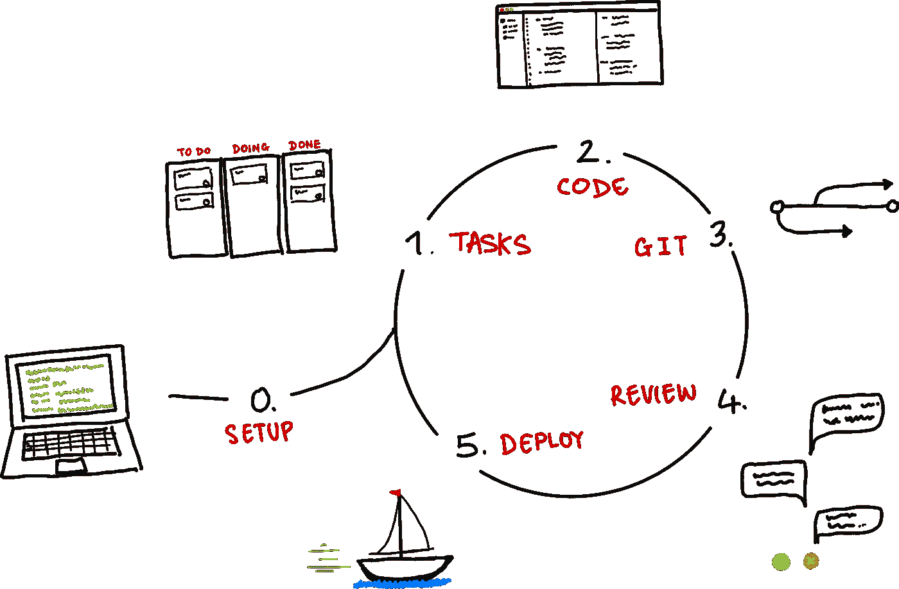

代码生命周期。尽可能快地完成这个循环，最大化你在工作中的学习。船对应的是部署(也叫出货)。来源:作者

你的目标应该是**最大化你在工作最初几个月经历的这些周期的数量**。这对于你来说是很好的，因为它最大化了你的学习，对于组织来说也是很好的，因为他们有很多机会推动你走向有价值的结果。

以下是我们将要讨论的步骤，您应该很快就能明白:

0.**设置**:如何在我的电脑上获取代码并运行？希望你只需要这样做一次，所以它不是核心循环的一部分。

1.**任务**:任务组织在哪里，如何分配？

2.**代码**:我如何编写和测试代码？

3. **Git** :如何将代码推送到版本控制？

4.评论:人们是如何评论我的作品的？

5.**部署**:它最终是如何部署的？

## 为什么您应该专注于执行这个生命周期？

刚从大学毕业，满脑子都是算法，你可能认为你的时间最好花在和你能找到的最聪明的程序员坐在一起，学习如何有效地实现旅行推销员算法的技巧。

请不要这样做。相反，在你需要理解的系统中快速导航，以快速通过这个循环。

如果你想跟踪某人，选择团队中完成任务最多的人，即使他们不是最性感或最有趣的。他们已经找到了快速度过这个周期的方法。

为什么快速完成这些步骤如此重要？这 5 个步骤是您想要对代码库进行的任何更改的固定成本。它们的成本与你所写代码的复杂程度不成比例。这意味着，无论您是修复一个打字错误还是重写整个 API，它们花费的时间大致相同。


在代码生命周期中，对代码库进行大的或小的更改需要花费大致相同的时间。如果你花了很长时间来完成这些步骤，那么小任务就会慢得惊人。来源:作者

如果你能把执行它们的成本降低到一个很小的数量，你就能捡起小块的工作并有效地执行它们。小块的工作有更高的机会被快速部署，你将更快地完成一个完整的周期。你会更早地得到更多的反馈，你会比奶酪滚下山更快地积聚动力。

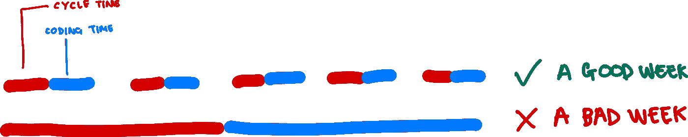

你想挑选许多小任务并快速执行它们。如果你纠结于基本的，你会倾向于选择更复杂的任务来弥补长周期时间，并在一周结束时什么都没有部署——糟糕的一周。来源:作者

这篇文章的其余部分是对这些步骤的一步一步的指导，你需要使用的工具，以及如何有效地执行它们。

## 如果我被卡住了怎么办？

坏消息是:你在学校或大学里不会学到这些东西。

好消息是:和你一起工作的人也没有在大学里学过！

从事软件工作的每个人都通过大致相同的三种策略来解决问题:

1.  Google stuff(通常会导致堆栈溢出)
2.  如果他们是守旧派，读一本书；如果他们注意力不集中，读一篇博客
3.  问问可能知道的人

请不要因为严重依赖第三条而感到焦虑或尴尬。

你周围的人花了几个小时对软件问题感到困惑和沮丧，他们很乐意与你分享这些经历的好处。

以下是我的朋友 [Jonny](https://www.linkedin.com/in/jonny-linton-7b18bb132?originalSubdomain=ca) 的一些建议，她在几个月内从实习生晋升为 Element AI 的一个产品团队的核心人物:

> *“以我的经验来看*【卡顿】*对新手来说是最大的减速。他们觉得他们需要证明自己，因此不想承认错误或知识差距——讽刺的是，这阻止了他们快速迭代和学习。我的建议是，在寻求帮助之前，设定好时间。此外，熟悉内部文档工具(如 Confluence ),并在询问前进行搜索。一直寻求帮助是我成为今天的开发者的唯一原因。这可能是你指派的“伙伴”，你团队的一员，最后修改代码的人(通过 git 责备检查)或者任何人！只是不要让自己被挡住，呆在那里。”*

# 0.我如何让代码在我的电脑上工作？

大多数公司使用**版本控制**来跟踪他们的代码。这允许多人在不覆盖彼此工作的情况下处理同一个项目，同时保留以前版本的防弹日志，以便在需要时可以很容易地恢复旧的工作。代码的多个副本存储在互联网上，一个叫做**库**的结构中。

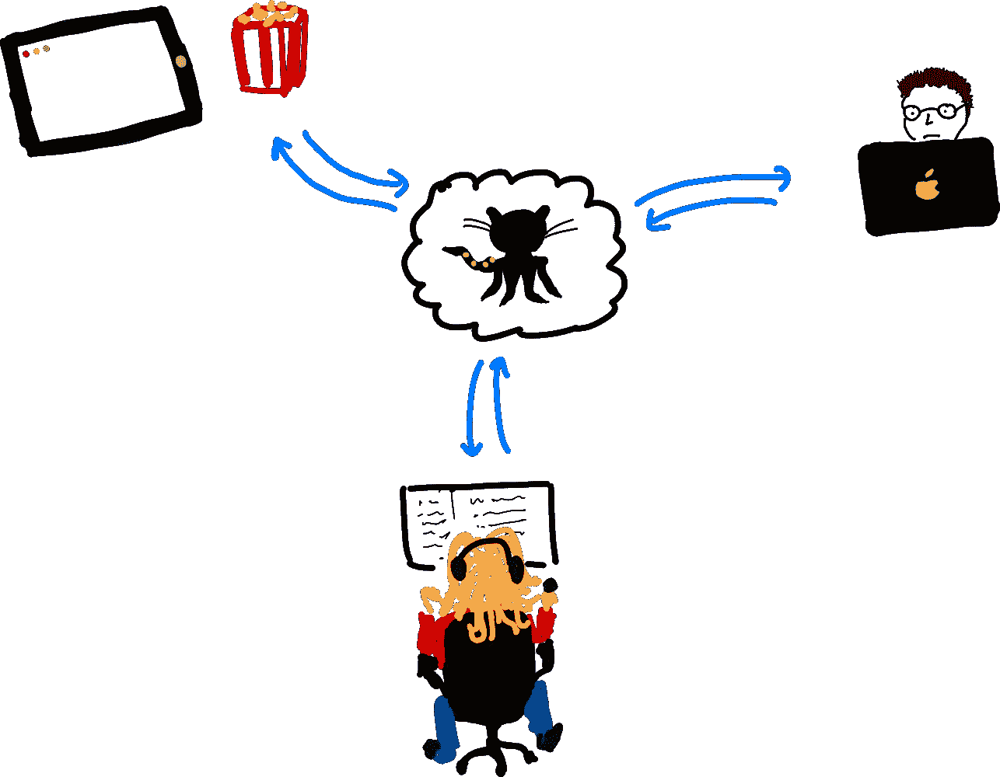

一个版本控制程序，如 Github(他们有这个奇怪的 octocat 字符作为吉祥物，如图中所示)，允许多个开发人员独立开发，定期更新互联网上的代码共享副本。来源:作者。

在 21 世纪，这种版本控制通常意味着使用一种叫做 git 的技术。开发人员将一个在线 git 库复制到他们的本地机器上——这被称为**克隆**——然后在将它们复制回服务器**之前进行修改——推动**他们的工作。

虽然底层技术— **git** —是开源的和标准的，但是有很多不同的网站会为你托管你的 git 库。Github、Gitlab、Bitbucket 是主要的三个。

为了简洁起见，我假设您使用的是 Github，但是下面的一切同样适用于其他提供者。

## 1.访问在线代码库

如果您还没有 Github 帐户，请创建一个。让你的主管给你项目的权限。

好吧，这很简单。我们开始得很快。

## 2.安装 SSH 密钥

为了避免每次推送或提取代码时都必须进行身份验证，您应该为您的版本控制系统设置一个 SSH 密钥。 [SSH 密钥](https://jumpcloud.com/blog/what-are-ssh-keys)允许您的计算机向服务器识别您的身份，并确认您应该被授予访问权限。

Github 有一个很好的生成和上传密钥的指南。

每个 SSH 密钥对由一个公钥和一个私钥组成。公钥是您上传到 Github 的那个，它看起来像这样:

```
$ cat ~/.ssh/id_rsa.pub ssh-rsa AAAAB3NzaC1yc2EAAAABIwAAAQEAklOUpkDHrfHY17SbrmTIpNLTGK9Tjom/BWDSU GPl+nafzlHDTYW7hdI4yZ5ew18JH4JW9jbhUFrviQzM7xlELEVf4h9lFX5QVkbPppSwg0cda3 Pbv7kOdJ/MTyBlWXFCR+HAo3FXRitBqxiX1nKhXpHAZsMciLq8V6RjsNAQwdsdMFvSlVK/7XA t3FaoJoAsncM1Q9x5+3V0Ww68/eIFmb1zuUFljQJKprrX88XypNDvjYNby6vw/Pb0rwert/En mZ+AW4OZPnTPI89ZPmVMLuayrD2cE86Z/il8b+gw3r3+1nKatmIkjn2so1d01QraTlMqVSsbx NrRFi9wrf+M7Q== schacon@mylaptop.local
```

私钥保存在您的计算机上，每次您需要进行身份验证时，它会被发送到您的版本控制提供商。Github 会将您的公钥与您发送的私钥进行比较，以确认它们是同一个密钥对的一部分，并且您应该被授予访问权限。

我建议*不要在你的 SSH 密钥上设置密码短语。你的电脑已经有密码保护了(对吧？)而且我也不认为有这个额外的障碍对迭代有帮助。*

## 3.使用终端克隆回购协议

现在你需要**复制**你将要处理的存储库——或者回购——到本地机器上。这被称为**克隆**，因为你正在创造一个精确的复制品，就像[克隆羊](https://dolly.roslin.ed.ac.uk/facts/the-life-of-dolly/index.html)。

为此，您将需要某种终端，它将使用像`bash`、`zsh`或`fish`这样的语言来处理基本的系统级操作。

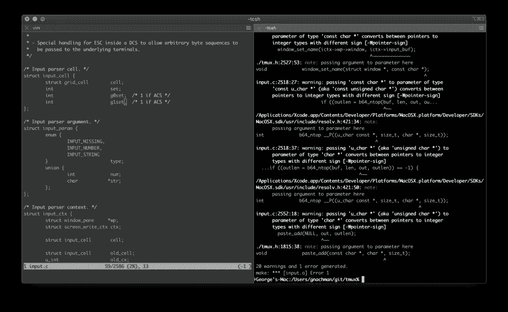

iTerm，最受欢迎的 Mac OSX 终端。资料来源: [iTerm](https://iterm2.com/features.html) (GPL-2)

我认识的大多数 Mac 用户都使用 iTerm 而不是内置终端，这给了你各种各样的好功能，比如 T21 分割面板。

根据我的经验，大学不太擅长教人们如何使用终端，缺乏基本的熟练程度会让你慢下来。我建议你花几个小时练习如何:

*   创建和删除文件和目录(`touch`、`rm`、`mkdir`)
*   显示文件内容并在其中搜索(`cat, grep`)
*   反向搜索以查找您以前使用过的命令(`ctrl+r`)

Unix(大多数 shells 所基于的语言)是一个极其强大和灵活的计算环境，大多数用户(比如我)对它只是皮毛。事实上，如果你是一名`awk`忍者，大多数开发者会比你完成了在线 Tensorflow 证书更有印象:考虑在这里投资一些时间，而不是更华丽的选择。[这本书](https://www.amazon.co.uk/dp/B0043GXMSY/ref=dp-kindle-redirect?_encoding=UTF8&btkr=1)不错，如果想深入的话。

好吧，让我们假设你正在运行这样的东西

```
git clone git@github.com/mycompany/myrepo.git
```

你会看到这样一条信息

```
Cloning into 'my-first-repo'... remote: Enumerating objects: 58, done. remote: Counting objects: 100% (58/58), done. remote: Compressing objects: 100% (43/43), done. remote: Total 58 (delta 8), reused 54 (delta 8), pack-reused 0 Receiving objects: 100% (58/58), 48.83 KiB | 200.00 KiB/s, done. Resolving deltas: 100% (8/8), done.
```

现在你有一个回购准备好了。

## 4.让它跑起来

让您的项目运行的具体说明应该在项目中描述，通常在一个名为`README.md`的文件中。如果没有，请某人带你完成代码运行，并主动为回购编写`README.md`——这是一项非常有价值的任务！

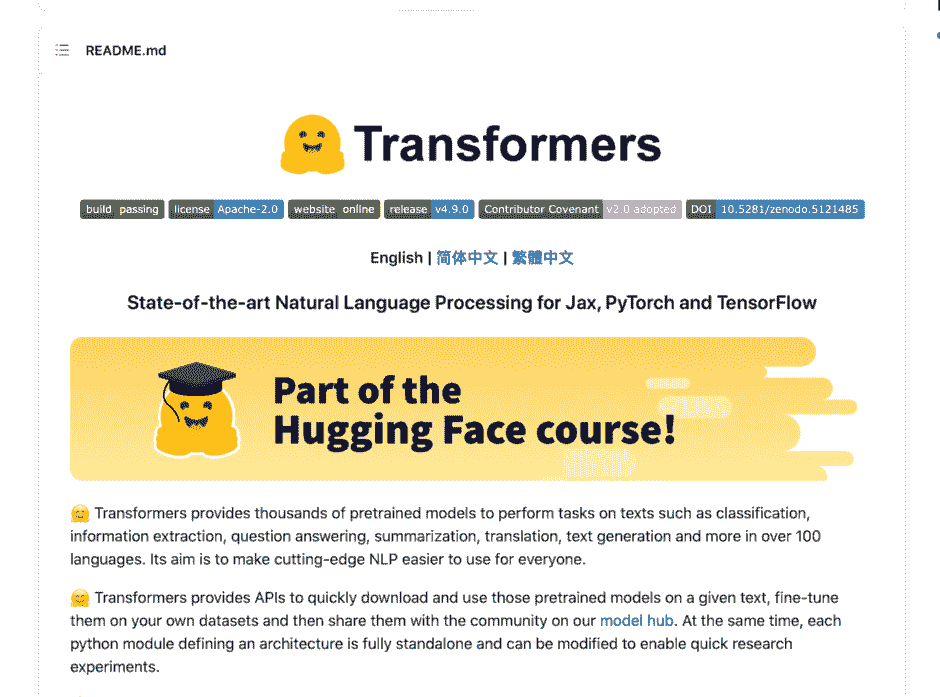

来自 https://github.com/huggingface/transformers.[的 README 示例](https://github.com/huggingface/transformers.)如果您在存储库的根目录下包含一个名为 README.md 的文件，当人们在线导航到代码时，它通常由您的版本控制系统呈现，作为用户指南。所有这些颜色鲜艳的徽章都与回购的各种构建和测试状态相关。来源:[拥抱脸](https://github.com/huggingface/transformers.)(阿帕奇 2.0)

首次建立一个新的回购协议可能是一个棘手的挑战，因为许多项目都依赖于外部系统，如亚马逊网络服务(AWS)或谷歌云平台(GCP)。

您可能还需要为它们登录，并且可能需要安装命令行界面(CLI)来更顺畅地使用它们。**尽早询问你** **可能需要的所有登录信息**，因为人们可能需要一段时间才能给予你访问权限。我们将在第 6 节回到这些部署环境。

> 尽早请求所有你可能需要的登录信息，因为人们可能需要一段时间才会给你提供访问权限

在很多情况下，你可能还会用到一个叫做 **Docker** 的工具。

Docker 是一个用于创建隔离的、可重复的计算环境的工具，就像在你的计算机中运行的小虚拟机，具有严格控制的环境。这些环境——**容器**——解决了环境差异的常见问题——一些人在 Mac 10.13 上工作，另一些人在 Mac OSX 10.9 上工作，各种不同的 Linux 发行版甚至(令人震惊的)Windows。

我能想到的最好的类比是音乐。Docker 以一个 **Dockerfile** 开始，它就像一段指定歌曲的乐谱。当它被 Docker 编译后，就变成了一个 **Docker 镜像**，有点像那首歌的 MP3。每当我们想要从 docker 映像启动一个计算任务时，结果就是一个 **Docker 容器**，这是一个由映像指定的短暂(意味着寿命很短)、一致(总是相同)的计算环境——就像每次播放 MP3 都会产生完全相同的短暂体验一样。

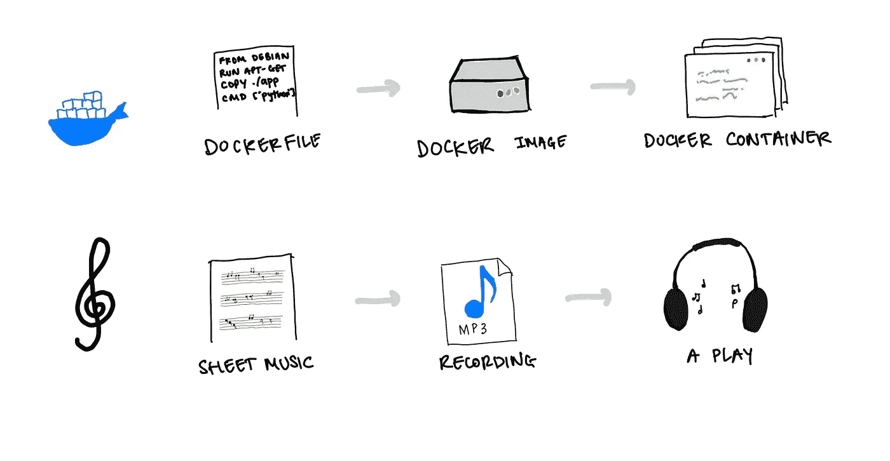

Docker (logo 是蓝鲸)是一个创建一致运行时的工具。它从对你的计算环境的书面描述开始，就像乐谱一样。这然后被编译成图像，有点像音乐被录制成文件。从这个图像中，我们可以启动容器，它们是短暂的、相同的计算作业，有点像 MP3 的每次播放都会给听者带来完全相同的体验。来源:作者

如果您的环境使用 Docker，那么有必要考虑一下创建和销毁 Docker 容器的基础知识。熟悉这些概念将减少开发的摩擦，并使您能够更快地审查代码。特别是，试着理解:

*   图像和容器的区别
*   图像是如何存储的
*   什么是`docker compose`以及它为什么有用

让我们假设您的项目在 Docker compose 中组织得很好，并且只有一个入口点，在这种情况下，您将运行如下代码:

```
docker compose up -d
```

# 1.任务组织在哪里？

团队需要一种方法来跟踪需要做什么工作，什么时候完成，谁来做。

大多数现代软件团队被描述为“敏捷”的，这基本上意味着他们以 1-4 周的周期工作，之后他们会停下来想想下一步该做什么。这包括选择一堆任务——通常被称为**票**或**问题**——为下一个周期工作。

开发人员中使用最频繁但非常不受欢迎的系统叫做吉拉。还有很多其他的，许多版本控制系统都内置了自己的问题跟踪器。

有三种主要类型的门票让你流连忘返:

*   **任务**:需要完成的一些工作，通常需要 1-12 个小时
*   **bug**:坏掉的东西
*   **Epics** :元票证代表一大块工作，包含多个任务

票证最重要的属性是其**状态**，通常是以下之一:

*   待办事项或**待办事项**:需要做的事情
*   **正在做**:正在做
*   **在评审中**:工作已经完成，其他人正在评审
*   **完成**:完成了

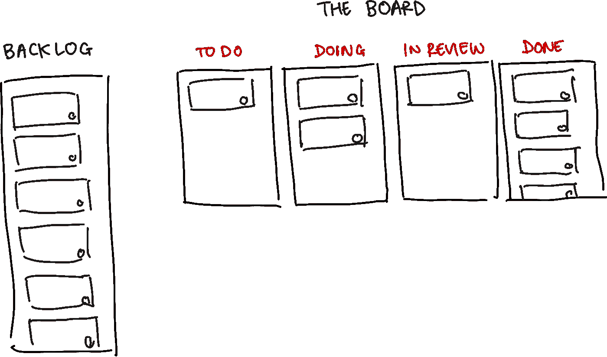

一个典型的情况是:许多任务被搁置，这意味着它们不会很快完成。被选中的任务最终会出现在“白板”上，在那里它们会移动到“要做”,进入“正在做”,然后进入“回顾”,最后完成。然后票就完成了，或者说“关闭”了。来源:作者

# 站立、计划和追溯

大多数软件团队有 3 次例会，在会上回顾进展并做出决定。在这些会议中，你将选择或被分配你的任务，报告你在这些任务上的进展，并思考如何更顺利地完成这些任务。

## 规划

**频率:**每次冲刺一次

**持续时间:**1 小时以上

目的:团队，或者有时仅仅是领导团队，决定下一个 sprint 应该做什么的大型会议。人们使用许多技术来区分工作的优先次序，并估计能完成多少工作。更多来自亚特兰蒂斯的[。](https://www.atlassian.com/agile/project-management/estimation)

## 单口站立

**频率**:通常每天

**持续时间:** 10 分钟

**目的:**每天检查谁在做什么，昨天完成(或没有完成)了什么，以及人们遇到的任何问题。

## 复古

**频率:**每次冲刺一次

持续时间: ~30 分钟

**目的:**这是团队反思哪些进展顺利，哪些进展不顺利的机会。当团队成熟并相互信任时，这些真的很有用。然而，很多时候，他们很尴尬。不过，还是值得一试。一些流行的技术是[启动、停止、继续](https://www.teamretro.com/retrospectives/start-stop-continue-retrospective/)和[快艇](https://www.agilealliance.org/how-to-improve-the-speedboat-retrospective/)。

# 选择你的首要任务

公司喜欢谈论“快速出货”和“快速迭代”，这被普遍认为是软件工程中的良好实践。

快速发货可以让你迅速发现你对需要建造什么以及建造它的最佳方式的理解中的缺陷。尤其是在初创公司，我们对用户的了解并不完善，业务经常以意想不到的方式发展。应对这种不确定性的最佳方式是快速发货。

作为一名新开发人员，这些原则对你来说更加重要，因为有太多你不知道的事情。了解用例、软件开发传统以及如何编写好代码的最佳方式是发布大量的用例，获得反馈，并进行改进。

记住，你的目标是**最大化你经历的周期数**，为了做到这一点，你需要挑选一些小任务。

试着找到你能做出的**最小可能**的贡献，然后去做。如果是一个 *bug 修复*比一个新特性要好，因为开发者并不真正喜欢 bug 修复，所以你是在帮所有人的忙。

具有相对独立的解决方案的小任务(意味着您不必在太多地方修改代码)是非常好的，因为:

1.  他们帮助你建立动力和信任:让你和你的团队觉得你很早就做出了贡献，这对你有好处
2.  **他们很容易被其他人审查**:审查代码可能非常耗时，你需要赢得人们花时间来帮助你改进的权利——保持简单，开始并限制你同事的认知开销
3.  **你不太可能做错**:在小任务中出错的空间更小，你也更容易在较小的工作中整合反馈

让我们假设你给自己找了一个不错的小任务，让一个按钮变大。它有一个引用 **MP-910** ，我们稍后将使用它将您的工作与您的代码正在解决的问题联系起来。

你的 JIRA 机票可能是这样的:

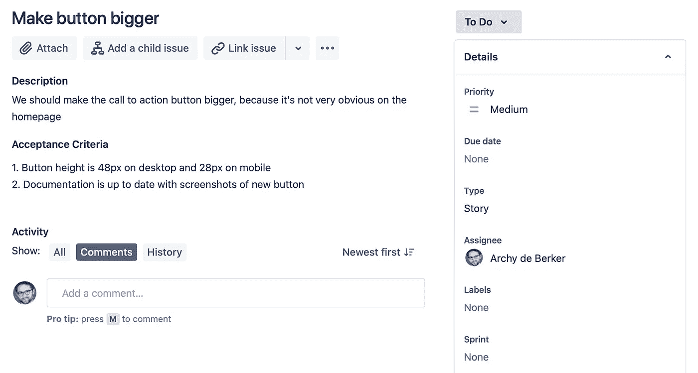

一张吉拉票的例子。来源:作者吉拉截图。

您通过将自己设置为受分配人来表明您完成该票证的意图，并将其移动到“进行中”，我们就可以开始了。

# 2.设置编写代码

有了应用程序的功能性本地版本和我们自己的任务，是时候编写一些代码了。

# 选择 IDE

为了在 MP-910 上工作，你需要编写代码，而要编写代码，你需要一个文本编辑器。

更传统的开发者使用内置于他们终端的编辑器，比如 **vim** 或者 **emacs** 。看着精通此道的人会令人眼花缭乱，因为他们敲击出晦涩难懂的键盘快捷键，手不离开键盘就能快速浏览文件。

然而，学习曲线非常陡峭，我强烈建议在编写软件的第一年避免尝试学习这些工具。

相反，你应该使用集成开发环境，或 **IDE** ，它是你电脑上专门用于编写代码的独立应用程序。它们有很多导航和操作代码的有用特性，并且它们通常由社区编写的丰富的插件生态系统支持，这些插件增加了有用的功能，如文件预览和代码林挺(稍后将详细介绍)。它们通常内置了终端和版本控制集成，因此您可以在单个应用程序中编写、运行和提交代码。

如果你正在写 Python，那么我会推荐 [PyCharm](https://www.jetbrains.com/pycharm/) ，它拥有最好的 Python 代码导航。Java 对应的是 [IDEA](https://www.jetbrains.com/idea/) ，也很优秀。

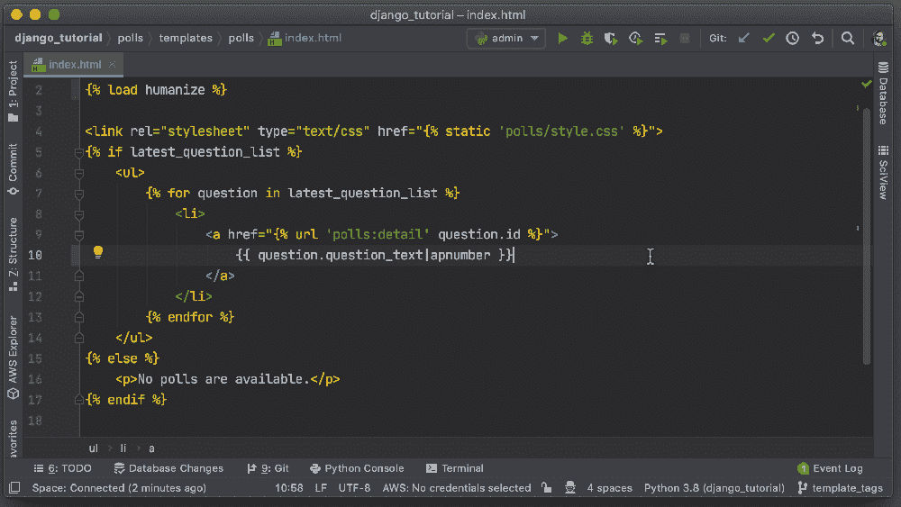

Pycharm 是一个很棒的 Python IDE。您可以在不离开编辑器的情况下提交代码并将其推送到版本控制。来源: [JetBrains](https://blog.jetbrains.com/pycharm/2020/04/new-vcs-features-in-pycharm-2020-1/)

对于其他或多或少的东西，我建议使用 [Visual Studio 代码](https://code.visualstudio.com)，它非常可扩展、快速，并且越来越受欢迎。你也可以在浏览器中使用它，所以它给了你一个非常便携的工具箱。

## 设置自动棉绒机

**林挺是一个有趣的词，与你在肚脐上发现的绒毛毫无关系。**

**它描述了以一致的方式格式化你的代码，使得其他人更容易阅读。它本质上是一套规则，应该遵循这些规则来保持事物的标准化。这些规则因语言和组织而异，但大致如下:**

*   **类名应该大写:`class MyClass`而不是`class my_class`**
*   **引号应该是双的，不是单引号`const name = "Archy"`不是`const name= 'Archy'`**
*   **最大行长度，以保持代码简洁易读**

**不遵守这些准则很容易激怒你的同事。许多公司会运行一个 **linter** ，检查你的代码是否符合他们的规则，防止你提交不符合规则的代码。**

**为了使每个人的生活更容易，我建议安装一个代码格式化程序，你可以配置它来自动格式化你的代码，使其符合你公司的指导方针，并通过 linter 检查。**

**下面是来自最受欢迎的 Javascript 格式化程序之一[pretty](https://prettier.io)的介绍，它很好地表达了格式化程序的优点:**

**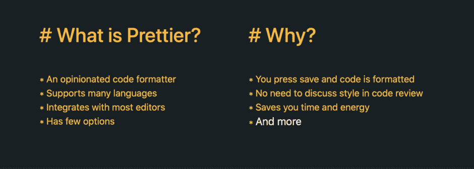**

**来源:[更漂亮](https://prettier.io/)(麻省理工学院许可)**

**[更漂亮的](https://prettier.io)工作得非常好，并与 ESLint 和 TSLint 等棉绒集成。
如果你是 Python，我建议用[黑色](https://github.com/psf/black)。您可以将它作为 PyCharm 的插件安装，然后添加一个键盘快捷键来格式化您的代码。这是魔法。**

## **使用 IDE 执行和调试代码**

**大多数 ide 都包括执行您正在编写的代码的功能。**

**正确设置这一点是值得的，因为能够快速获得关于代码是否编译或运行无误的反馈非常有帮助。这是另一个你应该尽快完成的反馈循环。**

**第二个很大的优势是，这使您可以访问可视化调试器，允许您暂停代码执行并检查代码状态以识别问题。这比`print`或者`console.log`好多了。**

**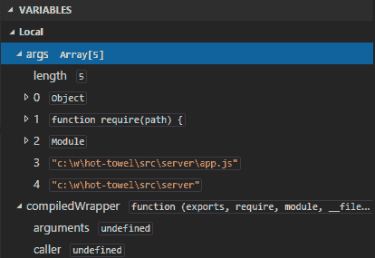**

**调试器允许您暂停执行并检查程序在特定点的状态。来源: [Visual Studio](https://code.visualstudio.com/docs/editor/debugging#_data-inspection)**

## **测试您的代码**

**与学校或学术界最大的区别之一是，公司不指望你的代码是正确的，因为它看起来是正确的:他们指望你用测试来证明它。**

**每当有人试图对代码库的主体进行修改时，以及在部署新代码之前，都会运行这些测试。他们确保一切按预期运行。软件测试的基本格式如下:**

```
def test_when_country_is_England_then_language_is_English(): 
    lang = get_language_for_country('England') 
    assert lang == 'English'
```

**这是一个非常好的主意，因为:**

1.  **编程时很容易出错:自动化测试可以防止这一点**
2.  ****自动化测试允许我们更自由地编辑代码库**，因为我们已经有了一套警报，它会告诉我们在 A 处的改变是否影响了我们不知道的 B 处的一些功能。这让我们可以更快地行动，更快地度过那该死的生命周期。**
3.  **测试提供了软件如何工作的“活”文档:设计良好的测试描绘出信息在系统中流动的主要路径。阅读测试通常比阅读文档更容易弄清楚事情是如何工作的。**
4.  **测试强化了某些良好的编程习惯:它迫使你将代码组织成小块，并鼓励你尽可能将不同的功能块分开。如果你写意大利面条式的代码，你会发现它很难测试。**

**而且，作为事务所的新手，你可以通过写好测试，大大增加同事对你第一批变革的信心。验证测试的逻辑通常比底层实现的逻辑更容易:一组编写良好的测试会告诉你的同事**

> ***我已经仔细考虑了这件事可能出错的方式，并且我已经编写了测试来确保它们不会出错***

**正如在下面的代码评审中所讨论的，你的同事是忙碌的人，容易受到压力、愤怒和不宽容的影响。通过编写好的测试，你可以让他们的生活变得容易得多。反过来，他们更有可能提供高质量的、有趣的反馈，比如“你可以重构这部分来提高时间复杂度”，而不是无聊的反馈，比如“我不知道这是否可行，写一些测试”，或者“这真的可行吗？!"。**

# **3.将代码推送到版本控制**

**好了，现在你可以让这个按钮变大了！您可以在本地运行项目，并使用调试器来修复问题，同时根据公司的规范自动格式化您的代码。太好了。**

**还记得我们为了获得当前版本的代码而进行的回购吗？我们还使用 git 来记录我们对代码库的更改，并将它们提交给团队的其他成员进行审查。我们将通过**从`main`分支中检出**一个新分支，添加一些`commits`，然后打开一个`pull request`，在`merging`该工作返回到`main branch`之前，我们在其中要求同事提供反馈。**

**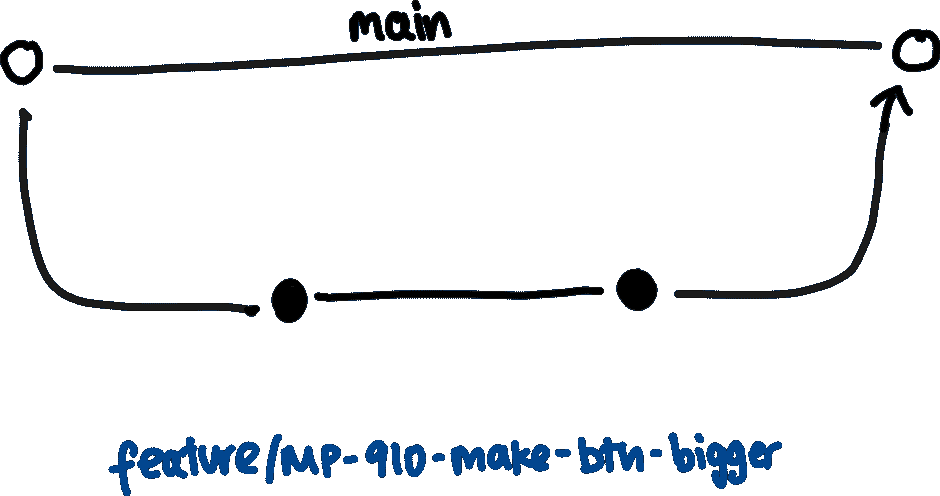**

**基本的工作流程。我们为我们的特性创建一个新的分支，并在合并回主分支(白点)之前添加提交(黑点)。来源:作者**

**最终，您的工作将形成对代码库的一系列原子变化的一部分，这些原子变化层层叠加，形成一个(有希望)伟大的产品，其中包含代码如何随时间变化的信息历史。确保你在故事中的角色以一种让你自豪的方式被写出来是值得的。**

**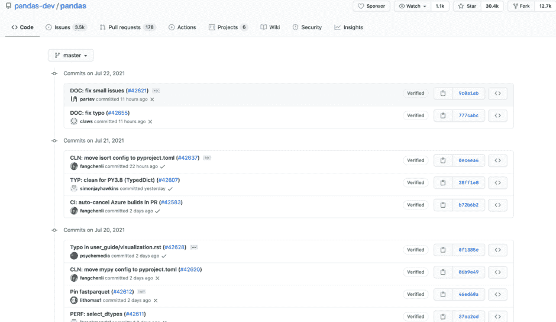**

**这是 pandas 的 git 历史，一个流行的 Python 数据分析库。这里的每一行都是到`master`分支的`commit`，以及关于提交引入了什么变化的消息。`master`中的当前代码是依次应用所有这些更改的结果。来源:Github 上熊猫的作者截图。**

## **基本 git 命令**

**你需要对`git`有一些基本的精通，以便为协作代码库做出贡献。`Git`可能会让人不知所措，但是已经有很多好的内容了:**

*   **Github : Git 手册**
*   **[罗耀拉·玛丽蒙特大学](https://cs.lmu.edu/~ray/notes/introgit/):Git 简介**
*   **[自由代码营](https://www.freecodecamp.org/news/what-is-git-and-how-to-use-it-c341b049ae61/):什么是 Git，如何使用**

**您需要很好地理解的命令有:**

*   **`branch` -创建代码的副本，这些副本将彼此独立发展**
*   **`commit` -你改变了一些东西的一大块工作**
*   **`add` -向特定提交添加修改或新文件**
*   **`pull` -从服务器抓取代码的变更**
*   **`push` -将您的本地更改复制到服务器上**

**尽管这可能令人畏惧且不直观，但好消息是`git`是你的保险单。这是一个安全网，它使得你不太可能永久性地破坏什么东西。这意味着你可以自由地四处乱搞，尝试一些东西，为自己打破一些东西，而不会影响到团队的其他成员。**

**以下是最简单的两步工作流程:**

## **1.在分支机构中组织您的工作**

****分支**是一个核心`git`概念，它描述了代码的副本，可以独立于其余部分对其进行更改。大多数软件仓库都有一些特殊的分支，你不能直接将代码推送到这些分支，比如**主库、**主库、**生产库、**或**开发库。不同的组织在版本控制中采用不同的工作组织策略。****

**在所有情况下，目的都是将稳定的代码体与新的、不稳定的功能分离开来，一旦通过了必要的审查和测试步骤，新的、不稳定的功能就会被合并到主代码库中。这是 [Github 流程](https://guides.github.com/introduction/flow/)中概述的基本模型。**

**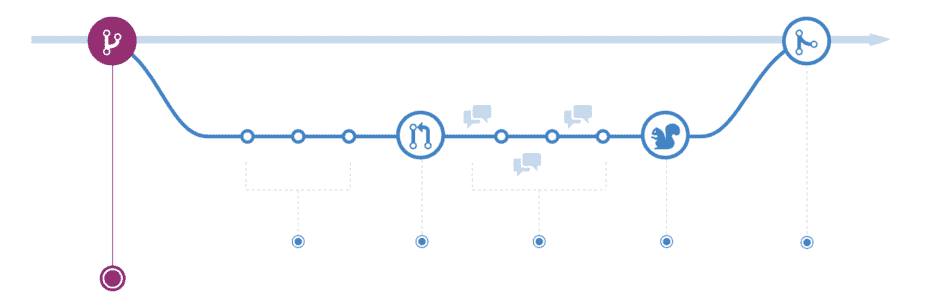**

**简单的分支模型。顶部的直线是`main`分支。我们分支到一个特性分支，添加一些提交(白色圆圈)，打开一个拉请求(带箭头的大圆圈)，然后在审查(语音气泡)之后它被部署(松鼠，出于某种原因)，并再次合并到`main`分支。来源: [Github 流量](https://guides.github.com/introduction/flow/)**

**为了做出改变，你需要自己的分支。有多种分支命名约定:一些公司使用前缀 feature 或 bugfix 来表示分支的类别。找出惯例，从主分支中取出一个分支，开始你的第一个任务:**

```
git checkout -b feature/MP-910-make-button-bigger
```

**那个`MP-910`是对你选择的任务的引用。通过将它包含在分支名称中，您给了您的版本控制和任务管理系统一个交流的机会，并在代码被推送时自动转移票证(希望您公司中的某人已经设置了这一点——如果没有，这对您来说是一个很好的小任务😉).**

## **2.将您的工作拆分为多个提交**

**一个**提交**是对现有代码的一组变更，与解释变更背后的逻辑的消息相关联。**

**理想情况下，您的提交代表了您完成任务过程中的直观步骤。有时在开始之前将工作分解是有帮助的，然后以此作为提交的指导。**

**用提交来组织你的工作有什么意义？**

**首先，如果您的工作引入了一个 bug，那么很容易通过一系列的提交来找出问题是在什么时候引入的。**

**其次，如果在某个时候你想重用*你的工作的一些*而不是其余的，你可以把你想要的提交放到别的地方(这叫做`<a href="https://git-scm.com/docs/git-cherry-pick">cherry-picking</a>`，这是一个有点高级的话题)。**

**第三，也是最重要的一点，提交描述了代码更改的逻辑，将您的工作分解成一系列更容易被他人(以及您未来的自己)理解的小块。**

**在我们的例子中，我们想让一个按钮变得更大，这可能只需要在一个地方添加代码。但是我们实际上可能需要做两处修改，一处是按钮，另一处是自述文件中描述有问题的按钮的截图。在这种情况下，最好将工作分成两次提交:**

```
(43a1r1) Increase sign up button size to accomodate new text (71282e) Update README screenshot to show new button
```

**括号中的数字是提交的**散列**——Git 用来标识提交和处理合并工作的唯一标识符。这些句子是提交消息，用简单的术语描述了提交中所做的工作。**

**编写好的提交消息是一种艺术形式，但是有三个要点:**

1.  **以大写字母开始**
2.  **用现在时写:“增加”，而不是“增加”。这描述了*当某人将与该提交相关的变更应用到代码*时会发生什么**
3.  **试着传达你正在做的事情的*意图*，而不是技术。人们可以自己阅读代码的变更:提交消息允许你捕获关于*为什么*你要做那些变更的额外细节**

**更多来自 [Chris Beams](https://chris.beams.io/posts/git-commit/) 的良好提交消息。**

**好了，现在您已经准备好提交了！**

# **4.人们如何评价我的作品？**

**在您对代码所做的编辑被合并到项目的主分支之前，您的同事会希望对其进行检查。**

**代码评审是一个非常有用的练习，有助于保持代码质量，让每个人都知道代码库是如何开发的。对你来说最重要的是，这是一个向同事学习的好机会。**

**与大多数专业情况不同，在代码审查期间，人们真的会受到激励，给你高质量的反馈。这是因为你正在编写和编辑他们将来可能会用到的代码，所以确保它是好的符合他们的利益。**

# **连续累计**

**你必须满足的第一个审查者通常是自动化的:一个所谓的**持续集成**系统，如 [Jenkins](https://www.jenkins.io/) 、 [CircleCI](https://circleci.com/docs/) 或 [Github Actions](https://github.com/features/actions) 。这个名字是对自动化测试给了我们更高的信心，我们的改变不会破坏任何东西，允许我们走向连续的(而不是零星的)部署。**

**这些检查代码可以被成功地构建和测试。通常，版本控制系统是这样配置的，你*不能*合并没有通过这些检查的代码。**

**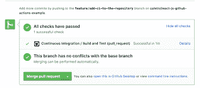**

**一个已经建立并测试成功的公关，来源: [Coletiv](https://www.coletiv.com/blog/how-to-setup-continuous-integration-and-deployment-workflows-for-reactjs-using-github-actions/)**

**有些系统还会为您创建一个测试部署。这是一个非常好的特性，允许您的评审人员实际操作您的代码，而不需要他们在本地进行设置。**

**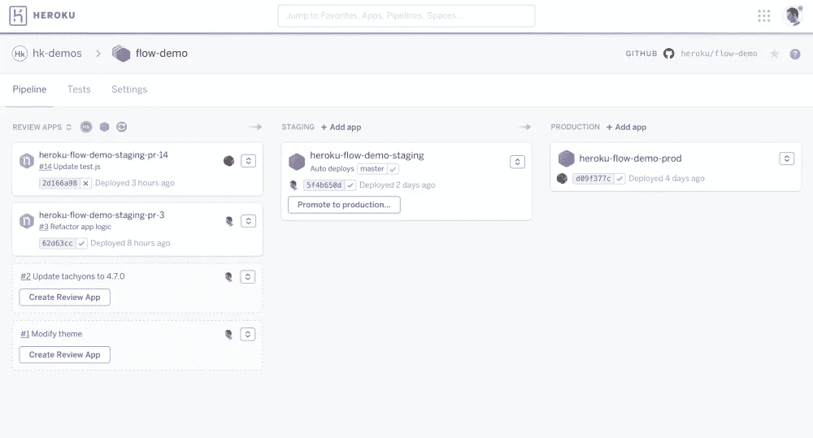**

**查看 Heroku 上的应用程序。左侧的框对应于打开拉请求时创建的临时部署。来源: [Heroku](https://devcenter.heroku.com/articles/pipelines) 作者截图。**

# **提交您的代码以供审查**

**完成你的第一次代码审查可能会非常紧张。尽量不要将任何反馈视为针对个人，如果人们发现了你忽略的错误，也不要感到惊讶——另一双眼睛通常非常有用。**

**这里有几个要点，可以让你的第一次代码评审轻松愉快，而不是伤痕累累:**

## **记录你的公关**

**从简洁的描述开始，你为什么要做这样的改变，以及代码评审者需要了解的任何额外的背景。**

**如果有你想过但没有做的事情，这里可以是一个很好的地方，这样评论者就不会浪费时间写“你想过……”了。**

**如果你想改变某样东西的外观，可以附上一张截图，甚至是一段视频，说明这件东西是如何改变的！我们试图让评论者的生活变得简单。不要让他们检查你的分支，看看改变 10px 的利润对按钮的影响！**

****

**尽可能在你的公关中加入更多的背景信息:甚至可以是一段视频。织机是一个有用的工具。来源:[织机](https://www.loom.com/blog/loom-github-chrome-extension-integration)**

## **跑起来**

**如上所述，在提交代码以供审查之前，自动格式化代码确实很有帮助。**

**这将捕获许多愚蠢的错误——如注释代码、未使用的导入或奇怪命名的变量——否则只会让您的评审者感到沮丧。**

## **检查所有东西都在本地运行**

**这听起来很愚蠢，但是你会惊讶于我们经常没有正确地检查代码是否在本地运行。**

**特别是如果您正在使用一个多组件系统——前端、后端和数据库——请务必检查所有组件是否如您所期望的那样很好地协同工作。**

## **检查测试是否通过**

**另一个令人惊讶的常见错误是无法在本地运行测试。**

**然后你推你的代码，去做别的事情，30 分钟后意识到当持续集成系统试图运行测试时，测试失败了。此时，您正在做其他的事情，并且评审您的代码已经滑落到评审者的任务列表的底部。**

## **回顾你自己的公关**

**您的版本控制系统将显示您的拉取请求，并突出显示您所做的更改。**

**自己看看这些真的是个好主意！我经常发现我无意中更改了一个文件，或者在拉取请求中添加了一个不相关的文件。**

**有时候，从评审者的角度来看你的代码有助于你发现澄清或清理代码的变化。站在评审者的角度，可以帮助你更客观地评估自己的工作。**

**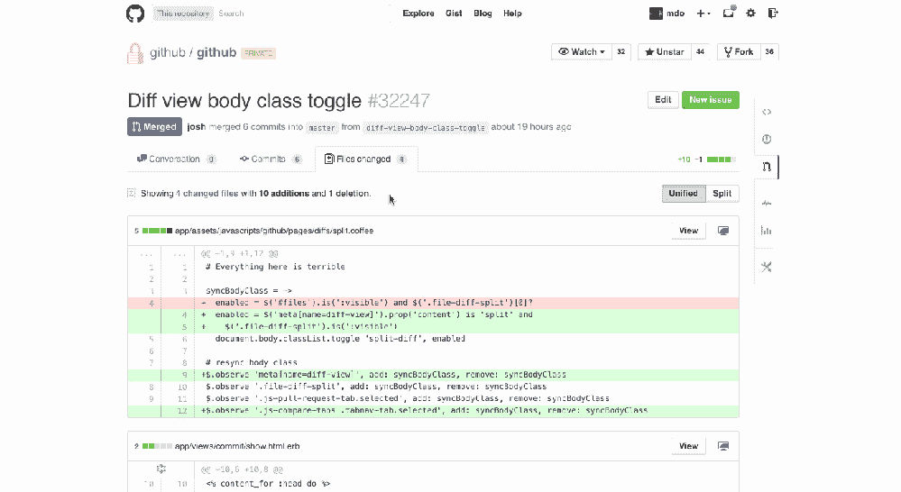**

**Git diffs:红色表示删除，绿色表示添加。你可以在 Github 上以统一或者拆分的风格查看这些。来源: [StackOverflow](https://stackoverflow.com/questions/15048958/change-github-diff-to-be-side-by-side-comparison/15713918)**

# **审查他人的代码**

**当谈到审查别人的代码时，试着记住提交自己的代码来审查是多么可怕，以及即使是最温和的建议也是对你作为一个人的价值的根本挑战。**

**关于人性化代码审查的一些建议:**

1.  ****忌****尤**。试试“我们少了一个逗号”而不是“你少了一个逗号”**
2.  ****短语为建议，而非指示**。试着说“也许这样会更好”,而不是“你应该改变它”**
3.  ****有建设性**。如果你建议改变，考虑提供一段工作代码，做你所建议的“如果我们使用字典代替像`a = dict(A=1)`那样会更有效率”**
4.  ****错了还是不一样？**有时候人会以一种你意想不到的方式完成一项任务。膝跳反应就是告诉他们这一点。在你这样做之前，考虑一下他们的方法是否真的更差，或者只是与你的想法不同。**
5.  **使用表情符号来缓和你批评性评论的语气🤨 🙋💡**
6.  ****在代码评审中，并不是所有事情都必须是负面的**！如果你认为某件事很酷，或者你学到了什么，说出来。**
7.  ****可以提问**！审查不必是单向的——编写代码的人可能非常乐意深入解释他们发现的将时间复杂度从 O(n)降低到 O(1)的简洁方法——利用这一点。**

**更多提示，请查看[谷歌关于代码审查的工程最佳实践](https://google.github.io/eng-practices/review/reviewer/)。**

**最后，记住修复一个坏的功能比修复一段坏的关系要容易得多。尤其是如果你是一名工程师。**

# **5.部署**

**部署是橡胶上路的地方:您的代码成为向用户公开的产品的一部分。**

**这通常是一个两阶段的过程。大多数公司都有一个或多个**阶段**环境，这允许你在将你的变更发布到外面的世界之前，检查它们在沙箱中的表现。一旦您在试运行中测试了功能，它就会被部署到**生产**中。**

**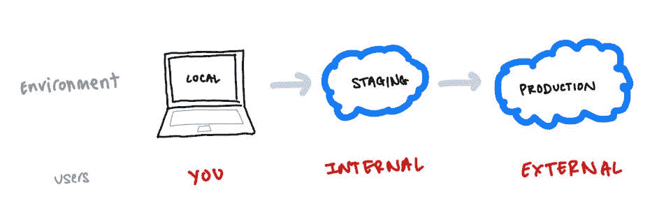**

**典型的部署流程。通常，阶段化将被称为“dev”，或者“开发环境”。在一些流程中，staging 与一个 git 分支(通常是`develop`)相关联，而 production 与另一个分支(`main`或`master`)相关联。来源:作者**

# **持续部署**

**上面讨论的**持续集成**的兄弟是**持续部署**。这是代码部署的自动化:当您将一个 PR 合并到一个给定的分支时，代码被部署到一个指定的环境中。**

**这通常由与您的 CI 相同的服务来处理，可以是您的版本控制系统(例如 Github)、第三方服务(例如 CircleCI)或您的托管环境(例如 AWS)。**

# **托管环境**

**当人们谈论软件被部署在“云”上时，他们实际上是指软件被部署在一个大型数据中心，该数据中心由一家不用付很多税的公司所有。**

**亚马逊网络服务(AWS)和谷歌云平台(GCP)最受欢迎，微软 Azure 和 Heroku 分别受到老牌公司和业余爱好者的青睐。**

**替代方案是本地或**本地**部署，其中代码在特定的命名数据中心运行——这种情况很少见，通常只用于非常敏感的环境(例如医疗保健)或有不寻常的硬件需求时(例如深度学习)。**

**如果你幸运的话，在你的第一个角色中，你不需要与主机环境纠缠太多。配置和维护部署环境本身就是一门艺术，由此产生了开发运维规程，其中 50%的人穿着西装革履的顾问谈论如何提高速度，而 50%的人穿着 Metallica t 恤衫，他们有一种超自然的能力来找出您的构建失败的原因。**

**概括地说，你的主机环境将会帮助你:**

1.  **部署东西:把运行在你电脑上的代码放在某个数据中心运行，通常是在一个 Linux 实例上或者作为一个 Docker 容器。**
2.  ****让其他人也能访问到它**:将它公开到网络上，并允许你将用户路由到它。当你有许多不同的服务时，你将使用工具来整齐地组织它们与互联网的接口，比如虚拟专用云和 API 网关。**
3.  ****但不是所有人**:你的托管环境通常会帮助你认证你的用户并管理他们的权限。**
4.  **… **有时会超出您的预期**:云计算的一大优势是可以轻松扩展您的服务来满足更多需求。如果你的信用卡额度足够高，这可以自动处理——这就是所谓的自动缩放。**

# **结束循环**

**邦扎。您的代码现在已经部署好了。如果任务管理自动化还没有为您完成，您可以从审核中的*移动您的票证- >完成！***

**希望现在的产品稍微好一点，你也稍微聪明一点。**

**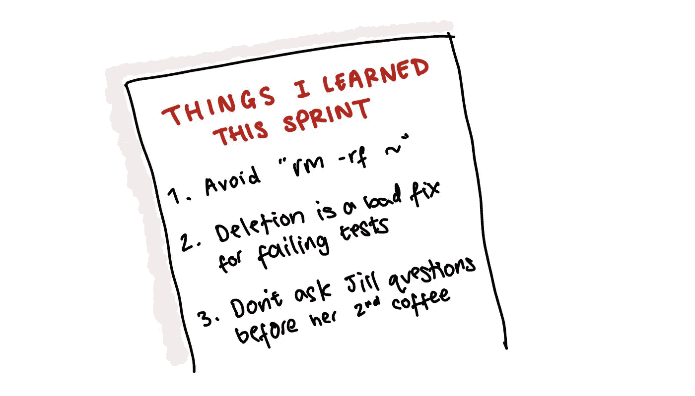**

**记下你在每个冲刺阶段学到的东西会很有帮助。第一个教训是真实的；新工作开始几周后，我设法意外地创建了一个名为~的本地文件夹，然后在尝试删除目录的过程中擦除了我的整个主目录。来源:作者**

**在完成这项工作时，考虑记下你学到的任何东西。当你遇到以前见过的问题时，日志可以派上用场，它为面试中那些讨厌的行为问题提供了大量的例子。**

**最后，如果有机会，试着**演示**你的作品。这可能只是对你的开发同事，对公司的其他人，甚至(理想情况下)对客户。这不仅可能会带来一些有用的反馈，而且解决某人的问题，然后向他们展示解决方案也是一种满足感。**

**希望你从演示工作中获得的兴奋感能让你立刻去买下一张票。**

# **进一步阅读**

**我希望这篇指南已经给了你足够的心智模型，让你可以开始写代码，并从你的同事那里积累反馈。**

**如果你想了解更多关于如何在你的第一个科技职位上取得成功的信息，我建议下一个话题是科技公司及其团队是如何工作的。**

**以下是我喜欢的一些作品:**

*   **[务实的程序员](https://pragprog.com/titles/tpp20/the-pragmatic-programmer-20th-anniversary-edition/):经典。有用的编程技巧，但关于如何理解你在公司中的角色以及如何与你的同事和用户互动的笔记更有价值**
*   **[不要称自己为程序员](https://www.kalzumeus.com/2011/10/28/dont-call-yourself-a-programmer/):这是一篇关于如何把自己想象成解决商业问题的人，而不是代码猴子的精彩文章**
*   **返工:Basecamp [可能不像其创始人在本书中描述的那样美好，但我仍然认为这些理智、冷静、高效团队合作的原则是正确的](https://www.theverge.com/2021/5/3/22418208/basecamp-all-hands-meeting-employee-resignations-buyouts-implosion)**
*   **[Rands In restes](https://randsinrepose.com/dont-skip-this/):一个伟大的科技博客，里面有大量的战争故事和享受科技生活的建议**

**如果你对我写的其他东西感兴趣，你可以在 Twitter 或我的博客上找到我[。](https://twitter.com/ArchydeB)**

***原载于 2021 年 8 月 16 日*[*【https://deberker.com】*](https://deberker.com/archy/minimal-viable-developer-acing-your-first-month-in-software/)*。***