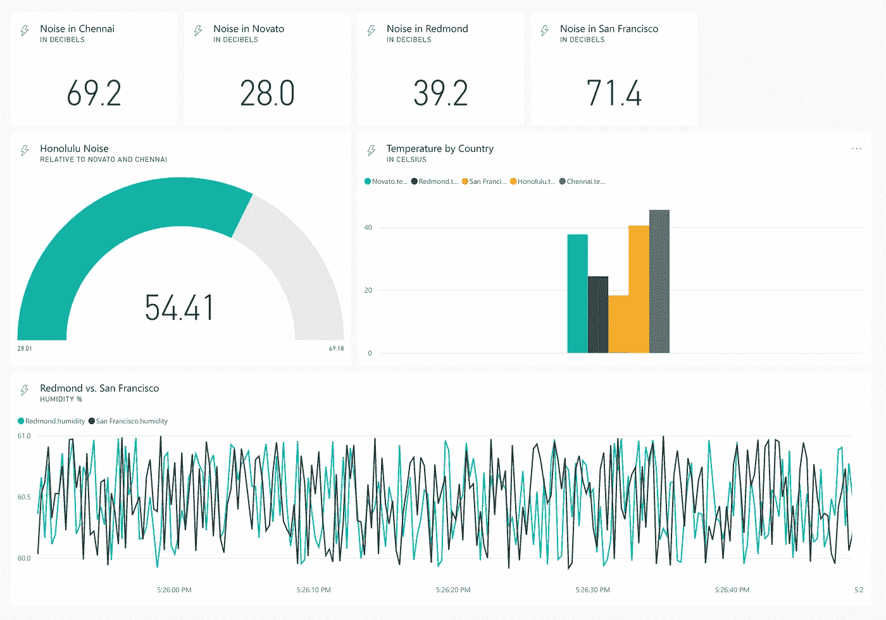
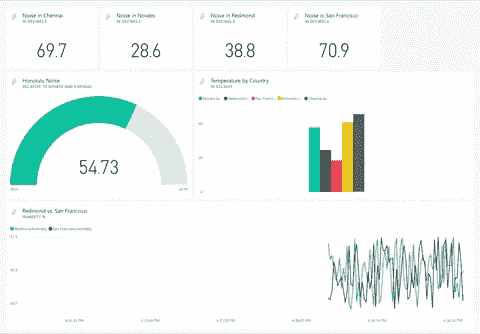
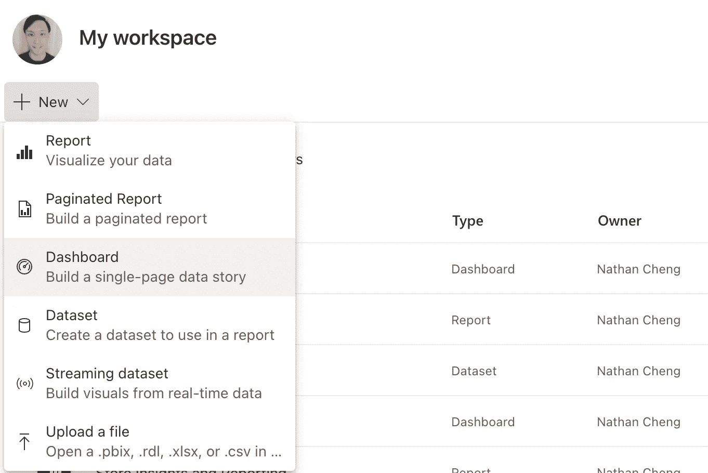
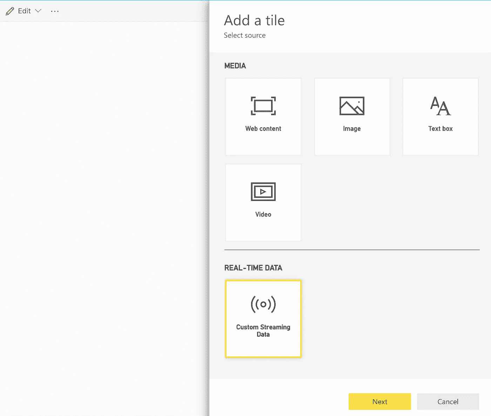
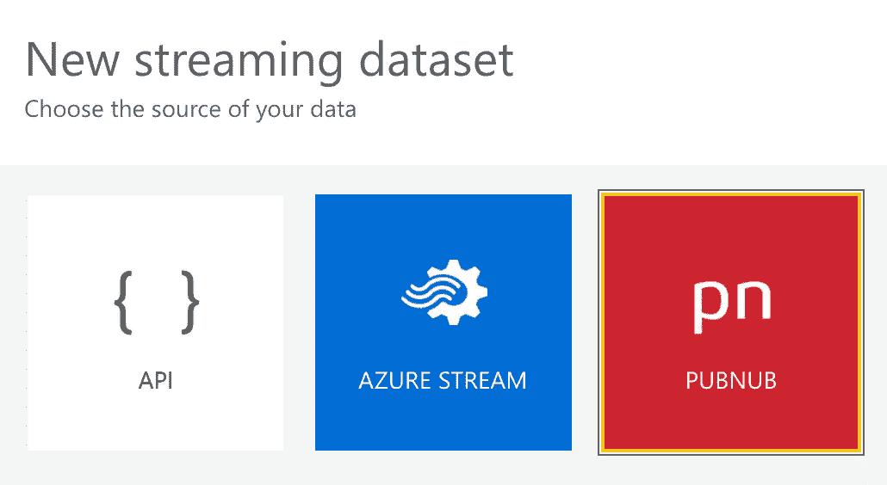
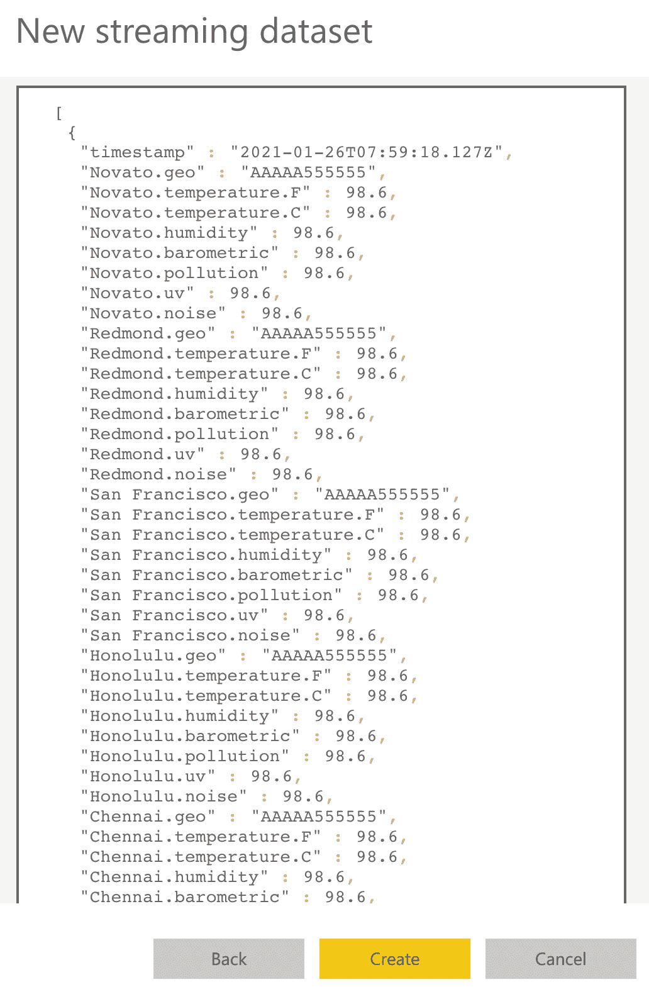
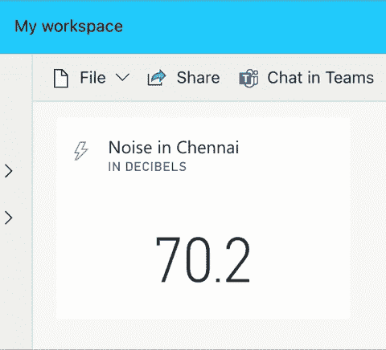
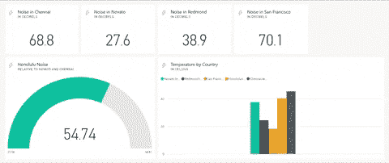
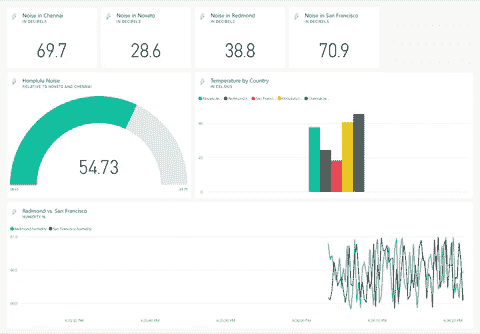

# Power BI 中的最小可行流仪表板:第 1 部分

> 原文：<https://towardsdatascience.com/minimum-viable-streaming-dashboard-in-power-bi-part-1-56e00a82c22f?source=collection_archive---------24----------------------->

## 关于开发实时流仪表板及其在 Power BI 中的用例的三部曲。

传统仪表板。图片由[作者](https://natworkeffects.medium.com)提供。

我们大多数人都熟悉传统仪表板的概念，它是关键指标和图表的汇编，显示出来为决策提供有用的信息。

这些控制面板中的大多数都由底层数据集提供支持，这些数据集以预定的时间间隔(每周、每天或每小时)刷新。

在任何给定的时间点，仪表板都为您提供静态信息的快照，这些信息将在未来的某个时间被刷新。而且这种设计模式已经被证明是普遍存在的。

然而，利益相关者有时会要求仪表板能够显示几分钟甚至几秒钟前生成的数据。

一个示例场景是监控关键医疗设备的现场工程师。为了捕捉机器停机时间，并立即做出反应以最大限度地减少对医疗服务的中断，工程师需要能够查看实时数据馈送。

输入功率 BI。Power BI 简化了我们使用无代码/低代码方法实现该解决方案的流程。

在这个由三部分组成的系列中，我将介绍如何在 Power BI 中设置流式仪表盘，以便您可以实现自己的流式仪表盘。

# 配置数据集

要显示流数据，首先需要考虑的是为仪表板提供动力的数据集。

Power BI 可以利用两种不同类型的数据集，它们是为在实时仪表盘上显示而设计的——流数据集和推送数据集。

就其核心而言，配置这两个数据集的方法几乎相同，主要区别在于，流式数据集将数据存储在临时缓存中，该缓存会很快过期，而推送数据集将历史数据存储在由 Power BI 创建的数据库中。

在本文中，我们将主要关注流数据集，并浏览一个简短的演示教程。然后，我们将看看这种解决方案发挥作用的一些用例及示例。

在本系列的[第 2 部分](/minimum-viable-streaming-dashboard-in-power-bi-part-2-b902cd25c8)中，我们将向前推进，探索流数据集的近亲——推送数据集。

## 流式数据集:利弊

如前所述，对于流数据集，数据存储在临时缓存中，很快就会过期。数据集只能存储过去一小时内生成的信息。

如果没有底层数据库来存储您的数据，您将无法在 Power BI 中使用流数据集创建报告。您只能创建仪表板拼贴。

因此，Power BI 报告中的过滤等功能不可用。

与使用推送数据集相比，这种设计的优点是仪表板平铺显示以平滑的动画更新。数据生成和可视化之间的延迟也降至最低，这有助于显示您想要监控的关键应用程序或设备生成的信息。

仪表板平铺中的平滑动画。Gif by [作者](https://natworkeffects.medium.com)。

在数据流进入 Power BI 之前，您可以执行简单的聚合，比如平均值，这样您就不仅仅局限于数据源生成的原始数据。

缺点是不能进行历史数据分析。特定时间范围或维度的筛选、DAX 表达式、穿透钻取或工具提示功能等报表功能不可用。

您可以对数据执行的聚合类型也是有限的。具有多个表连接和筛选器的复杂聚合会给仪表板带来延迟。显示复杂指标的代价是仪表板性能不佳。

如果需要复杂的聚合，您可以考虑每小时刷新一次的推送数据集或仪表盘作为其他选项。

# 演示:PubNub 数据流

有两种方法可以将 Power BI 仪表板连接到流数据集:

1.  从现有的 PubNub 数据流中读取数据。
2.  将数据推送到 Power BI REST API。

在本文中，我们将利用来自 PubNub 数据流的数据，在[第 2 部分](/minimum-viable-streaming-dashboard-in-power-bi-part-2-b902cd25c8)中，你将看到后一种方法的演示。

## 创建超级商务智能帐户

在我们为演示创建数据集之前，请使用下面的链接访问 Power BI 网站，并使用您的工作或学校电子邮件地址注册 Power BI 帐户:

<https://powerbi.microsoft.com/en-us/get-started/>  

无需下载 Power BI Desktop，因为我们无法使用流数据集创建报告。因此，在本教程中，我们只使用 Power BI 服务。

## 添加流数据集

现在，我们可以继续创建我们的流数据集。首先，在主页上点击**我的工作区**，创建一个新的**仪表盘**。

将新仪表板命名为 **PubNub 传感器集群**。

在 Power BI 中创建新的仪表板。图片由[作者](https://natworkeffects.medium.com)提供。

成功创建仪表板后，您应该会看到一个空白画布，我们可以在其中设计流式仪表板。所以我们来添加一个磁贴。

继续点击工具栏中的**编辑按钮**，然后**添加一个图块**。

在出现的右侧窗格中，我们可以选择流数据的来源。选择**自定义流数据**，点击**下一步**。

继续**添加流数据集**。

选择自定义流数据源。图片由[作者](https://natworkeffects.medium.com)提供。

选择 **PubNub** 作为我们的数据源，点击**下一步**。

这将告诉 Power BI 您想要从现有的 PubNub 流中读取数据。

请注意，PubNub 没有将数据推送到 Power BI 服务——我们只是从 PubNub 的 API 中读取数据。

PubNub 流数据源。图片由[作者](https://natworkeffects.medium.com)提供。

填写以下字段:

1.  数据集名称: **PubNub 传感器网络**
2.  子键: **mspowerbi**
3.  通道名称:**传感器网络**
4.  您可以将 PAM 身份验证密钥字段留空。

单击 Next 后，您将看到 PubNub 传感器网络数据集的模式和列名，后面是 JSON 格式的数据结构。这包含将由 Power BI 处理的数据。

继续并点击**创建按钮**来完成创建您的第一个流数据集。

现在，您将回到仪表板画布。

再次点击**编辑按钮**并且**添加一个图块**。

选择**自定义流数据**，您将看到您刚刚创建的数据集可用于创建仪表板图块。

JSON 格式的 PubNub 传感器网络数据结构。图片由[作者](https://natworkeffects.medium.com)提供。

## 设计串流仪表板

这很容易，现在剩下要做的就是通过添加磁贴来设计我们的仪表板。

使用您之前创建的数据集，用以下信息创建一个**卡片视觉**:

*   场:**奈.噪**
*   数值小数位: **1**
*   标题:**钦奈的噪音**
*   副标题:**分贝**

您最终应该得到一个类似下图的数据卡，数据从 PubNub API 实时传输到您的仪表板。

钦奈的噪音(卡片视觉)。Gif 作者[作者](https://natworkeffects.medium.com)。

对 Novato、Redmond 和 San Francisco 重复上述步骤。

完成后，您的仪表板应该有单独的卡片显示来自 4 个不同国家的噪音量。

不同国家的噪音水平。Gif 作者[作者](https://natworkeffects.medium.com)。

接下来，用以下信息创建一个**仪表视觉**:

*   值:**檀香山.噪音**
*   最小值: **Novato.noise**
*   最大值:**钦奈噪声**
*   标题:**檀香山噪音**
*   字幕:**相对于诺瓦托和钦奈**

然后，继续创建一个**簇状** **柱形图可视化**。

*   值:选择所有以**温度为后缀的列。C** 。这将把每个国家的摄氏温度添加到视觉效果中。
*   标题:**各国温度**
*   副标题:**摄氏度**

将鼠标移到簇状柱形图右下角的小箭头上。

单击并拖动箭头以控制聚集柱形图视觉效果的大小。

调整视觉效果的大小，使整个图例可见。

具有仪表和聚集柱形图视觉效果的仪表板。Gif 作者[作者](https://natworkeffects.medium.com)。

最后，创建一个**折线图视觉**。

*   轴:**时间戳**
*   值:选择以**湿度**为后缀的 Redmond 和 San Francisco 列
*   标题:**雷德蒙对旧金山**
*   字幕:**湿度%**

调整视觉效果的大小，如下所示:

带折线图视觉效果的最终仪表板。Gif 作者[作者](https://natworkeffects.medium.com)。

# 用例与真实场景

拥有流式数据集的最大优势是其极低的延迟。

但是，由于流数据集的局限性，即缺少过滤器、工具提示、穿透钻取等，如果您的企业希望跟踪需要在检测到关键事件后立即解决的关键事件，而不需要对数据执行复杂的计算，则应考虑实施此类解决方案。

真实场景的示例包括但不限于:

1.  网站可靠性工程—通过监控响应时间和修复加载缓慢的页面，提供流畅的用户体验。此外，通过响应服务器上过载的请求，防止 web 和移动应用程序停机。
2.  物联网传感器摄取-测量给定区域的人数以促进资源规划，并提出防止过度拥挤的措施，例如在公共交通上。
3.  车队维护——对自动车辆故障做出快速反应，例如送货车辆、电动汽车等，以建立强大的供应链，并确保高质量的客户服务。
4.  关键机器—快速维修机器故障，例如工厂机器，以确保高生产质量。
5.  数据中心运营-维护数据中心机器，以确保它们按需提供 IaaS 和 PaaS 服务，并满足预定义的客户 SLA。
6.  金融交易—实时查看证券数据，以便金融专业人员做出买入/卖出决策。

# 结论

## 流媒体技术服务

在过去的十年中，流媒体技术有了很大的发展。如果没有经验丰富的开发人员的帮助，这样的仪表板在几年前是很难构建和维护的。

然而，现在有许多新兴服务使每个人都能够轻松地构建流媒体应用程序。

如您所见，业务用户现在只需点击几下按钮，就可以自行构建流式仪表盘，无需太多系统管理和维护。

本文中使用的演示最初是由 PubNub 在其官方网站上编写的，因此我强烈建议您也查看他们的文章以供参考。

<https://www.pubnub.com/blog/microsoft-power-bi-streaming-business-data-to-dashboards/>  

## PubNub 示例数据流

我们刚刚探索了 PubNub 提供的众多数据流中的一个。如果你对用流技术构建更多应用的前景感到兴奋，今天就在他们的网站上探索 PubNub 的 API 吧。

<https://www.pubnub.com/developers/realtime-data-streams/>  

数据集的范围从 Twitter 互动到股票市场数据，再到维基百科的文章，所以请随意使用 PubNub 的数据流之一来构建您的下一个项目。

在那之前，我们将在[第 2 部分](/minimum-viable-streaming-dashboard-in-power-bi-part-2-b902cd25c8)中见面，届时我们将讨论推送数据集，以及如何将数据推送到 Power BI REST API。