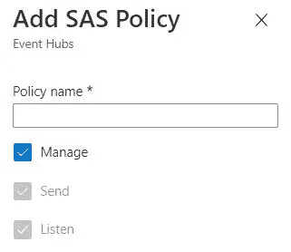

# Power BI 中的最小可行流仪表板:第 2 部分

> 原文：<https://towardsdatascience.com/minimum-viable-streaming-dashboard-in-power-bi-part-2-b902cd25c8?source=collection_archive---------25----------------------->

## 具有推送数据集和 Power BI REST API

欢迎回到最小可行流仪表板系列的第 2 部分，在这里我们继续讨论实时仪表板以及如何在 Power BI 中配置它们。

回到[第 1 部分](/minimum-viable-streaming-dashboard-in-power-bi-part-1-56e00a82c22f)，我们讨论了流数据集以及它们如何利用临时缓存来存储数据。数据过期快，导致历史数据分析无法进行。

然而，在本帖中，我们将探讨如何配置推送数据集。您将会看到更多的功能可供我们使用，包括过滤、工具提示、穿透钻取等等。

# 将数据推送到 Power BI REST API

## Power BI Rest API

使用 [Power BI REST API](https://docs.microsoft.com/en-us/rest/api/power-bi/) 将数据推送到 Power BI 数据集。

API 包含一组服务端点，使开发人员和 Azure 服务能够在其上构建应用程序。尽管我们今天不会明确地调用这些端点，但有必要理解，您可以利用这个特定的[操作集](https://docs.microsoft.com/en-us/rest/api/power-bi/pushdatasets)在 Power BI 中创建您自己的推送/流数据集。

这就是 Azure 服务(如 Azure Stream Analytics)与 Power BI 数据集交互的方式。

## 推送数据的配置方法

**1。API**

有两种方法可以将数据从数据源推送到 BI 的 REST API。

第一种是使用 Power BI 服务中提供的 **API 选项。**


Power BI 服务中的 API 选项。图片由[作者](https://nathancheng-data.medium.com/)提供。

当您单击 API 时，您将看到一个屏幕，您可以在其中命名 Power BI 数据集，并设计它的 JSON 模式。


设计数据集。图片由[作者](https://nathancheng-data.medium.com/)提供。

注意**历史数据分析** **默认为** **关**。

这是一个开关，您可以使用它在创建流数据集和利用两种模式下提供的功能的**推送+流数据集**之间切换。

关闭切换只会创建一个流数据集，其工作方式类似于我们在[第 1 部分](/minimum-viable-streaming-dashboard-in-power-bi-part-1-56e00a82c22f)中读取数据的 PubNub 流。

唯一的区别是，对于 PubNub 来说，Power BI 仅仅是从 PubNub 的 API 中读取一个数据流。


Power BI 创建的推送 URL 端点。图片由[作者](https://nathancheng-data.medium.com/)提供。

您可以将数据推送到 REST API，而无需通过 Power BI 服务的 UI。但是请记住，您必须**授权您的应用程序使用权限**来对您想要创建数据集的 Power BI 工作区进行更改。

这是一个值得专门撰写博客的话题。

今天，我们将主要关注将数据推送到 Power BI REST API 的第二种方法，使用 Azure Stream Analytics。

**2。Azure 流分析(ASA)**


Azure Stream Analytics 徽标。图片由[微软](https://azure.microsoft.com/en-us/services/stream-analytics/)提供。

Azure Stream Analytics 是一个托管的 PaaS 服务，运行在微软的 Azure 平台上。如果你以前使用过 Spark 的结构化流媒体引擎，那么 ASA 引擎非常相似。

ASA 作业是用类似 SQL 的查询语言编写的，这是任何使用过数据库的开发人员都能理解的通用语言。

该服务的设计理念与 [Spark 的结构化流项目](https://www.youtube.com/watch?v=wQfm4P23Hew&ab_channel=DataCouncil)高度相似，即作为服务的消费者，您不必担心事件流处理的复杂性，即延迟数据到达时间、数据无序、事件交付保证。

您应该能够告诉 ASA 您想要的输出，用 SQL 编写您的查询，就像您正在运行一个批处理查询一样，服务会计算出如何将该查询转换成可以在流上运行的版本。

# 演示:事件流

这是我们今天要构建的应用程序的示意图。


演示应用程序架构图。图片由 [*作者*](https://nathancheng-data.medium.com/) 提供。

对于我们的事件数据源，我们将使用一个简单的 Python 脚本向事件中心发送事件。

所以，废话不多说，让我们从 Event Hub 开始，创建我们的应用程序所需的资源。

## 为事件摄取创建事件中心名称空间

我们必须创建的第一个资源是一个事件中心名称空间，用于接收所有事件。

在此之前，请前往 Azure 并注册一个免费试用版。你可以获得 200 美元的免费信用点数，在 30 天内探索 Azure 服务。


Azure 免费试用注册屏幕。图片来自[作者](https://nathancheng-data.medium.com/)。

如果你目前是学生，你可以获得价值 100 美元的额外 Azure 点数。

**1。创建事件中心名称空间**

注册完成后，在门户的搜索栏中搜索事件中心，单击事件中心，并填写以下属性:

*   订阅:选择您的默认订阅
*   资源组:**创建新的**，并为资源组选择一个名称
*   名称空间名称:为事件中心名称空间选择一个名称
*   位置:选择离你最近的地区
*   定价层级:**标准**
*   吞吐量单位: **1**
*   启用可用性区域:**未选中**
*   启用自动充气:**未选中**


创建事件中心命名空间。图片由[作者](https://nathancheng-data.medium.com/)提供。

事件中心名称空间充当多个事件中心实例或 Kafka 术语中的主题的管理容器。

事件发布者可以使用基于 Azure Active Directory 的身份验证和授权，或者使用共享访问签名(SAS)将事件推送到每个主题。

**2。添加 SAS 策略**

我们需要一个 SAS 令牌来授权我们的 Python 应用程序向 Event Hub 发送事件。

因此，转到 Event Hub 名称空间中的 Shared Access Policies 窗格，添加一个包含以下详细信息的新策略:

*   策略名称:选择策略名称
*   管理:**勾选**



添加事件中心命名空间 SAS 策略。图片由[作者](https://nathancheng-data.medium.com/)提供。

复制为您创建的**连接字符串-主键**，并将其保存在方便的地方，我们将在稍后的 Python 脚本中使用它来向事件中心发送 web 事件。

**3。创建一个活动中心**

将鼠标悬停在“事件中心”窗格上，并使用以下属性创建一个事件中心实例:

*   名称:为事件中心实例选择一个名称
*   分区计数: **1**
*   消息保留: **1** (如果您需要一天以上的时间来完成本文中的步骤，请随意设置一个更长的保留期)
*   捕捉:**关**


创建事件中心实例。图片由[作者](https://nathancheng-data.medium.com/)提供。

## 用 Python 编写事件生成器

我们今天要使用的代码可以在这个 [Github repo](https://github.com/natworkeffects/power-bi-streaming) 中找到。

**1。安装 Python 3**

在你的系统上安装 [Python 3](https://www.python.org/downloads/release/python-379/) 。确保您使用的版本至少为 3.6 及以上。我用的是 3.7.9 版本。

**2。安装 Visual Studio (VS)代码编辑器**

安装您的 Linux / Windows / MacOS 版本的 [Visual Studio 代码](https://code.visualstudio.com/download)。

然后，在您的目录中创建一个项目文件夹。我把我的命名为 ***事件流*** ，但是你可以随意命名你的。

**3。列出所需的 Python 包**

继续，打开刚才在 VS 代码中创建的文件夹。创建一个***requirements . txt***文件。将 Github repo 中的代码复制并粘贴到您的文件中。


必需的 Python 包。图片由[作者](https://nathancheng-data.medium.com/)提供。

**4。编写模拟随机网络事件的 Python 代码**

完成后，创建一个***send _ events . py***文件。将 repo 中的代码复制并粘贴到文件中。

在您的终端中，运行以下命令:

```
pip3 install -r requirements.txt
```

这将安装包我们指定在***requirements . txt***文件前面。

如果 pip3 命令失败， ***cd*** 到 VS 代码终端中您电脑上***Python/Python 37/Scripts***文件夹中的确切 pip3 文件路径。


Python 脚本模拟随机网络事件。图片由[作者](https://nathancheng-data.medium.com/)提供。

**5。运行 Python 文件将事件发送到事件中枢**

在运行文件将事件推送到事件中心之前，将**连接字符串-主键**粘贴到 ***<连接字符串>*** 参数中。

同样，在 ***<事件中枢>*** 参数中填写您的事件中枢主题名称。

完成这些步骤后，右键单击代码编辑器中的任意位置，并选择**在终端**中运行 Python 文件。

## 从 VS 代码编辑器创建 Azure 流分析作业

**1。安装 Azure 流分析工具扩展**

在 VS 代码中，点击**扩展**标签，搜索 **Azure Stream Analytics** 。

安装 **Azure 流分析工具**扩展。

作为依赖，还为我们安装了 **Azure 账号**扩展。这个扩展使我们能够从 Azure Portal 中检索数据，并将我们的 ASA 作业发布到门户。


在 VS 代码中安装 Azure 流分析扩展。图片由[作者](https://nathancheng-data.medium.com/)提供。

**2。创建新的流分析项目**

在 Visual Studio 代码中，导航回**资源管理器**选项卡。

使用 **Ctrl+Shift+P / Cmd+Shift+P** 打开命令面板。

然后，在搜索栏中输入 ASA。

选择 **ASA:创建新项目**，输入您的项目名称。我把我的矿命名为*。*

***3。定义输入数据***

*展开**输入**文件夹，打开 ***input.json*** 文件。我们将使用这个文件来指定一个输入数据流，我们的 ASA 作业可以从中读取数据。*

*在编辑器窗口的左上角，点击**添加实时输入**按钮。选择**活动中心**，然后**从您的 Azure 订阅中选择**。*

*给你的输入流起个名字，我命名为 mine**event-hub-stream。***

**

*将实时输入流添加到流分析作业。图片由[作者](https://nathancheng-data.medium.com/)提供。*

*然后你可以使用新的**和*。在**输入**文件夹中为您创建的 json* 文件填充您的事件中枢连接设置，通过点击交互按钮。***

**

*配置事件中心实时输入流。图片由[作者](https://nathancheng-data.medium.com/)提供。*

*点击**预览数据**位于**左上角*。json*** 文件，以便了解我们之前使用 Python 脚本发送到 Event Hub 的数据。*

**

*预览事件中心数据。图片由[作者](https://nathancheng-data.medium.com/)提供。*

*请注意，输入流中的所有数据都被视为字符串。对于其中的一些列，例如***event _ timestamp***，我们将在下一步中使用 ASA 查询将它们的数据类型更改为 ***datetime*** 。*

***4。编写流分析查询***

***中的*。asaql*** 文件，插入来自 Github repo 的 SQL 查询。*

*如果您希望修改查询，可以在[这里](https://docs.microsoft.com/en-us/stream-analytics-query/stream-analytics-query-language-reference)找到流分析查询语言提供的功能的综合参考。*

**

*流分析 SQL 查询。图片由[作者](https://nathancheng-data.medium.com/)提供。*

***5。定义输出接收器***

*执行与步骤 3 中相同的过程，为 ASA 作业创建要写入的输出接收器。*

*展开**输出**文件夹，打开 ***output.json*** 文件。*

*点击**添加输出，**选择 **Power BI** ，然后**从你的 Azure 订阅中选择**。*

*给你的输出起个名字，我的是 ***事件-中枢-数据集*** 。*

*然后你可以使用新的 ***。在 **Outputs** 文件夹中为您创建的 json* 和**文件，用于填充您的 Power BI 工作空间和数据集信息。*

*记下 ***GroupId*** uuid 值。该值唯一标识您选择的 Power BI 工作空间。我们稍后将使用它向 ASA 作业授予写入该工作区的权限。*

**

*为流分析作业配置 Power BI 输出数据集。图片来自[作者](https://nathancheng-data.medium.com/)。*

*注意**我的工作空间**选项在 VS 代码中不可用(虽然在 Azure Portal 中创建 Power BI 输出接收器时可用)。*

*因此，您必须首先在 Power BI 服务中创建一个工作区，然后在 VS 代码的下拉列表中选择工作区。*

*这需要你有一个**专业版账号**，或者免费试用专业版。*

*如果您没有 Pro 许可证，您必须将输出数据集工作空间设置在**我的工作空间**中，这是通过在 Azure Portal 中编辑您的 ASA 作业来完成的。*

*6。编辑您的 SQL 查询以引用您新创建的输入流和输出接收器*

*回到你的 ***。asaql*** 文件，并更改**输出**来反映你的 Power BI 输出 sink，更改**输入**来反映你的 Event Hub 流。*

*他们将各自的名字命名为 ***。被创建的 json*** 文件。*

**

*指定 SQL 查询以事件中心输入流为目标，并将数据写入 Power BI 数据集。图片由[作者](https://nathancheng-data.medium.com/)提供。*

## *将 ASA 作业发布到 Azure 门户*

***1。提交 ASA 作业并创建服务主体***

*在你的**中*。asaql*** 文件，并通过点击左上角的**提交到 Azure** 将您的作业提交到 Azure 门户。*

*给 Azure 几分钟时间来完成作业的部署。*

*您可以在 **Azure Stream Analytics** 终端窗口中监控 ASA 部署日志。*

*部署完成后，转到 Azure Portal 查看您的新 ASA 作业。*

*点击管理身份面板，确保**使用系统分配的管理身份**在上设置为**。***

**

*流分析应用程序的服务主体 ID。图片由[作者](https://nathancheng-data.medium.com/)提供。*

*Azure 已经为您的 ASA 应用程序自动创建了一个服务主体，以及一个与**相关联的主体 ID** ，用于在将数据写入 Power BI 工作区时进行身份验证。*

*复制主体 ID，我们将在下一步中使用它。*

***2。授予 ASA 工作贡献者对您的 Power BI 工作区的访问权限。***

*现在我们要做的就是授予 ASA 作业对 Power BI 工作区的写访问权限。*

*我们可以通过使用***MicrosoftPowerBIMgmt***PowerShell cmdlet 来做到这一点。*

*在您的计算机上打开 Windows PowerShell，并键入以下命令来安装 cmdlet:*

```
*Install-Module -Name MicrosoftPowerBIMgmt*
```

*然后，继续使用您的凭据登录 Power BI:*

```
*Login-PowerBI*
```

*输入以下命令，授予 ASA 服务主体 **Contributor** 对您指定的输出工作空间的访问权限。*

*将***<group-ID>***替换为您从*your***output . JSON***文件中复制的 ***GroupId*** ，将***<Principal-ID>***替换为 ASA 作业的 ***Principal ID*** 。**

```
**Add-PowerBIWorkspaceUser -WorkspaceId <group-id> -PrincipalId <principal-id> -PrincipalType App -AccessRight Contributor**
```

****3。启动作业，并在 Power BI 工作空间中检查您的输出数据集****

**在 Azure 门户中，在 ASA 作业的概览窗格上，按 **Start** 运行作业。**

**导航到 Power BI 工作区，并验证数据集是否已成功创建。**

**如果没有创建数据集，您的事件可能已经过期，因为我们只将事件中心中事件的保留期设置为 1 天。**

**在这种情况下，再次使用***send _ events . py***文件发送 web 事件，然后验证事件是否已经写入 Power BI 数据集。**

# **结论**

**在本文中，我们探讨了如何在 Power BI 中创建推送数据集。**

**我们从将 web 事件从一个简单的 Python 脚本接收到一个事件中心开始。然后，使用 Azure Stream Analytics 作为处理引擎，对数据输入流进行转换。**

**在[第 3 部分](/minimum-viable-streaming-dashboard-in-power-bi-part-3-9d0b29f4f6a2)中，我们将通过更多地谈论流分析及其成本模型来结束这一系列，并发布我们的第一份 Power BI 报告，其中包含我们在本帖中构建的数据集。**

**在结束之前，我想简单介绍一下当今架构中使用的服务组件。**

## **事件交付保证**

**在使用流技术时，您应该注意一些警告，其中最重要的是事件交付保证。**

**ASA 保证至少向输出接收器传递一次，这保证了所有记录都被传递到 Power BI，但是数据集中可能会出现重复的记录。**

**在需要一次性交付记录的情况下，修改流分析查询，使用唯一标识符/主键来处理记录的重复数据删除。**

## **流分析创建的 Power BI 数据集中的默认参数**

**ASA 使用[推送数据集服务端点](https://docs.microsoft.com/en-us/rest/api/power-bi/pushdatasets/datasets_postdatasetingroup)创建一个 Power BI 推送数据集，其 ***默认模式*** 参数设置为 ***推送流*** ，从而产生一个数据集，该数据集可以利用我们在[第 1 部分](/minimum-viable-streaming-dashboard-in-power-bi-part-1-56e00a82c22f)中看到的报告功能和平滑动画流切片。**

**ASA 还自动将数据集的***retention policy***参数设置为 ***basicFIFO*** 。有了这个设置，Power BI 中支持 Push dataset 的数据库存储了 200，000 行，这些行以先进先出(FIFO)的方式被删除。**

**因此，即使使用推送数据集，我们也无法分析跨越太远的业务历史数据。然而，这是对仅利用临时缓存来存储数据的流数据集的改进。**

# **资源**

**我要感谢微软的贡献者，他们为我们在这篇博文中使用的技术写了很棒的文档。**

**如果您需要更多信息，请从下面列出的文章开始研究:**

1.  **[电力 BI 中的实时流](https://docs.microsoft.com/en-us/power-bi/connect-data/service-real-time-streaming)**
2.  **[使用 Python 从 Azure 事件中心发送或接收事件](https://docs.microsoft.com/en-us/azure/event-hubs/event-hubs-python-get-started-send)**
3.  **[流分析查询语言参考](https://docs.microsoft.com/en-us/stream-analytics-query/stream-analytics-query-language-reference)**
4.  **[事件交付保证(Azure 流分析)](https://docs.microsoft.com/en-us/stream-analytics-query/event-delivery-guarantees-azure-stream-analytics)**
5.  **[Power BI REST API](https://docs.microsoft.com/en-us/rest/api/power-bi/)**
6.  **[使用托管身份认证您的 Azure 流分析作业，以支持 BI 输出](https://docs.microsoft.com/en-us/azure/stream-analytics/powerbi-output-managed-identity)**
7.  **[假网络事件| PyPI](https://pypi.org/project/fake-web-events/)**

**同样，我们今天使用的所有代码片段都可以在提供的 Github 资源库中找到。在那之前，我们在[第三部](/minimum-viable-streaming-dashboard-in-power-bi-part-3-9d0b29f4f6a2)再见。**

**[](https://github.com/natworkeffects/power-bi-streaming) [## GitHub-natworkeffects/power-bi-streaming

### 此时您不能执行该操作。您已使用另一个标签页或窗口登录。您已在另一个选项卡中注销，或者…

github.com](https://github.com/natworkeffects/power-bi-streaming)**