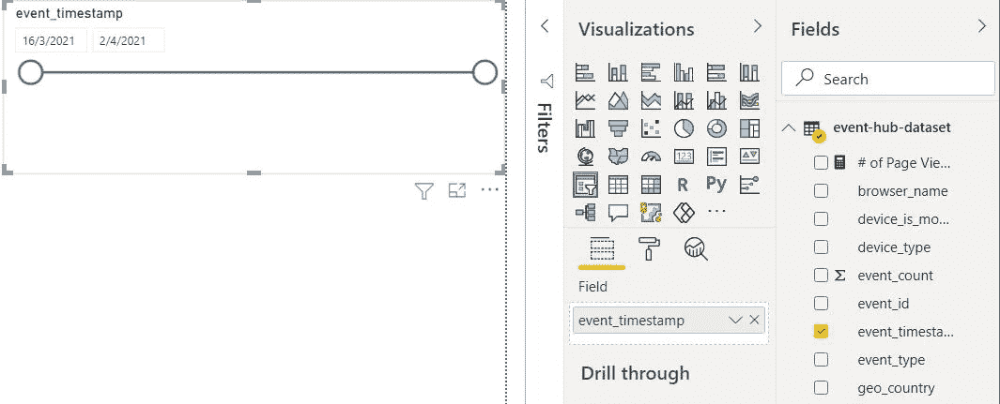

# Power BI 中的最小可行流仪表板:第 3 部分

> 原文：<https://towardsdatascience.com/minimum-viable-streaming-dashboard-in-power-bi-part-3-9d0b29f4f6a2?source=collection_archive---------25----------------------->

## 在 Power BI Desktop 中开发报告，并将报告发布到 Power BI 服务


使用推送数据集的最终功率 BI 报告。图片由[作者](https://natworkeffects.medium.com)提供。

欢迎回到最小可行流仪表板系列的最后一部分。

在本帖中，我们将介绍如何使用我们在[第 2 部分](/minimum-viable-streaming-dashboard-in-power-bi-part-2-b902cd25c8)中创建的推送数据集来构建一个 Power BI 报告。

为了提醒您，我们目前有一个 Azure Stream Analytics (ASA)作业在 Azure cloud 中运行，它将事件写入 Power BI Push 数据集。


应用程序架构图。图片由[作者](https://natworkeffects.medium.com)提供。

现在，我们剩下要做的就是通过连接到该数据集来开发我们的 Power BI 报告。

# 在 Power BI Desktop 中构建报告

在我们开始之前，请从微软网站下载 [Power BI Desktop](https://www.microsoft.com/en-us/download/details.aspx?id=58494) 。

下载如下所示的 64 位版本。


下载 Power BI 桌面。图片作者[作者](https://natworkeffects.medium.com)。

完成安装后，在 Windows 搜索栏中搜索 Power BI Desktop，右键单击应用程序图标，并将应用程序快捷方式固定到任务栏。

您应该会在任务栏上看到一个黄色的图表图标，如下所示:


Pin Power BI 桌面应用程序快捷方式到任务栏。图片由[作者](https://natworkeffects.medium.com)提供。

## 连接到推送数据集

点击任务栏上的应用程序图标，打开 Power BI Desktop。


打开 Power BI 桌面应用程序。图片由[作者](https://natworkeffects.medium.com)提供。

点击**获取数据**，使用您的 Power BI 账户登录。

在各种连接器的搜索栏中，搜索 **Power BI 数据集**。


Power BI 数据集连接器。图片由[作者](https://natworkeffects.medium.com)提供。

点击右下角黄色的**连接**按钮。

搜索您在第 2 部分中创建的推送数据集的名称。我的叫做 ***事件-中枢-数据集*** 。


连接到在[第 2 部分](/minimum-viable-streaming-dashboard-in-power-bi-part-2-b902cd25c8)中创建的推送数据集。图片由[作者](https://natworkeffects.medium.com)提供。

点击**创建**按钮，建立与数据集的实时连接。

在最右侧的字段窗格中，您将看到由 ASA 作业创建的所有列。

在页面底部附近，您会看到一条消息，说明您已实时连接到 Power BI 推送数据集。


建立与 Power BI 推送数据集的实时连接。图片由[作者](https://natworkeffects.medium.com)提供。

## Power BI 桌面简介

我会花一点时间来解释我们将在主**报告**选项卡上使用的元素。


用于报告开发的主报告选项卡。图片由[作者](https://natworkeffects.medium.com)提供。

这是**报告**选项卡，在这里您可以设计可视化，添加交互式过滤器，并为最终用户配置您的报告。

中间的大块空白被称为**画布**，是用户用来与发布的报告进行交互的主要界面。

最右边是前面提到的**字段**窗格。这是显示所有表格及其各自列的地方。

您可以看到，对于某些列，在列名旁边有一个**求和**符号。


表示值的默认汇总的求和符号。图片由[作者](https://natworkeffects.medium.com)提供。

每当您看到这种情况时，Power BI 就会在该列上应用默认汇总，只要它在 visual 中用作一个值。

为了更好地控制列的汇总方式，Power BI 中的最佳实践是创建明确的度量，定义我们希望如何对列进行汇总。

我们可以通过点击 ***event_count*** 列名旁边的省略号，并点击 **New Measure** 来实现。


在 Power BI 中创建新的明确衡量标准。图片由[作者](https://natworkeffects.medium.com)提供。

在报表画布顶部弹出的公式栏中输入以下 DAX 表达式:

```
# of Page Views = SUM('<dataset-name>'[event_count])
```

按下键盘上的 **Enter** 键。

现在，每当我们在我们的一个视觉效果中使用页面浏览量的*度量时，Power BI 知道给我们页面浏览量的总数。*

*选中 ***#页面浏览量*** 度量，将**度量工具**功能区中的**格式**选项更改为**整数**。*

*此外，继续选择**格式化**部分的**逗号**图标。*

*这将使我们的页面浏览量更加符合人眼的视觉效果。*

**

*在 Power BI 测量工具功能区中设置测量格式。图片由[作者](https://natworkeffects.medium.com)提供。*

## *设计视觉效果*

*让我们开始为我们的用户创造一些互动的视觉效果。*

*我们将创建一个摘要页面，显示我们网站上发生的事件的总数。*

*我们还将允许用户深入了解每个事件的细节。*

***1。汇总页面***

*在**可视化**窗格中，找到并选择**卡片**可视化。*

*勾选我们创建的页面浏览量**度量旁边的复选框，将显式度量添加到卡片。***

***这将显示迄今为止的总浏览量。***

******

***以百万为单位显示页面浏览总数的卡片。图片由[作者](https://nathancheng-data.medium.com/)提供。***

***选择**卡**视觉后，转到**可视化**窗格中的**格式**选项卡(油漆滚筒图标)。***

***展开**数据标签**下拉菜单，将**显示单位**改为**无**。***

******

***更改卡片可视的显示单位，以显示页面浏览总数。图片由[作者](https://nathancheng-data.medium.com/)提供。***

***接下来，从**可视化**窗格中选择**地图**可视化，将 ***geo_country*** 拖动到 **Location** 字段框中，然后将***geo _ region _ name***拖动到 ***geo_country*** 下面。***

**这将有效地创建一个层次结构，使您能够从国家级别深入到地区级别。**

**将*的页面浏览量添加到**大小**字段框中，你会看到我们的访问者来自哪里的全球分布。***

******

***地图视觉与地理层次显示网站访问者的全球传播。图片由[作者](https://nathancheng-data.medium.com/)提供。***

***选择**单击打开下钻**箭头，激活地图视图的**下钻**模式。***

******

***激活地图可视化的下钻模式。图片由[作者](https://nathancheng-data.medium.com/)提供。***

***然后，点击地图北美部分附近的**美国**气泡。***

***这将允许您深入到地区级别，并能够看到**美国**的不同地区。***

******

***在可视地图上向下钻取到美国地区级别。图片作者[作者](https://nathancheng-data.medium.com/)。***

***区域名称在这里没有什么意义，因为我们的事件是以编程方式生成的。***

***请注意当我们在同一个画布上与**地图**视觉交互时，**卡片**视觉指标是如何变化的。***

***Power BI 使同一个画布页上的视觉效果能够作为默认设置相互交互。***

***这非常方便，因为它为报表开发人员节省了一个额外的配置交互的步骤。***

***点击**向上钻取**箭头返回上一级至国家级别，并在**地图**视图上取消**向下钻取**模式。***

******

***取消地图视觉上的向下钻取模式。图片由[作者](https://nathancheng-data.medium.com/)提供。***

***现在我们知道了我们的大部分流量来自哪里，我们也可以分析用户是如何来到我们的网站的。***

***为此，向画布添加一个**圆环图**可视化，并检查页面浏览量的*和 ***utm_source*** 列。****

**确保页面浏览量的*被添加到**值**字段框中，并且 ***utm_source*** 在**图例**字段框中。***

****

**显示广告平台表现的环形图。图片由[作者](https://nathancheng-data.medium.com/)提供。**

**现在我们可以看到网页浏览量的网站来源。这告诉我们哪些广告平台的营销活动表现更好。**

**选择**圆环图**视觉后，转到**可视化**窗格中的**格式**选项卡。**

**展开**细节标签**下拉菜单，将**显示单位**改为**千位**。**

****

**更改圆环图视觉效果的显示单位，以显示页面浏览总数(以千为单位)。图片由[作者](https://nathancheng-data.medium.com/)提供。**

**点击地图图表中的**美国**气泡，然后**Ctrl+点击**谷歌**部分的**圆环图**视觉。****

****

**在同一画布上使用多种视觉效果的过滤卡视觉效果。图片由[作者](https://nathancheng-data.medium.com/)提供。**

****卡片**中的数字显示了通过我们在谷歌上发起的营销活动访问我们网站的美国用户总数。**

**最后，让我们在画布上添加一个日期切片器。**

**点击**切片器**视觉，并从**字段**窗格中检查 ***事件 _ 时间戳*** 。**

**您应该会看到如下所示的切片器，它允许用户查看特定时间段的信息。**

****

**允许用户指定时间段筛选器的日期切片器。图片由[作者](https://nathancheng-data.medium.com/)提供。**

**选择**切片器**视觉，转到**可视化**窗格中的**格式**选项卡。**

**关闭**切片机机头**。**

**接下来，展开**日期输入**下拉菜单，并将**文本大小**更改为 **12** 。**

**如下图所示排列您的视觉效果:**

****

**带日期切片器文本大小格式的最终仪表板设计布局。图片由[作者](https://nathancheng-data.medium.com/)提供。**

**将此页面重命名为**活动**概述。**

****2。详细页面****

**添加一个新的空白报告页面，并将其重命名为**活动详情**。**

****

**创建新的市场活动详细信息报告页。图片由[作者](https://nathancheng-data.medium.com/)提供。**

**在画布中插入一个**表**视图，并按以下顺序将这些列添加到表中:**

*   **事件时间戳**
*   **页面访问量**
*   **utm_source**
*   **utm_campaign**
*   **utm_content**
*   **用户 _ 自定义 _id**
*   **地理国家**
*   **地理区域名称**

****

**直观显示市场活动详细信息的表格。图片由[作者](https://nathancheng-data.medium.com/)提供。**

**选中**表格**视觉后，转到**可视化**窗格中的**格式**选项卡，展开**样式**部分。**

**将视觉样式更改为**最小**以获得更好的可读性。**

****

**更改表格视觉样式以提高可读性。图片由[作者](https://nathancheng-data.medium.com/)提供。**

**让我们在**表**中更改一些其他格式设置。**

**展开**列标题**部分，将**字体族**设置为 **Segoe UI Semibold** ，将**文本大小**设置为 **11** 。**

**对于**值**，将**字体族**保留为 **Segoe UI** ，并将**文本大小**设置为 **11** 。**

**您的最终表格结果应该如下所示:**

****

**更改字体选项后的最终表格外观。图片由[作者](https://nathancheng-data.medium.com/)提供。**

**现在回到**可视化**窗格下的**字段**选项卡。**

**向下滚动，直到看到一个框，显示**在此添加钻取字段**。**

**将以下字段拖到该部分:**

*   **地理国家**
*   **地理区域名称**
*   **utm_source**

**这将告诉 Power BI 使用您添加的字段来监听任何想要从报告中的其他页面钻取到详细页面的用户。**

****

**将钻取字段添加到市场活动详细信息页面。图片由[作者](https://nathancheng-data.medium.com/)提供。**

**如果您现在返回到**战役概述**页面，并在**地图**视图中右键单击**美国**，您应该会看到一个名为**钻取**的选项。**

****

**从活动概览页钻取到详细信息页。图片由[作者](https://nathancheng-data.medium.com/)提供。**

**将鼠标悬停在该选项上，并点击**活动详情**进入该详情页面。**

**请注意**活动概述**页面中的所有过滤器将如何延续到详细信息页面，即仅向用户显示美国页面浏览量。**

****

**从概览页应用了筛选器的活动详细信息页。图片由[作者](https://nathancheng-data.medium.com/)提供。**

****Ctrl+点击左上角的**箭头返回摘要页面。**

**点击 UI 左上角的**保存**图标，保存您的 Power BI 报告。**

# **将您的报告发布到 Power BI Service**

**现在我们有了报告，点击**主页**功能区中的**发布**，将报告发布到工作区。**

**我将在 ***事件-中枢-数据集*** 所在的[部分](/minimum-viable-streaming-dashboard-in-power-bi-part-2-b902cd25c8)中使用同一个。**

****

**向 Power BI 服务发布最终报告。图片由[作者](https://nathancheng-data.medium.com/)提供。**

**登录 [Power BI Service](http://app.powerbi.com) ，在发布报告的工作区查看报告。**

**现在，我们可以使用过滤、钻取和工具提示等功能了！**

**这就是使用可以分析历史数据的推送数据集的好处。**

****

**在 Power BI 服务中查看已发布的报告。图片由[作者](https://nathancheng-data.medium.com/)提供。**

## **将事件发送到事件中心**

**让我们使用我们在[第 2 部分](/minimum-viable-streaming-dashboard-in-power-bi-part-2-b902cd25c8)中创建的***send _ events . py***文件再次向事件中心发送一些事件。**

**给 ASA 作业一些时间来完成事件处理，并刷新报告。**

**您应该看到您的指标立即得到更新，尽管没有以前在流数据集中看到的平滑动画。**

****

**测试 Power BI 服务中已发布报告的功能。 [Gif](https://gph.is/g/aQnpvwV) 作者[作者](https://nathancheng-data.medium.com/)。**

**Power BI Push 数据集最多只能存储 20 万行。**

**如果您发现您的 ***【页面浏览量】*** 减少了，那是因为您已经达到了极限，数据集中较老的行已经以先进先出(FIFO)的方式被推出。**

# **结论**

**我们终于走到了 Power BI 系列中最小可行流仪表板的尽头。**

**在这一部分中，我们介绍了如何使用推送数据集开发 Power BI 报告，并将其发布到 Power BI 服务，以向我们的最终用户展示精选的数据和见解。**

**如果您在这些帖子中学到了对您有用的新东西，请随时关注我，了解更多关于构建现代数据管理平台的内容。**

## **流分析成本模型:基于流单元数量的每小时计费**

**每小时 0.127 美元，3 个流媒体设备全天候运行，每月仅需支付 283 美元。**

**不需要管理服务器，所以您可以只关注代码的输出。**

## **清理 Azure 门户中的资源**

**由于我们不再发送事件，您可以继续在门户中停止您的 ASA 作业。**

**否则，会产生不必要的费用。**

****

**停止 Azure 流分析作业。图片作者[作者](https://nathancheng-data.medium.com/)。**

**如果您认为将来可能仍然需要，可以保留已停止的 ASA 作业和事件中心，因为如果 ASA 作业没有运行/处理事件，事件中心没有接收任何新事件，它们不会产生任何成本。**

# **资源**

**同样，如果您没有先阅读第一部分和第二部分就直接阅读了本文，我将包含这两部分的链接。**

**所有用于研究目的的微软文档也在下面链接。**

1.  **[Azure 流分析中的流单元](https://docs.microsoft.com/en-us/azure/stream-analytics/stream-analytics-streaming-unit-consumption)**
2.  **[Azure Stream Analytics |定价](https://azure.microsoft.com/en-us/pricing/details/stream-analytics/)**
3.  **[活动中心|定价](https://azure.microsoft.com/en-us/pricing/details/event-hubs/)**
4.  **[Power BI 中的最小可行流仪表板:第 1 部分](/minimum-viable-streaming-dashboard-in-power-bi-part-1-56e00a82c22f)**
5.  **[Power BI 中的最小可行流仪表板:第 2 部分](/minimum-viable-streaming-dashboard-in-power-bi-part-2-b902cd25c8)**

**今天使用的所有 Python 代码片段都可以在
Github repo:**

**<https://github.com/natworkeffects/power-bi-streaming>  

感谢您通读本系列，下一篇文章再见。**