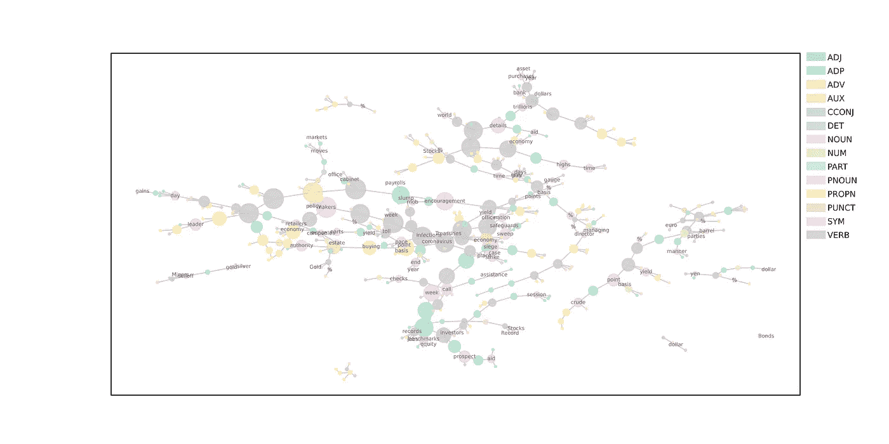
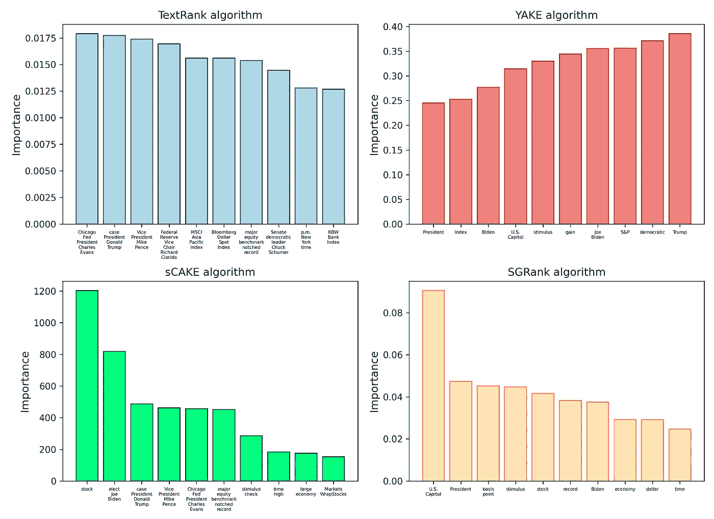
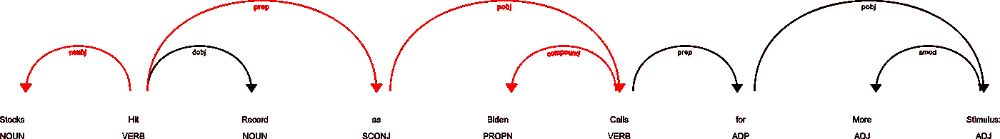
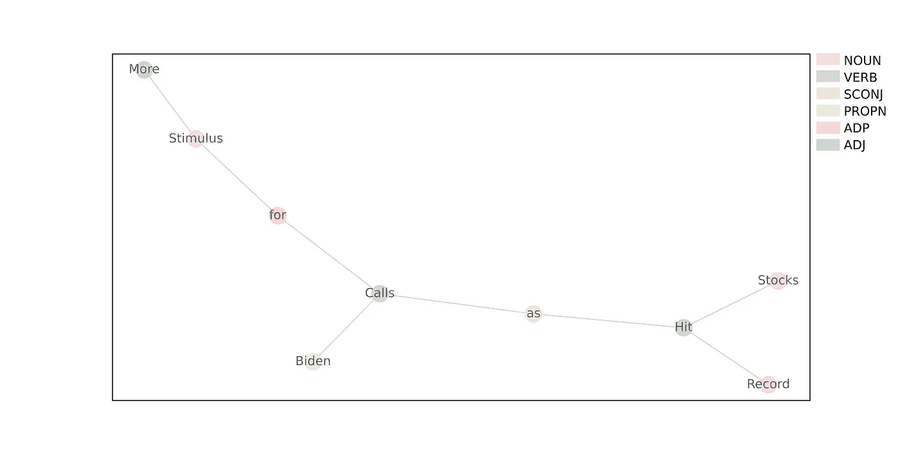
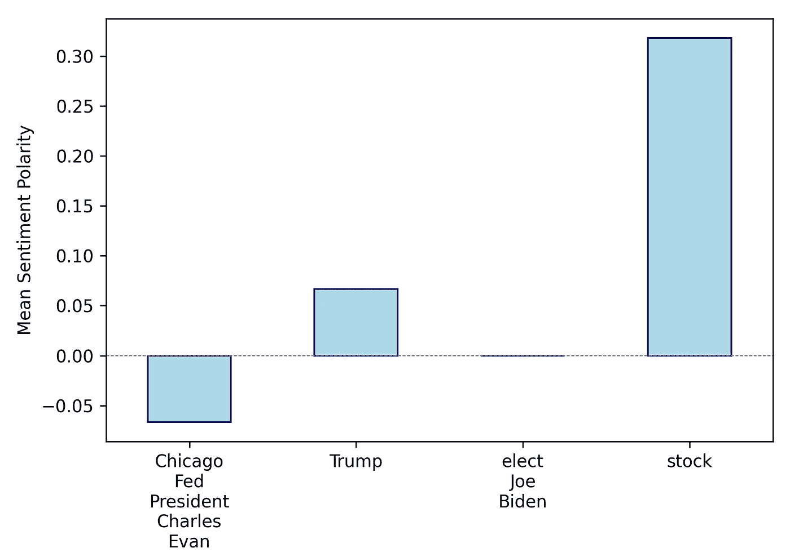

# 使用预先训练的语言模型挖掘经济新闻文章

> 原文：<https://towardsdatascience.com/mining-an-economic-news-article-using-pre-trained-language-models-f75af041ecf0?source=collection_archive---------16----------------------->

这篇文章中分析的整篇新闻文章的依赖网络的可视化。节点表示文档标记，边表示依赖关系。节点大小与介数中心性成比例，颜色表示词性标签。仅显示名词的标签。图片作者。

## 找到关键实体，建立依赖网络，并衡量新闻文章中的情绪

是时候我决定超越文档分类，使用自然语言处理来理解文本文档中的内容了，在这种情况下，是一篇[彭博文章](https://www.bloomberg.com/news/articles/2021-01-07/asian-stocks-to-follow-u-s-gains-dollar-rises-markets-wrap)。我选择的文章标题是“*股市创纪录，拜登呼吁更多刺激措施:市场回暖*”；这篇文章报道了股票市场对乔·拜登宣布将提供数万亿美元援助以支持美国经济的反应。

我之所以选择这篇文章，是因为从 NLP 的角度来理解它似乎很有挑战性；它谈论许多相关的事件和实体，而不是专注于一个人或一家公司。我想提取三条信息:

1.  这篇文章的主题是谁/什么？(我认为是股市和/或乔·拜登)
2.  主体发生了什么，主体依赖于谁/什么？
3.  正在发生的事情是好是坏，例如，对主题的看法是什么？

我将分三个独立的部分来研究这些问题，最后得出一些结论，并提出一些改进的建议。但是，首先，我要说一下我们将要使用的工具。

## 包装和建模

这个项目由 SpaCy 的' *en_core_web_sm* '语言模型支持，这是一个卷积神经网络，在 [OntoNotes5 数据集](https://catalog.ldc.upenn.edu/LDC2013T19)上训练。该模型将一个文本文档作为一个字符串，并将其转换为一个 *Doc* 对象，该对象是一个 *Token* 对象的集合。 *Token* objects 表示单词和标点符号，但具有附加属性，如词性(POS)标签(动词、形容词、名词等。)、依赖关系标签(标记在语法上是如何相关的)、词汇化形式等等。我们将使用这些属性与文本进行交互，并提取我们想要的信息。

还有第二个库 Textacy，它构建在 SpaCy 之上。它使用 SpaCy 的语言模型预测的令牌属性来执行 SpaCy 没有提供的其他有用任务。我将在这里使用它来提取关键术语和 SVO 模式，这将在后面讨论。**注意**:要在 Windows 10 上安装带有 pip 的 Textacy，我首先需要下载[微软 C++构建工具](https://visualstudio.microsoft.com/visual-cpp-build-tools/)。

除了 SpaCy 和 Textacy，我将使用另外两个 Python 库进行信息提取。第一个是 Networkx，我们将用它来构建依赖网络，找出哪些实体依赖于哪些实体；第二个是 TextBlob，我们将使用它来估计情绪。依赖项的完整列表可以在 [Github repo](https://github.com/job9931/Text-Mining) 中的*requirements . txt*文件中找到。

关于代码回购的一个注意事项:在本文中，我将代码编写为独立的片段，您几乎可以复制和粘贴，但我很快将重新构造回购，将其转换为 CLI 工具。

## 提取关键术语

Textacy 允许您实现四种不同的关键字提取算法:TextRank、YAKE、sCAKE 和 SGRank。我不会详细介绍每个算法是如何工作的，但是，它们都遵循相似的方法来计算“重要性”，使用图形和统计技术的组合。

在纯图形算法中，如 TextRank，文档被表示为图，以单词或短语为节点，以语义或上下文关系为边；然后根据连接到每个节点的边的数量和类型给每个节点分配分数。在统计算法中，例如 YAKE，它不构建图形，重要性由词频和其他度量来确定，例如给定词与停用词的相似程度。sCAKE 和 SGRank 算法是混合算法，使用图形和统计方法来生成重要性分数。

每个算法返回的前 10 个关键字如下所示:

由 Textacy 提供的四个关键术语提取算法返回的关键术语的排名。图片作者。

sCAKE(Semantic Connectivity Aware Keyword Extraction)算法在我们的新闻文章中表现最佳，发现' *stock* '是最重要的关键词，而'*elect**Joe Biden '*是第二重要的关键词，其中 *elect* 很可能来自短语 *president-elect。*其他算法识别出的最重要的关键词是“*芝加哥联邦储备银行行长 Charles Evans* ”、“*川普*”和“*美国国会大厦*”。

计算关键字并生成上述图的代码如下所示。

使用 Textacy 提供的每个文本提取算法提取和可视化文档的前 10 个关键词的代码。

## 理解主体发生了什么以及它依赖于哪些实体

为了找出我们最重要的关键词所代表的主要主题发生了什么，我将提取两种语言结构:**主语-动词-宾语(SVO)模式**和**句子**。SVO 可以用 Textacy 的 *extract* 类直接计算；它们是三元组，会告诉我们关键字在做什么，但不会告诉我们为什么，因为它们只是单词的三元组。SVO 模式的一个例子是“*总统宣布支持*”:*总统*”是主语，“*宣布*是动词，“*支持*是宾语。

为了理解事情发生的原因，我们将浏览包含关键术语的句子的**依存树**。依存树使用语法标签来解释句子中不同的单词如何相互依存。当我们创建一个 *Doc* 对象时，SpaCy 会自动为我们构建这个，如上面代码片段的第 47 行所示。

以下代码提取了所有包含我们的关键术语的 SVO 模式和句子:

如何从整个文档中获取所有 SVO 模式和句子，然后过滤它们以找到包含关键术语的那些。

首先，我使用 Textacy 提取 SVO 模式，然后过滤它们以获得包含我们的关键术语的模式。只有两个 SVO 模式包含词汇'*股票*'后的引理:

*   *股票创纪录*
*   *股票上涨 10%*

虽然这些肯定是信息丰富的，但它们并没有告诉我们是什么在推动股票发生变化。额外的信息来自句子，这些句子是通过循环*docs . sents*返回的生成器获得的；我对它们进行了过滤，以获得包含关键术语的内容。

包含“*股票*”的句子，在引理之后:

*   拜登呼吁出台更多刺激措施，股市创历史新高
*   纽约时间下午 4 点，标准普尔 500 指数上涨约 0.5%

还是那句话，只有两个；在结论中我会建议如何提取更多的句子，但现在，让我们看看如何使用它们。通过打印依赖树，我们可以看到哪些实体依赖于哪些实体。下面是句子“*股市创纪录，拜登呼吁更多刺激*”的依存树:

SpaCy 为句子“拜登呼吁更多刺激，股市创纪录”生成的依存树。箭头显示单词之间的语法依赖关系，箭头旁边的标签告诉您依赖关系的性质。在每个单词下面，我们还有位置标签。图片作者。

树标签'*用依存标签' *nsubj'* 储备了*，表示名词性主语，实质上就是句子的主语。通过箭头，我们可以看到主题依赖于哪些单词，标签告诉我们关系的性质。红色箭头通过动词' *hit* '和' *calls* '突出了单词' *Stocks* 如何依赖于' *Biden* 。

为了与依赖树进行交互，必须使用 Python 的 Networkx 模块将其转换为图形/网络。节点代表记号，边代表依赖关系:下面是句子“*股票创纪录，拜登呼吁更多刺激*”的依赖网络的可视化。

使用 Networkx 生成的依赖图。节点根据其位置标签进行着色。图片作者。

将句子表示为网络允许我们定义记号之间距离的概念(以及任何其他图形属性)。我们可以使用距离作为两个令牌相互依赖程度的基本度量，距离近的令牌比距离远的令牌相互依赖程度更高。以下代码向您展示了如何构建一个网络，并使用它来计算名词性主语与所有其他名词和专有名词之间的最短路径。

代码从 SpaCy 的依存关系树构建依存关系网络，计算所有名词性主语与其他名词和专有名词之间的最短路径，然后最终将结果保存在 DataFrame 中。

使用上面的代码，我们发现单词' *Stocks* '依赖于三个名词:

*   *记录*’—距离:2
*   *拜登*’—距离:4
*   *刺激*’—距离:5

虽然我们可以接受股市取决于拜登和他对经济的刺激，但我不会说股市取决于他们创下的纪录。这表明这种计算依赖强度的基本方法并不完美。为了改进，您可能希望只计算专有名词和命名实体的距离，尽管我们不会在本文中讨论命名实体标签(它们很容易使用， [SpaCy 会为您预测它们](https://spacy.io/api/annotation#named-entities))。

## 分析情绪

此时，我们已经通过计算关键术语发现了文章的主题——股票；主题发生了什么(股票在上涨)，通过提取 SVO 模式；通过建立依赖网络，我们知道主体依赖于哪些实体(拜登和刺激)。剩下要做的就是估计关于主题的情绪。

为此，我将使用 TextBlob 的情感分析器来计算我之前提取的所有句子的情感，然后取平均值以获得特定主题的情感分数。我还试图估计 SVO 模式的情绪，但他们都返回了 0.0 分，表明中性情绪，可能是因为他们没有包含足够的信息来提供准确的估计。

平均情感极性得分，由四个关键词提取算法返回的关于顶部关键词的所有句子得出。图片作者。

正如预期的那样，关键词“*股票*”被发现具有积极的情绪，而“*当选人乔·拜登*”是中性的，“*川普*”是积极的，而“*芝加哥联邦储备银行行长查尔斯·埃文*”是消极的。快速计算情绪的代码在这里:

计算我们之前提取的句子的平均情感极性得分。

## 结论

本文的主要观点是，您可以使用预先训练的语言模型，尤其是 SpaCy 提供的语言模型，从文本文档中提取大量信息。此外，我希望这篇文章向您展示，您不需要使用最先进的模型架构来获得良好的结果，因此，与其将时间花在训练语言模型上，不如将时间花在提取信息和利用现有模型构建知识上。

虽然我们能够快速获得大量信息，但仍有几点需要改进:

*   首先，如果你事先没有读过这篇文章，很难知道哪个关键词提取算法是最好的。为了解决这个问题，在选择一个算法之前，您可能希望使用所有 4 个算法并跟踪每个算法对于您给定任务的性能。
*   第二，我们收到的 SVO 句型和句子数量很少。这部分是因为一些关键词含有噪音。例如，只有一个句子包含“*选举乔·拜登*”，但许多句子包含“*拜登*”。因此，您可能希望在提取 svo 和句子之前清理您的关键术语。例如，您可以通过检查关键字中有哪些 POS 标签，并只保留专有名词来做到这一点。另一个建议是找到关键术语的同义词，例如，除了搜索“*股票*”之外，还要搜索包含“*市场*”和“*指数*”的句子。

我们已经了解了如何提取关键术语、SVO 模式和句子，如何构建依赖网络并使用它们来发现句子中标记之间的关系，最后，如何评估文档中关于关键术语的情感。这里的代码应该可以帮助你快速开始挖掘你自己的文本文档，你可以到项目报告[这里](https://github.com/job9931/Text-Mining)获得一些额外的绘图功能，并查看我们提取的数据！

关键词提取算法引用: [TextRank](https://www.aclweb.org/anthology/W04-3252.pdf) ， [YAKE](https://repositorio.inesctec.pt/bitstream/123456789/7622/1/P-00N-NF3.pdf) ， [sCAKE](https://arxiv.org/pdf/1811.10831v1.pdf) ， [SGRank](https://www.aclweb.org/anthology/S15-1013.pdf)

保持联系: [linkedin](https://www.linkedin.com/in/oliver-batey-084a75150/)