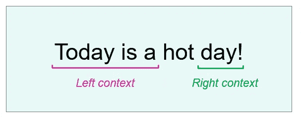
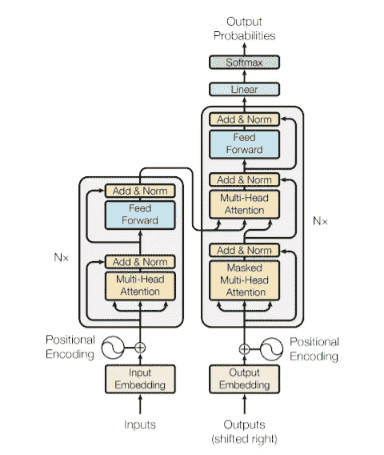
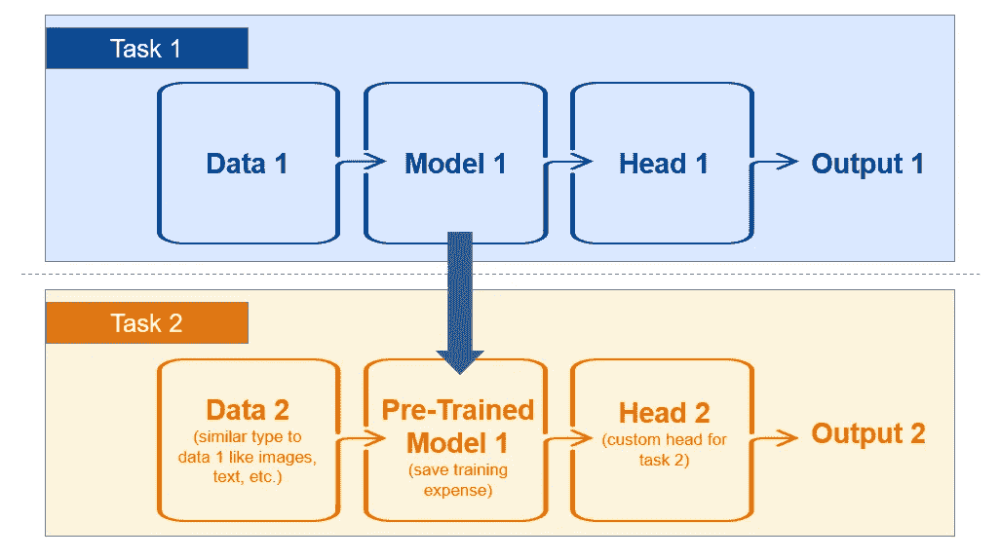
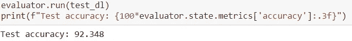
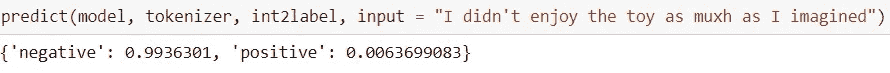

# 挖掘意见以了解客户趋势:第 1 部分，共 2 部分

> 原文：<https://towardsdatascience.com/mining-opinions-to-understand-customer-trends-part-1-of-2-e531793228b7?source=collection_archive---------45----------------------->

## 用 PyTorch 微调预训练变压器

ahin Sezer diner 在 [Unsplash](https://unsplash.com?utm_source=medium&utm_medium=referral) 上拍摄的照片

随着互联网上可用信息的丰富，挖掘意见以了解客户对你的品牌、产品和服务的感受已经成为一个重要的成功指标。公司在投资人工智能以从客户头脑中获得有价值的见解时不会退缩。

> “你最不满意的顾客是你最大的学习来源”~比尔·盖茨

为了挖掘客户的意见，公司经常利用自然语言处理(NLP)的进步，在这篇博客中，我想探索一些可以用来解决手头问题的 NLP 的关键概念。

## 目标

在这个由 2 部分组成的系列中，我使用 2017 年改变 NLP 面貌的模型 Transformers，使用亚马逊评论分析不同产品领域的客户情绪。除了 Transformers，我还探索了并行计算、迁移学习和交互式仪表板的概念。

> 本系列的第 1 部分着重于微调预先训练好的变压器，第 2 部分详细介绍了我在 Jupyter 笔记本上创建交互式仪表盘的实验。

# 1.在我们编码之前…

## 1a。变压器-ing NLP

[Samule 孙](https://unsplash.com/@samule?utm_source=medium&utm_medium=referral)在 [Unsplash](https://unsplash.com?utm_source=medium&utm_medium=referral) 上拍照

> Transformer 是一种 NLP 编码器-解码器架构，它使用多头自关注机制来并行处理输入序列。

让我们分解上面的句子，并为每个部分开发一个直觉:

*   **“NLP”:自然语言处理或 NLP** 是机器学习中的一个领域，它帮助机器从人类语言中获取意义。NLP 的应用范围从理解语言(如总结文本、社交媒体监控)到生成语言(如为图片创建字幕)，有时两者同时进行(如语言翻译、聊天机器人)。
*   "**编码器-解码器架构**":计算机/机器无法理解文字，因此我们以数字的形式给它输入语言。**编码**意味着将数据转换成编码信息(在我们的例子中是数字向量，也就是隐藏状态)，而**解码**意味着将编码信息转换成可理解的语言。解码器的输出将取决于模型的目标，例如，在将英语翻译成印地语时，解码器会将编码的消息转换成印地语。
*   "**自我关注机制**":简单的编码器-解码器架构的缺点是，由于[消失梯度问题](/the-vanishing-gradient-problem-69bf08b15484)，它不能熟练地管理长句子序列。为了解决这个问题，引入了**注意机制**。目的是允许 NLP 模型在解码每个时间步长时更多地关注输入序列的相关部分。有[种不同类型的注意力](/attention-and-its-different-forms-7fc3674d14dc)，变形金刚使用的那种叫做[自我注意力](/illustrated-self-attention-2d627e33b20a)。它通过利用上下文向量来捕捉句子中单词之间的上下文关系。

> 注意是理解变压器和 NLP 最重要的概念之一，在这里阅读更多关于它的内容！

*   "**多头注意力**":自我注意力过程并行重复多次，每次都称为一个头，因此得名"多头"注意力。多头注意力允许嵌入学习每个单词意思的不同方面。一种思考方式是，一座建筑可以用它的高度、宽度、颜色、位置等来描述。而拥有不同的描述，让最终的画面更加丰富。
*   "**并行处理输入序列**":变形金刚的前身按顺序(一个单词接一个单词，从左到右或从右到左)编码输入，不允许模型利用 GPU 并行计算的魔力。假设 Transformer 架构为每个时间步长创建上下文向量，则单词相互独立，可以并行处理。该属性还允许模型中的双向性，即每个单词预测都考虑当前单词两侧的上下文。(图一)

图 1:变形金刚在编码过程中从两个方向考虑上下文(图片由作者提供)

> 变形金刚在 NLP 中是一股强大的力量，有大量文章解释了[原始论文](https://arxiv.org/pdf/1706.03762.pdf)。上面的简短描述并没有很好地体现建筑的复杂之美——我鼓励你多读一些关于它的内容。这里有一篇这样有用的[文章](/transformers-89034557de14)。

图 2:变压器架构([来源](https://arxiv.org/pdf/1706.03762.pdf))

## 1b。将学习转化为救援

当我们开始向机器学习模型教授人类语言时，我们理解得相当简单的人类语言似乎具有无限的复杂性。找到捕捉所有细微差别的数据集来制作高级 NLP 模型是一项艰巨的任务，一旦我们找到了必要的数据量，模型的实际训练就变成了一项计算开销很大的任务。为了解决这个问题，我们使用迁移学习。

> 在迁移学习中，我们重用一个预先训练的模型作为另一个模型的起点。潜在的想法是，在第一个任务中学到的特征足够普遍，可以重新用于第二个任务。

图 3:迁移学习的图解(图片由作者提供)

2018 年，谷歌彻底改变了 NLP 格局(再次！)通过从变压器释放双向编码器表示( [BERT](https://arxiv.org/abs/1810.04805) )。BERT 本质上是“变形金刚”的“编码器”部分，它是在维基百科语料库上训练出来的(意思是很多很多的数据！).

> 来自 BERT 的迁移学习显示了 2018 年对 11 个不同下游任务的异常预测。

BERT 的目的是制造一个健壮的编码器，它可以嵌入单词，同时从两个方向考虑句子的上下文。(当前单词前后的单词)唉，它就是这么做的！使用来自 BERT 的预训练表示显著地增加了 NLP 模型预测的准确性，并且甚至更显著地减少了达到该准确性所需的计算开销。

> 经过预先训练的语言模型已经成为自然语言处理研究中的一项重要内容，在过去的三年中取得了许多突破。 [GPT-2](https://d4mucfpksywv.cloudfront.net/better-language-models/language-models.pdf) 、 [GPT-3](https://arxiv.org/pdf/2005.14165.pdf) 、 [T5](https://arxiv.org/pdf/1910.10683.pdf) 、[罗伯塔](https://arxiv.org/pdf/1907.11692.pdf)和 [XLNet](https://arxiv.org/abs/1906.08237) 是其他一些流行的语言模型。

## 1c。并行计算的力量

随着数据可用性的扩展和体系结构的复杂性，给你的神经网络增加新的层次对你的 CPU 来说是一项艰巨的任务。让“工作”变得更容易的一个简单方法是利用多个 CPU 内核。这有助于 CPU 并行处理进程，减少周转时间。

加快处理速度的更好方法是使用[GPU](/what-is-a-gpu-and-do-you-need-one-in-deep-learning-718b9597aa0d)。CPU 并行计算线程的能力受限于内核的数量，然而，GPU 可以同时处理多个计算。事实证明，GPU 对于 ML 模型非常有价值，尤其是对于深度学习。

GPU 可能不适合所有人，但不用担心，ML 社区会支持你！网上有多种选择可以使用免费的 GPU！在这篇博客中，我将利用 [Google Colab](/getting-started-with-google-colab-f2fff97f594c) 的 **NVIDIA** GPU。

> 对于 NVIDIA GPUs，我们可以使用 [CUDA](https://blogs.nvidia.com/blog/2012/09/10/what-is-cuda-2/) 来创建一个简单的解决方案，以允许在我们的模型中进行并行处理

# 2.现在，让我们编码

上面讨论的概念可以用来创建一个 ML 模型来挖掘意见和理解当前的客户情绪。我将这个过程分为 4 个步骤:

*   数据准备
*   迁移学习
*   微调和培训
*   预测！

我将使用来自[多领域情感数据集(版本 2.0)](https://www.cs.jhu.edu/~mdredze/datasets/sentiment/) 的“未处理的”tar 文件。该数据集包含过去几十年中多个类别的亚马逊产品评论。

## 2a。数据准备

数据以 XML 格式呈现，首先需要转换成 Pandas 数据框架。我们可以用美味的汤来做到这一点。

> “Beautiful Soup 是一个 Python 库，用于从 HTML 和 XML 文件中提取数据。它有助于导航、搜索和修改解析树”

代码块 1 :使用 Beautiful Soup 将 XML 数据转换成 Pandas DataFrame

我们现在将使用 BERT 词汇表将文本转换成标记。 [PyTorch-Pretrained-BERT](https://github.com/huggingface/pytorch-pretrained-BERT) 库为所有的 BERT 模型提供了令牌。点击阅读更多关于他们[的信息。](/bert-to-the-rescue-17671379687f)

每个模型都有一个“最大序列”限制，我们需要将我们的令牌截断到伯特的限制，即 512。我们还将添加一个标记来区分句子(“CLS”)和填充(“填充”)，以确保所有句子都具有相同的长度。

**代码块 2** :创建一个处理器来标记数据集

我们现在将创建一个[数据加载器](/how-to-use-datasets-and-dataloader-in-pytorch-for-custom-text-data-270eed7f7c00)来遍历数据。数据加载器支持数据的自动批处理，在我们希望并行处理数据操作时非常有用。在将文本放入数据加载器时，我们对数据集的每一行进行标记，并用相应的标签加载它。

**代码块 3** :创建一个带有文本标记和相应标签的数据加载器

## 2b。迁移学习

对于迁移学习，我采用了来自[NAACL 2019 迁移学习](https://docs.google.com/presentation/d/1fIhGikFPnb7G5kr58OvYC3GN4io7MznnM0aAgadvJfc/edit#slide=id.g5a8fba10ed_1_204)教程的预训练模型。

**代码块 4** :变压器型号

在模型的顶部，我们将为业务问题添加一个分类器头。在我们的例子中，我们希望预测“积极”或“消极”的客户反应——因此，我们的模型将有两个输出类。

**代码块** **5** :模型分类头

## 2c。模型微调和培训

我们现在需要创建一个函数来训练数据，并创建一个评估函数来评估每个时期的验证数据。我们还需要为模型优化定义一个配置。定义一个单独的字典来微调模型允许我们在迭代超参数时进行简单的修改。

**代码块**6:定义列车功能

**代码块 7** :定义评估函数

PyTorch 的 Ignite 库只需要几行代码就可以非常方便地进行培训和评估。

**代码块 8** :训练模型

可以使用定义的赋值器来检查模型的准确性。预训练模型使我们能够通过几千个例子达到 92%的准确率。

图 4:测试集上的模型准确性

## 2d。预测！

为了预测样本，我们将首先像代码块 2 一样标记数据，然后将其输入到模型中。

**代码块 9:** 定义预测功能

上述函数可直接用于输出单个句子的肯定和否定类别。在这个博客的第 2 部分，我们将使用这个函数进行批量预测。

图 5 **:** 单输入的模型预测

# 结论

概括地说，我们学习了如何使用漂亮的 Soup 读取 XML 文件，使用 PyTorch 数据加载器创建迭代器，使用 BERT 标记文本，并在预训练的模型上使用迁移学习来创建情感分析的基础。一个分类器也被添加到基本模型中，使其能够预测积极和消极的情绪。

查看“[注意力是你所需要的全部](https://arxiv.org/pdf/1706.03762.pdf)”这篇文章，阅读更多关于变形金刚的内容。请参考[源代码](https://github.com/VidushiBhatia/Mining-Opinions-using-Transformers-PyTorch/blob/main/Mining_Opinions_to_Predict_Customer_Trends_using_Transformers_PyTorch.ipynb)了解更多细节，如果您有任何问题/建议，请随时联系我！

> 在这篇博客的第二部分，我将创建一个交互式仪表板，它将根据变压器模型的预测绘制实时趋势！