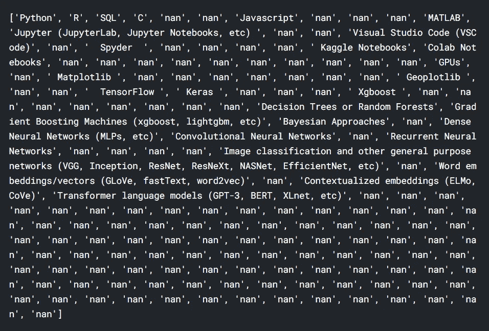
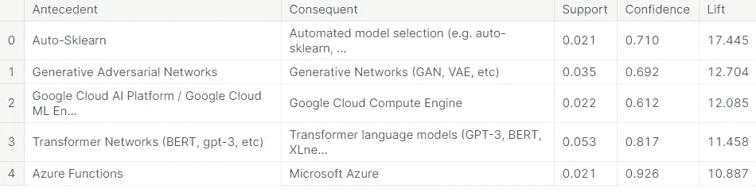
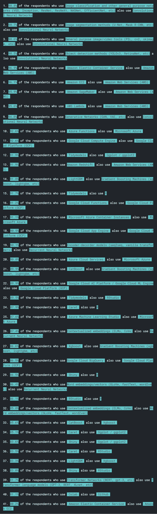

# 挖掘“2020 年 Kaggle 机器学习和数据科学调查”数据

> 原文：<https://towardsdatascience.com/mining-the-2020-kaggle-machine-learning-data-science-survey-data-e4f29188515?source=collection_archive---------29----------------------->

本文将 Apriori 算法应用于“2020 年 Kaggle 机器学习和数据科学调查”数据，以找出受访者使用的技术之间的关联。本文假设读者具备 Apriori 算法及其 Python 实现的工作知识。

威廉·艾文在 [Unsplash](https://unsplash.com/s/photos/survey?utm_source=unsplash&utm_medium=referral&utm_content=creditCopyText) 上的照片

[2020 Kaggle 机器学习&数据科学调查](https://www.kaggle.com/c/kaggle-survey-2020)是由 [Kaggle](https://www.kaggle.com/) 在 2020 年进行的一项调查。该调查于 2020 年 10 月在网上进行。经过数据整理，该调查有 20，036 份回复。该调查有 39 个以上的问题，询问受访者关于他们的人口统计数据、用于数据科学和机器学习的技术(编程语言、ide、算法、库和云产品)、他们计划在未来学习的技术等。

Kaggle 还从 2020 年 11 月 19 日到 2021 年 1 月 7 日发起了一年一度的数据科学调查挑战，供社区使用这些数据讲述一个关于数据科学和机器学习社区的故事。在本文中，我们将尝试找出被调查者使用的各种技术之间的关联规则。让我们开始挖掘“2020 年 Kaggle 机器学习和数据科学调查”数据。这篇文章的完整代码可以从我的 [Kaggle 笔记本](https://www.kaggle.com/ksvmuralidhar/association-rule-mining-kaggle-2020-survey)中获得。

## 数据导入和预处理

从响应中删除“None”和“Other ”,因为它们不携带任何信息，还会导致整个数据集重复。例如，我们无法区分“使用的编程语言”问题和“使用的 IDEs”问题中的“无”或“其他”。

有两个回答，分别是‘MATLAB’和‘Shiny’，出现在两个不同的问题中。“MATLAB”出现在“使用的编程语言”和“使用的 IDEs”问题中。同时，Shiny 出现在“使用的数据可视化库”和“用于公开共享机器学习应用程序的产品”问题中。因此，我们将把“IDEs used”问题下的“MATLAB”替换为“MATLAB IDE”，把“Products used to public share machine learning applications”问题下的“Shiny”替换为“Shiny(public share)”。

数据存储在数据框中，但 Python 中“apriori”包的“apriori”方法需要一个列表列表，而不是数据框。因此，我们将把数据框转换成一个列表的列表(我们称之为“主列表”)，其中“主列表”中的每个列表代表数据框的一行/一个索引。

“主列表”中的列表(图片由作者提供)

## 对数据应用 Apriori 算法

数据经过处理，可以进行关联规则挖掘。我们将设置“最小支持度”为 0.02，“最小置信度”为 0.6，“升力”为 3，“最大长度”为 2。

生成的前 5 条规则记录(按作者排序的图片)

我们将筛选支持度大于 0.02、置信度大于 0.8 和提升度大于 3 的规则，并将它们组织成句子，这有助于读者轻松理解它们。

作者图片

这些是从 Kaggle 调查数据中生成的一些重要的关联规则。具有高置信度的规则听起来非常明显。很少有规则(如规则 40)显示出“Colab”和“Github”之间的强关联，这在这个关联规则挖掘练习之前是没有预料到的。然而，通过调整 support、confidence、lift 和 max_length 超参数进行的进一步分析可能会揭示听起来很有趣的其他见解。