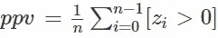
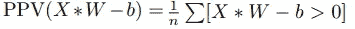
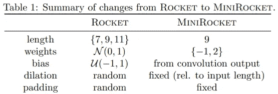
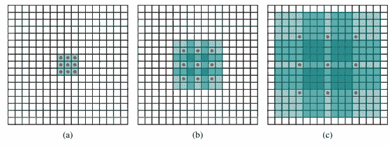
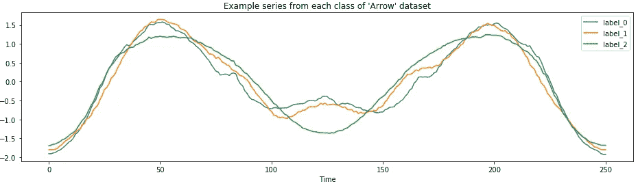

# 微型火箭:快速和准确的时间序列分类

> 原文：<https://towardsdatascience.com/minirocket-fast-er-and-accurate-time-series-classification-cdacca2dcbfa?source=collection_archive---------7----------------------->

## [思想和理论](https://towardsdatascience.com/tagged/thoughts-and-theory)

## 使用 Python 实现系列分类的最快的先进算法


由[乔·施奈德](https://commons.wikimedia.org/wiki/User:JMSchneid)在[维基共享资源](https://en.wikipedia.org/wiki/File:JMS_0067Crop.jpg)

大多数最新的(SOTA)时间序列分类方法受到高计算复杂度的限制。这使得它们在较小的数据集上训练缓慢，并且在大数据集上实际上不可用。

最近，ROCKET(随机卷积核变换)已经实现了 SOTA 精度，其时间仅为其他 SOTA 时间序列分类器的一小部分。ROCKET 使用随机卷积核将时间序列转换为特征，并将特征传递给线性分类器。

迷你火箭甚至更快！

MiniRocket (最小随机卷积核变换)是 Rocket 的(几乎)确定性重构，在较大数据集上速度快 **75 倍**，精确度大致相当。

> MiniRocket 是 Rocket 的新默认变体

在 UCR 档案馆的 108 个数据集上，Rocket 在单个 CPU 内核上运行了大约 2 小时。 *MINIROCKET 只用了 8 分钟就跑完了！*相比之下，第二快的 SOTA 算法(cBOSS)需要大约 14 个小时。

# 火箭快速入门

其核心是，Rocket 是一种时间序列转换或特征提取的方法。提取的特征包含与系列类成员资格相关的信息，其可以由线性分类器建模。

Rocket 通过首先将每个序列与 10，000 个随机卷积核进行卷积来转换时间序列。*随机卷积核具有随机长度、权重、偏差、膨胀和填充。*

然后 Rocket 分别将全局最大池和 PPV“正值比例”池应用于卷积输出，为每个内核生成 2 个特性，每个池方法一个特性。这导致每个输入时间序列有 20，000 个要素。

*正值的比例*表示如何对内核捕获的模式的流行程度进行加权。这个值是 ROCKET 最关键的元素，有助于它的高精度。



zi 是卷积运算的输出

Rocket 提取的特征用于训练线性分类器。

有关 Rocket 的更多背景信息，请参阅我之前的文章:

[](https://link.medium.com/qYcaC7lL69) [## ROCKET:快速准确的时间序列分类

### “时间序列分类的任务可以被认为是学习或检测信号或模式…

link.medium.com](https://link.medium.com/qYcaC7lL69) 

# MiniRocket 和 Rocket 有什么不同？

MiniRocket 和 Rocket 都依赖于使用卷积结果的 PPV 或正值比例来汇集卷积值。作为快速复习，您可以将 PPV 定义为:



PPV =将 X 与权重 *W* 卷积并减去偏差 *b* 后，大于 0 的值的比例。

## 核超参数

MiniRocket 使用一个小的、固定的卷积核集合，而不是具有随机超参数的核。

一般来说，MiniRocket 会最小化每个内核的超参数选项的数量。微型火箭内核的数量保持尽可能少，同时仍然保持精度，以最大限度地提高计算效率。



***长度超参数***

Rocket 从值 7、9 和 11 中随机选择内核长度；MiniRocket 只使用长度为 9 的内核。*这也意味着序列长度必须大于或等于 9，或者填充长度至少为 9。*

***重量超参数***

Rocket 从 0 到 1 之间的正态分布中随机选择权重；MiniRocket 将权重值限制为`-1`或`2`。MiniRocket 进一步将其内核集限制为恰好有 3 个值`2` *(例如【1，1，1，1，1，1，1，2，2】)*。

> 事实上，MiniRocket 的权重参数正好使用 2 个固定值，这对速度优化至关重要

两个选定权重值的确切值和比例并不重要，只要内核权重总和为 0。这确保内核仅对输入值的*相对*幅度敏感。

因此，MiniRocket 使用一个小的固定的 84 个内核的集合，并且几乎完全是确定性的。

***偏倚超参数***

Rocket 从-1 和 1 之间的均匀分布中随机选择偏差；MiniRocket 只是从卷积输出中采样偏差值。

对于每个卷积核，偏差值是从一个随机训练示例的卷积输出的分位数中提取的。

这是 MiniRocket 唯一的随机组件。

***扩张超参数***

膨胀允许将较小的内核应用于较宽的数据窗口。



[【1511.07122 v2】通过扩张卷积的多尺度上下文聚合(arxiv.org)](https://arxiv.org/abs/1511.07122v2)

Rocket 随机选择一个膨胀值；MiniRocket 将每个内核的最大扩展数限制为 32。较大的膨胀值会降低变换的效率，并且不会提高精度。

## 卷积输出的汇集

Rocket 和 MiniRocket 都将 PPV 池应用于卷积输出以生成输出要素。

Rocket 还将全局最大池应用于卷积输出，以生成附加要素。MiniRocket 不使用全局池，因为它不会提高其他更改的准确性。因此，MiniRocket 生成的功能是 Rocket 的一半，并且保持同等的准确性。

# MiniRocket 怎么比 Rocket 快？

MiniRocket 通过 4 个关键的优化显著加快了转换速度，这些优化是由小型固定内核集的属性和 PPV 实现的。

## 同时计算 W 和 W 的 PPV

这种优化利用了固定内核和 PPV 的数学特性。

基本思想是 PPV = 1-PNV(负值比例)。如果你计算一个内核的 PPV，你可以“免费”得到 PNV，不需要运行额外的卷积。由于 PNV 只是反转内核的 PPV，这允许 MiniRocket 在不增加计算量的情况下将应用于一个系列的内核数量增加一倍。

实际上，一旦计算出权重α= 1 和β = 2 的核集合的 PPV，就可以快速计算出 PNV = 1-PPV。PNV 是权重α = 1 和β= 2 的反向核的 PPV。

## 重复使用卷积输出来计算多个要素

对于较小的膨胀，使用相同的内核来计算多个特征，例如不同的偏差值。因此，通过对多个特征重新使用来自相同核的卷积输出，减少了时间。

## 避免卷积运算中的乘法运算

加法运算比乘法运算快。因为内核权重被限制为 2 个值，所以大多数乘法运算可以从数学上分解出来，并替换为加法。

核心直觉是:每个输入序列只需要计算一次αX 和βX，因为没有其他权重值。然后，这些值可以被重复使用，以仅通过加法来完成卷积运算。

## 对于每一次膨胀，“几乎一次”计算所有内核

这种优化使用智能数学来进一步预计算和重用卷积输出。基本思想是在单个步骤中计算(α+β)*X，而不是为每次膨胀分别计算α*X 和β*X。

# 如何配合 Python 使用 MiniRocket？

像 Rocket 一样，MiniRocket 转换是在`[sktime](https://www.sktime.org/en/latest/examples/rocket.html)` python 包中实现的。

[](https://link.medium.com/TyOyddIK19) [## Sktime:用于时间序列机器学习的统一 Python 库

### 用于时间序列预测、分类和回归的“sklearn”

link.medium.com](https://link.medium.com/TyOyddIK19) 

以下代码示例改编自`sktime` [小型火箭演示](https://github.com/alan-turing-institute/sktime/blob/master/examples/minirocket.ipynb)。

首先，加载所需的包。

```
import numpy as np
from sklearn.linear_model import RidgeClassifierCV
from sktime.datasets import load_arrow_head  # univariate dataset
from sktime.transformers.series_as_features.rocket import MiniRocket
```

接下来设置训练和测试数据—在这种情况下，我加载单变量 [*箭头*](https://timeseriesclassification.com/description.php?Dataset=ArrowHead) 系列数据集。*注意，输入序列的长度必须大于等于 9***。如果您的系列较短，请使用 sktime 中的* `*PaddingTransformer*` *功能填充系列。**

*与 Rocket 不同，MiniRocket 的一个好处是不需要对输入序列进行规范化。*

```
*X_train, y_train = load_arrow_head(split="test", return_X_y=True)
X_test, y_test = load_arrow_head(split="train", return_X_y=True)
print(X_train.shape, X_test.shape) 
*>> (175, 1) (36, 1)**
```

**

*使用 MiniRocket 变换来变换训练数据。MiniRocket 使用 10，000 个卷积核来创建 10，000 个特征。*

```
*minirocket = MiniRocket() 
minirocket.fit(X_train)
X_train_transform = minirocket.transform(X_train)
X_train_transform.shape
>> (175, 10000)*
```

*从 scikit-learn 初始化并训练线性分类器。作者建议对较小的数据集使用`[RidgeClassifierCV](https://scikit-learn.org/stable/modules/generated/sklearn.linear_model.RidgeClassifierCV.html)` (<20k 训练示例)。对于更大的数据集，使用随机梯度下降`[SGDClassifier(loss='log')](https://scikit-learn.org/stable/modules/generated/sklearn.linear_model.SGDClassifier.html)`训练的逻辑回归。*

```
*classifier = RidgeClassifierCV(alphas=np.logspace(-3, 3, 10), normalize=True)
classifier.fit(X_train_transform, y_train)*
```

*最后，为了给训练好的模型评分并生成预测，使用 Rocket 转换测试数据并调用训练好的模型。*

```
*X_test_transform = minirocket.transform(X_test)
classifier.score(X_test_transform, y_test)
>> 0.9167*
```

*对于多元数列，步骤是相同的，但是使用`MiniRocketMultivariate`类代替`MiniRocket`。*

# *相关著作*

*感谢您的阅读！你可能也会喜欢下面的相关文章。如果你还不是灵媒会员，今天就加入灵媒吧！*

*[](/a-brief-introduction-to-time-series-classification-algorithms-7b4284d31b97) [## 时间序列分类算法综述

### 专门为时间序列分类设计的专用算法

towardsdatascience.com](/a-brief-introduction-to-time-series-classification-algorithms-7b4284d31b97) [](/sktime-a-unified-python-library-for-time-series-machine-learning-3c103c139a55) [## Sktime:用于时间序列机器学习的统一 Python 库

### 用于时间序列预测、分类和回归的“sklearn”

towardsdatascience.com](/sktime-a-unified-python-library-for-time-series-machine-learning-3c103c139a55) [](/how-to-apply-hierarchical-clustering-to-time-series-a5fe2a7d8447) [## 如何对时间序列应用层次聚类

### 如何在 python 中对时间序列进行聚类—比 k-means 更快！

towardsdatascience.com](/how-to-apply-hierarchical-clustering-to-time-series-a5fe2a7d8447) [](/how-to-apply-k-means-clustering-to-time-series-data-28d04a8f7da3) [## 如何对时间序列数据应用 K 均值聚类

### 使算法适应时间序列的理论和代码

towardsdatascience.com](/how-to-apply-k-means-clustering-to-time-series-data-28d04a8f7da3) 

# 参考

【arxiv.org】【2012.08791】MINIROCKET:时间序列分类的一种非常快速(几乎)确定性变换

[GitHub—Angus 924/mini rocket:mini rocket:一种用于时间序列分类的非常快速(几乎)确定性变换](https://github.com/angus924/minirocket)

[艾伦大师的 sk time/mini rocket . ipynb-图灵研究所/sktime GitHub](https://github.com/alan-turing-institute/sktime/blob/master/examples/minirocket.ipynb)*