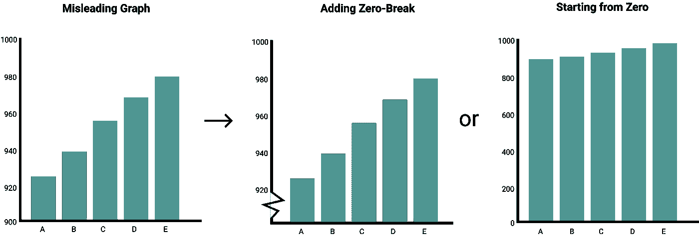

# 误导性图表

> 原文：<https://towardsdatascience.com/misleading-graphs-e86c8df8c5de?source=collection_archive---------2----------------------->

## …以及如何修复它们！

任何与数据相关的工作都有一个可能被低估的方面，那就是呈现和可视化您的结果。交流你所掌握的数据会非常困难。随之而来的是意外创建误导性图表的可能性。

虽然我们大多数人都知道饼状图可以呈现的许多问题(这里的、这里的和这里的)，但图表可能会在许多方面产生误导。

不是所有的饼状图都不好！图片由作者提供。

为了客观地看待这个问题，我发现自己在过去创造了误导性的图表，现在必须小心不要再这样做了！

我认为大多数人都有这个问题。我们毕竟是人，并严重受制于我们的偏见。

> 注意会导致误导性图表的陷阱

在本文中，我们将讨论图形中的常见错误，并定义修复它们的方法。

**注意**:通过数据可视化，可以发现许多规则的例外。记住这一点，下面的原则仅仅是指导方针，绝对不是真理。

# 1.操纵 Y 轴

可以说，误导性图表最常见的形式是 Y 轴被操纵。当相互比较大的数字时，许多人试图从 Y 轴中排除零，以便更好地显示实例之间的差异。

这很容易引起误解，因为它似乎夸大了实例之间的差异。很重要的一点是，要知道你看到的是数值之间的相对差异还是绝对差异。

让我们来看一个真实世界中 Y 轴被操纵的例子:

操纵 Y 轴人为放大差异。检索到[此处](https://www.statisticshowto.com/probability-and-statistics/descriptive-statistics/misleading-graphs/)。

视觉上，从上面的例子看，获得福利的人数增加了一倍。然而，因为他们从 94，000，000 开始，差别被非常夸大。

## 解决办法

这个问题有两个解决方案。

首先，简单地在你的图表中包含零值。它将按原样显示数据，没有读取 Y 轴的困难。

第二，可能有些时候加零实际上是相当误导的。假设您想要在 0–100 摄氏度的范围内观察人体体温。这种范围会阻止您发现患者体内威胁生命的几度体温升高。在这种情况下，删除零是有意义的。

在这种情况下，我会建议你添加一个**零断点**来表示你已经从图表中删除了零。数据可视化的透明性非常重要。

通过从零开始或添加零断点来修正误导性图表。图片由作者提供。

# 2.两个 Y 轴

有时，您可能希望看到具有不同 Y 轴的两条线。最著名的例子是泰勒·维根创造的，他创造了一系列有趣的可视化，展示虚假的相关性[。](http://www.tylervigen.com/spurious-correlations)

虚假相关是指两个事件或变量看似相关，但没有因果关系。您可以通过匹配两个不同事件的 Y 轴来创建这种效果。

由泰勒·维根[创作。](http://www.tylervigen.com/spurious-correlations)

结果就是上面这个惊人的可视化。通过重叠这两条线，现在看来任何科学支出都与自杀有关。事实上，这绝对不是这种情况，这是一个很好的带有两个 Y 轴的误导图的例子。

## 解决办法

在两个 Y 轴上都包含零是一种快速解决方法，可以防止图表产生误导。然而，如果没有任何可证明的因果关系，您的线碰巧重叠，您仍然可能偶然发现虚假的相关性。

这时，您应该考虑根本不显示图表。当你提出这样的关系时，用额外的数据、实验或结果来支持它们是很重要的。

# 3.三维图形

除了饼状图，这是我个人最讨厌的东西…

> 具有两个轴的 3D 图形！

这些图表摆脱了比例，并有根据角度使事物看起来更大或更小的趋势。

In，Junyong & Lee，Sangseok。(2017).统计数据展示。韩国麻醉学杂志。70.267.10.4097/kjae.2017.70.3.267\. [此处检索](https://www.researchgate.net/figure/Simple-pie-chart-A-versus-3D-pie-chart-B-In-the-3D-pie-chart-slices-at-the-rear-of_fig8_317262617)。

上面的例子摘自 Junyong In 和 Sangseok Lee 的论文[,他们在论文中研究了数据呈现是如何呈现和扭曲信息的。](https://www.researchgate.net/publication/317262617_Statistical_data_presentation)

从这个例子中我们可以看出，两张图表中的死因 A 看起来非常不同。事实上，对我来说，A 和 B 在 3D 图中看起来非常相似！

## 解决办法

我认为，在很多情况下，3D 图比具有相同数量轴的 2D 图更能提供信息。

> 不要用 3D 图！

一般来说，我会建议你不要使用 3D 图形，因为它太容易陷入失真陷阱。

# 4.不当缩放

为了使可视化更具视觉吸引力，一些人倾向于在图表中使用图像和象形图。虽然这可以增强图表，但也有可能创建一个误导性的图表！

象形图的问题可以在它们的相对大小中找到。假设你有两个值，100 和 300，你想用象形图来表示它们。

如果你将它们统一缩放，就会产生一种感知上的误导性比较。通常，人们倾向于解释象形图的面积，而不仅仅是它们的高度。

调整象形图的大小会导致尺寸的过度夸大。不是 3 倍数值，感觉是 9 倍！图片由作者提供。

上图显示了调整象形图的大小是如何导致一个误导性的图形的。通过将高度与数值相匹配，你实际上是在求差值的平方，从而夸大了较大的象形图。

## 解决办法

解决方案相当简单。与其让人们关注象形图的面积，不如让他们关注高度。您可以通过堆叠象形图而不是调整区域大小来实现这一点。

通过堆叠而不是调整大小来修复象形图。图片由作者提供。

# 5.樱桃采摘

创建误导性图表的最麻烦的方法之一是摘樱桃。摘樱桃是有选择地挑出支持你观点的证据，而忽略不支持你观点的数据的行为。

当你期望从数据中得到某些东西时，很容易陷入这个陷阱。不幸的是，有些人故意挑选最适合他们的数据。

例如，下图显示了从 1997 年到 2012 年的全球气温。这个图表的目的是为了否定全球气温正在上升的说法。

通过挑选 15 年来误导图表，使全球变暖无效，并忽略所有其他年份。从[这里](https://www.vislies.org/2017/gallery/)检索。

事实上，从图表来看，气温似乎已经稳定了几年。然而，这个图表有很大的误导性！

cherry 图表选择了证实他们观点的 15 年，而忽略了在那之前发生的任何事情。

关于全球变暖的全部故事。从[这里](https://www.vislies.org/2017/gallery/)取回。

如果你把从 1900 年到 2012 年的所有平均温度相加，你会看到一个非常不同的视图，如上图所示。

你可以看到，如果你选择一小部分数据，你很容易误导你的观众。

## 解决办法

重要的是，你要问自己以下问题:

> “我没有看到哪些数据？”

回答这个问题可以帮助您避免创建一个仅呈现数据的单个有偏见视角的图表。

# 感谢您的阅读！

如果你像我一样，对人工智能、数据科学或心理学充满热情，请随时在 [LinkedIn](https://www.linkedin.com/in/mgrootendorst/) 上添加我，或者在 [Twitter](https://twitter.com/MaartenGr) 上关注我。