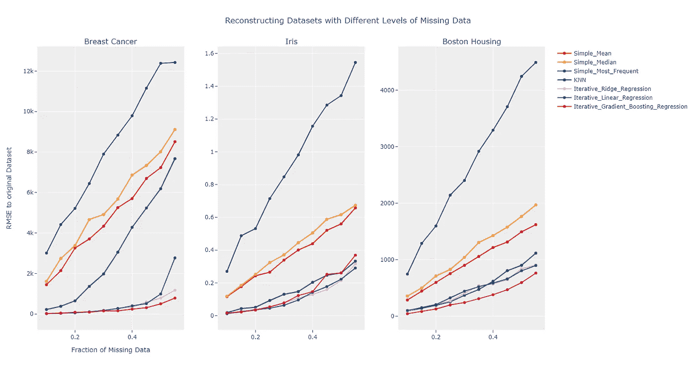
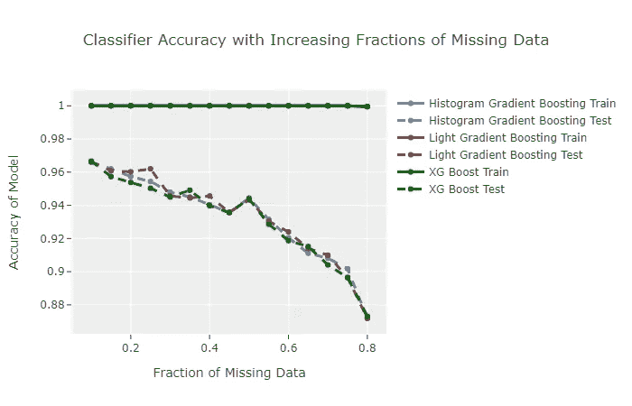

# 缺失值处理—插补和高级模型

> 原文：<https://towardsdatascience.com/missing-value-handling-imputation-and-advanced-models-11a67f551b83?source=collection_archive---------27----------------------->

## 不同插补方法和自动纳入缺失值的模型的利弊


阿尔文·恩格勒在 [Unsplash](https://unsplash.com?utm_source=medium&utm_medium=referral) 上的照片

缺失值是许多数据科学项目中的常见问题。在我上一篇关于缺失值[的文章中，我讨论了缺失数据和识别每种类型。在这篇后续文章中，我们将讨论处理缺失值的插补方法和模型。](/missing-value-handling-missing-data-types-a89c0d81a5bb)

# 归罪

插补是处理缺失值的有效工具。通过插入一个描述性的值，甚至根据剩余的已知值计算一个值，可以缓解不同缺失数据类型的问题。

*虽然没有一种方法是完美的，也没有比实际数据更好的方法，但插补可能比完全删除实例要好。*

缺失值插补有许多不同的方法，但这里只重点介绍几种方法。

*   简单插补
*   KNN 插补
*   迭代插补

这些方法可以在常用的 scikit-learn 包中找到，并且与 Python 中的标准数据格式兼容。用给定的估算器将缺失值估算到数据帧中的基本过程写在下面的代码块中。

```
imputer = SimpleImputer(strategy=’mean’)# df is a pandas dataframe with missing values
# fit_transform returns a numpy array
df_imputed = imputer.fit_transform(df)# Convert to pandas dataframe again
df_imputed = pd.DataFrame.from_records(df_imputed, columns=df.columns)
```

## 简单插补

最基本的插补方法是为每个缺失的数据点插补一个常数值。或者，您可以使用这些方法来计算和估算数据集的平均值、中值或最频繁值。

当要素数量相对较大且缺失值较少时，这是一种实用的方法，因为少量缺失值对整体模型性能而言可以忽略不计。

## KNN 插补

KNN 插补提供了比简单插补更详细的方法。使用与具有缺失值的实例最相似的 K 个记录，可以对缺失值和非缺失值之间的一些依赖关系进行建模。

因此，这种方法更加灵活，可以处理随机丢失的数据。

KNN 插补在计算上比简单插补更昂贵。尽管如此，如果您的数据集不在数十万条记录的范围内，这种方法也能很好地工作。

## 迭代插补

与 KNN 插补相似，**迭代插补可以模拟已知值之间的复杂关系，并预测缺失特征**。这种方法是一个多步骤的过程，它创建一系列模型，根据其他要素的已知值来预测缺失的要素。

迭代插补是一种复杂的算法，但总体方法相对简单。

1.  用简单估算法估算缺失值。这一步允许模型正确地拟合和预测。
2.  确定插补顺序。实现有几个选项。此参数会影响最终预测，因为以前的预测用于将来的预测。
3.  通过在所有其他特征上训练模型来估算一个特征。目标变量是包含一些已知值的被估算的特征。
4.  对每个特征重复此过程。
5.  对所有特征重复该过程几次，或者直到完整迭代之间的变化低于阈值容差。

迭代插补使用贝叶斯岭回归作为默认估计量；但是，您可以根据自己的选择对其进行修改。

迭代插补的一个缺点是，与其他插补方法相比，它的计算成本更高。因此，对于庞大的数据集，KNN 插补可能更可取。

# 插补方法的比较

这些估算方法在估算数据的方式上有所不同。为了比较每个估算者，我进行了几次实验，删除数据，然后用每个估算者再次输入数据。

所使用的数据集针对不同程度的遗漏随机移除数据。实验进行了十次，以确保结果的有效性。使用三个 UCI 数据集重复该实验。

插补后，**具有真实已知值的原始数据集与插补数据集**进行比较。计算两个数据集之间的均方误差，以评估插补方法的有效性。

从实验中可以清楚地看出，由于有许多缺失值，简单插补的性能会迅速下降。最频繁的插补总是表现较差，也许只有当数据的分布众所周知时才最好使用。

KNN 提高了性能，但更依赖于底层数据分布。

当数据中有许多缺失值时，迭代插补优于插补。但是，当有许多丢失值时，这些方法可以提高性能。**另一方面，当只有少量缺失值时，简单插补的表现相当。**



用不同的插补方法重建数据集(作者提供照片)

# 处理缺失值的模型

可能的情况是，缺少值这一事实很重要。例如，假设有一个乳腺癌数据集的扩展。在这个备选集中，有一个与乳腺癌相关的特征“测量血压”。

在某些情况下，医生不会测量该特征，因为从医生的角度来看，所有其他特征都表明它是不相关的。

现在，这一特性确实有实际价值，但不得而知。此外，与输入其他值相比，数据丢失的事实可能更有价值。

幸运的是，有一些模型可以处理缺失数据而不需要插补。这里使用的每个模型都是一个梯度推进模型，一个基于决策树的集成模型。

这些模型处理树内拆分处的缺失值；缺失的值会进入分离侧，从而最大程度地降低分离处的总损耗。当有一个以前在测试过程中从未见过的缺失值时，实例会转到包含最多样本的一侧。

# 估价

这些模型中的每一个都有许多允许微调的参数。有关如何正确微调模型的详细信息，请参见我的另一篇关于超参数优化的文章[这里](/hyperparameter-tuning-always-tune-your-models-7db7aeaf47e9)。

我使用乳腺癌数据集和默认模型超参数来比较每个模型。

对于每个测试，我会从数据集中随机删除越来越多的数据，然后拆分这些数据。我用 70%的数据训练模型，用 30%测试每个模型。

该实验在每个缺失水平下重复 10 次，并对 10 次实验的准确度进行平均。结果如下图所示。

这里的性能不如随着丢失数据部分的增加而降低的性能相关。**在大多数情况下，超过 50%的缺失数据不太可能**。请注意，当删除 50%的数据时，这些模型的性能下降不到 5%。



比较缺失数据的不可知模型(作者提供图片)

# 结论

丢失数据是数据科学中令人沮丧的一个方面。此外，确定丢失数据背后的机制本身也是一个很大的问题。

但是，有几个选项可以用来处理或避开丢失的数据。这些方法各有利弊，没有完美的办法。

**插补为保持数据的灵活性**提供了一个出色的解决方案，无需完全删除实例。然而，这里没有讨论更多的插补方法。

# 总结 TLDR；

*   插补是处理缺失值的有效方法。尽可能使用 KNN 插补和迭代插补来模拟随机缺失和非随机缺失数据。选择主要取决于可用的计算资源和数据的性质。
*   如果数据缺失的事实是有意义的，请尝试在训练和预测期间允许缺失数据的模型，如 XGBoost、直方图梯度增强和 LightGBM。

*如果你有兴趣阅读关于新颖的数据科学工具和理解机器学习算法的文章，可以考虑在 Medium 上关注我。*

如果你对我的写作感兴趣，并想直接支持我，请通过以下链接订阅。这个链接确保我会收到你的会员费的一部分。

<https://zjwarnes.medium.com/membership> 