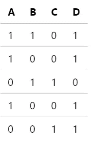
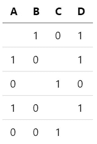
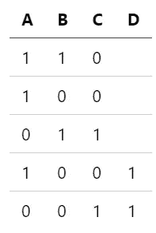
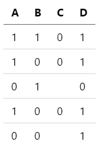
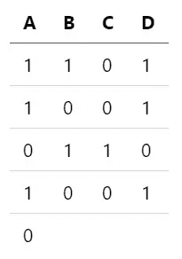

# 缺失值处理-缺失数据类型

> 原文：<https://towardsdatascience.com/missing-value-handling-missing-data-types-a89c0d81a5bb?source=collection_archive---------3----------------------->

## 有不同类型的缺失数据。了解你的血型决定了应该如何处理。

照片由[西格蒙德](https://unsplash.com/@sigmund?utm_source=medium&utm_medium=referral)在 [Unsplash](https://unsplash.com?utm_source=medium&utm_medium=referral) 拍摄

# 缺失数据

缺失数据在数据科学和机器学习的许多不同领域都很常见。不幸的是，有效地处理这一问题具有挑战性，而且通常没有最佳解决方案。

缺失值会严重影响您的模型，这取决于您处理它们的方式。值缺失的事实可能在您的模型和目标问题中具有重要意义。

没有完美的方法来处理丢失的值。本文将讨论不同类型的缺失值，何时可以考虑删除缺失值的实例，以及何时应该考虑不同的方法。

对于每个示例，我都引用随机生成合成数据集。该数据集具有四个要素 A、B、C、D、五个实例和二元要素。

## **缺失数据的类型**

缺失数据通常分为四种类型。完全随机缺失(MCAR)，随机缺失，非随机缺失，结构性缺失。每种类型都可能出现在您的数据中，甚至是多个缺失数据类型的组合。

## **完全随机失踪(MCAR)**

这些丢失的数据点没有可辨别的模式。通常，选择要估算的值取决于抛硬币。当您无法从剩余的已知变量中预测缺失值时，这些值最容易识别。它丢失的事实与其余变量无关。

然而，通常情况并非如此，除非数据是以这种方式专门设计的。这方面的一个例子是明确随机生成的数据或使用预定义列表中问题的随机子集的调查数据。即使从产生缺失值的不一致传感器测量的数据也可能仍然具有缺失数据的潜在模式。

通常，假设数据完全随机缺失不是一个合理的假设，除非产生数据的机制是完全已知的。

例如，我在下表中显示了 MCAR 的数据。这些值是随机移除的，没有可辨别的模式。

随机数据完全缺失(作者照片)

## **随机失踪(MAR)**

与 MCAR 相反，MAR 不认为其他变量不能预测缺失值。这种类型可能更常见于正确记录数据时出现错误的情况。

例如，假设一个传感器错过了某一分钟的测量，但捕捉到了前一分钟和后一分钟的数据。丢失的值可以从剩余的值粗略地内插，达到合理的精确度。

要确定数据是否包含随机缺失数据，请观察不同特征的条件概率。例如，与比例分布相比，如果另一个特征的条件增加了特定值的可能性，则该值很可能是 MAR。

我在下面的数据集中显示了 MAR 数据。特征 D 缺失，可以从剩余数据中进行概率推断。

随机数据缺失(作者照片)

## **非随机缺失(MNAR)**

非随机缺失或不可忽略的数据是数据缺失原因机制已知的数据。尽管如此，这些值仍然不能被有效地推断或预测。

这种形式的数据的一个例子是用于回避问题的调查的人口统计。例如，也许某一年龄/收入阶层的人拒绝回答他们拥有多少辆车或房子。这里的机制可能是显而易见的，但是推断丢失数据的实际值是很难准确预测的。

这种类型的缺失数据类似于下面的缺失数据类型，结构性缺失数据，但是有一个很大的区别。在结构性缺失数据中，该机制易于分析。相比之下，当数据真正丢失而不是随机丢失时，该数据很难处理，因为机制可能不明显。

这是一个丢失非随机数据的例子。当特征 A 为 0 时，特征 C 缺失。

不随意遗漏数据(作者照片)

## **结构性缺失数据**

丢失的数据丢失的原因很明显。通常，导致数据丢失的机制很容易推断出来。这种类型是故意丢失的数据。例如，一项要求就业收入的调查可能会遗漏那些没有工作的人的值。

这种类型的缺失数据也可能纯粹是数据工程的结果。例如，在处理时间序列数据时，将数据转换成表格格式是很常见的。虽然这种表格格式对于开箱即用的监督模型来说是理想的，但是处理数据的过程可能会产生缺失值。当聚合某个时间间隔内的数据时，如果数据具有不一致的时间戳，则某些时间间隔没有记录的数据点。这种结构会导致表格聚合中缺少值。

有些情况下，删除结构性缺失数据是合适的。但是，根据正在解决的问题，这可能会导致其他问题。

这是一个结构性缺失数据的例子。最后一个实例几乎包含了所有缺失的值。可能在记录数据或数据处理过程中出现错误。

结构性缺失数据(作者照片)

## **缺失数据的类型**

很可能仍然不清楚如何准确区分丢失数据的类型以及如何处理每种数据类型。此外，即使您确定是特定类型的数据，也可能有不同缺失数据类型的元素，这使问题更加复杂。

继续进行的选择通常分为三种方法。

*   删除丢失的数据实例。如果缺少的值很少，并且有很多数据，这种方法应该是可以接受的。
*   插补方法，这是一种常见的方法，它允许大多数模型照常运行，无需任何修改。
*   保留缺失的值，并使用包含它们的模型。这种方法限制了可用的模型。

# **删除丢失的数据**

根据数据实例的数量或数据类型，简单地删除实例是最直接的方法。如前所述，当数据在结构上缺失时，可以做到这一点。但是，在删除这些数据时，必须考虑删除这些实例会如何影响模型。

删除数据时更重要的问题是有多少记录会受到影响。当数据集很大，并且很少有实例包含缺失值时，就没什么可担心的了。然而，在许多问题中，数据集很小，并且每个实例对于整体理解问题是至关重要的。

多方面的方法也是切实可行的。例如，在彻底分析数据中存在的缺失值并确定频率后，决定要删除的记录子集可能是最佳选择。

然而，简单地删除数据仍然感觉像是通过将记录的其余部分合并到模型中而错过了对模型的潜在改进。

# **结论**

缺失数据有几种类型，不同类型之间的差异很微妙。此外，丢失的数据可能在同一个特征中呈现多种类型，这加剧了问题的严重性。在某些情况下，可以删除丢失的数据。然而，其他一些方法更有效。在这些关于缺失数据的帖子的第二部分，讨论了处理缺失值的插补方法和模型。

# 总结 TLDR；

*   缺失数据有多种形式。因为根据定义它们是未知的，所以通常很难确定确切的类型。
*   如果您有大量的数据和很少的缺失值，删除缺失值的实例是可以的。

*如果你有兴趣阅读关于新颖的数据科学工具和理解机器学习算法的文章，可以考虑在 Medium 上关注我。*

如果你对我的写作感兴趣，并想直接支持我，请通过以下链接订阅。这个链接确保我会收到你的会员费的一部分。

<https://zjwarnes.medium.com/membership> 