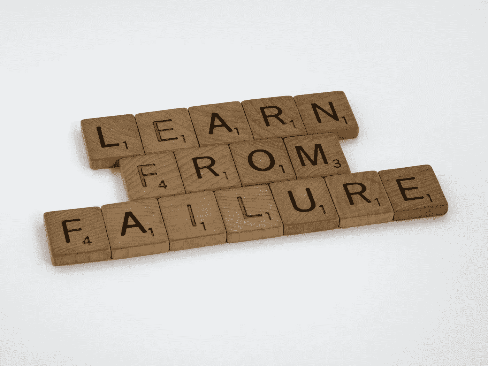

# 我在机器学习生涯中犯的错误

> 原文：<https://towardsdatascience.com/mistakes-i-made-in-my-machine-learning-career-839f2e1b3b76?source=collection_archive---------8----------------------->

## [办公时间](https://towardsdatascience.com/tagged/office-hours)

## 以及如何避免它们

> [**在我主持的这个现场培训会上，用 TensorFlow 和 Keras 学习 AI 和深度学习的基础知识。**](https://www.oreilly.com/live-events/practical-introduction-to-the-world-of-computer-vision-and-deep-learning-with-tensorflow-keras/0636920060577/0636920061406/)

事实是，在你的职业生涯中，你会犯很多错误。有利的一面是，对于你犯的每一个错误，你都有机会学习和提升。

布雷特·乔丹在 [Unsplash](https://unsplash.com/s/photos/mistakes?utm_source=unsplash&utm_medium=referral&utm_content=creditCopyText) 上拍摄的照片

在这篇文章中，你会遇到我在作为计算机视觉/机器学习工程师的职业生涯中迄今为止所犯的错误；以及你作为一名 ML 从业者如何避免我犯的每一个错误。

## **为什么这很重要？**

普通人一生中花 50 年的时间在工作上，对我们大多数人来说，我们才刚刚开始我们的职业生涯，此外，我发现最好向那些更有经验的人学习，因为这让我在职业发展和成功方面处于最佳位置。两分钟阅读这篇文章可以让你避免数月或数年的职业停滞。

# 我忽视了我的学习

弗瑞德·卡尼在 [Unsplash](https://unsplash.com/s/photos/book-burning?utm_source=unsplash&utm_medium=referral&utm_content=creditCopyText) 拍摄的照片

机器学习的全职工作可能会让人不知所措。在我职业生涯的初期，平衡朝九晚五的工作和保持非工作时间的学习比现在更容易管理。

机器学习领域的兴奋和新奇，加上一个责任很少的角色，意味着我可以在工作之外额外花两个小时跟上 ML 的发展并完成个人项目。

但是几个月过去了，我的责任和工作量增加了。

在你的 ML 角色中获得更多的责任是一种成就(特别是如果伴随着💲).虽然，过了一段时间，你的脑力承受一个朝九晚五的角色的能力减弱了，在这个角色中，你变得精神疲惫，同时保持 2-3 个小时的学习日程。

由于我的智力下降，缺乏动力，也许是精疲力竭，我停止了工作之外的学习。虽然在我的 ML 角色中有很多东西要学和做，但拥有一个成长的心态意味着我在知识和专业知识的不断积累中找到了职业成功和相关性。

## 如何避免

在与我目前工作的公司的首席技术官的一次坦率交谈中，事情发生了令人兴奋的转变。我解释说，我的外部学习努力正在减少。我的首席技术官认识到公司团队成员不断积累知识和技能的重要性。

请允许我指出一个显而易见的事实:你工作的公司会从你的发展和知识增长中获得积极的收益。如果你在工作之外的学习能让你找到一种有效的方法来实现公司旗舰产品中使用的算法，你的公司最终会从你的解决方案和新发现的知识中获益。这也是公司允许员工花一些时间进行个人发展的原因之一。

确保你不会落后于学习和发展的一个可靠方法是**在工作时间向你的直线经理要求一段时间来学习和发展**。大多数雇主和经理都会同意这一点，只要你提出一个合理的个人发展时间，也许是周四或周五下午。

一些雇主甚至更进一步，报销员工在书籍、视频和课程等学习材料上的任何费用。

**你是否有兴趣跟我一起学习？请查看我即将在奥赖利开设的现场课程:**

 [## 使用 TensorFlow & Keras 对计算机视觉和深度学习世界的实用介绍

### 你将学到的是你的现场活动？时间表指导员计算机视觉自 20 世纪 60 年代以来已经存在，并已…

www.oreilly.com](https://www.oreilly.com/live-events/practical-introduction-to-the-world-of-computer-vision-and-deep-learning-with-tensorflow-keras/0636920060577/0636920060576/) 

# 思维理论>实践

由[叶戈尔·米兹尼克](https://unsplash.com/@vonshnauzer?utm_source=unsplash&utm_medium=referral&utm_content=creditCopyText)在 [Unsplash](https://unsplash.com/s/photos/theory?utm_source=unsplash&utm_medium=referral&utm_content=creditCopyText) 拍摄的照片

我最喜欢的消遣之一是听机器学习内容创作者的播客和 YouTube 视频，如[莱克斯·弗里德曼](https://www.youtube.com/user/lexfridman)、[特维米尔](https://www.youtube.com/channel/UC7kjWIK1H8tfmFlzZO-wHMw)、[肯·吉](https://www.youtube.com/channel/UCiT9RITQ9PW6BhXK0y2jaeg)等。通常这些节目的嘉宾是 AI/ML 专家，他们雄辩地讲述他们的领域。当然，他们的口才来自于他们各自职业生涯中积累的知识和经验。

你不会怪我认为我必须阅读大量的书籍和研究论文，才能变得和我们在播客上听到的嘉宾一样博学。在我机器学习之旅的早期，有几个月，我完全专注于理论。我阅读研究论文，从教科书上记笔记，这一切都是为了增加我对感兴趣领域的知识。

我的策略的问题是，ML 工程师并不仅仅依靠知识而成功。任何一个经验丰富的 ML 工程师可能会确认在 ML 的实践方面和理论之间存在着不均衡的分裂。研究；这种分裂在工程角色中更倾向于 ML 的实践方面。

虽然大量的理论知识是必不可少的，但在机器学习领域，应用知识解决问题是最重要的。这就是我们在这里的目的。

## 如何避免

你不必完全避免进行研究和获取 ML 理论知识。一些 ML 角色高度依赖于理论和研究。但对于我们这些渴望成为 ML 工程师和应用数据科学家的人来说，最好用动手实践经验来伴随你的学习。

ML 中涵盖的介绍性主题和概念是围绕神经网络及其内部工作的(权重、激活函数、偏差等)。).这些主题涵盖深入和广泛，为新的学习者提供一个坚实的基础。

避免忽视机器学习的实践方面的一个可靠方法是给自己配备有用的 ML 教科书，如[用 Scikit-Learn、Keras 和 TensorFlow](https://learning.oreilly.com/library/view/hands-on-machine-learning/9781492032632/) 进行机器学习实践；[数据科学手册](https://www.oreilly.com/library/view/python-data-science/9781491912126/)；[数据科学从无到有](https://www.oreilly.com/library/view/data-science-from/9781492041122/)等。这些书更关注 ML 的实际方面，避免与构建商业 ML 应用程序无关的深入信息。

# 没有足够频繁地使用“不”。

照片由 [Gemma Evans](https://unsplash.com/@stayandroam?utm_source=unsplash&utm_medium=referral&utm_content=creditCopyText) 在 [Unsplash](https://unsplash.com/s/photos/no?utm_source=unsplash&utm_medium=referral&utm_content=creditCopyText) 上拍摄

如果有人想让我为他们的“天才”工作，而我有一美元的时间。我会多几百英镑。在我职业生涯的早期，我答应了几乎所有要求我帮助和时间的人。对你遇到的每一个项目都说“是”的问题是你把自己分散得太开了。

说“不”的想法不仅仅适用于项目请求，软件工程师需要对超出范围的特性请求说不；当被要求使用机器学习技术来解决明显不需要 ML 解决方案的问题时，数据科学家需要说“不”。

## 如何避免

**这个很简单:说“不”。试着说得更好一点，但你已经明白了。**

我已经拒绝了几份写作工作和工作邀请，主要是因为我已经确定了自己承担项目和工作的能力，无论如何我都不会超出这个能力。

如果你犹豫要不要错过机会，试着通知有兴趣与你合作的个人、公司或组织，让他们知道你现在没空，但在接下来的几个月里可能会有一些工作机会，并且希望保持联系。这样做，你并没有完全关上大门。

# 独自做事

由 [Eréndira Tovar](https://unsplash.com/@eretovar?utm_source=unsplash&utm_medium=referral&utm_content=creditCopyText) 在 [Unsplash](https://unsplash.com/s/photos/alone?utm_source=unsplash&utm_medium=referral&utm_content=creditCopyText) 上拍摄的照片

对我来说，在本科阶段独自完成小组项目要比和其他不愿意努力或者根本不能胜任任务的同学一起工作容易得多。

虽然我独自完成了足够多的小组任务，但我错过了早期获得沟通和协作技能的机会。

在科技世界里，没有人能独自完成任何事情。有一些项目、软件和开源工具依靠在线社区的协作凝聚力蓬勃发展。

对于那些科技行业的新手来说，从这篇文章中可以学到一点:站在巨人的肩膀上总是比独自一人更容易。从更实际的意义上来说，利用库和工具使您的工作更容易，而不是重新发明轮子。

## **如何避开**

**不要害怕向高级开发人员或比你更有见识的人寻求帮助**。与一个更有经验的开发人员进行两分钟的对话将会节省您筛选 StackOverflow 或错误日志的时间。

还有，寻求帮助不一定要亲自去；有很多在线社区都有专家愿意帮助那些恰当表达简洁问题的人。

**以下是一些与 ML 工程师和数据科学家相关的论坛和讨论渠道:**

*   [PyTorch 论坛](https://discuss.pytorch.org/)
*   [PyTorch 闪电讨论](https://github.com/PyTorchLightning/pytorch-lightning/discussions)
*   [张量流论坛](https://discuss.tensorflow.org/)
*   [苹果开发者论坛](https://developer.apple.com/forums/)
*   [Swift 论坛](https://forums.swift.org/)
*   [Scikit 学习讨论](https://github.com/scikit-learn/scikit-learn/discussions)
*   [朱庇特的话语](https://discourse.jupyter.org/)

# 结论

错误是游戏的一部分，但确保错误不再重复，并确保从每一个错误中吸取教训是一个很好的实践。

在机器学习领域的成功职业生涯是你愿意付出多少努力和时间来获取和实施 ML 知识，同时保持持续增长的心态的组合。

## 下面是这篇文章的主要内容。

*   如果你发现你在工作时间之外没有学到足够的知识来保持你的知识在一个合理的水平，试着与你的经理或雇主进行一次谈话，安排时间专注于你的个人学习发展。
*   虽然 ML 的理论是必不可少的，但是不要害怕深入到机器学习的实践方面。
*   不要过度投入到项目或任务中，让自己过于分散。
*   需要时，总是寻求帮助。

在我的职业生涯中，我肯定会犯更多的错误，并从中吸取教训。现在，我将留给您一些针对一般开发人员的通用技巧。

1.  不要在生产环境中修复错误
2.  不要直接推送到主服务器
3.  不要把软件发布安排在周五晚上
4.  当训练机器学习模型时，不要测试你的训练数据
5.  数据稀缺？尝试增强

*感谢阅读*

## 想要更多吗？

1.  [**订阅**](https://richmondalake.medium.com/subscribe) 在我发表文章时得到通知。
2.  [**成为推荐媒介会员，支持我的写作**](https://richmondalake.medium.com/membership) 。
3.  通过 [**LinkedIn**](https://www.linkedin.com/in/richmondalake/) 联系我