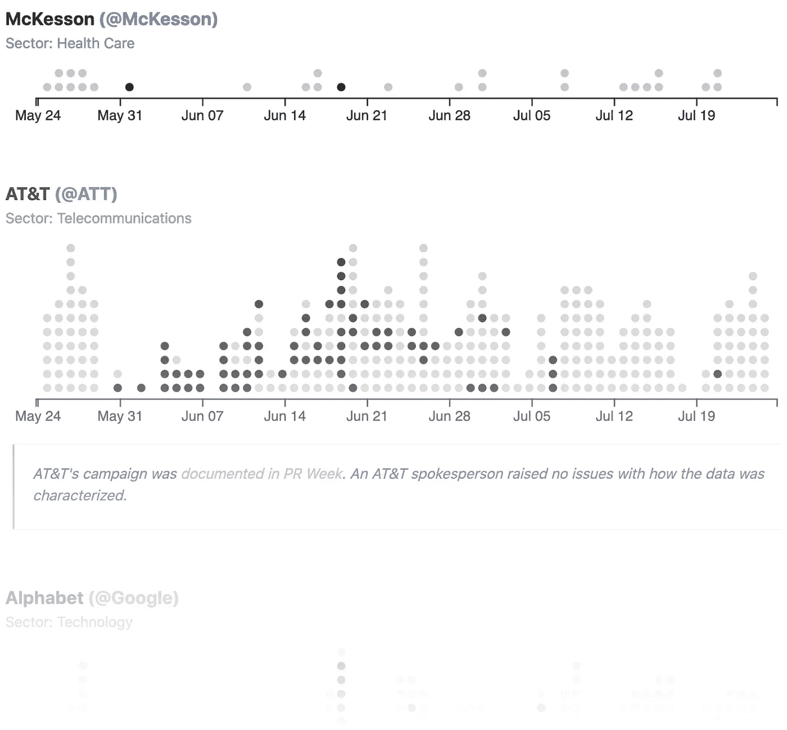

# 第一次使用 Twitter 数据时要避免的错误

> 原文：<https://towardsdatascience.com/mistakes-to-avoid-when-using-twitter-data-for-the-first-time-304c3d0ef7a6?source=collection_archive---------29----------------------->



## 阅读:我第一次使用 Twitter 数据时犯的错误

我刚刚花了很多时间收集、整理和分析 2020 年黑人的命也是命抗议活动的财富 100 强推文。在几千条推文之后，我遇到了很多困难和棘手的情况。下面我列出了一些我在使用 Twitter API 时遇到的错误。

许多这样的失误都在 [Twitter 的文档中解决了，](https://developer.twitter.com/en/docs/twitter-api/v1/data-dictionary/object-model/tweet)因此，尽管不必阅读所有内容就可以尝试网络抓取和机器人制作，但在做任何重要的事情之前，一定要浏览一下 API 的字段描述和限制！对于那些刚刚入门的人来说，这里有[一个视频教程](https://www.youtube.com/watch?v=dvAurfBB6Jk)，这里有[一个快速博客帖子](/how-to-scrape-tweets-from-twitter-59287e20f0f1)——尽管这些绝不是唯一的教程。

# 确保获取全文数据。

这是一个非常标准的失误:tweets 过去只有 140 个字符，但现在是 280 个字符。确保无论是进行直接 API 查询还是使用包装器，都将`extended`设置为等于`true`(默认情况下，该值设置为`false`)。该参数将告诉 Twitter 您想要完整的 280 个字符。当对您的数据集应用任何类型的验证器时，我建议包括如下内容:

```
for tweet in dataset:
     assert not tweet[‘truncated’]
```

这将有助于确保每一次抓取都能捕捉到完整的推文。

# 规范回车，因为 Twitter 没有。

`\r\n`和`\n`都可以出现在你的推文中。然而，当从 JSON 响应创建 CSV 时，这可能会导致问题。一个有两个单独行尾的 CSV 会让熊猫困惑，并且违背了[商定的标准](https://www.loc.gov/preservation/digital/formats/fdd/fdd000323.shtml)。也许最简单的处理方法是使用 python 的`repr`函数在字符串中显式包含特殊字符。这将迫使所有内容都在一行中，并防止混淆:

```
>>> lengthy_string = “Look at these cat pictures\n#cats”
>>> print(lengthy_string)
Look at these cat pictures
#cats
>>> print(repr(lengthy_string))
‘Look at these cat pictures\\n#cats’
```

但是，如果您希望分析文本数据，该方法将在以后添加步骤。另一个合理的解决方案是简单地删除`\r`，并用空格`str.replace(‘\r’, ‘ ‘)`替换它，但这种方法取决于您的研究问题。

# 使用正确的字段来确定转发

确定一条推文是否被转发的最可靠方法是查看是否存在`retweeted_status`字段或`quoted_status`字段。

```
is_retweet = hasattr(tweet, ‘retweeted_status’)
is_quoted = hasattr(tweet, ‘quoted_status’)
```

在解析 tweet JSON 时，这些字段并不明显。被转发的领域是一个红鲱鱼。它指示进行身份验证的用户(注册 API 令牌的人)是否发出了 retweet。而且找文首的“RT @”也不靠谱。

请记住，这两个字段是可空的，这意味着由于原始 tweet 可以被删除，与 retweeted_status 字段相关联的值可以为空。所以，你需要寻找这些字段的*存在*。不要给他们设置任何条件。类似于…

```
if tweet.get(‘retweeted_status’):
     print(‘is_retweet’)
```

…如果原始推文被删除，会错误地将一条推文定性为普通推文。

# 确定一条推文是否是回复是复杂的。

事实证明，没有一个单一、统一的方法来确定一条推文是否是回复。一些在线评论者建议在推特 JSON 中寻找字段`in_reply_to_status_id`。但是一些正常的 tweets 有这个字段，只是设置为 null。您可以查看字段是否为空，但这也是不可靠的。如果原始推文被删除，则`in_reply_to_status_id`变为 null，如果用户删除了他们的帐户，则`in_reply_to_user_id`变为 null。当然也不是每条以“@”开头的推文都是回复；只有在回应特定状态时，推文才会被视为回复。

简而言之，没有一种可靠的方法可以做到这一点。幸运的是，这个问题在 Twitter API 的 v2 中得到了解决。要了解更多信息，请阅读 Twitter 开发者社区论坛上的讨论。您还可以根据 API 请求中的回复进行过滤。

# 不要将 Twitter IDs 存储为整数。

Tweet IDs 是非常大的数字，一些软件由于内存空间不足，会在你不知道的情况下四舍五入整数 id。Twitter 建议您专门使用 id_str 字段。如果您的程序将 ID 视为一个字符串，那么它将不会面临存储为整数时所面临的内存挑战。大多数程序可以将 Twitter IDs 的当前大小作为整数来处理，所以欢迎您自担风险使用这些整数，但是在验证过程中要考虑仔细检查 id_str 是否等于 id。

# 让我的生活变得更轻松的其他技巧

*   微软 Edge 加载推文的速度比 Firefox 或 Chrome 快得多。如果您需要滚动浏览许多推文，这可能会很有用。
*   请记住，并非一条推文的所有语言都包含在`full_text`中。如果你在做文本分析，如果对你的研究很重要，你可能也要考虑图像或视频中的文本。如果您需要下载与推文相关的媒体，这里有一个片段:

*   确保您熟悉 Twitter API 的局限性。你只能[获得最新的 100 条转发](https://levels.io/giveaway/)，你只能在个人资料上查看最新的 3200 条推文，你只能每 15 分钟获得给定用户的最新 75000 名关注者。程序员对这些限制的误解导致了[巨大的软件失败](/fake-follower-calculators-misinform-users-journalists-with-dubious-statistics-659b60fc4d5a)，所以在创建一些被认为是可靠的东西时要记住它们。

> 阅读更多关于数字人文中心@普林斯顿的博客