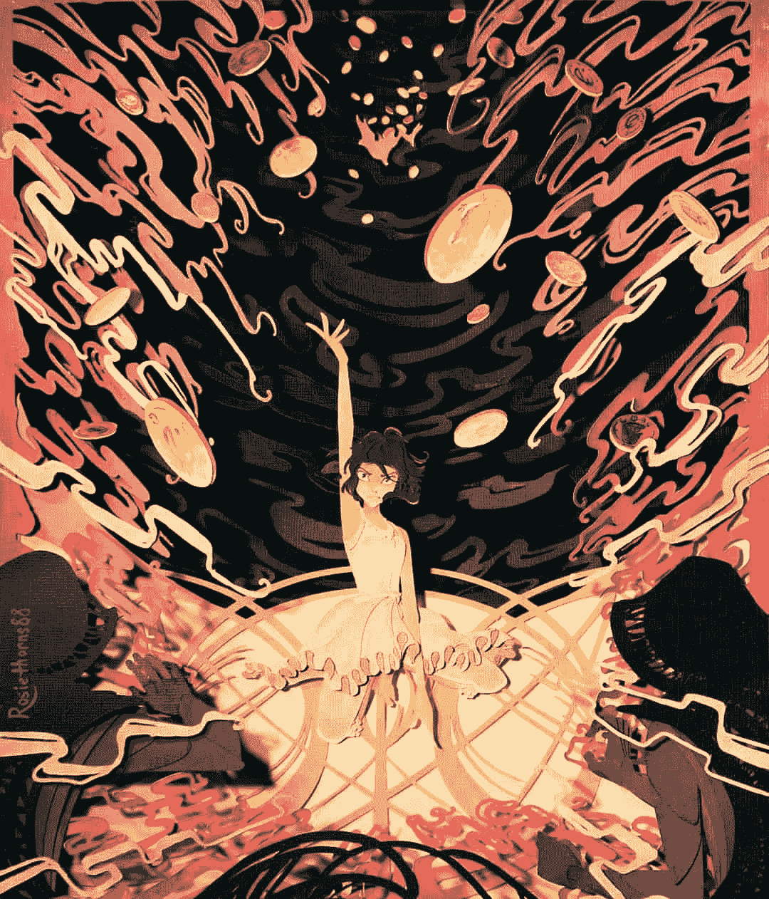
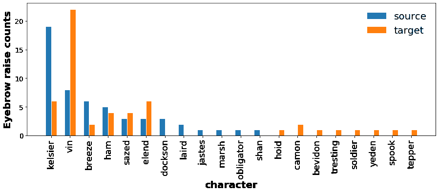
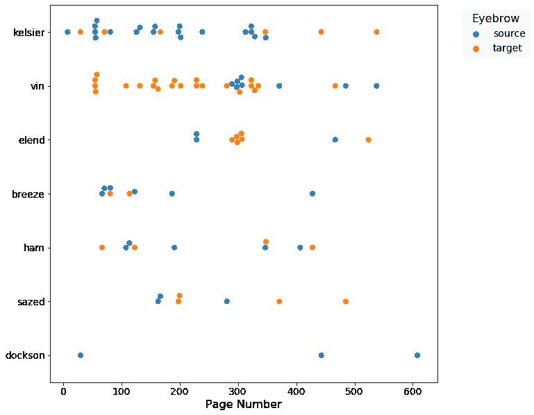
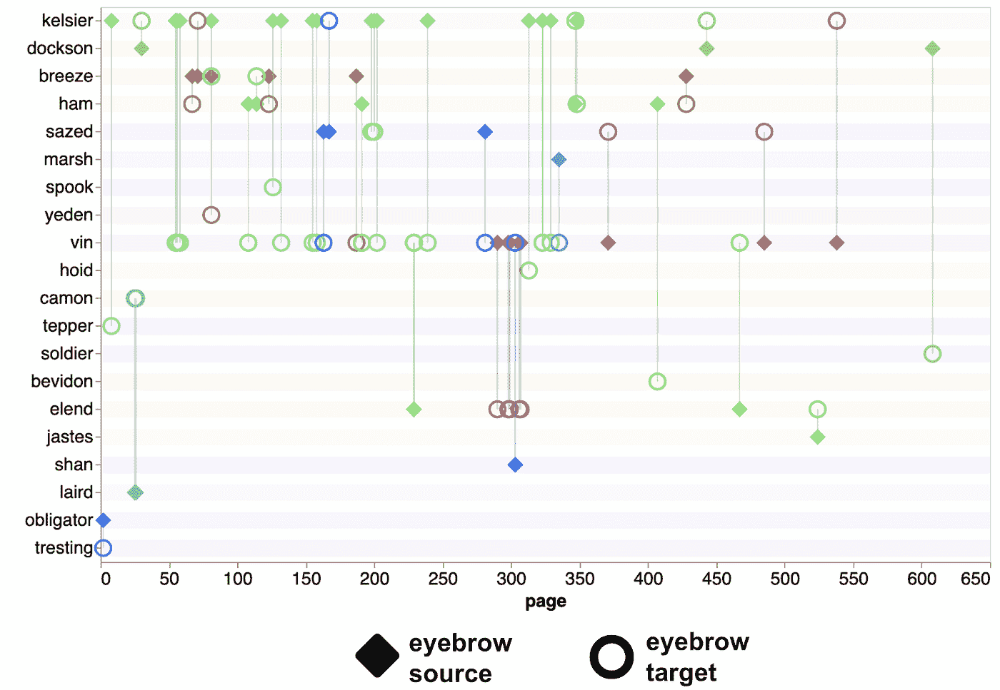
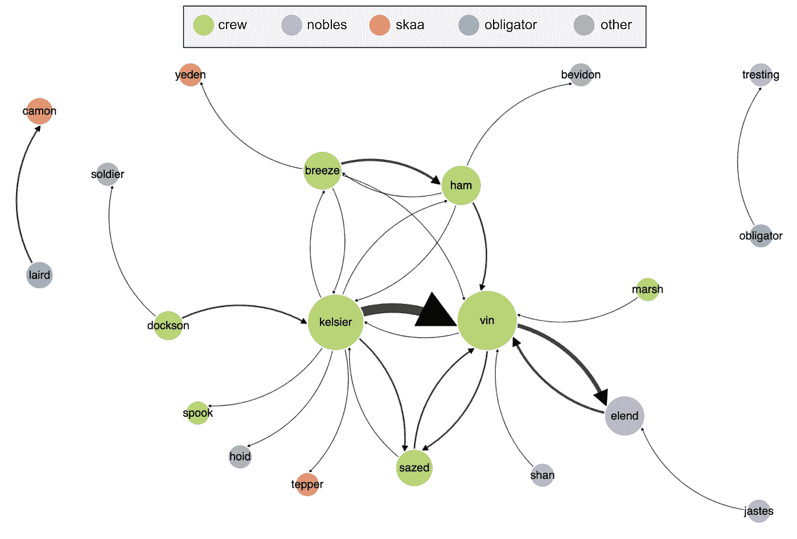

# 出生错误:最后的眉毛

> 原文：<https://towardsdatascience.com/mistborn-the-final-eyebrow-54466c815285?source=collection_archive---------24----------------------->

## [实践教程](https://towardsdatascience.com/tagged/hands-on-tutorials)

## 一份让你皱眉头的 Allomancer 社会动力学分析

*【TLDR】:欣赏一些* [*的交互可视化*](https://erinhwilson.github.io/mistborn/) *总结了 Mistborn 中的眉毛交互数据。*

《雾与怒》——罗斯·罗斯 88 的作品(经许可使用)

如果你发现自己对布兰登·桑德森的《生不逢时》系列感到惊讶，你并不孤单。是的，*是一本有趣的奇幻读物:第一个时代的特点是一群可爱的小偷，他们在暴虐的帝国的钢铁统治中穿梭于社会差异、政治阴谋和革命之间。虽然 *Mistborn 的*魔法系统 allomacy——能够通过摄取各种金属的小碎屑来巧妙运用多种能力——可能是我读过的最酷的魔法系统，但故事中有一个特征*确实*超越了其他特征:眉毛。*

*是的，眉毛。这个系列中的角色互相“扬眉”的次数令人震惊。也许是有声读物讲述者的语调让这句话如此清晰地跳了出来，但当我们听的时候，它成了我和我的伙伴的一个笑话，每当一个角色“扬起眉毛”，我们就会立即转向对方，露出我们最疯狂的扭曲眉毛的表情。*

*但是后来…我很好奇。*

*凯尔西耶“扬了多少次眉毛”？有什么模式吗？他是平等地向所有的船员扬起眉毛，还是发现某些船员特别令人费解？作为一名有抱负的数据科学家，我决定更深入地研究一下。*

*下面是对生不逢时系列的第一本书《最终帝国》中的社会动态的初步分析。第二册和第三册将在以后的文章中讨论。**这篇文章包含了*最终帝国、*** 的剧透，所以如果你还没有看过并且想看的话，就此打住，留到以后吧。但是，如果你被吸引住了，并对此感兴趣，请继续阅读涵盖三个主要分析的数据和解释:*

1.  *哪些角色最常扬起眉毛？哪些角色最常接受眉毛上扬？*
2.  *人物的扬眉行为有时间意义吗？*
3.  *根据人物眉毛交流的频率和方向性，我们可以推断出他们之间的社会动态是怎样的？*

# *眉毛数据收集*

*仅提供数据收集方式的简要概述:*

*   *我们借了一本电子书《最终帝国》、*、【升天之井】、*和【千古英雄】*。**
*   *我们控制了“眉毛”这个词的例子*
*   *我们阅读了关于眉毛互动的文章，以确保它确实是眉毛的“抬起”或“竖起”或“提升”——基本上我们计算了任何类型的提升。*
*   ***值得注意的是，“眉毛”这个词在整个系列中只出现了两次，而且角色之间没有相关的互动:在第三部中，*时代的英雄*，马什在进入一个空房间时扬起眉毛，而斯洛斯威特被描述为有“浓密的眉毛”这些不包括在数据中。*
*   *最后，我们记录了:1)扬起眉毛的角色(“源”)，2)扬起眉毛的角色(“目标”)，以及 3)交互的页码。*

*总的来说，我们在*最终帝国*中记录了 53 次眉毛互动，在*提升之井*中记录了 48 次，在*时代英雄*中记录了 42 次。*

# *眉头为谁扬起*

*我的第一个分析是简单地计算每个角色的眉毛源(“raiser”)和目标(“raisee”)实例的总数(图 1)。*

**

****图 1。*** *每个角色的眉毛交互类型(“源”或“目标”)的原始计数。(图片由作者提供)**

*不出所料，Kelsier 是最常见的眉毛来源，给出了 19 个明显的提升。这是有道理的:他作为船员领袖的地位，加上他流氓般的魅力，自然有助于对他古怪的船员进行诙谐的戏谑和友好的屈尊俯就。此外，如果“扬起眉毛”是桑德森的作者怪癖之一，凯尔西作为两个主要视点(POV)角色之一的角色只是给他更多的页面时间来晃动眉毛。*

*下一个最常见的眉毛来源是凯尔西耶的学徒和共同主视点角色，文，打卡在 8 次加薪。再次，文获得了大量的页面时间，所以她第二名的地位并不令人惊讶，尽管讽刺的舒缓微风以 6 紧随其后。但是真正让 Vin 突出的是她的第一眉毛目标地位:Vin 接受了高达 22 次的眉毛提升！安静而奇怪，船员们并不总是知道如何看待文，常常带着关切或怀疑的眼光看待她。然而，这种名副其实的眉毛瞄准山不能纯粹用页面时间来解释，因为凯尔西耶只收到 6 次加薪，并说了很多荒谬的事情。*

*到目前为止，这些结果并不令人兴奋:这两个视点角色参与了大部分眉毛互动，主要支持角色 Breeze，Ham，Dockson，Sazed 和 Elend 各增加了少量。几个次要人物顺便引起了一两次争论。*

*接下来，我研究了眉毛互动的时间动态，以观察角色的眉毛行为是否在整个故事中发生了变化。*

# *眉间的颞弧*

*为了更好地了解眉毛在整个系列中的分布，对于每个角色，我绘制了他们随着时间推移的眉毛互动——作为来源或目标。x 轴是页码(时间)，y 轴包括至少 3 次互动中涉及的主要人物(图 2)。*

**

***图二。**主角眉在*最终帝国*中的互动。*(图片作者)**

*从这个视图中，我们仍然可以清楚地看到 Kelsier 和 Vin 参与了最多的眉毛交互，因为它们有最多的点，但是在这些交互发生的时间上有一个有趣的差异！凯尔西耶在整个故事的开始有一个相对规则的眉毛上升模式，穿插着针对他的零星眉毛。但是在全书进行到大约⅔的时候，他突然停止对其他人皱眉…这不是他的死亡——这发生在书的最后，在图中我们可以看到在最后的几百页中他仍然活着并且是目标(橙色的点)。我相信这次突然的停火与他的计划(摧毁耶登的隐藏部队)的重大挫折几乎同时发生。尽管意识到他推翻主统治者的计划极其冒险，成功的可能性极小，但凯尔西耶可能意识到开玩笑的时间已经结束了，他需要认真对待。当然，他仍然向工作人员宣传微笑和保持积极态度的重要性，但是当他调整最后一幕的计划时，他高度活跃的眉毛不再是他领导风格的一部分…*

*相反，Vin 在这本书的整个前半部分都被当作一个眉毛上扬的*目标*。如前所述，她易受惊的性格需要一段时间才能让其他人适应，当她试图在这群愚蠢的船员中找到自己的位置时，她仍然保持警惕。*

*但是后来！事情发生了变化:在故事进行到一半的时候，文突然连续五次竖起眉毛！虽然在她突然成为眉毛来源后，她仍然获得了一些加薪，但这一时刻似乎让她敞开了心扉，她在未来变得舒适地扬起眉毛…*

*发生了什么事？是什么引发了这种转变？为了进一步挖掘这个问题，我重新格式化了图形设计，以额外可视化每次眉毛相遇的源和目标之间的连接(图 3)。这个图有点野，提前为视觉上的复杂道歉！虽然我喜欢图 2 的简单，但我设计了这个替代版本，以允许随着时间的推移对特定眉毛互换进行调查。我认为这个图作为一个交互式可视化稍微有效一些，在这里[可以看到](https://erinhwilson.github.io/mistborn/viz/fe_eyebrow_conn_int.html)。*

*只是为了便于您了解，它的设置方式与图 2 相同:x 轴是页码(时间), y 轴有一个部分用于标记每个角色的眉毛交换。现在，如果角色是眉毛的来源，那么一个点就是菱形，如果角色是眉毛的目标，那么这个点就是圆形，而不是蓝色和橙色。垂直线现在直接连接每个交互的源和目标，颜色与源角色相关联。*

**

***图三。**在*最终帝国*的过程中所有角色的眉毛互动，现在与眉毛“源”(菱形)和“目标”(圆形)的每个互动由一条垂直线连接。([互动版](https://erinhwilson.github.io/mistborn/viz/fe_eyebrow_conn_int.html)，我*法师作者*)*

*回到对 Vin 突然加入眉毛提升者联盟的分析，让我们关注她的互动模式，下面用粗体强调:*

**

*在图 3 中仔细观察 Vin 的眉毛互动。*(图片作者)**

*在剧情中间沿着文的轨迹滑动，我们仍然看到开放的圆圈标志着她是许多眉毛扬起的目标——它们主要来自凯尔西耶，但哈姆、微风、马什和萨泽德也加入进来。但是上面说的 Vin 的眉源簇*完全是* *针对 Elend 的！*几页前，在 Keep Venture 的舞会上，当他们初次相遇时，Elend 偷偷提高了 Vin，但在 Vin 的第二次和第三次舞会上，她鼓起勇气对一位杰出的贵族提高了眉毛。*

*这标志着文转型的一个关键时刻:我们看到她是一个街头顽童——躲在阴影中，试图逃避审查——看着她成为宫廷阴谋游戏中的真正玩家，并在她作为一个出生不熟的人进入权力中心时成长为一个自信的船员。眉毛上扬显然是这一弧线的重要标志:在 Elend 公开展示眉毛肌肉后，她接着向她最亲密的导师 Sazed 和 Kelsier 开火。事实上，Kelsier 在该系列的最后一次眉毛互动是作为 Vin 的接收者。哦，徒弟真的变成师傅了…*

# *一个额头抬起他们，并在深处捆绑他们*

*在我的最终分析中，我对人物的整体社会网络感到好奇，这些网络是由他们的眉毛交流来定义的。在这里，我删除了时间组件，并在一个有向图中总结了数据(图 4)。*

**

***图 4。**有向图捕捉了*最终帝国中所有角色眉毛扬起的频率和方向性。*每个角色都是一个节点，大小与他们参与的眉毛互动总数成比例。节点之间的每条边指示源角色和目标角色之间眉毛交互的方向；箭头的大小也与从源到目标的眉毛总数成比例。*(图片作者)**

*这个网络再次表明，Vin 和 Kelsier 是眉毛活动的中心，但从 Kelsier 到 Vin (12)和从 Vin 到 Kelsier (1)的提升之间有明显的区别。这种方向性感觉很重要，因为它强调了 Snark 大师与令人困惑的学徒权力动态。*

*我们还可以看到更多的船员动态:微风和火腿与凯尔西耶和 Vin 创建了一个紧密连接的组件。也许我们可以感觉到微风对哈姆的哲学化的高度恼怒，因为从微风的节点到哈姆的节点有更多的眉毛。此外，文和凯尔西耶与萨泽德交换眉毛的频率大致相同，而坚定的道克森只有外向的眉毛:朝向凯尔西耶和一名无名士兵。合乎逻辑的是，没有人会对 Dox 提出质疑。*

*值得注意的是，文是唯一一个与贵族成员交换眉毛的船员。她对贵族们来说也是一个谜，并从埃伦和珊那里得到友好和不那么友好的加薪。但是，最粗的箭头再次标志着对埃伦眉毛的稳固流出，展示了她日益增长的信心。虽然她的贵族女性即兴创作有点粗糙，但她最终接受了自己的角色，并从政治棋子演变为政治玩家。*

*(以下是该网络的互动版本。虽然交互性对于理解网络来说并不重要，但我正在学习/练习 D3，并认为拖动角色泡泡很有趣。)*

# *低眉和无眉*

*虽然“扬起眉毛”是出生不良的宇宙中许多角色共有的一种习惯，但也有一些明显的例外。在船员中，俱乐部是零眉交流。这位头发花白的将军没有被任何船员的恶作剧所迷惑，也没有说任何特别令人费解的话。在邪恶中，两个义务者竖起了几根眉毛，但我们从统治者或任何钢铁检察官那里都没有(他们甚至有眉毛吗？).当这些坏蛋到达现场时，激烈的行动迅速跟进，没有多余的时间来开玩笑。*

# *眉毛上扬，帝国衰落*

**(* 🎵*我们已经看到了船员们所做的一切！*🎵 *)**

*这群傻乎乎的船员齐心协力，完成了一项不可能的任务。当他们的金属掌握占据了中心舞台，他们用钢推、铁拉和白镴…重击他们的方式取得了对主统治者的毁灭性胜利时，背景中的眉头真的把他们都皱在了一起。总的来说，眉毛的交换似乎在塑造角色之间的社会动态方面发挥了重要作用，也强调了角色转变的关键时刻，因为他们考虑到了他们不断变化的世界。*

*而这就是*最终帝国的最终眉！当一部系列小说把人物的发展轨迹贯穿全书的时候总是很棒的，因此检查这本书和系列其他部分之间人物眉毛行为的变化可能会揭示一些有趣的模式。特别是当主角凯尔西耶在接下来的系列赛中退出时，谁会挑起眉毛呢？**

*请留意后续分析，深入探究*升天之井*和*时代英雄*、*出生错误*系列第 2 和第 3 册中的眉毛动作。只是为了好玩:*

*   ***三本书的剧情互动版本**都在这里[整理](https://erinhwilson.github.io/mistborn/)。*
*   ***数据**和**代码**可在[https://github.com/erinhwilson/mistborn](https://github.com/erinhwilson/mistborn)获得，主要在[本](https://github.com/erinhwilson/mistborn/blob/master/eyebrow_viz.ipynb) Jupyter 笔记本和[本](https://observablehq.com/d/ea523a627b98997b) Observable 笔记本中。*

*非常感谢马特·约翰逊、Claire Johnson 和 Kylie Fournier 在数据收集/可视化和早期反馈方面的帮助！*