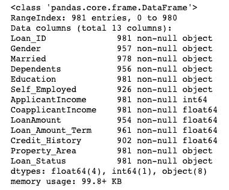
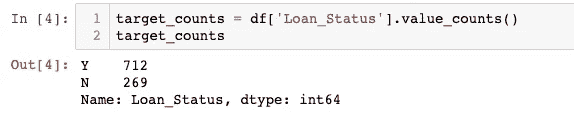
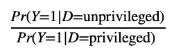
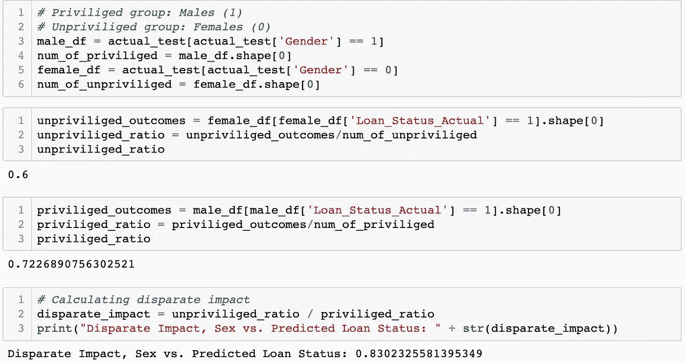
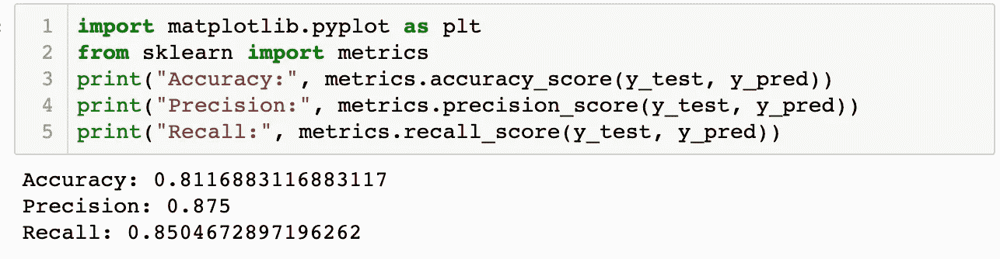
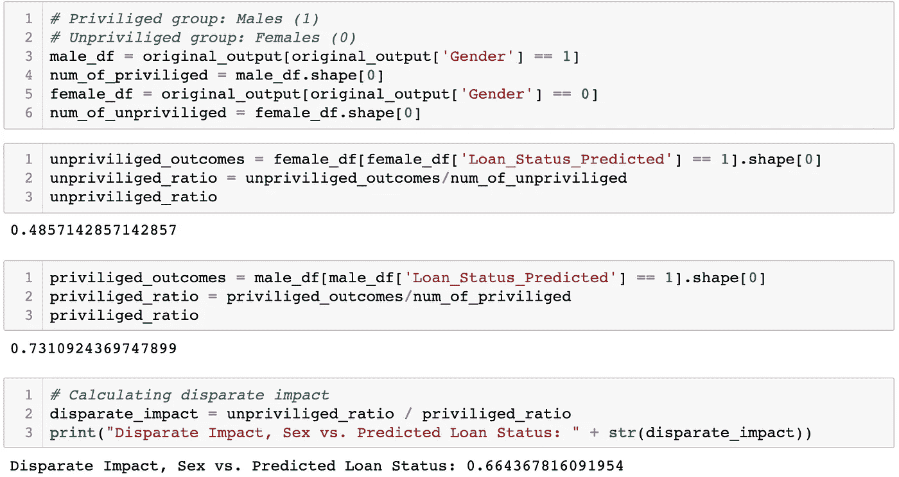
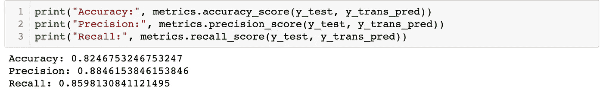
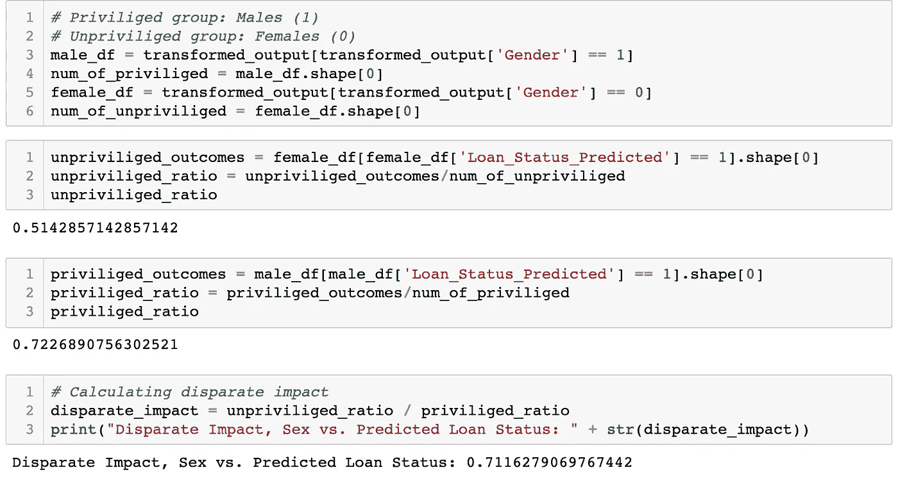

# 用 AIF360 减轻人工智能中的偏差

> 原文：<https://towardsdatascience.com/mitigating-bias-in-ai-with-aif360-b4305d1f88a9?source=collection_archive---------2----------------------->

## 预测贷款批准并检查这样做的偏差


凯文·Ku 在 Unsplash[上的照片](https://unsplash.com?utm_source=medium&utm_medium=referral)

随着人工智能变得越来越普遍，我们这些设计这种系统的人必须认识到这种系统加剧偏见的潜在可能性。在这篇文章中，我展示了数据中的偏差是如何通过机器学习加剧的。我首先创建了一个有偏见的 ML 模型，然后使用 IBM Research 的开源工具包 [AI Fairness 360](https://aif360.mybluemix.net/) (AIF360)，试图减轻这种偏见。

*本练习的数据集和 Jupyter 笔记本在 GitHub repo* [*这里*](https://github.com/bryantruong/examingBiasInAI) *有。*

# 数据集

在选择数据集时，我认为重要的是选择一个明确涉及法律[保护群体/类别](https://en.wikipedia.org/wiki/Protected_group)的数据集，其结果变量是二元的，具有明确定义的有利结果和不利结果。

我从 Kaggle 中选择了一个相对较小的[数据集，其中包含贷款申请人的信息，以及贷款是被批准还是被拒绝(由我们的结果变量`Loan_Status`表示)。](https://www.kaggle.com/vikasp/loadpred)

让我们来看看数据集的功能:

1.  **贷款 ID**
2.  **性别**(男或女)
3.  **已婚**(是或否)
4.  **家属** (0、1、2 或 3+)
5.  **学历**(表明主申请人是否高中毕业)
6.  **个体经营者**(是或否)
7.  **申请人收入**
8.  **共同申请人收入**
9.  **贷款金额**
10.  **贷款申请人期限**
11.  **信用记录** (0 或 1，0 表示信用记录良好)
12.  **物业区域**(农村、半城市或城市)
13.  **贷款状态**(是或否)

在这个数据集中，有三个变量与受保护的类直接相关，应该检查它们的偏差:`Gender`、`Married`和`Dependents`

在这个练习中，为了简洁起见，我只检查了与`Gender`相关的偏差，尽管也应该检查其他受保护类的偏差。

# 入门指南

首先，我用 Pandas 导入数据集，并检查缺失值。

```
import numpy as np
import pandas as pd
df = pd.read_csv('credit_risk.csv')
df.info()
```



看一看原始数据集。

不幸的是，数据集中有丢失的值(见上文),所以我简单地删除了空值行:

```
df = df.dropna(how='any', axis = 0)
```

## 数据探索

接下来，我仔细查看了输出变量`Loan_Status`。特别是，我希望看到其值之间的频率分解:



输出变量的二进制类的频率。

显然，各阶级之间存在着明显的不平衡。我们的模型很容易偏向多数阶级(事实上，如果模型只是简单地*总是*预测贷款批准，它已经有大约 72%的数据准确性)。减轻这种情况的一种可能方法是使用 [SMOTE 算法](https://imbalanced-learn.org/stable/generated/imblearn.over_sampling.SMOTE.html?highlight=smote#imblearn.over_sampling.SMOTE)(合成少数过采样技术)用合成样本对少数进行上采样，但我选择执行特征缩放，并确保用于构建模型的技术/算法“意识到”类中的不平衡。

还有很多本可以并且应该完成的数据探索，但是我想保持这篇文章简短，所以我没有深入研究数据探索。

## 清理数据

首先，我丢弃了那些不会给我们的模型增加任何价值的特征(`Loan_ID`)，并通过一次热编码将分类特征编码成二进制表示。

我手动编码了`Gender`和`Loan Status`列，因为我想分别将它们保存为一列，并使用`pd.get_dummies`函数将其他分类变量转换为指示变量:

```
# Drop Loan_ID
df = df.drop(['Loan_ID'], axis = 1)# Encode Male as 1, Female as 0
df.loc[df.Gender == 'Male', 'Gender'] = 1
df.loc[df.Gender == 'Female', 'Gender'] = 0# Encode Y Loan_Status as 1, N Loan_Status as 0
df.loc[df.Loan_Status == 'Y', 'Loan_Status'] = 1
df.loc[df.Loan_Status == 'N', 'Loan_Status'] = 0# Replace the categorical values with the numeric equivalents that we have above
categoricalFeatures = ['Property_Area', 'Married', 'Dependents', 'Education', 'Self_Employed']# Iterate through the list of categorical features and one hot encode them.
for feature in categoricalFeatures:
    onehot = pd.get_dummies(df[feature], prefix=feature)
    df = df.drop(feature, axis=1)
    df = df.join(onehot)
```

## 分割数据集

然后，我执行了特征缩放，并将数据集分成训练集和测试集:

```
from sklearn.preprocessing import StandardScaler
scaler = StandardScaler()
data_std = scaler.fit_transform(x)
# We will follow an 80-20 split pattern for our training and test data, respectively
x_train,x_test,y_train,y_test = train_test_split(x, y, test_size=0.2, random_state = 0)
```

在解释我如何训练模型之前，我想解释一下我如何量化和测量数据集中的偏差。

# **量化偏差**

我们如何量化偏见？有许多不同的方法，但我使用了一个称为“不同影响比率”的指标:



用简单的英语来说，完全不同的影响比率是无特权群体(在我们的例子中是女性)的积极结果比率(`Loan_Status` =1)除以特权群体(男性)的积极结果比率。AIF360 工具建议可接受的下限是. 8。也就是说，如果无特权组收到正面结果的时间少于特权组的 80%，则这是一个不同的影响违规。

## 评估测试分割中的偏差

我想通过计算不同的影响比率来检查我们的模型所测试的实际数据中存在的偏差:



计算不同的影响

我得出了一个 0.83 的不同收入比率。这表明实际的测试分割有利于特权群体(男性)，因为不同的收入比率 1 表明完全平等。

# 训练模型

我使用了逻辑回归，一种更简单的分类算法，因为它在预测的结果变量是二元的情况下是有效的。在这个数据集中，`Loan_Status`确实是二进制的，`Loan_Status`的值为`0`,表示贷款被拒绝，`1`的值表示贷款被批准。

我使用了 scikit-learn 的`LogisticRegression`模块，我指定了要平衡的类的权重。这很重要，因为我想小心地消除在数据探索阶段发现的类不平衡所产生的偏见。

```
from sklearn.linear_model import LogisticRegression
# Liblinear is a solver that is very fast for small datasets, like ours
model = LogisticRegression(solver='liblinear', class_weight='balanced')# Fit the model to the training data
model.fit(x_train, y_train)
```

# 评估模型

## 评估绩效

接下来，我试图评估模型的性能。我使用 scikit-learn 的度量模块来计算分类性能指标:



对于这样一个简单的基线模型来说还不错！显然，在现实世界中，我想尝试多种其他技术，但是这个练习的重点不是建模，我想保持这篇文章的简短。

## 评估预测结果的偏差

为了量化偏差，我计算了完全不同的影响比率，就像之前一样，除了没有使用测试数据中的*实际*结果，我计算了由我刚刚训练的模型产生的*预测*结果的完全不同的收入比率。



如上所示，**我得出了一个 0.66 的不同影响比**。

这种完全不同的影响比比实际测试结果更糟糕，实际测试结果为 0.83，比我们刚刚训练的模型的 0.66 偏差更小。这并不令人惊讶，因为已经一次又一次地表明，偏见很容易在机器学习模型中被放大。

# 利用人工智能公平性减轻偏差 360

## 工具包

为了减轻偏见，我利用了 IBM Research 在 2018 年推出的开源工具包/Python 度量和算法包。偏差减轻算法通常可以分为三类:预处理(在训练之前影响数据)、处理中(影响分类器本身)和后处理(影响输出的预测标签)。我选择应用 AIF360 包提供的预处理算法`DisparateImpactRemover`，它编辑特征值以增加组的公平性。要了解更多，您可以访问[文档](https://aif360.readthedocs.io/en/latest/modules/generated/aif360.algorithms.preprocessing.DisparateImpactRemover.html?highlight=disparate%20income%20remover)(和/或[源代码](https://github.com/IBM/AIF360/blob/master/aif360/algorithms/preprocessing/disparate_impact_remover.py#L6-L65))，并且[这篇中间文章](/ai-fairness-explanation-of-disparate-impact-remover-ce0da59451f1#:~:text=Disparate%20Impact%20Remover%20is%20a,increase%20fairness%20between%20the%20groups.&text=The%20technique%20was%20introduced%20in,Feldman%2C%20S.%20A.%20Friedler%2C%20J.)也提供了很好的解释。当然，在现实世界中，我希望尝试多种偏差缓解技术，而不是只有一种。

## 应用预处理

这就是棘手的地方。客观地说，AIF360 文档并不是最好的，但是在继承链上，我看到 AIF360 要求用户在应用不同的影响消除算法之前，将 Pandas 数据帧转换成他们称之为`BinaryLabelDataSet`的数据类型(参见此处的文档):

```
import aif360
from aif360.algorithms.preprocessing import DisparateImpactRemover
binaryLabelDataset = aif360.datasets.BinaryLabelDataset(
    favorable_label=1,
    unfavorable_label=0,
    df=encoded_df,
    label_names=['Loan_Status'],
    protected_attribute_names=['Gender'])
```

然后我创建了一个`DisparateImpactRemover`对象，用于在数据集的未受保护的特征上运行修复程序。运行修复程序后，我将运行`DisparateImpactRemover`产生的`BinaryLabelDataset`转换回熊猫数据帧，我称之为`transformed`。

```
di = DisparateImpactRemover(repair_level = 1.0)
dataset_transf_train = di.fit_transform(binaryLabelDataset)
transformed = dataset_transf_train.convert_to_dataframe()[0]
```

# 训练模型(预处理后)

然后，我重复了前面使用的相同步骤，只是对数据集进行了预处理。将转换后的数据集分成单独的 x 和 y 数据帧后，我执行了特征缩放，并将数据集分成训练集和测试集:

```
x_trans = transformed.drop(['Loan_Status'], axis = 1)
y = transformed['Loan_Status']
scaler = StandardScaler()
data_std = scaler.fit_transform(x_trans)
x_trans_train,x_trans_test,y_trans_train,y_trans_test = train_test_split(x_trans, y, test_size=0.2, random_state = 0)
```

接下来，我用转换后的训练集训练模型:

```
model.fit(x_trans_train, y_trans_train)
```

# 评估模型(预处理后)

## 评估绩效

我很想知道使用不同的影响消除算法进行偏差缓解预处理是否会降低性能，因此我运行了该模型的分类性能测量:



查看这些性能指标，性能没有下降！但是偏见真的有什么变化吗？

## 评估预测结果的偏差

我计算了不同的影响比率，但这次是根据模型产生的预测结果，该模型是在我们运行不同影响消除算法的*转换的*数据集上训练的:



如上图所示，**我得出了 0.71**的悬殊收入比。

这种完全不同的影响比仍然比实际的测试分割差(. 83)。然而，这种完全不同的影响比*比基于原始的、未修改的数据训练的模型产生的完全不同的影响比*要好——没有任何分类器指标表明性能有所牺牲！

# 结束语

这个练习的目的是开始探索偏倚——看看偏倚在 ML 模型中是如何被放大的，以及减少偏倚的潜在方法。在训练模型之前，我已经观察到原始数据集的测试值中的偏差(完全不同的收入比率为. 83)。当我训练一个模型并评估其偏差的预测值时，偏差被显著放大了(完全不同的收入比率为. 66)。然后，我应用了一种称为异类影响消除的预处理技术，并使用转换后的数据训练了一个模型。这导致预测值偏差更小(完全不同的收入比率为 0.71)。这离理想还差得很远，但这是一个开始！

我绝不是这方面的专家。然而，我想强调的是，如果一个人不小心，创建一个编码和放大偏差的模型是多么容易(尽管，通过有限的数据探索，一个基本的模型和一个小数据集)。最后，我还想探索用开源工具减轻偏见的方法。