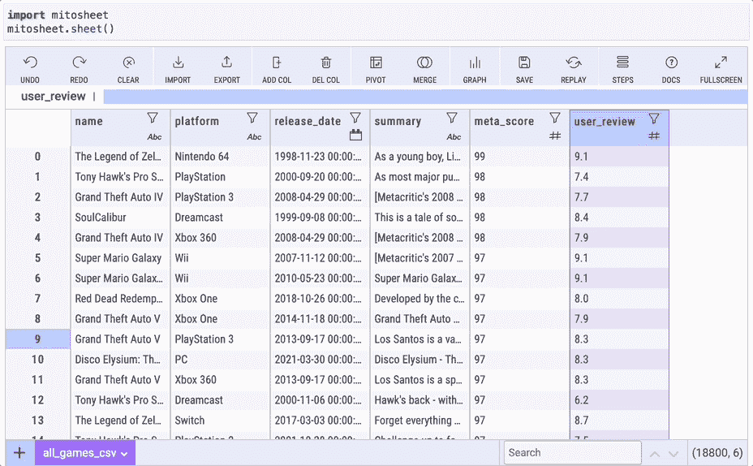
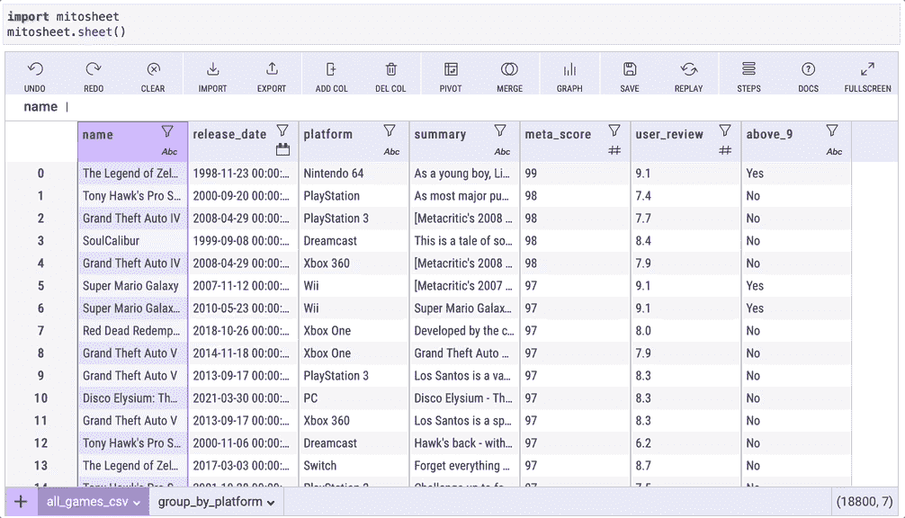

# 米托:你见过的最酷的 Python 库之一

> 原文：<https://towardsdatascience.com/mito-one-of-the-coolest-python-libraries-you-have-ever-seen-5261dbfedceb?source=collection_archive---------0----------------------->

## 大蟒

## 下面是我对这个很酷的 Python 库的看法，以及为什么你应该尝试一下


照片由[卡尔视觉](https://unsplash.com/@kalvisuals)从 [Unsplash](https://unsplash.com/photos/PFC2fY9LE_g)

几周前，我发布了一个关于 Bamboolib 的博客，这个博客变得非常受欢迎。该博客很受欢迎，第一周就有数万人浏览。在那之后，我计划写其他与数据科学相关的主题，并打算在一段时间内避免写 Python 库，除非我发现了令人惊叹的东西。我找到了，它叫米托。

我前阵子听说过米托，但从来没有机会去测试它，但最近我决定尝试一下，它令人印象深刻！但在此之前，有一点需要注意:这是**而不是**赞助的内容。我这么说是因为在过去的几周里，一些开发商联系我，问我是否愿意进行有偿合作，所以如果你是其中之一，我不会进行任何形式的有偿合作。然而，我接受关于写作主题的建议。现在，让我们回到米托。

## 米托—只需点击几下鼠标，节省数小时的工作时间

米托是一个 Python 库，可帮助您执行数据准备、数据清理、转换、探索性数据分析、创建图表等。通过 GUI，只需一两行代码和几次点击就可以完成很多工作。他们试图创造一种类似的体验，就好像你在使用 Microsoft Excel 一样。米托和 Bamboolib(另一个 Python 库)有很多相似之处，比如有一个 GUI 让人们更容易执行任务，他们都创建了 Python 代码，你可以在任何地方复制和使用，即使你没有安装米托。

如果你没有看过我在 Bamboolib 上的博客，你可以在这里找到它:

</bamboolib-one-of-the-most-useful-python-libraries-you-have-ever-seen-6ce331685bb7>  

话虽如此，让我们把我们的手放在米托！

# 装置

安装过程很简单。出于安全考虑，我建议您为米托创建一个环境。他们的网站展示了如何创建 Python 环境。为此，您可以将两个代码中的一个复制并粘贴到您的终端中:

Mac:

```
python3 -m venv mitoenv
source mitoenv/bin/activate
python -m pip install mitoinstaller
python -m mitoinstaller install
```

窗口:

```
python3 -m venv mitoenv
mitoenv\Scripts\activate.bat
python -m pip install mitoinstaller
python -m mitoinstaller install
```

如果您决定使用 Conda 虚拟环境，您可以复制并粘贴以下代码:

```
conda create -n mitoenv python=3.8
conda activate mitoenv
python -m pip install mitoinstaller
python -m mitoinstaller install
```

完成这些步骤后，您应该可以开始工作了。请注意，米托将用起始代码为您创建一个 JupyterLab 笔记本文件。您也可以通过在终端中键入`jupyter lab`来启动 JupyterLab 笔记本。现在让我们把手弄脏。

# 第一步

发起米托再简单不过了。您只需要通过键入`import mitosheet`来导入它，并通过键入`mitosheet.sheet()`来启动它。这就是我们今天将使用的所有编码！


作者 GIF

现在，让我们导入将要使用的数据集。点击`import`，找到文件，我们就可以开始了。在这次演示中，我将使用 Kaggle 的[1995–2021 顶级视频游戏元评论](https://www.kaggle.com/deepcontractor/top-video-games-19952021-metacritic)数据集。导入数据集后，米托向我们展示了几个你可以用它做什么的购物车。


作者 GIF

# 数据准备

## 更改数据类型

在米托更换`datatype`简直易如反掌。您需要做的就是单击列名正下方的数据类型，然后选择新的数据类型。在下面的例子中，我将把一个字符串改为一个`datetime datatype`。您会看到图标将从 *Abc* (这意味着`datatype`是一个字符串)变为一个日历图标。太简单了！


他们没有选项让你选择`datetime datatype`的格式，所以如果任何米托开发者准备好这个博客，我认为如果我们可以选择格式，这将是一个很好的额外功能。

另外，`user_review`列似乎是一个字符串。让我们通过将它改为 float 来解决这个问题。


作者 GIF

你看到米托图形用户界面下方的单元格中添加了一行代码吗？这是因为米托还会给你在另一台笔记本上使用它的代码，即使你没有安装米托。如果你正在学习编码，但不知道如何做某事，这是一个极好的工具。另一个很酷的事情是，它自动在单元格中添加评论，这样任何人都可以阅读。

简单比较一下，Bamboolib 可以自动识别出`user_review`列应该是浮点数而不是整数，但是米托不能，所以如果你试图把一个有数字的列改成整数，它会抛出一个错误。不过，这不是什么大问题。


作者 GIF

## 重命名列

更改列名再简单不过了。就像在 Excel 中一样，您只需单击列名并进行编辑。太棒了，对吧？前阵子做了一个项目，要改 200 个栏目的名字，花了我不少时间。我无法想象如果我认识米托，我会节省多少时间。


作者 GIF

## 删除列

删除列是米托做的另一件简单得可笑的事情。只需选择该列，然后点击`DEL COL`。就是这样！

假设有一个项目，您需要删除多个列。你不需要输入每个人的名字，只需点击几下就可以解决。



作者 GIF

## 撤消操作

米托让删除列变得如此简单，以至于有人可以删除比他们想要的更多的列。如果你用 Jupyter 笔记本没有米托，你会怎么做？再次运行所有代码？谁有时间做那个？只需点击`UNDO`，就可以撤销任何操作。是不是用`UNDO`有点多了？没问题！只要点击`REDO`，你就可以取消撤销。抱歉，我不得不说。


作者 GIF

## 使用多个数据帧

另一个非常酷的特性是你可以同时处理多个数据帧。有两种方法可以做到。您可以点击`IMPORT`并从您的计算机上传文件，或者，如果您的笔记本中有数据帧，您可以在括号中添加它们的名称，就像下面的代码一样。

```
mitosheet.sheet(df1, df2)
```


作者 GIF

对于上面的例子，我创建了两个数据帧。一个在`user_review > 9`，一个在`user_review < 9`。

# 数据转换

## 过滤数据

您可以通过单击漏斗图标并选择要过滤的内容来过滤数据。在下面的例子中，我只过滤了那些`user_review`大于 9.5 的游戏。您还可以创建过滤器组，从中可以选择多个条件。


作者 GIF

## 数据透视表

`.groupby()`对于数据分析非常有用，即使您是专业用户，您也需要承认在 Python 中对数据进行分组可能有点耗时。如果你创建一个或两个`.groupby()`，你可能还可以，但是每天做多次会变得很烦人。现在，米托没有选择。取而代之的是`.pivot_table()` ，其工作原理类似。但是它们之间有什么区别呢？

简而言之，`.pivot_table()`允许您将数据聚合成更多的形状。例如，您可以选择索引、列和行值。`.groupby()`将创建表格，其中给定的维度放入列中，并且将为这些维度的每个组合创建行。
现在我们已经了解了它们之间的区别，您可以创建一个数据透视表，方法是单击 pivot，选择您想要创建分组依据的列、您想要查看的统计数据，瞧！

在下面的例子中，我按平台分组，然后得到`meta_score` 平均值、名字计数和`user_review`平均值。


作者 GIF

这是米托为我们刚刚做的`.pivot_table()`创建的代码。这是相当多的代码，我们只需点击几下鼠标就能完成。

```
**# Pivoted all_games_csv into df2**
unused_columns = all_games_csv.columns.difference(set(['platform']).union(set([])).union(set({'name', 'user_review', 'meta_score'})))
tmp_df = all_games_csv.drop(unused_columns, axis=1)
pivot_table = tmp_df.pivot_table(
    index=['platform'],
    values=['meta_score', 'name', 'user_review'],
    aggfunc={'meta_score': ['mean'], 'name': ['count'], 'user_review': ['mean']}
)
```

这是一个很好的功能，但对我来说真正酷的是，你可以在一个新的标签中获得分组。您可以通过选项卡来回导航，轻松比较结果。


作者 GIF

## 创建条件列

使用 IF，只需很少的步骤就可以基于条件创建列。在下面的例子中，我将创建一个新列，说明 user_review 列是否大于 9。为此，我单击 user_review 列中的任何值，单击 ADD COL，然后键入`=IF(user_review,’Yes’, ‘No’)`。它的工作方式是`=IF(**column**, **Value_IF_True**, **Value_IF_False**)`，这与你在 Excel 中所做的非常相似。


现在，让我们来看看米托生成的代码:

```
all_games_csv.rename(columns={"new-column-1inv": "above_9"}, inplace=True)all_games_csv['above_9'] = IF(all_games_csv['user_review'] > 9, 'Yes','No')
```

我必须承认，我不知道我们可以像代码片段中那样使用`IF`。我通常会使用一个`.lambda()`函数。很高兴知道！

# 数据探索

米托让数据探索变得直观。只需点击列，点击过滤器图标，然后点击`Summary`。您将看到数据分布图等信息，以及平均值、标准偏差、空值数量等描述性统计数据。


作者 GIF

如果你想知道，它适用于数字和分类。



# 数据可视化

如果您需要创建一些基本的图表，您也可以这样做。例如，您可以通过几次点击来创建一个条形图，并且如果您想要编辑它，您可以生成用于生成图形的代码。只需点击`GRAPH`，然后选择图表类型以及 x 轴和 y 轴。


作者 GIF

# 最后的想法

米托是一个为你学习 Python 或者想快速完成一些任务的人准备的库。我真的很喜欢米托和 Bamboolib，因为它们可以让更多的人开始使用 Python。对于初学者来说，Python 可能有点棘手和令人沮丧，我相信米托可以帮助人们学习和发展他们的技能。

即使你已经使用 Python 很多年了，你也可以通过观察米托生成的代码来了解一二。现在，它对每个人都适用吗？这是一个棘手的问题，这将取决于你需要什么，但我认为即使是已经编码多年的人也可以利用其中的一些功能，而不是键入 15 行代码，也许你只需点击几下就可以实现同样的功能。尽管如此，尝试一下，让我知道你的想法。编码快乐！

***你可能还喜欢:***

</bamboolib-one-of-the-most-useful-python-libraries-you-have-ever-seen-6ce331685bb7>  </5-python-libraries-that-you-dont-know-but-you-should-fd6f810773a7> [## 5 个你不知道但应该知道的 Python 库

towardsdatascience.com](/5-python-libraries-that-you-dont-know-but-you-should-fd6f810773a7) </3-awesome-python-libraries-that-you-should-know-about-e2485e6e1cbe> 