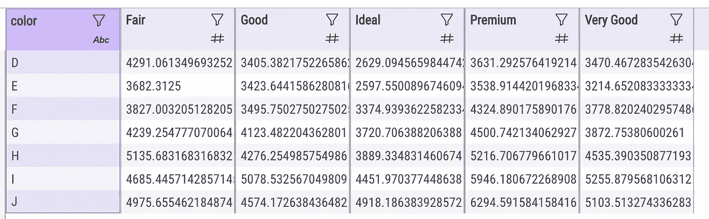

# 米托:无需编码即可加速数据集操作

> 原文：<https://towardsdatascience.com/mito-speed-up-dataset-manipulation-with-no-coding-407b8c72f46f?source=collection_archive---------25----------------------->

## 数据预处理

## 概述米托，一个用于交互式数据集操作的 Python 库，不需要任何编程技能。


作者图片

我一直在寻找新的工具来提高我的数据科学家活动。这次我遇到了[米托](https://docs.trymito.io/)，一个作为 Python 库提供的电子表格，它允许你以简单快速的方式操作数据集，最重要的是以交互的方式。

**米托在 Jupyter 实验室环境中提供了一个图形界面，所以你可以操作任何数据集。**

在实践中，米托结合了电子表格的经典功能(比如用户友好的可用性)和 Python 的所有潜力。事实上，**界面内进行的所有操作都被自动翻译成 Python 代码，也可以在其他地方使用**。

米托提供以下功能:

*   导入/导出数据集
*   向数据集中添加/删除列
*   构建数据透视表
*   合并两个数据集
*   绘图图表
*   筛选/排序列
*   列统计

在这篇文章中，我给出了米托的概述，以及一个实际使用的例子。

# 1 米托概述

米托是一个交互式电子表格，以 Python 库的形式提供，在 Jupiter Lab 中运行，必须提前安装。

可以通过以下命令轻松安装米托:

```
python3 -m pip install mitoinstaller
python3 -m mitoinstaller install
```

米托官方文档附带了对[常见安装问题](https://docs.trymito.io/getting-started/installing-mito/common-install-errors)的详细描述，如果安装过程失败，可以帮到你。在我的情况下，安装是好的。

安装后，您必须重新启动 Jupyter Lab(如果它正在运行),以便启用米托。您可以通过以下命令从命令行运行 Jupyter Lab:

```
jupyter lab
```

为了运行米托交互界面，您可以创建一个新的笔记本并在单元格中编写以下代码:

```
import mitosheetmitosheet.sheet()
```

**每次通过米托接口修改数据集时，米托都会在下面的单元格中生成等效的 Python 代码。**

数据集存储为 Pandas 数据帧，也可以在单元格中直接操作。

第一次运行米托时，会打开一个新的弹出窗口，要求您提供一些信息，例如您的电子邮件和其他类似的内容:


作者图片

注册后，米托互动界面在笔记本电脑环境中启动。您可以通过点击右上角的按钮启用**全屏模式**。

## 1.1 菜单栏

该界面提供了以下菜单栏:


作者图片

从左侧开始，以下菜单项可用:

*   **撤销—** 清除数据集上的最后一次更改；
*   **导入—** 从文件系统加载新的数据集。将打开一个弹出窗口，允许您浏览文件系统的目录。支持的格式包括 Excel (XLSX)和 CSV


作者图片

*   **导出** —将处理过的数据集以 CSV 格式下载到您的本地文件系统；
*   **添加列** —向数据集中添加一个新列。您可以更改列名以及列值。在最后一种情况下，您可以手动输入值，也可以从其他列中计算值。双击该列的第一行即可插入公式；
*   **删除列** —完全擦除一列；
*   **pivot** —构建一个数据透视表。生成的表在新的选项卡中打开，因此可以单独操作；
*   **合并** —合并两个数据集。您可以在以下合并类型中进行选择:


作者图片


作者图片

*   **图表** —为探索性数据分析(EDA)绘制图表。您可以选择与 X 轴和 Y 轴相关联的列，然后选择一个受支持的图形(有关受支持的图形类型，请参见左图)。所有的图形都是在 [Plotly](https://plotly.com/) 中生成的，这是最著名的数据可视化 Python 库之一。米托保存由 Plotly 为每个图形生成的 HTML 文件。您甚至可以复制生成图形的代码；
*   **保存** —保存当前的有丝分裂表；
*   **重放** —对新数据重新运行保存的操作。

## 1.2 色谱柱上的操作

如果单击列名，将会打开一个新的弹出窗口，如下所示:


作者图片

您可以选择**列类型**和**顺序值**(升序或降序)。您甚至可以**添加一个或多个过滤器或一组过滤器**，例如只选择符合某些特定标准的值。您也可以**在一列中搜索特定值**。

最后，在 Summary Stats 选项卡中，显示了您的列的分布，以及更具体的摘要信息，包括计数、唯一性、顶部和频率。

# 2 用法示例

作为用例，我利用了 Kaggle 上的 [diamond.csv](https://www.kaggle.com/soumenksarker/regression-types-and-stats-in-depth/data) 数据集。首先，我创建了一个新的笔记本，在第一个单元格中，我编写了以下代码:

```
import mitosheetmitosheet.sheet()
```

## 2.1 下降柱

我选择第一列，名为`Unnamed: 0`，然后点击**删除列**按钮，如下图所示:


作者图片

因此，该列被删除，并且在下面的单元格中生成相应的 Python 代码:

```
# Imported /Users/angelica/mitosheet_test/source/diamonds.csv
import pandas as pd
diamonds_csv = pd.read_csv(r'/Users/angelica/mitosheet_test/source/diamonds.csv')# Deleted column(s) Unnamed: 0 from diamonds_csv
diamonds_csv.drop(['Unnamed: 0'], axis=1, inplace=True)
```

## 2.2 数据透视表

现在，我构建了一个数据透视表，它显示了每种颜色和切割类型的平均价格。我单击“Pivot”按钮，并在弹出窗口中选择以下选项:


作者图片

我也重命名列名，只需双击列名。通过一次操作，米托生成了下表:



作者图片

米托自动生成相应的代码:

```
# Pivoted diamonds_csv into df2
unused_columns = diamonds_csv.columns.difference(set(['color']).union(set(['cut'])).union(set({'price'})))
tmp_df = diamonds_csv.drop(unused_columns, axis=1)
pivot_table = tmp_df.pivot_table(
    index=['color'],
    columns=['cut'],
    values=['price'],
    aggfunc={'price': ['mean']}
)# Flatten the column headers
pivot_table.columns = [flatten_column_header(col) for col in pivot_table.columns.values]# Reset the column name and the indexes
df2 = pivot_table.reset_index()# Renamed price mean Fair to Fair in df2
df2.rename(columns={"price mean Fair": "Fair"}, inplace=True)# Renamed price mean Good to Good in df2
df2.rename(columns={"price mean Good": "Good"}, inplace=True)# Renamed price mean Ideal to Ideal in df2
df2.rename(columns={"price mean Ideal": "Ideal"}, inplace=True)# Renamed price mean Premium to Premium in df2
df2.rename(columns={"price mean Premium": "Premium"}, inplace=True)# Renamed price mean Very Good to Very Good in df2
df2.rename(columns={"price mean Very Good": "Very Good"}, inplace=True)
```

## 2.3 图表

给定前面定义的数据透视表，我构建一个条形图，显示每种颜色和切割类型的平均价格。米托允许在每个图表中最多添加三个系列。因此，在我的图表中，我包括了*理想*、*优质*和*非常好*。


作者图片

米托允许将生成的图形下载为 png 文件或复制图形代码:

```
# Import plotly and create a figure
import plotly.graph_objects as go
fig = go.Figure()# Add the bar chart traces to the graph
for column_header in ['Ideal', 'Premium', 'Very Good']:
    fig.add_trace(
        go.Bar( 
            x=df2['color'],
            y=df2[column_header],
            name=column_header
        )
    )# Update the title and stacking mode of the graph
# See Plotly documentation for customizations: [https://plotly.com/python/reference/bar/](https://plotly.com/python/reference/bar/)
fig.update_layout(
    xaxis_title='color',
    yaxis_title='',
    title='color, Ideal, Premium, Very Good bar chart',
    barmode='group',
)
fig.show(renderer="iframe")
```

由于图形是在 Plotly 中生成的，我可以按照 Plotly 的指导方针修改它。

## 2.4 合并

现在我加载第二个数据集，它包含每种切割类型的所有者:


作者图片

想法是将原始数据集与先前加载的第二个数据集合并。我点击*合并*按钮，配置如何合并两个数据集，如下图所示:


作者图片

结果，创建了一个新的数据集，它包括两个起始数据集的所有列:


作者图片

和前面的例子一样，米托为合并操作生成 Python 代码:

```
# Imported /Users/angelica/CNR/Git/mitosheet_test/source/cut_owners.csv
import pandas as pd
cut_owners_csv = pd.read_csv(r'/Users/angelica/CNR/Git/mitosheet_test/source/cut_owners.csv')# Imported /Users/angelica/CNR/Git/mitosheet_test/source/cut_owners.csv
import pandas as pd
cut_owners_csv_1 = pd.read_csv(r'/Users/angelica/CNR/Git/mitosheet_test/source/cut_owners.csv')# Merged diamonds_csv and cut_owners_csv
temp_df = cut_owners_csv.drop_duplicates(subset='cut') # Remove duplicates so lookup merge only returns first match
df5 = diamonds_csv.merge(temp_df, left_on=['cut'], right_on=['cut'], how='left', suffixes=['_diamonds_csv', '_cut_owners_csv'])
```

## 2.5 列统计

最后，我在单个列上执行一些操作。我可以通过单击列名旁边的漏斗图标来打开相关的弹出窗口。我考虑的是*克拉*列，**是数字**，我按升序对其排序，只需点击*筛选/排序*选项卡中的*升序*按钮。然后我创建一个新的过滤器，它只选择值大于 0.3 的行。


作者图片

同样，米托自动生成 Python 代码:

```
# Sorted carat in df5 in ascending order
df5 = df5.sort_values(by='carat', ascending=True, na_position='first')# Filtered carat in df5
df5 = df5[df5['carat'] > 0.3]
```

现在，我选择“Summary Stats”选项卡，米托在*克拉*列显示了以下统计数据:


# 摘要

在这篇文章中，我描述了[米托](https://docs.trymito.io/)，这是一个允许快速操作数据集的电子表格。米托可以很容易地在朱庇特实验室运行，因此你只需尝试一下:)

本文中使用的完整代码可以从我的 Github 资源库下载。

如果你读到这里，对我来说，今天已经很多了。谢谢！你可以在这篇文章中读到更多关于我的信息。

# 你愿意支持我的研究吗？

你可以每月订阅几美元，解锁无限的文章。

# 相关文章

</automatic-update-of-django-models-from-a-google-spreadsheet-7c6d4f30e3ca>  </dataset-manipulation-with-open-refine-a5043b7294a7>  <https://alod83.medium.com/how-to-import-and-export-a-dataset-in-phpmyadmin-b108288a3ca3>  

***免责声明*** *:这不是赞助文章。我与米托或其作者没有任何关系。这篇文章展示了该框架的一个公正的概述，旨在使数据科学工具能够为更多的人所使用。*