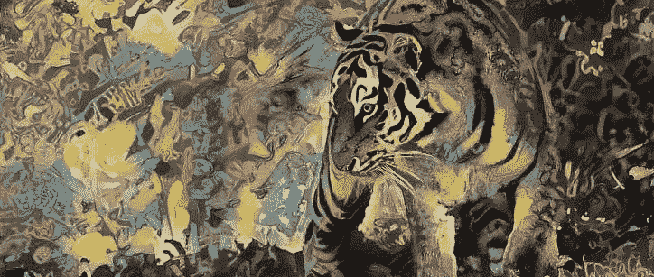
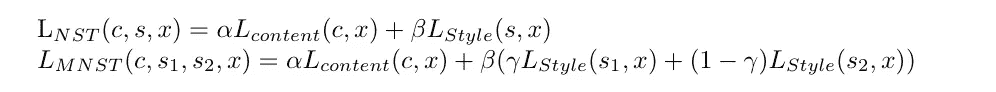
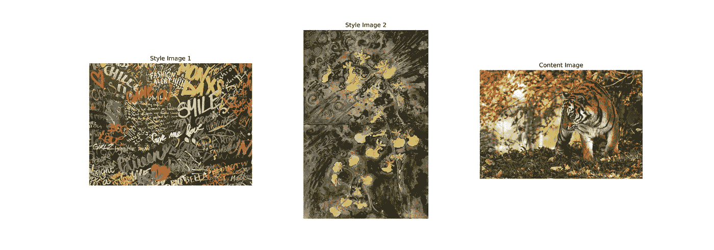
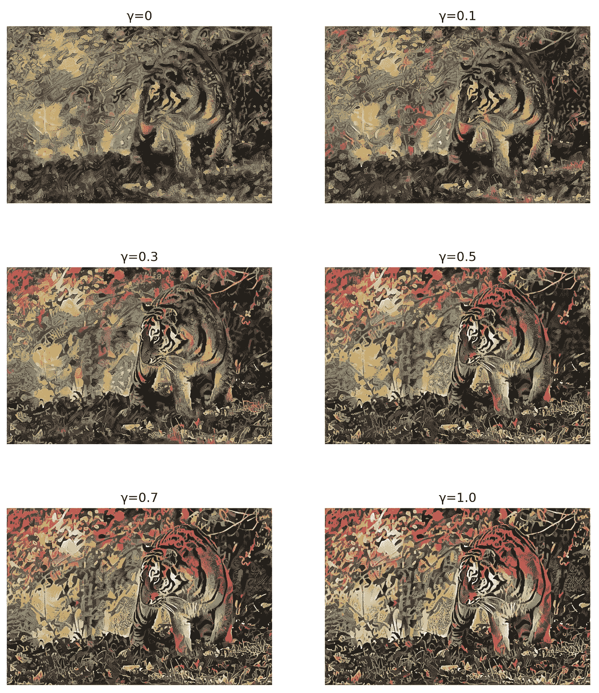
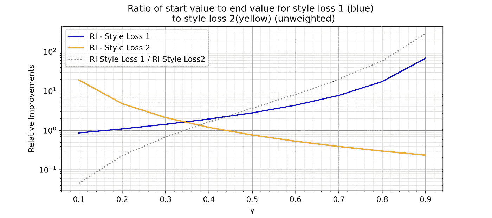
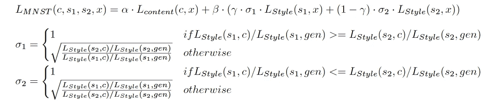
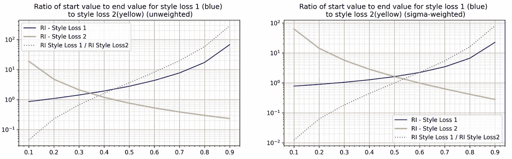
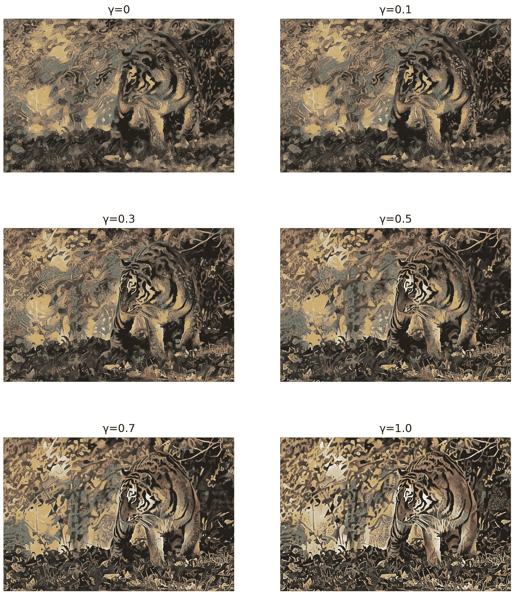
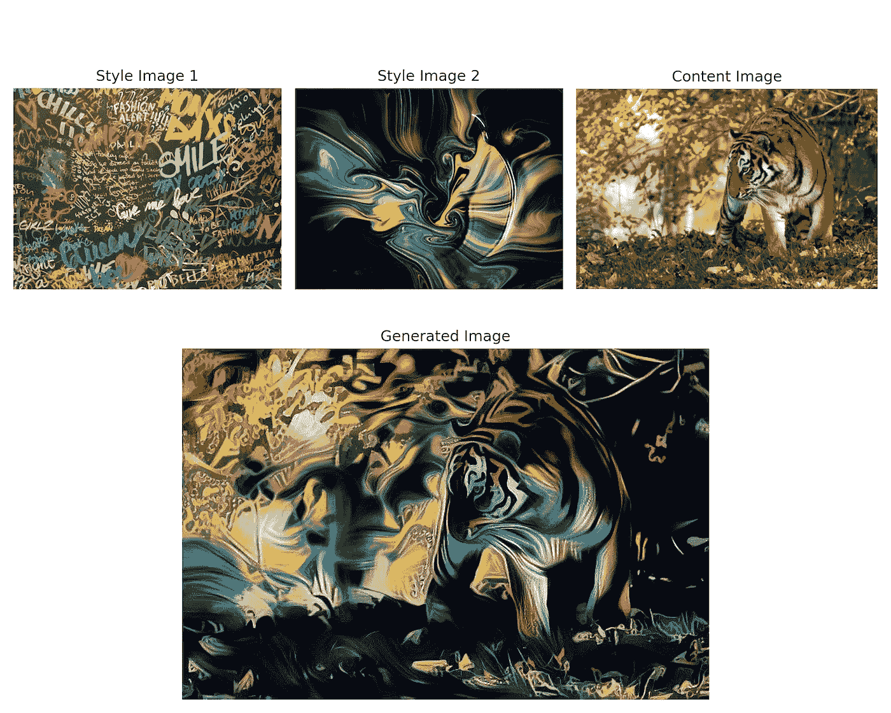
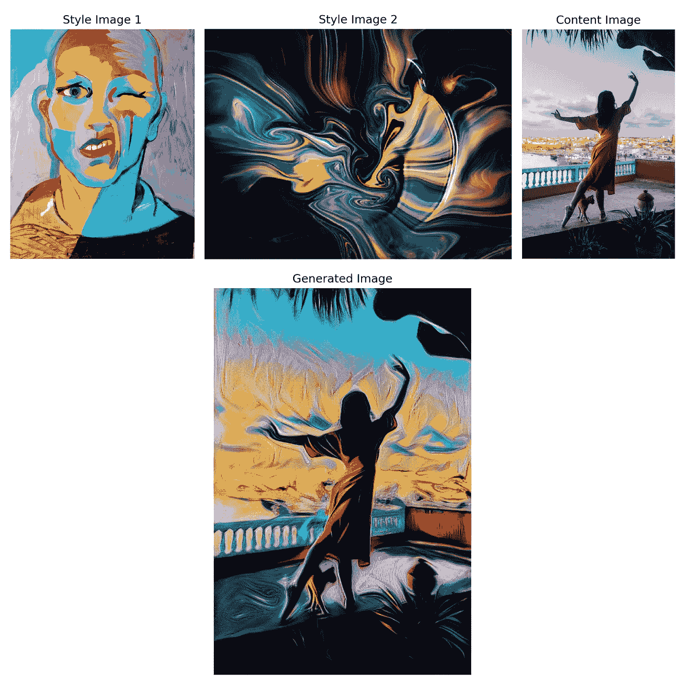

# 两种风格图像的混合神经风格转换

> 原文：<https://towardsdatascience.com/mixed-neural-style-transfer-with-two-style-images-9469b2681b54?source=collection_archive---------16----------------------->

## [实践教程](https://towardsdatascience.com/tagged/hands-on-tutorials)

## 一种扩展神经类型转移的方法

图 1:我基于一个内容图像和两个风格图像实现混合神经风格转移(MNST)的结果。(C [内容图片](https://unsplash.com/photos/o9ehJD6vUvw)由 [Alexas_Fotos](https://unsplash.com/@alexas_fotos?utm_source=medium&utm_medium=referral) ，s [风格图片 1](https://unsplash.com/photos/o1xcUi-Yt_w) 由 [Andreas Fickl](https://unsplash.com/@afafa?utm_source=medium&utm_medium=referral) ，s [风格图片 2](https://unsplash.com/photos/pw-ap4Zp4CU) 由 [Europeana](https://unsplash.com/@europeana)

**简介**

作为一个既是技术又是艺术爱好者的人，神经风格转移(NST)对我来说非常迷人:一种通过使用内容和风格模板来创建绘画的算法。在实现和试验最初的 NST 算法时，我有了在一幅图像中结合两种风格的想法。因此，我的故事的主题是关于原始神经风格转移的变体，这种方法在 Gatys 等人的论文“[艺术风格的神经算法”中有所描述。](https://arxiv.org/pdf/1508.06576.pdf)混合神经风格转移(MNST)描述了原始算法的扩展，使用两个风格图像和一个内容图像。

在这个故事的过程中，我将解释如何将两幅图像的风格应用于一幅摄影作品，分析改进过程，并展示如何通过根据各自的损失对给定的风格进行加权来扩展 NST 优化过程。

由于有一些关于神经类型转移的非常好的教程和解释，我想把介绍留给他们，而是继续混合神经类型转移。(查看 [Vamshik Shetty](https://medium.com/u/bc0ad784dd4e?source=post_page-----9469b2681b54--------------------------------) 的[神经类型转移教程](/neural-style-transfer-tutorial-part-1-f5cd3315fa7f)，它对 gram 矩阵做了很好的介绍。[这个 TensorFlow 教程](https://www.tensorflow.org/tutorials/generative/style_transfer)也可能是一个很好的实现起点。)

**从神经类型转移到混合神经类型转移**

作为 NST 核心要素的损失函数包括两个方面:内容损失和风格损失。虽然内容损失保证了新生成的图像不会偏离内容图像的主题太远，但是风格损失度量了风格图像的风格差异。当实现 NST 的原始方法时，我想知道如果我将 NST 的损失函数扩展第二个样式损失，以生成两个样式图像和一个内容图像之间的混合，会发生什么。

图 2: α和β对内容和风格损失进行加权。γ分别对风格损失 1 和风格损失 2 进行加权，而γ应该取 0 到 1 之间的值。c 表示内容图像，s 表示 NST 的样式图像，s1 和 s2 表示 MNST 的样式图像。图片作者。

在 NST 的原始损失函数中，α和β分别是内容损失和风格损失的权重。对于 MNST，α和β保持不变，但γ作为第二种类型的权重被引入。它用于定义个人风格影响整体风格损失的程度。例如，如果γ ist 设置为 0.7，则风格图像 1 的损失对整体风格损失的影响大于风格图像 2 的损失，其权重为 0.3。通过在 0 和 1 之间移动γ值，可以在两种风格图像的 NST 结果之间进行插值。所以γ基本上应该像样式的交叉渐变器一样工作。

对于以下示例，这些图像被选择为内容图像、样式图像 1 和样式图像 2:

图 3:图片加载自[unsplash.com](https://unsplash.com/?utm_source=medium&utm_medium=referral):[风格图片 1](https://unsplash.com/photos/o1xcUi-Yt_w) 作者[安德烈亚斯·菲克尔](https://unsplash.com/@afafa?utm_source=medium&utm_medium=referral)，s [风格图片 2](https://unsplash.com/photos/pw-ap4Zp4CU) 作者[欧洲](https://unsplash.com/@europeana)，c [内容图片](https://unsplash.com/photos/o9ehJD6vUvw)作者 [Alexas_Fotos](https://unsplash.com/@alexas_fotos?utm_source=medium&utm_medium=referral)

**设置**

*   *模型:*用 ImageNet 权重预训练的 VGG19 模型
*   *内容输出层* : block5_conv2
*   *样式输出图层:* block1_conv1，block2_conv1，block3_conv1，block4_conv1，block5_conv1
*   *层权重:* 此外，我还为风格损失配置了层输出的权重，因此较高的卷积层比较低层获得相对较低的权重。这种加权背后的直觉是给予过滤器较低的影响，强调复杂的结构，而不是集中于简单的结构，定义图像的风格。[block1_conv1: 1.0，block2_conv1: 1.0，block3_conv1: 0.2，
    block4_conv1: 0.3，block5_conv1: 0.01]
*   *Gram 矩阵:*Gram 矩阵的计算略有变化，因为它们的值没有除以输出尺寸。
*   *α* =0.002， *β* =0.02
*   *优化器:* Adam 优化器，initial_learning_rate=12.0，decay_steps=100，decay_rate=0.6。
*   *损失* : tf.reduce_mean 用于计算样式和内容损失
*   *开始条件:*优化从内容图像的副本开始。

图 4:基于图 3 所示的内容和风格图像，不同γ值的 MNST 结果。(C [内容图片](https://unsplash.com/photos/o9ehJD6vUvw)由 [Alexas_Fotos](https://unsplash.com/@alexas_fotos?utm_source=medium&utm_medium=referral) ，s [风格图片 1](https://unsplash.com/photos/o1xcUi-Yt_w) 由 [Andreas Fickl](https://unsplash.com/@afafa?utm_source=medium&utm_medium=referral) ，s [风格图片 2](https://unsplash.com/photos/pw-ap4Zp4CU) 由 [Europeana](https://unsplash.com/@europeana)

**结果评估**

当比较不同γ值的风格混合时，可以清楚地看到风格图像 1 的风格如何日益影响整体结果。虽然对于接近 0 的γ值，样式图像 2 的褪色样式在生成的图像中占优势，但是随着γ向 1 移动，样式图像 1 中的涂鸦文本的曲线看起来更清楚。

尽管混合风格效果很好，但γ ≥ 0.5 的结果之间的差异初看起来并不明显。虽然较低的γ值明显影响整体结果，但对于大于 0.5 的值，需要良好的眼睛才能看到任何变化。一种解释可能是涂鸦丰富多彩、生动活泼的风格，这使得微妙的变化难以察觉。

观察这种损失会得出不同的解释。对于γ = 0.5 的平衡场景，在优化过程开始时，风格损失 1 是风格损失 2 的 3.6 倍。在优化过程结束时，风格损失 1 的相对改善(开始损失/最终损失)几乎是风格损失 2 的四倍。因为我的样式转换实现开始优化内容图像的副本，所以第一次迭代中的样式损失是内容图像和样式图像之间的样式损失。因此，在优化过程的第一次迭代中，x=c。

**从内容图像开始校准 MNST 的损失**

对于γ=0.5，样式 1 和样式 2 应该同样强烈地影响最终结果。因此，应该避免一个样式损失被优化而另一个保持不变甚至增加。找到正确的方法需要一些修补。我的直觉是，对于γ=0.5，两种风格损失应该取得相同的相对进展。如果风格损失 1 提高了 50%(与其起始损失相比)，风格损失 2 也应该提高 50%。

相对改善的计算方法如下:

图 5: RI 表示优化过程中风格损失 1 和 2 的相对改善。它将第一次迭代的初始损失与最后一次迭代后的损失进行比较。c 代表内容图像，gen 是最后一次迭代后生成的图像。

为了了解不同γ值下 RI1 和 RI2 的变化情况，我让 MNST 运行 100 次迭代，以 0.1 为步长计算从γ=0 到γ=1 的相对改善。使用 RI1 和 RI2 之间的比率来找出与风格损失 2 相比，风格损失 1 改善了多少。

图 6:对不同γ值的 RI1 和 RI2 的观察表明，对于γ~0.34，风格损失 1 和 2 具有相同的相对改善，而对于 0.5 则不是预期的。图片作者。

结果表明，对于γ~0.34，RI1 和 RI2 是相同的，而对于γ≥0.34 的值，风格损失 1 改善得更好。这支持了图 4 中目视检查的先前印象，即对于γ=0.5，两种类型的影响不相等。

为了将注意力更多地转移到“较弱”的风格上，我最初使用γ=0.5 时风格损失的相对改善(RI1/RI2)之间的比率作为风格损失 2 的附加权重，称为σ。但是现在结果超过了 0.5 的值，因为γ~0.64 的风格发展得同样好。在检查了不同σ值的影响后，结果表明σ的变化不会线性影响 RI1/RI2 的偏移，而是通过平方根影响。

因此，总损失函数现在看起来如下:

图 7:除了γ，还引入了σ1 和σ2，以平衡损失的改善。图片作者。

通过使用称为σ1 和σ2 的新权重，对于γ=0.5，两种风格损失的相对改善是相等的(如图 8 所示)。当观察灰色虚线时，还可以看到，相对改善之间的比率在γ=0.5 附近对称地发展。

图 8:左:在没有西格玛权重的情况下，100 次迭代后，不同γ值的风格损失 1 和 2 的开始值与结束值的比率。右图:sigma 权重的情况相同。图片作者。

比较具有和不具有σ1 和σ2 的 MNST 的结果(图 4 与图 9)，可以看出，样式图像 1 的样式连续淡入，并且从γ=0.5 开始不支配结果图像。

图 9:基于图 3 所示的内容和风格图像，对于σ1=1 和σ2~1.9 的不同γ值的 MNST 结果。(C [内容图片](https://unsplash.com/photos/o9ehJD6vUvw)由 [Alexas_Fotos](https://unsplash.com/@alexas_fotos?utm_source=medium&utm_medium=referral) ，s [风格图片 1](https://unsplash.com/photos/o1xcUi-Yt_w) 由 [Andreas Fickl](https://unsplash.com/@afafa?utm_source=medium&utm_medium=referral) ，s [风格图片 2](https://unsplash.com/photos/pw-ap4Zp4CU) 由 [Europeana](https://unsplash.com/@europeana)

**结论**

在尝试不同的风格和内容图片时，我意识到，当风格图片的结构和颜色不同时，MNST 会产生好的结果。相比之下，如果选择了两种风格的图像，它们都非常丰富多彩并且纹理相似，则结果通常不是很有趣，因为每种风格对整体结果都有独特的贡献。同样值得思考的是，哪种样式可以强调内容图像的哪一部分，以增加新生成图形的表现力。

最后，我想再给你们看两个 MNST 的例子，它们是在我的实验中创建的。

享受:)

图 10: γ = 0.4，σ1 = 1，σ2 ~ 1.503 || [风格图 1](https://unsplash.com/photos/o1xcUi-Yt_w) 由[安德烈亚斯·菲克尔](https://unsplash.com/@afafa?utm_source=medium&utm_medium=referral)，s [风格图 2](https://unsplash.com/photos/mLzNhIOKtGw) 由[丹-克里斯蒂安·pădureț](https://unsplash.com/@dancristianp?utm_source=medium&utm_medium=referral)，[内容图](https://unsplash.com/photos/o9ehJD6vUvw)由 [Alexas_Fotos](https://unsplash.com/@alexas_fotos?utm_source=medium&utm_medium=referral) 。所有参考均从[unsplash.com](http://The images are loaded from unsplash.com)加载

图 11: γ = 0.5，σ1 = 1，σ2 ~ 1.150 || s [tyle 图片 1](https://unsplash.com/photos/oz7w_okbI0Q) 由[尼古拉·波伊斯](https://unsplash.com/@powys_plays?utm_source=medium&utm_medium=referral)，s [tyle 图片 2](https://unsplash.com/photos/mLzNhIOKtGw) 由[丹-克里斯蒂安·pădureț](https://unsplash.com/@dancristianp?utm_source=medium&utm_medium=referral)，c [内容图片](https://unsplash.com/photos/jTc2bkoiaZw)由[迈赫迪·拉马法](https://unsplash.com/@mehdi_lamaaffar)。所有参考从[unsplash.com](http://The images are loaded from unsplash.com)加载