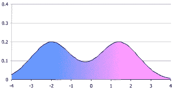
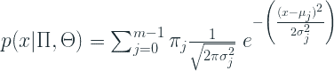
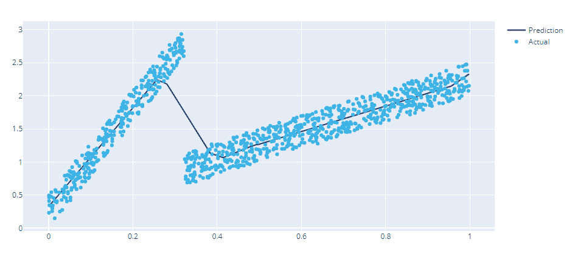

# 混合密度网络:不确定性估计的概率回归

> 原文：<https://towardsdatascience.com/mixture-density-networks-probabilistic-regression-for-uncertainty-estimation-5f7250207431?source=collection_archive---------8----------------------->

不确定性无处不在。它存在于我们做出的每一个决定，我们采取的每一个行动中。在我们计划未来的商业决策中尤其如此。尽管如此，我们在商业中使用的所有预测模型都忽略了不确定性。

由[杰克·英格尔](https://unsplash.com/@ingle_jake?utm_source=medium&utm_medium=referral)在 [Unsplash](https://unsplash.com?utm_source=medium&utm_medium=referral) 上拍摄的照片

假设你是谷歌 Play 商店的经理，谷歌 Pixel 5a 即将发布。总部向您发送了他们 ML 模型的预测，并表示他们预计在发布的第一周将售出 100 台。但是你知道，从你的经验来看，总部的预测并不总是正确的，并希望通过采购超过 100 件来避免缺货。*但是又有多少呢？你怎么知道 ML 模型的预测会有多错误？换句话说，这个 100 台的预测**有多大把握**？这个模型置信度的额外信息在做出这个决定时是至关重要的，而总部的 ML 模型不能给你这个信息。但是如果除了 100 个单位的预测之外，模型还给了你一个不确定性的度量，比如预期概率分布的标准偏差，会怎么样呢？现在，你可以根据自己的风险偏好做出明智的决定，决定囤积多少。*

但是我们怎么做呢？通常，分类问题有一个额外的优势，因为我们在顶部添加了逻辑函数，它让我们对模型的置信度有了一些了解(尽管从技术上讲这不是一回事)。说到回归，我们的传统模型给我们一个点估计。

# 不确定性的类型

有两种主要的不确定性——认知的不确定性和任意的不确定性。

*   认知不确定性描述了模型不知道的东西。这是由于对模型的了解不够。这种不确定性可以通过增加数据或增加模型复杂性来降低。
*   随机不确定性是固有的不确定性，是数据生成过程的一部分。例如，由高精度设备发射的纸飞机，保持相同的释放程度、释放速度和一千个其他参数，每次试验仍然不会落在相同的地方。这种固有的可变性是任意的不确定性。

一个典型的监督机器学习问题可以写成如下:

这里认知的不确定性来自θ，任意性来自 **x** 。典型地，高认知不确定性存在于稀疏填充有数据示例的特征空间部分中。在这样的 n 维空间中，可能有许多参数可以解释给定的数据点，这导致了不确定性。

# 核心思想

这里的关键创新是这样的:

在普通的神经网络回归中，我们将在最后一层有一个神经元，它被训练来预测我们感兴趣的值。如果我们预测一个概率分布的**参数会怎么样？例如，高斯分布由其均值(μ)和标准差(σ)来参数化。因此，在最后一层不是只有一个神经元，而是有两个神经元来预测高斯分布的均值和标准差。**

厉害！经过适当的训练，我们有了**均值和标准差**，这意味着我们有了整个概率分布，因此通过扩展成为不确定性的**估计。**

但是，有一个问题。当我们训练模型来预测分布的参数时，我们在模型上施加了巨大的感应偏差。据我们所知，我们试图建模的目标变量甚至可能不遵循任何参数分布。

双峰分布(来源: [Wiki](https://en.wikipedia.org/wiki/Multimodal_distribution) )

让我们看看双峰的例子。看起来有两个高斯分布，挤在一起。如果我们做一个深入的实验，并将这种“两个高斯分布的*挤压*扩展到“N 个高斯分布的*挤压*”的情况，这种合成的混合物可以模拟各种各样的概率分布。这正是混合密度网络的编码思想。网络的最后一层由许多高斯成分(平均值和标准偏差)组成。并且具有决定如何混合这些高斯分量的另一个学习参数(潜在表示)。

# 混合密度网络

混合密度网络由两个组件构建而成——神经网络和混合模型。

神经网络可以是任何有效的架构，它接受输入 **X** 并转换成一组学习到的特征(我们可以将其视为编码器或主干)。

现在，让我们来看看混合模型。像我们之前讨论的那样，混合模型是一种概率分布模型，它是由多个简单分布的加权和构建而成的。更正式地说，它将概率密度函数( *pdf* ) *p(x)* 建模为由 *j pⱼ(x)* 索引的*m*pdf 与权重的混合

通过下面的等式:

，其中θⱼ是描述分布形状和位置的分布参数。

在他的论文[1]中，Bishop 使用高斯核，并解释说，只要正确选择混合系数和高斯参数，任何概率密度函数都可以近似为任意精度。通过使用上述等式中的高斯核。它变成了:

混合密度网络:神经网络的输出参数化高斯混合模型。[来源【2】](https://www.researchgate.net/publication/325194613_Probabilistic_Forecasting_of_Household_Electrical_Load_Using_Artificial_Neural_Networks)

# 充分条件

Bishop 还提出了一些限制和实现 MDNs 的方法。

1.  混合系数(π或α)是概率，必须小于零，并且总和为 1。这可以通过将混合系数的输出通过 *Softmax* 层来轻松实现。
2.  方差(σ)应该严格为正。Bishop[1]建议我们对 sigma 神经元的原始对数使用指数函数。他认为这与假设一个无信息的先验具有相同的效果，并避免了一个或多个方差变为零的病理配置。
3.  中心参数(μ)代表位置参数，这应该是平均神经元的原始逻辑。

# 损失函数

使用标准反向传播对网络进行端到端训练。为此，我们最小化的损失函数是负对数似然，这相当于最大似然估计。

我们已经知道什么是 *P(x)* ，现在的问题是计算它并最小化负对数似然。

# 确保稳定性的实施和技巧

现在我们知道了模型背后的理论，让我们看看如何实现它(以及一些技巧和失败模式)。众所周知，实施和培训 MDN 非常困难，因为有很多事情可能会出错。但是通过采用先前的研究和大量的实验，我已经确定了一些技巧，使得训练相对稳定。实现将在 PyTorch 中使用我开发的库— [Pytorch Tabular](https://deep-and-shallow.com/2021/01/27/pytorch-tabular-a-framework-for-deep-learning-for-tabular-data/) (这是一个高度灵活的框架，用于处理深度学习和表格数据)。

# 避免数值下溢

如果你还记得高斯混合的 *pdf* 公式，它包括所有 *pdf* 的混合系数加权总和。所以负对数可能性是:

我们知道这一点

如果你检查这个方程，我们会看到一个指数函数，然后乘以混合系数，然后取它的对数。该指数和随后的对数可能导致非常小的数字，从而导致数字下溢。因此，我们按照 Axel Brando Guillaumes [3]的建议，使用 [LogsumExp](https://en.wikipedia.org/wiki/LogSumExp) 技巧，在对数域中进行计算。

因此负对数似然性变为:

现在，我们使用`torch.logsumexp`计算批次中所有样本的负对数似然，然后计算平均值。这有助于我们在训练中避免大量的数值不稳定性。

# 方差参数的激活函数

Bishop[1]建议对方差参数使用指数激活函数。这个选择有它的长处。指数函数趋向于正输出，在较低的一侧，它永远不会真正达到零。但实际上，它存在一些问题。指数函数增长得非常大非常快，并且在具有高方差的数据集的情况下，训练变得不稳定。

Axel Brando Guillaumes [3]提出了一种替代方案，这就是我们在实施中使用的方案。ELU 激活的修改版本。

ELU 激活功能(来源: [ML 备忘单](https://ml-cheatsheet.readthedocs.io/en/latest/activation_functions.html#elu)

对于更高的值，ELU 函数保留指数行为，并恢复为线性行为。唯一的问题是指数行为是在 x 为负的时候。但是如果我们将这个函数向上移动 1，我们得到一个近似指数行为的函数。所以阿克塞尔·白兰度·纪尧姆[3]建议使用

作为方差参数的激活函数。因为从技术上讲这也可以变成零，所以我们在修改后的 ELU 上增加了一个ε来确保稳定性。所以使用的最终激活是:

# 多重高斯和模式崩溃

当我们使用多个高斯分量并使用反向传播训练模型时，网络倾向于忽略除一个分量之外的所有分量，并训练单个分量来解释数据。例如，如果我们使用两个分量，当训练时，一个分量趋向于 0，另一个趋向于 1，并且对应于变成 1 的混合分量的均值和方差分量将被训练来解释数据。

Axel Brando Guillaumes [3]建议将π值削减到一个下限。但是这种方法有一个问题。

*   因为应用了 softmax，应用了 softmax 之后就不能裁剪π了；不然加起来也不是一个。在 softmax 之前，您必须对原始 logit 值应用裁剪，这非常不直观。

于是，通过实验，我们找出了另一套让网络运转起来的招数(虽然不能保证，但肯定鼓励网络远离模式崩溃)。

1.  **权重正则化** —将 L1 或 L2 正则化应用于计算均值、方差和混合分量的神经元权重。
2.  **偏置初始化** —如果我们预先计算两个高斯的可能中心，我们可以初始化μ层对这些中心的偏置。这已经显示出在训练期间对两个高斯核/分量的分离具有强烈的影响。

# 混合系数的 Softmax 替代方案

Bishop[1]建议使用 Softmax 层将混合系数(π)的原始对数转换为概率。但是我们使用了一个 [Gumbel Softmax](/what-is-gumbel-softmax-7f6d9cdcb90e) ，它提供了一个更加清晰的概率分布。这是可取的，因为我们希望我们的模型能够在不需要的时候有效地剔除一个或多个组件。Softmax 仍然会给这些分配一个小概率，而 Gumbel Softmax 使这个概率更小。

来源[4]

# 密码

下面是在 [PyTorch 表格](https://github.com/manujosephv/pytorch_tabular)中实现的示例代码。前往 repo 查看完整的实现(此外，还可以访问 NODE、AutoInt 等其他模型的实现)。

MDN 头的代码

一个抽象类，它包含一个主干网络并使其成为一个 MDN

# 实验

从 Oliver Borchers 博士的这款出色的 [Colab 笔记本](https://colab.research.google.com/drive/1at5lIq0jYvA58AmJ0aVgn2aUVpzIbwS3#scrollTo=MEhwQgPbuZuC)中获得灵感，我使用该实现设计了自己的一组实验。还有一个关于如何在 PyTorch 表格中使用 MDN 的教程。

# 线性函数

作者图片

这是一个简单的线性函数，但会添加一些高斯噪声作为输入 x 的函数，常规前馈网络将能够用一条穿过中间的直线来近似此函数。但是如果我们使用一个单一成分的 MDN，它将逼近函数的平均值和不确定性

作者图片

# 非线性函数

作者图片

这是一个扭曲的非线性函数。对于 x 的每个值，都有两个 y 值——一个在正侧，另一个在负侧。让我们看看，如果我们在这些数据上安装一个正常的前馈网络，会发生什么。

作者图片

不太好不是吗？好吧，如果你考虑最大似然估计，它很可能会失败，因为正负点的概率是相等的。但是，当您在它上面训练 MDN 时，这两个组件会被正确地学习，如果我们绘制出这两个组件，它将看起来像这样:

作者图片

# 高斯混合

作者图片

这里我们有两个高斯分量，它们以一个比例混合，所有的分量都用 x 参数化。

作者图片

直方图还显示了顶部的两个小凸起，而不是正常高斯的单个平滑。

让我们看看标准前馈网络如何捕捉这个函数。

作者图片

很好，除了过渡部分。和往常一样，没有关于不确定性的信息。(注:网络如何弯曲自己来逼近阶跃函数，真的太棒了。

现在让我们根据这些数据训练一个 MDN。

作者图片

现在，那不是很好吗？这两个组件被很好地捕获——一个组件很好地捕获了第一部分，另一个组件捕获了第二部分。不确定性也估计得很好。让我们也来看看混合系数。

作者图片

分量 1(上图中的粉色分量)在过渡点之前具有较高的混合系数，之后很快降至零。

# 摘要

我们已经看到了不确定性对商业决策的重要性，也探索了一种使用混合密度网络的方法。PyTorch Tabular 以一种非常用户友好的方式提供了本文中讨论的所有技巧的实现，以及其他一些针对表格数据的先进算法。请点击这里查看:

**如有任何疑问/问题请联系我** [**LinkedIn**](https://www.linkedin.com/in/manujosephv/) **。**对于您在库上遇到的任何问题，请在 [**Github**](https://github.com/manujosephv/pytorch_tabular/issues) 上提出问题。

# 参考

1.  C.M. Bishop，混合密度网络，(1994 年)
2.  沃森，朱利安&费龙，巴蒂斯特&蒙蒂，A..(2018).基于人工神经网络的家庭电力负荷概率预测。10.1109/pmaps . 18448 . 186486486616
3.  Guillaumes，A.B. (2017)。分布和不确定性估计的混合密度网络。巴塞罗那大学
4.  张，顾，s .，普尔，B. (2017)。用 Gumbel-Softmax 进行分类重新参数化。 *ArXiv，abs/1611.01144* 。

*原载于 2021 年 3 月 20 日*[*【http://deep-and-shallow.com】*](https://deep-and-shallow.com/2021/03/20/mixture-density-networks-probabilistic-regression-for-uncertainty-estimation/)*。*